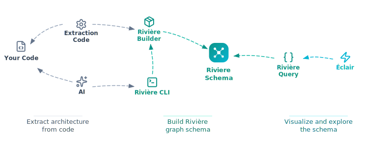

# Architecture Overview



## Components

### Your Code
The source code from which architecture is extracted. Rivière reads your codebase to build a living representation of how operations flow through your system.

### Extraction Code
Custom scripts or code you write to extract architecture from your codebase. Uses the Rivière Builder library to parse your code and emit schema components.

### AI
AI-assisted extraction as an alternative to writing extraction code. Can analyze your codebase and generate Rivière schema components.

### Extraction Packages

Three packages enable deterministic TypeScript extraction:

| Package | Purpose |
|---------|---------|
| `@living-architecture/riviere-extract-config` | JSON Schema defining the extraction config DSL |
| `@living-architecture/riviere-extract-conventions` | Decorators, default config, and ESLint enforcement |
| `@living-architecture/riviere-extract-ts` | TypeScript extractor using ts-morph for AST parsing |

#### Package Dependencies

```text
riviere-extract-ts
└── uses riviere-extract-config

riviere-extract-conventions
└── uses riviere-extract-config

riviere-cli
└── uses riviere-extract-ts
```

#### Enforcement Principle

Convention without enforcement is unreliable. When architectural components are identified by convention (decorators, naming patterns, inheritance), teams need mechanisms to ensure code follows those conventions.

`riviere-extract-conventions` provides both:

- **Decorators** to mark components
- **ESLint rule** (`require-component-decorator`) to enforce all classes are annotated

Without enforcement, extraction misses unmarked components. With enforcement, extraction is deterministic—same code produces same results.

For custom conventions, teams implement their own enforcement (custom ESLint rules, CI checks).

### Rivière CLI
Command-line interface for building and validating schemas. Provides an interactive workflow for defining domains, components, and links.

### Rivière Builder
Node.js library for programmatically building the schema graph. Used by extraction code and the CLI to construct the schema.

### Rivière Schema
The central graph-based representation of your architecture. Captures domains, operations, entities, events, and the flows between them.

### Rivière Query
Browser-safe library for querying the schema. Provides methods to traverse flows, find components, and analyze the architecture graph.

### Éclair
Web application for visualizing and exploring your architecture. Renders the schema as interactive diagrams showing domains, flows, and component relationships.
