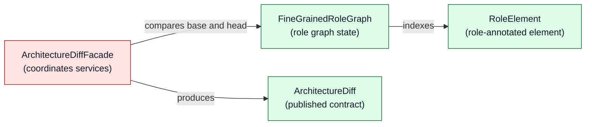
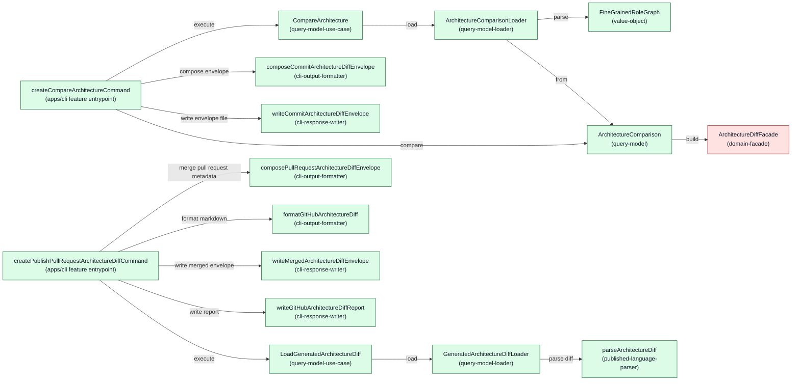
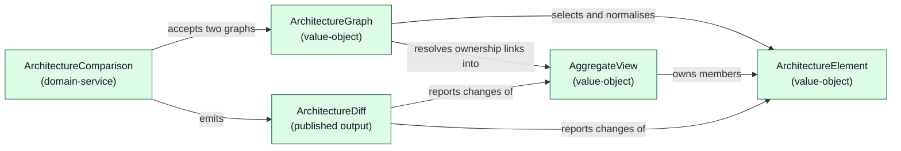
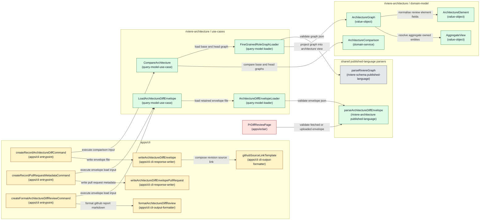

# Architecture: Pull Request Architecture Diffs

**Status:** Draft

---

## 1. Product feasibility check

**Decision status:** Approved

Feasibility remains plausible at architecture depth. The revised product concept and PRD are approved, so architecture drafting can continue.

The repository contains a throwaway TypeScript proof of concept for a GitHub architecture diff and a separate, half finished graph comparison built into the Éclair UI. Neither is the intended foundation for the approved product. Rivière needs one reusable architecture diff capability, decoupled from any UI. GitHub and Éclair consume the same generated `ArchitectureDiff` while providing tailored experiences.

Architecture discovery established two independently named and retained workflow outputs. The `high-level graph` remains selective and shows flows and key concepts for exploration or other purposes. The `fine-grained-role-graph` maps every role annotated class and method together with the ownership, relationships, package information, and source evidence required by the architecture diff.

The completed representation prototype proves that a valid Rivière graph can reproduce the existing pull request #478 architecture diff. It does not prove direct workflow extraction because it creates graph fixtures from the disposable TypeScript architecture snapshots. The user accepted this remaining uncertainty and decided that direct workflow generation, exact parity, and performance validation will be the first delivery ticket.

## 2. Ownership and boundaries

**Decision status:** Approved

### Approved subdomain direction

**`riviere-architecture` provides architectural insights based on Rivière graphs and other Rivière concepts.** Architecture comparison is one capability within this subdomain. It may also use Rivière roles directly or concepts introduced later, where justified by a specific insight. Neither those dependencies nor the relocation of existing Builder or Query capabilities has been decided.

### Approved package and consumer responsibilities

The responsibility split follows ADR-002:

| Location | Responsibility |
| --- | --- |
| `packages/riviere-architecture/domain-model` | Architectural interpretation and comparison rules. |
| `packages/riviere-architecture/use-cases` | Expose architecture comparison to callers, including loading its inputs. |
| `packages/riviere-architecture/published-language` | Define the shared `ArchitectureDiff` contract, using Rivière published-language types where it returns graph elements. |
| `apps/cli` | Expose comparison through the Rivière CLI and format the GitHub output. |
| `apps/eclair` | Present the generated diff as the approved review page. |

TypeScript extraction remains outside `riviere-architecture`. This split does not approve moving existing Query capabilities or introducing a direct dependency on Rivière roles.

### Approved viewer hosting and diff file convention

The review page uses the existing Éclair deployment at `https://living-architecture.dev/eclair/`. For public repositories, the reviewer clicks a link to view the diff in Éclair without downloading or selecting a file. Private repositories use file upload as described below.

The generated `ArchitectureDiff` is stored in one tracked file under the existing `.riviere` directory:

```text
.riviere/pr-diffs/riviere-architecture-diff.json
```

The file contains the architecture diff comparing `main` against the current commit. Users access an older diff by going back to the corresponding Git commit. There are no per-pull-request or commit-pair directories and no separate reports branch.

The GitHub Action builds the GitHub report from the existing JSON file. It does not calculate the architecture diff.

### Approved pull request identity and diff resolution

The Éclair link uses `pr-diff` to identify a repository and pull request ID, not a caller-supplied JSON URL. The tracked diff path above is a convention for the GitHub integration, not merely this repository's local storage choice.

For public repositories, Éclair resolves the diff as follows:

1. Fetch pull request metadata from `https://api.github.com/repos/{owner}/{repository}/pulls/{pullRequestId}`.
2. Use the returned `head.repo.full_name` and `head.sha` to generate `https://raw.githubusercontent.com/{head.repo.full_name}/{head.sha}/.riviere/pr-diffs/riviere-architecture-diff.json`.
3. Load and validate the generated `ArchitectureDiff` for presentation.

For pull request #478, the metadata URL is `https://api.github.com/repos/NTCoding/living-architecture/pulls/478`. The raw file URL uses the actual head repository and commit SHA returned by that request. Using the head repository accommodates forks; pinning the file request to the returned SHA avoids following a moving branch during loading. Reopening the link resolves the pull request's current head again.

The Éclair `pr-diff` link encodes the repository and pull request ID as path parameters: `https://living-architecture.dev/eclair/#/pr-diff/<owner>/<repository>/<pullRequestId>`. `owner` and `repository` identify the base repository where the pull request lives; the pull request ID is that repository's. Query parameters were rejected because they add a second encoding style next to Éclair's existing path-parameter routes and read less cleanly when shared.

When the diff cannot be loaded, Éclair shows an explicit error state with as much detail as possible about what failed — pull request metadata not fetched, diff file not found, or diff failed validation — and always links to the pull request on GitHub so the reviewer still reaches the complete GitHub architecture diff. There is no automatic retry loop.

How and when the diff is generated and committed is up to each application to decide, using the Rivière library. The living-architecture repository will use a commit-hook step, which generates the diff comparing `main` against the current commit. Comment-only and artifact-only delivery were rejected because neither places the file in the head commit that the public resolution reads.

### Approved private repository file upload

Private repositories use diff file upload instead of authenticated GitHub loading. Éclair has no backend; uploaded files are processed in the browser.

The uploaded file is one self-contained JSON envelope with two top-level keys: `metadata` (repository and pull request identity and link, pull request title and description, base and head revision, and revision-specific source links) and `diff` (the generated `ArchitectureDiff`). The review must not depend on fetching private GitHub metadata. The commit hook writes `metadata.repository`, `metadata.baseRevision`, `metadata.headRevision`, `metadata.sourceLinks`, and `diff`; the PR-time GitHub Action writes `metadata.pullRequest.number`, `.title`, `.description`, and `.url`, which do not exist at commit time. Two files were rejected because the upload path would need a second convention; embedding metadata inside the `ArchitectureDiff` schema was rejected because it couples GitHub-specific identity fields into the language-agnostic comparison contract.

Private repository support is included through upload, not excluded or deferred. This qualifies the previously recorded link-based review path. The PRD and solution exploration now both distinguish public GitHub loading from private file upload and are approved.

## 3. Component design

**Decision status:** Pending

### Design Options: Rivière Architecture Diff

<!-- component-design-option-1:start -->
#### Option 1: DDD value objects and domain-facade comparison exposed as a query model

This option makes architecture comparison a read-side domain capability inside `riviere-architecture`. The comparison input is a pair of file paths; the `riviere-architecture` use-cases package owns loading its inputs (the two `fine-grained-role-graph` files) exactly like the canonical riviere-builder query loaders; the comparison rules (diffing, grouping, association detection, affected-aggregate resolution, totals) live in explicit `domain-service` functions coordinated by a `domain-facade`; and the capability is exposed to callers as a `query-model` loaded by a `query-model-loader` and orchestrated by a `query-model-use-case`. The shared `ArchitectureDiff` serialization contract lives in a published-language package; the tracked `.riviere/pr-diffs/riviere-architecture-diff.json` envelope is modelled as a second query so the PR-time GitHub Action merges its fields and formats the report from already-generated state without recalculating. `apps/cli` passes only options and formats/writes output; every comparison rule sits in the domain.

##### Domain model change



Legend: green = new, red = open decision (domain-facade instance awaiting `approvedInstances` approval), gray = existing, yellow = changed.

No aggregate here: the comparison only reads `base`/`head` and derives a result, so the owning class is a query model, and the behaviour is domain services plus a facade. `ArchitectureDiff` (green) is the published-language contract shown as a domain output, not a consumer-API mapping. The tracked-file envelope (`ArchitectureDiffEnvelope`) is deliberately **not** in this diagram: it is an app-facing read shape (query model), not a domain concept. There is no existing `riviere-architecture` subdomain, so all concepts are new.

##### Runtime call diagram



Legend: green = new, red = open decision (facade instance approval), gray = existing, yellow = changed. Left cluster = commit-hook phase; right cluster = PR-time Action phase.

##### State loading and persistence description

**Load 1 — comparison inputs (commit-hook phase):**

- **Loaded state:** exactly two `fine-grained-role-graph` files — `base` (the `main` revision) and `head` (the current commit). These are retained outputs of the two independently named Rivière workflows.
- **Owning component and role:** `ArchitectureComparisonLoader` (`query-model-loader`) in `packages/riviere-architecture/use-cases/src/features/architecture-diff/data-access/architecture-comparison/`. This honours the approved ownership "Expose architecture comparison to callers, including loading its inputs"; the CLI passes only paths and never reads files.
- **Exact load call:** `load(baseGraphPath, headGraphPath)`; per path it resolves the path against the working directory, checks `existsSync`, reads with `readFileSync`, `JSON.parse`s, then parses via `FineGrainedRoleGraph.parse` — mirroring `packages/riviere-builder/use-cases/src/features/query/data-access/graph/query-loaders.ts` (`loadQueryModel`/`resolveGraphPath`). Both paths are required; there is no default-path convention.
- **Load inputs and origins:** `CompareArchitectureInput = { baseGraphPath: string; headGraphPath: string }` ← CLI options `--base-graph` / `--head-graph` supplied by the commit-hook script. How the hook generates and materialises the base (`main`) and head graph files (retained output paths, worktree, or checkout) is **deferred to the approved first delivery ticket** (ARCH.md §6); the loader therefore takes explicit required paths and invents no path convention.
- **Loaded output:** `ArchitectureComparison` query model. `base` ← success value of `FineGrainedRoleGraph.parse(base file JSON)`; `head` ← success value of `FineGrainedRoleGraph.parse(head file JSON)`; combined via `ArchitectureComparison.from(base, head)`. Missing file → `FineGrainedRoleGraphNotFoundError`; unreadable/invalid JSON or failed parse → `FineGrainedRoleGraphCorruptedError` (both `data-access-error`).
- **Invoked by:** `CompareArchitecture.execute` only. Never invoked by an entrypoint.
- **Owning object after loading:** `ArchitectureComparison` holds both `FineGrainedRoleGraph` values as private read-only data members. Source location lives on each `RoleElement` (from `riviere-schema` `SourceLocation`); revision-specific URLs are composed at the app boundary inside the envelope metadata.

**Load 2 — tracked diff envelope (PR-time Action phase):**

- **Loaded state:** the tracked file `.riviere/pr-diffs/riviere-architecture-diff.json` (approved convention; used as the `envelopePathOption` default).
- **Owning component and role:** `GeneratedArchitectureDiffLoader` (`query-model-loader`) in `.../data-access/architecture-diff-envelope/`.
- **Exact load call:** `load(envelopePathOption)` → `readFileSync` → `JSON.parse` → `parseArchitectureDiff(envelope.diff)` (published-language parser, explicit success/failure result, no throwing validation).
- **Load inputs and origins:** `LoadGeneratedArchitectureDiffInput = { envelopePathOption: string | undefined }` ← CLI option `--envelope` (default `.riviere/pr-diffs/riviere-architecture-diff.json`) supplied by the workflow step.
- **Loaded output:** `ArchitectureDiffEnvelope`. `metadata` ← passthrough of the file's metadata object (`repository`, `baseRevision`, `headRevision`, `sourceLinks`, optional `pullRequest`); `diff` ← `parseArchitectureDiff` success value. Missing file → `ArchitectureDiffEnvelopeNotFoundError`; corrupt metadata or failed diff validation → `ArchitectureDiffEnvelopeCorruptedError` (`data-access-error`).
- **Invoked by:** `LoadGeneratedArchitectureDiff.execute` only.

**Persistence — tracked envelope writes (field-level ownership per ARCH.md):**

- **Commit-hook write:** `writeCommitArchitectureDiffEnvelope(envelope, outputPath)` (`cli-response-writer`) writes `{ metadata: { repository, baseRevision, headRevision, sourceLinks }, diff }`. Field origins: `repository` ← `git remote get-url origin`; `baseRevision` ← `git rev-parse main`; `headRevision` ← `git rev-parse HEAD` — each passed by the commit-hook script as `--repository` / `--base-revision` / `--head-revision` options (the CLI performs no git subprocess calls; no `external-client-service` role is allowed in `apps/cli`). `sourceLinks` ← composed by `composeCommitArchitectureDiffEnvelope` from repository + revisions as base/head blob-URL prefixes (`https://github.com/{repository}/blob/{revision}/`) used by both GitHub and Éclair to build element source-line links from `SourceLocation`. `diff` ← `architectureComparison.compare()`. `outputPath` ← `--output`, default `.riviere/pr-diffs/riviere-architecture-diff.json`.
- **PR-time write-back:** `writeMergedArchitectureDiffEnvelope(mergedEnvelope, envelopePath)` (`cli-response-writer`) writes the same file with only `metadata.pullRequest.{ number, title, description, url }` added by `composePullRequestArchitectureDiffEnvelope`. Field origins: GitHub Actions pull-request event context (`github.event.pull_request.number`, `.title`, `.body`, `.html_url`) passed as options by the workflow step. These fields do not exist at commit time.
- **Report write:** `writeGitHubArchitectureDiffReport(markdown, reportPath)` (`cli-response-writer`) writes the markdown file the workflow posts as the pull-request comment; the report is built from the parsed envelope, never recalculated.

##### Components

Subdomain packages (`packages/riviere-architecture/`):

| Component | Layer / path | Status | .riviere role | Responsibilities | Estimated size |
|---|---|---|---|---|---|
| `ArchitectureDiff` | `published-language/src/published-language` | New | `published-language-schema` | Root `diff` contract: subdomains, elements, associations, affected aggregates, totals. | Medium |
| `ArchitectureSubdomainChange` | published-language | New | `published-language-data-structure` | Subdomain change with status, affected aggregates, per-package-kind additions/removals. | Medium |
| `ArchitectureElementChange` | published-language | New | `published-language-data-structure` | Element change: direction, layer, group, before/after element reference, source evidence. | Large |
| `ApplicationAssociationChange` | published-language | New | `published-language-data-structure` | Application↔subdomain association change with base and head source evidence. | Small |
| `AffectedAggregate` | published-language | New | `published-language-data-structure` | Aggregate named as affected with separated added/removed members. | Small |
| `ArchitectureDiffTotals` | published-language | New | `published-language-data-structure` | changedSubdomains, changedPackages, affectedAggregates. | Small |
| `ARCHITECTURE_CHANGE_DIRECTION` / `ArchitectureChangeDirection` | published-language | New | `published-language-enumeration` / `published-language-enumeration-type` | `added` / `removed` / `modified`. | Small |
| `ARCHITECTURE_PACKAGE_KIND` / `ArchitecturePackageKind` | published-language | New | `published-language-enumeration` / `published-language-enumeration-type` | `use-cases` / `domain-model` / `published-language` / `application`. | Small |
| `ARCHITECTURE_LAYER_NAME` / `ArchitectureLayerName` | published-language | New | `published-language-enumeration` / `published-language-enumeration-type` | `entrypoints` / `use-cases` / `domain`. | Small |
| `architecture-diff-field-names` | published-language | New | `published-language-field-name` | String-literal field-name constants. | Small |
| `parseArchitectureDiff` | published-language | New | `published-language-parser` | Parse `unknown` → `ArchitectureDiff` or a declared failure shape; used by the envelope loader and by Éclair readers. | Medium |
| `FineGrainedRoleGraph` | `domain-model/src/domain/comparison` | New | `value-object` | Owns a validated `RiviereGraph`; exposes `elements()` as `RoleElement[]`. | Medium |
| `RoleElement` | domain-model | New | `value-object` | One role-annotated element: identity, `architectureRole`, `packageKind`, `aggregateOwnerId`, methods, source location; `sameAs`. | Medium |
| `diffRoleElements` | domain-model `domain/comparison` | New | `domain-service` | Produce `ArchitectureElementChange[]` (added/removed/modified) via `RoleElement` identity. | Medium |
| `groupChangesBySubdomainAndLayer` | domain-model | New | `domain-service` | Group element changes by subdomain → layer → direction → package/use-case/aggregate group. | Medium |
| `detectApplicationAssociationChanges` | domain-model | New | `domain-service` | Detect application↔subdomain reassignment with base and head evidence. | Medium |
| `resolveAffectedAggregates` | domain-model | New | `domain-service` | Enforce "changed on both sides ⇒ affected, not created+deleted". | Small |
| `summarizeDiffTotals` | domain-model | New | `domain-service` | Compute `ArchitectureDiffTotals` from changes, grouping, associations. | Small |
| `ArchitectureDiffFacade` | domain-model | New | `domain-facade` *(open decision)* | One stable `build(base, head)` interface coordinating the five comparison services held as private readonly members. | Small |
| `CompareArchitecture` | `use-cases/src/features/architecture-diff/queries` | New | `query-model-use-case` | Translate input into loader criteria; load and return the comparison query model. | Small |
| `CompareArchitectureInput` | use-cases `queries` | New | `query-model-use-case-input` | `{ baseGraphPath: string; headGraphPath: string }` — paths only, no file content. | Small |
| `ArchitectureComparison` | use-cases `queries` | New | `query-model` | Read model holding base+head; exposes `compare(): ArchitectureDiff` via the facade. | Small |
| `ArchitectureComparisonLoader` | use-cases `data-access/architecture-comparison` | New | `query-model-loader` | `load(baseGraphPath, headGraphPath)`: read both graph files via `node:fs`, parse value objects, construct the query model. Owns "loading its inputs". | Medium |
| `FineGrainedRoleGraphNotFoundError` / `FineGrainedRoleGraphCorruptedError` | use-cases `data-access/architecture-comparison` | New | `data-access-error` | Missing or corrupt/unparseable graph file (not a domain violation). | Small |
| `LoadGeneratedArchitectureDiff` | use-cases `queries` | New | `query-model-use-case` | Load and return the tracked envelope as a query model. | Small |
| `LoadGeneratedArchitectureDiffInput` | use-cases `queries` | New | `query-model-use-case-input` | `{ envelopePathOption: string \| undefined }`. | Small |
| `ArchitectureDiffEnvelope` | use-cases `queries` | New | `query-model` | `{ metadata, diff }` interface — the tracked-file read shape and app write target. | Small |
| `ArchitectureDiffEnvelopeMetadata` / `ArchitectureDiffPullRequestMetadata` | use-cases `queries` | New | `query-model-value` | Commit-time metadata (repository, revisions, sourceLinks, optional pullRequest) and PR-time metadata (number, title, description, url). | Small |
| `GeneratedArchitectureDiffLoader` | use-cases `data-access/architecture-diff-envelope` | New | `query-model-loader` | `load(envelopePathOption)`: read tracked file, validate `diff` via `parseArchitectureDiff`, return the envelope. | Medium |
| `ArchitectureDiffEnvelopeNotFoundError` / `ArchitectureDiffEnvelopeCorruptedError` | use-cases `data-access/architecture-diff-envelope` | New | `data-access-error` | Missing tracked file or invalid envelope/diff. | Small |

Consumer boundaries:

| Component | Layer / path | Status | .riviere role | Responsibilities | Estimated size |
|---|---|---|---|---|---|
| `createCompareArchitectureCommand` + `CompareArchitectureEntrypointDependencies` | `apps/cli/src/features/architecture-diff/entrypoint/compare-architecture` | New | `cli-entrypoint` + `cli-entrypoint-dependencies` | Register `--base-graph`/`--head-graph`/`--repository`/`--base-revision`/`--head-revision`/`--output` options; translate options into `CompareArchitectureInput` inline (canonical query pattern; **no input factory**); invoke query; call `compare()`; compose and write the commit-time envelope. | Small |
| `composeCommitArchitectureDiffEnvelope` | `apps/cli` `entrypoint/compare-architecture` | New | `cli-output-formatter` | Compose `{ metadata: { repository, baseRevision, headRevision, sourceLinks }, diff }` from the diff and git-context options; derive sourceLinks URL prefixes. | Small |
| `writeCommitArchitectureDiffEnvelope` | `apps/cli` `entrypoint/compare-architecture` | New | `cli-response-writer` | Write the envelope JSON to the tracked output path. | Small |
| `createPublishPullRequestArchitectureDiffCommand` + `PublishPullRequestArchitectureDiffEntrypointDependencies` | `apps/cli/src/features/architecture-diff/entrypoint/publish-pr-architecture-diff` | New | `cli-entrypoint` + `cli-entrypoint-dependencies` | Register `--envelope`/`--pull-request-number`/`--pull-request-title`/`--pull-request-description`/`--pull-request-url`/`--report-output` options; translate into `LoadGeneratedArchitectureDiffInput`; invoke query; merge, write back, format, and write the report. | Small |
| `composePullRequestArchitectureDiffEnvelope` | `apps/cli` `entrypoint/publish-pr-architecture-diff` | New | `cli-output-formatter` | Add only `metadata.pullRequest.*` to the loaded envelope (approved PR-time field ownership). | Small |
| `formatGitHubArchitectureDiff` (+ sibling section formatters) | `apps/cli` `entrypoint/publish-pr-architecture-diff` | New | `cli-output-formatter` | Format the parsed envelope (diff + sourceLinks) as the complete GitHub markdown report; decomposes into section formatter functions like the existing proof of concept. | Large |
| `writeMergedArchitectureDiffEnvelope` | `apps/cli` `entrypoint/publish-pr-architecture-diff` | New | `cli-response-writer` | Write the merged envelope back to the tracked file. | Small |
| `writeGitHubArchitectureDiffReport` | `apps/cli` `entrypoint/publish-pr-architecture-diff` | New | `cli-response-writer` | Write the markdown report file the workflow posts as the pull-request comment. | Small |
| `pr-diff` review page | `apps/eclair/src/features/pr-diff` | New | (Éclair is unassigned) | Public link load and private upload both validate `diff` via `parseArchitectureDiff`; presents metadata from the envelope. | — |
| Commit-hook script + PR workflow steps | `.githooks/` + `.github/workflows/` | Changed | (outside enforced packages) | Supply git context and GitHub event context as CLI options; invoke the two commands; post the report comment. | — |

### .riviere role options

| Element | Kind | Sublocation | Candidate roles | Preferred role | Reason | Open decision |
|---|---|---|---|---|---|---|
| `ArchitectureDiff` | interface | `riviere-architecture/published-language` | `published-language-schema`, `published-language-data-structure` | `published-language-schema` | Root cross-boundary contract, not a nested member shape. | none |
| `ArchitectureSubdomainChange`, `ArchitectureElementChange`, `ApplicationAssociationChange`, `AffectedAggregate`, `ArchitectureDiffTotals` | interfaces | published-language | `published-language-data-structure` | `published-language-data-structure` | Member shapes of the schema; must be data structures. | none |
| `ARCHITECTURE_CHANGE_DIRECTION`/`ArchitectureChangeDirection` (and package-kind, layer-name pairs) | variable + type alias | published-language | `published-language-enumeration` + `-enumeration-type` | same | Closed string unions follow the repo enumeration pair convention. | none |
| `architecture-diff-field-names` | const | published-language | `published-language-field-name` | `published-language-field-name` | Unchecked string-literal duplication is forbidden repo-wide. | none |
| `parseArchitectureDiff` | function | published-language | `published-language-parser` | `published-language-parser` | Parses the complete schema with an explicit failure branch; used by the envelope loader and Éclair. | none |
| `FineGrainedRoleGraph`, `RoleElement` | classes | `riviere-architecture/domain-model` `domain/comparison` | `value-object` | `value-object` | Immutable parsed graph state with `parse`/`from` factories and brand members; no invariants beyond integrity. | `RoleElement` terminology confirmation |
| `diffRoleElements`, `groupChangesBySubdomainAndLayer`, `detectApplicationAssociationChanges`, `resolveAffectedAggregates`, `summarizeDiffTotals` | functions | domain-model `domain/comparison` | `domain-service` | `domain-service` | Operate on two value-object states (base and head) that no single object owns; each carries the required justification ("comparison of two states has no single owning aggregate/value object"). | none |
| `ArchitectureDiffFacade` | class | domain-model `domain/comparison` | `domain-facade`, `domain-service` | `domain-facade` | Consumer (`ArchitectureComparison` query model) needs one stable interface over five services with sequencing; `domain-service` forbids depending on other domain services. Requires `approvedInstances` entry with justification answering the configured question. | **yes** — user approval required |
| `CompareArchitecture`, `LoadGeneratedArchitectureDiff` | classes | `riviere-architecture/use-cases` `features/architecture-diff/queries` | `query-model-use-case` | `query-model-use-case` | Read-only load-and-return orchestration. | none |
| `CompareArchitectureInput`, `LoadGeneratedArchitectureDiffInput` | interfaces | use-cases `queries` | `query-model-use-case-input` | `query-model-use-case-input` | Name matches `.*(Input\|Options)$`; paths/options only. | none |
| `ArchitectureComparison` | class | use-cases `queries` | `query-model` | `query-model` | Read model for the concrete compare read; depends on the facade (allowed dependent role). | none |
| `ArchitectureDiffEnvelope` | interface | use-cases `queries` | `query-model`, `query-model-value` | `query-model` | The tracked-file read shape returned by the query; `query-model` (interface target) is also accepted by `cli-response-writer.allowedInputs`. | none |
| `ArchitectureDiffEnvelopeMetadata`, `ArchitectureDiffPullRequestMetadata` | interfaces | use-cases `queries` | `query-model-value` | `query-model-value` | Result shapes flowing out of the envelope query model. | none |
| `ArchitectureComparisonLoader`, `GeneratedArchitectureDiffLoader` | classes | use-cases `data-access/{architecture-comparison, architecture-diff-envelope}` | `query-model-loader` | `query-model-loader` | Load concrete query models from persisted files; canonical `query-loaders.ts` shape; no save. | none |
| `FineGrainedRoleGraphNotFoundError`/`…CorruptedError`, `ArchitectureDiffEnvelopeNotFoundError`/`…CorruptedError` | classes | use-cases `data-access/*` | `data-access-error` | `data-access-error` | File-level failures, mirroring `GraphNotFoundError`/`GraphCorruptedError`. | none |
| `createCompareArchitectureCommand`, `createPublishPullRequestArchitectureDiffCommand` | functions | `apps/cli` `features/architecture-diff/entrypoint/*` | `cli-entrypoint` | `cli-entrypoint` | Register command, translate options into query input inline, invoke query, delegate formatting/writing. | none |
| `CompareArchitectureEntrypointDependencies`, `PublishPullRequestArchitectureDiffEntrypointDependencies` | interfaces | apps/cli entrypoints | `cli-entrypoint-dependencies` | `cli-entrypoint-dependencies` | Name matches `.*EntrypointDependencies$`; collaborator roles all allowed. | none |
| `composeCommitArchitectureDiffEnvelope`, `composePullRequestArchitectureDiffEnvelope`, `formatGitHubArchitectureDiff` (+ section formatters) | functions | apps/cli entrypoints | `cli-output-formatter` | `cli-output-formatter` | Decide envelope/report presentation from a typed result; no file I/O, no loading. | none |
| `writeCommitArchitectureDiffEnvelope`, `writeMergedArchitectureDiffEnvelope`, `writeGitHubArchitectureDiffReport` | functions | apps/cli entrypoints | `cli-response-writer` | `cli-response-writer` | Perform the output side effect (file writes); envelope input is a `query-model`. | none |

No `command-input-factory` appears on the query path: its `allowedOutputs`/`allowedDependencyRoles` only permit `command-use-case-input`, and the canonical "CLI Invoking Query Model Use Case" pattern has no factory — the `cli-entrypoint` translates options inline, matching `apps/cli/src/features/query/entrypoint/components/entrypoint.ts`.

### Canonical role pattern

Pattern: `CLI Invoking Query Model Use Case` and `Query Model Use Case loading and querying a query model` (from `.riviere/canonical-role-configurations.md`), applied twice. The commit-hook command invokes `CompareArchitecture` and formats/writes the envelope; the PR-time Action invokes `LoadGeneratedArchitectureDiff` and formats/writes the merged envelope plus report. Both loaders follow the canonical `query-loaders.ts` data-access shape (path option in, file read via `node:fs`, `data-access-error` on failure, concrete query model out).

### Tangled responsibility findings

- **Resolved:** the previous draft had the app-side entrypoint/factory read graph files and pass raw content — an "entrypoint directly imports persistence" tangle, plus a `command-input-factory` producing a `query-model-use-case-input` (incompatible role). Corrected: all file reading lives in `ArchitectureComparisonLoader`/`GeneratedArchitectureDiffLoader` (use-cases data-access); the factory is dropped.
- **Checked, not tangled:** the PR-time merge is presentation-side composition (`cli-output-formatter`) plus a `cli-response-writer` file write at the CLI output boundary — the same precedent as `writeFinalizedGraph`/`writePullRequestArchitectureDiff`. No write behaviour exists on a query model or loader, so the "write behind a query model" check passes.

No tangled responsibilities identified beyond the resolved finding above.

#### Output contract reconciliation

`CompareArchitecture.execute` returns `ArchitectureComparison` (role `query-model`), satisfying `allowedOutputs = ['query-model', 'query-model-value']`. Its `compare()` returns the published-language `ArchitectureDiff` via the facade. `LoadGeneratedArchitectureDiff.execute` returns `ArchitectureDiffEnvelope` (interface annotated `query-model`) whose `diff` member is the validated `ArchitectureDiff` and whose `metadata` members are `query-model-value` shapes. `apps/cli` never imports published-language directly (features may only import subdomain `queries`/`commands`): it consumes the `ArchitectureDiff` type via the query package's exported types and the envelope, and `parseArchitectureDiff` is invoked inside `GeneratedArchitectureDiffLoader` (data-access may import any subdomain published-language) and by Éclair. The envelope keeps GitHub-specific identity fields out of the language-agnostic `ArchitectureDiff` schema, per the approved rejection. Conformance between query results and the schema is asserted in use-cases tests by round-tripping through `parseArchitectureDiff`. The approved field-level write ownership is visible in the two composers: commit-time writes `repository`/`baseRevision`/`headRevision`/`sourceLinks`/`diff`; PR-time adds only `pullRequest.number`/`.title`/`.description`/`.url`.

##### Runtime call outline

```text
createCompareArchitectureCommand  (commit-hook phase)
  ├─ compareArchitecture.execute({ baseGraphPath, headGraphPath })
  │  └─ architectureComparisonLoader.load(baseGraphPath, headGraphPath)
  │     ├─ readFileSync(baseGraphPath)
  │     ├─ FineGrainedRoleGraph.parse(baseGraphJson)
  │     ├─ readFileSync(headGraphPath)
  │     ├─ FineGrainedRoleGraph.parse(headGraphJson)
  │     └─ ArchitectureComparison.from(base, head)
  ├─ architectureComparison.compare()
  │  └─ architectureDiffFacade.build(base, head)
  │     ├─ diffRoleElements(base.elements(), head.elements())
  │     ├─ groupChangesBySubdomainAndLayer(elementChanges, base, head)
  │     ├─ detectApplicationAssociationChanges(base.elements(), head.elements())
  │     ├─ resolveAffectedAggregates(elementChanges)
  │     └─ summarizeDiffTotals(elementChanges, grouping, associationChanges)
  ├─ composeCommitArchitectureDiffEnvelope(architectureDiff, commitContext)
  └─ writeCommitArchitectureDiffEnvelope(envelope, outputPath)

createPublishPullRequestArchitectureDiffCommand  (PR-time Action phase)
  ├─ loadGeneratedArchitectureDiff.execute({ envelopePathOption })
  │  └─ generatedArchitectureDiffLoader.load(envelopePathOption)
  │     ├─ readFileSync(envelopePath)
  │     └─ parseArchitectureDiff(envelopeJson.diff)
  ├─ composePullRequestArchitectureDiffEnvelope(envelope, pullRequestMetadata)
  ├─ writeMergedArchitectureDiffEnvelope(mergedEnvelope, envelopePath)
  ├─ formatGitHubArchitectureDiff(mergedEnvelope)
  └─ writeGitHubArchitectureDiffReport(markdown, reportPath)
```

##### Code stress test

```typescript
// ── riviere-architecture/use-cases: queries ──────────────────────────────
/** @riviere-role query-model-use-case */
export class CompareArchitecture {
  constructor(private readonly loader: ArchitectureComparisonLoader) {}
  execute(input: CompareArchitectureInput): ArchitectureComparison {
    return this.loader.load(input.baseGraphPath, input.headGraphPath)
  }
}

// ── riviere-architecture/use-cases: data-access (owns loading its inputs) ─
/** @riviere-role query-model-loader */
export class ArchitectureComparisonLoader {
  load(baseGraphPath: string, headGraphPath: string): ArchitectureComparison {
    const base = loadFineGrainedRoleGraph(baseGraphPath)
    const head = loadFineGrainedRoleGraph(headGraphPath)
    return ArchitectureComparison.from(base, head)
  }
}

function loadFineGrainedRoleGraph(graphPath: string): FineGrainedRoleGraph {
  if (!existsSync(graphPath)) {
    throw new FineGrainedRoleGraphNotFoundError(graphPath)
  }
  let json: unknown
  try {
    json = JSON.parse(readFileSync(graphPath, 'utf-8'))
  } catch (error) {
    throw new FineGrainedRoleGraphCorruptedError(graphPath, { cause: error })
  }
  const parsed = FineGrainedRoleGraph.parse(json)
  if (!parsed.success) {
    throw new FineGrainedRoleGraphCorruptedError(graphPath)
  }
  return parsed.graph
}

/** @riviere-role query-model */
export class ArchitectureComparison {
  private readonly facade = new ArchitectureDiffFacade()
  private constructor(
    private readonly base: FineGrainedRoleGraph,
    private readonly head: FineGrainedRoleGraph,
  ) {}
  static from(base: FineGrainedRoleGraph, head: FineGrainedRoleGraph): ArchitectureComparison {
    return new ArchitectureComparison(base, head)
  }
  compare(): ArchitectureDiff {
    return this.facade.build(this.base, this.head)
  }
}

// ── riviere-architecture/domain-model: facade holds its services ─────────
/** @riviere-role domain-facade */
export class ArchitectureDiffFacade {
  private readonly diffElements = diffRoleElements
  private readonly groupChanges = groupChangesBySubdomainAndLayer
  private readonly detectAssociationChanges = detectApplicationAssociationChanges
  private readonly resolveAffected = resolveAffectedAggregates
  private readonly summarizeTotals = summarizeDiffTotals

  build(base: FineGrainedRoleGraph, head: FineGrainedRoleGraph): ArchitectureDiff {
    const elements = this.diffElements(base.elements(), head.elements())
    const grouping = this.groupChanges(elements, base, head)
    const associations = this.detectAssociationChanges(base.elements(), head.elements())
    const affectedAggregates = this.resolveAffected(elements)
    const totals = this.summarizeTotals(elements, grouping, associations)
    return { subdomains: grouping.subdomains, elements, associations, affectedAggregates, totals }
  }
}

// ── domain service: element diff by stable identity (added/removed/modified)
/** @riviere-role domain-service */
export function diffRoleElements(
  base: readonly RoleElement[],
  head: readonly RoleElement[],
): readonly ArchitectureElementChange[] {
  const baseById = new Map(base.map((element) => [element.id, element]))
  const headById = new Map(head.map((element) => [element.id, element]))
  const added = [...headById.values()]
    .filter((element) => !baseById.has(element.id))
    .map((after) => ({ direction: 'added', after }) as ArchitectureElementChange)
  const removed = [...baseById.values()]
    .filter((element) => !headById.has(element.id))
    .map((before) => ({ direction: 'removed', before }) as ArchitectureElementChange)
  const modified = [...headById.values()]
    .filter((element) => baseById.has(element.id) && !baseById.get(element.id)!.sameAs(element))
    .map((after) => ({ direction: 'modified', before: baseById.get(after.id)!, after }) as ArchitectureElementChange)
  return [...added, ...removed, ...modified]
}

// ── apps/cli: approved field-level envelope ownership ────────────────────
/** @riviere-role cli-output-formatter */
export function composeCommitArchitectureDiffEnvelope(
  architectureDiff: ArchitectureDiff,
  commitContext: { repository: string; baseRevision: string; headRevision: string },
): ArchitectureDiffEnvelope {
  return {
    metadata: {
      repository: commitContext.repository,
      baseRevision: commitContext.baseRevision,
      headRevision: commitContext.headRevision,
      sourceLinks: {
        base: `https://github.com/${commitContext.repository}/blob/${commitContext.baseRevision}/`,
        head: `https://github.com/${commitContext.repository}/blob/${commitContext.headRevision}/`,
      },
    },
    diff: architectureDiff,
  }
}

/** @riviere-role cli-output-formatter */
export function composePullRequestArchitectureDiffEnvelope(
  envelope: ArchitectureDiffEnvelope,
  pullRequest: ArchitectureDiffPullRequestMetadata,
): ArchitectureDiffEnvelope {
  return { metadata: { ...envelope.metadata, pullRequest }, diff: envelope.diff }
}
```

`groupChangesBySubdomainAndLayer`, `detectApplicationAssociationChanges`, `resolveAffectedAggregates`, and `summarizeDiffTotals` keep the previous option's domain-service shapes (grouping by `RoleElement.domain`/`.layer`/`.packageKind`; association reassignment with base+head evidence; "changed on both sides ⇒ affected"; three totals). `RoleElement.sameAs(other)` implements structural equality over `architectureRole`, `packageKind`, `aggregateOwnerId`, `methods`, and `sourceLocation`, ignoring `id`.

##### New dependencies

| Dependency | Status | Used by | Purpose |
|---|---|---|---|
| `@living-architecture/riviere-schema-published-language` | Existing | `riviere-architecture-published-language`, `riviere-architecture-domain-model` | Reuse `Component`, `Link`, `SourceLocation`, `RiviereGraph` for element references and graph parsing. |
| `@living-architecture/riviere-architecture-published-language` | New | `riviere-architecture-domain-model`, `riviere-architecture-use-cases`, `apps/eclair` | The single shared `ArchitectureDiff` contract and `parseArchitectureDiff` for readers. |
| `@living-architecture/riviere-architecture-use-cases` | New | `apps/cli` | The two query use cases, query models, envelope types, and loaders; apps may only import subdomain queries/commands. |
| None | — | — | No runtime/adapter libraries; comparison is pure domain logic over parsed graphs; file access is `node:fs` in data-access and CLI writers only. |

##### Code shape

```text
packages/riviere-architecture/
  published-language/src/published-language/
    architecture-diff.ts                    (root schema)
    architecture-element-change.ts          (data structure)
    architecture-subdomain-change.ts
    application-association-change.ts
    affected-aggregate.ts
    architecture-diff-totals.ts
    architecture-change-direction.ts        (enumeration + type)
    architecture-package-kind.ts
    architecture-layer-name.ts
    architecture-diff-field-names.ts
    parse-architecture-diff.ts              (parser)
    index.ts
  domain-model/src/domain/comparison/
    fine-grained-role-graph.ts              (value-object)
    role-element.ts                         (value-object)
    diff-role-elements.ts                   (domain-service)
    group-changes-by-subdomain-and-layer.ts (domain-service)
    detect-application-association-changes.ts (domain-service)
    resolve-affected-aggregates.ts          (domain-service)
    summarize-diff-totals.ts                (domain-service)
    architecture-diff-facade.ts             (domain-facade)
  use-cases/src/features/architecture-diff/
    queries/compare-architecture.ts               (query-model-use-case)
    queries/compare-architecture-input.ts
    queries/architecture-comparison.ts            (query-model)
    queries/load-generated-architecture-diff.ts   (query-model-use-case)
    queries/load-generated-architecture-diff-input.ts
    queries/architecture-diff-envelope.ts         (query-model)
    queries/architecture-diff-envelope-metadata.ts        (query-model-value)
    queries/architecture-diff-pull-request-metadata.ts    (query-model-value)
    data-access/architecture-comparison/architecture-comparison-loader.ts
    data-access/architecture-comparison/fine-grained-role-graph-not-found-error.ts
    data-access/architecture-comparison/fine-grained-role-graph-corrupted-error.ts
    data-access/architecture-diff-envelope/generated-architecture-diff-loader.ts
    data-access/architecture-diff-envelope/architecture-diff-envelope-not-found-error.ts
    data-access/architecture-diff-envelope/architecture-diff-envelope-corrupted-error.ts
apps/cli/src/features/architecture-diff/entrypoint/
  compare-architecture/entrypoint.ts
  compare-architecture/compose-commit-architecture-diff-envelope.ts
  compare-architecture/write-commit-architecture-diff-envelope.ts
  publish-pr-architecture-diff/entrypoint.ts
  publish-pr-architecture-diff/compose-pull-request-architecture-diff-envelope.ts
  publish-pr-architecture-diff/format-github-architecture-diff.ts   (+ section formatters)
  publish-pr-architecture-diff/write-merged-architecture-diff-envelope.ts
  publish-pr-architecture-diff/write-github-architecture-diff-report.ts
apps/eclair/src/features/pr-diff/             (minimal review page)
```

##### Design validation

- **Domain terminology:** pass. `FineGrainedRoleGraph`, `ArchitectureDiff`, `ArchitectureComparison`, `ArchitectureDiffEnvelope`, `metadata`/`diff` envelope keys, `sourceLinks`, commit hook, and PR-time Action reuse PRD/ARCH terms. `RoleElement` is proposed for a single role-annotated element (no existing shared term).
- **Application/domain separation:** pass. Both use cases only translate-and-load-and-return; the comparison query model delegates computation to the facade; every comparison rule is a domain service; envelope merge and report formatting are presentation-side; no loops or private logic in use cases.
- **Role and location fit:** pass, with one open decision. Every element maps to a real role and an allowed sublocation; loading lives in use-cases data-access per the approved "including loading its inputs" ownership; no `command-input-factory` on the query path; writers take a `query-model`/strings. `ArchitectureDiffFacade` is a new `domain-facade` instance needing `approvedInstances` approval.
- **Implementability:** pass. ADR-002 allows domain-model→any published-language, use-cases→own domain + any published-language, and apps→subdomain queries only; the envelope query makes `parseArchitectureDiff` reachable without apps importing published-language; both file reads mirror the canonical `query-loaders.ts` pattern.

##### Rejected sub-ideas

- **Aggregate + aggregate-repository + command-use-case:** rejected — the comparison is read-only over immutable inputs and derives a result without mutating or persisting domain state, so the write-side roles are wrong.
- **App-side generic JSON reader passing raw content:** rejected — ARCH.md assigns input loading to `riviere-architecture/use-cases`, the canonical query loaders read files by path in data-access, and no reader role exists in `apps/cli`.
- **`command-input-factory` on the query path:** rejected — its role constraints only allow producing `command-use-case-input`; the canonical query pattern translates options in the `cli-entrypoint` with no factory.
- **Returning the published-language `ArchitectureDiff` directly from the use case:** rejected — `query-model-use-case` `allowedOutputs` are `query-model`/`query-model-value`; the query models own the read and the published-language package owns serialization.
- **A single monolithic `buildArchitectureDiff` domain-service:** rejected — it hides the grouping, association, affected-aggregate, and totals rules behind one entry point; the per-capability services make each rule reviewable.
- **Sequencing services inside the query model:** rejected — that would leak comparison orchestration into the query layer; the facade keeps it in the domain.
- **Moving grouping into the CLI formatter:** rejected — grouping and association detection are comparison rules, not presentation, and must stay consistent across GitHub and Éclair.
- **Modelling the PR-time merge as a command use case:** rejected — the merge adds presentation metadata to an already-generated file at the CLI output boundary; no domain state changes, so the writer/formatter pair is sufficient and matches `writeFinalizedGraph` precedent.

##### Open decisions

- **New domain-facade instance `ArchitectureDiffFacade`.** Requires approval to be added to `approvedInstances` in `.riviere/roles.ts`. Justification answering the configured question: the consumer is the `ArchitectureComparison` query model (plus any future query needing the same read); it needs one stable domain interface because correctly assembling the comparison requires five services in a fixed sequence (diff → group + detect associations → resolve affected aggregates → totals), a discovery and assembly burden that must not leak into the query layer.
- **`RoleElement` terminology.** Proposed domain term for a single role-annotated element in the fine-grained-role-graph; confirm before it becomes shared vocabulary.
<!-- component-design-option-1:end -->

<!-- component-design-option-2:start -->
#### Option 2: Lean query-model-only comparison

Comparing two `fine-grained-role-graph` states is a **read-only** operation: a pure function over two immutable inputs producing one immutable result, so `riviere-architecture` stays **query-only** — one comparison query (`CompareArchitecture`) and one envelope-loading query (`LoadArchitectureDiffEnvelope`), with no aggregate, repository, or command use case in the subdomain. The graph-to-architecture projection — selecting review elements, resolving ownership links, grouping into subdomains and layers — is `ArchitectureGraph.from(riviereGraph)` in the domain-model, the architectural interpretation ARCH §2 assigns to `packages/riviere-architecture/domain-model`; the use-cases loaders own only reading and validating inputs. The retained file convention is delivered by two named `apps/cli` writers: the commit hook records the `ArchitectureDiff` plus commit-time metadata into `.riviere/pr-diffs/riviere-architecture-diff.json`, and the PR-time Action loads that same file, records `metadata.pullRequest`, and formats the GitHub report **from the file — never from a live comparison**. The envelope contract (`metadata` + `diff`, commit-time vs PR-time field split) is owned by `riviere-architecture/published-language`, and Éclair consumes the same envelope through its parser.

##### Domain model change

The comparison rules move from the dead `living-documentation` proof of concept into `riviere-architecture`, expressed **in Rivière graph concepts, not TypeScript symbols**. No aggregate is introduced: comparison has no lifecycle, protected state, or invariant beyond validity of inputs and output, and validity is owned by published-language parsing and value-object construction.



Legend: green = new domain concept. There are no changed or open-decision domain concepts in this option.

##### Runtime call diagram



Legend: green = new (the three `riviere-architecture` packages are new); yellow = changed (new commands added to the existing `apps/cli`); gray = existing (`parseRiviereGraph` in `riviere-schema-published-language`); red = open decision (`PrDiffReviewPage`, Éclair is explicitly unassigned).

##### Components

All three `packages/riviere-architecture/*` packages are new; `apps/cli` and `apps/eclair` are changed.

| Component | Layer / path | Status | .riviere role | Responsibilities | Estimated size |
|---|---|---|---|---|---|
| `ArchitectureGraph` | `packages/riviere-architecture/domain-model/src/domain/architecture-graph.ts` | New | `value-object` | Owns the architectural interpretation (ARCH §2): `from(riviereGraph)` selects `architecture-review-element` components, resolves `aggregate-owns-entity` and `supports-primary-element` links, groups members into subdomains/layers, splits application-owned elements out, canonicalises ordering. | Medium |
| `ArchitectureElement` | `packages/riviere-architecture/domain-model/src/domain/architecture-element.ts` | New | `value-object` | One role-annotated element; `fromReviewElementComponent` owns field normalisation: name, subdomain, `architectureRole`, `packageKind` into the closed union, `externalClient`, `methods`, related-to references, source evidence. | Small |
| `AggregateView` | `packages/riviere-architecture/domain-model/src/domain/aggregate-view.ts` | New | `value-object` | Read view of one aggregate; `fromAggregateComponent` owns field normalisation plus resolved owned-entity names: name, packageKind, methods, entities, source evidence. | Small |
| `InvalidArchitectureGraphError` | `packages/riviere-architecture/domain-model/src/domain/invalid-architecture-graph-error.ts` | New | `domain-error` | Thrown by the projection when a review element's required custom properties are missing or outside the closed unions (schema-valid graph, untrustworthy custom values). | Small |
| `ArchitectureComparison` | `packages/riviere-architecture/domain-model/src/domain/architecture-comparison.ts` | New | `domain-service` | Pure `compare(base, head) → ArchitectureDiff`; owns change direction, layer-change composition, aggregate member grouping, association-change detection. | Medium |
| `ArchitectureDiff` (+ nested change data structures, `ARCHITECTURE_PACKAGE_KIND`/`ArchitecturePackageKind` and `ARCHITECTURE_LAYER_NAME`/`ArchitectureLayerName` enumeration pairs) | `packages/riviere-architecture/published-language/src/published-language/architecture-diff.ts` | New | `published-language-schema`, `published-language-data-structure`, `published-language-enumeration`/`-enumeration-type` | Stable language-agnostic comparison contract (subdomain → layer → added/removed change sets); method-free. | Medium |
| `ArchitectureDiffEnvelope` (+ `ArchitectureDiffEnvelopeMetadata`, `RevisionReference`, source-link and pull-request structures) | `packages/riviere-architecture/published-language/src/published-language/architecture-diff-envelope.ts` | New | `published-language-schema`, `published-language-data-structure` | The retained-file contract: both top-level keys, with the commit-time (`repository`, `baseRevision`, `headRevision`, `sourceLinks`, `diff`) vs PR-time (`pullRequest`) field split. | Small |
| `parseArchitectureDiffEnvelope` | `packages/riviere-architecture/published-language/src/published-language/architecture-diff-envelope-parser.ts` | New | `published-language-parser` | Validates an unknown JSON value into an `ArchitectureDiffEnvelope`; commit-time fields required, `pullRequest` optional; browser-safe (no Node built-ins). | Small |
| `CompareArchitecture` (+ `CompareArchitectureInput`) | `packages/riviere-architecture/use-cases/src/features/comparison/queries/compare-architecture.ts` | New | `query-model-use-case` (+ `query-model-use-case-input`) | Load base → load head → compare → return `ArchitectureDiffView`; no domain decisions. | Small |
| `LoadArchitectureDiffEnvelope` (+ `LoadArchitectureDiffEnvelopeInput`) | `packages/riviere-architecture/use-cases/src/features/comparison/queries/load-architecture-diff-envelope.ts` | New | `query-model-use-case` (+ `query-model-use-case-input`) | Loads and validates the retained envelope file; returns `ArchitectureDiffEnvelopeView`. | Small |
| `ArchitectureDiffView` | `packages/riviere-architecture/use-cases/src/features/comparison/queries/architecture-diff-view.ts` | New | `query-model` | App-facing read shape: validated `ArchitectureDiff` plus base and head `RevisionReference`s. | Small |
| `ArchitectureDiffEnvelopeView` | `packages/riviere-architecture/use-cases/src/features/comparison/queries/architecture-diff-envelope-view.ts` | New | `query-model` | App-facing read shape wrapping the validated envelope. | Small |
| `FineGrainedRoleGraphView` | `packages/riviere-architecture/use-cases/src/features/comparison/queries/fine-grained-role-graph-view.ts` | New | `query-model` | One loaded `ArchitectureGraph` plus its `RevisionReference`. | Small |
| `FineGrainedRoleGraphLoader` (+ `ArchitectureGraphLoadError`) | `packages/riviere-architecture/use-cases/src/features/comparison/data-access/fine-grained-role-graph/` | New | `query-model-loader` (+ `data-access-error`) | Reads a retained graph file by required path, validates with `parseRiviereGraph`, invokes the domain factory `ArchitectureGraph.from`, attaches the `RevisionReference`. Contains no interpretation logic. | Small |
| `ArchitectureDiffEnvelopeLoader` (+ `ArchitectureDiffEnvelopeLoadError`) | `packages/riviere-architecture/use-cases/src/features/comparison/data-access/architecture-diff-envelope/` | New | `query-model-loader` (+ `data-access-error`) | Reads `.riviere/pr-diffs/riviere-architecture-diff.json` (default) by path and validates it with `parseArchitectureDiffEnvelope`. | Small |
| `createRecordArchitectureDiffCommand` + `RecordArchitectureDiffEntrypointDependencies` | `apps/cli/src/features/architecture-diff/entrypoint/record-architecture-diff/entrypoint.ts` | Changed | `cli-entrypoint` + `cli-entrypoint-dependencies` | Commit-hook command: receives exactly one dependencies interface (composition-root assembled) holding `compareArchitecture` and `writeArchitectureDiffEnvelope`; translates options into `CompareArchitectureInput` inline; executes the query; calls the writer through dependencies. | Small |
| `writeArchitectureDiffEnvelope` | `apps/cli/src/features/architecture-diff/entrypoint/record-architecture-diff/write-architecture-diff-envelope.ts` | Changed | `cli-response-writer` | Serialises the `ArchitectureDiff` plus commit-time metadata into the envelope and writes the retained file; composes `sourceLinks` via `githubSourceLinkTemplate`. | Small |
| `createRecordPullRequestMetadataCommand` + `RecordPullRequestMetadataEntrypointDependencies` | `apps/cli/src/features/architecture-diff/entrypoint/record-pull-request-metadata/entrypoint.ts` | Changed | `cli-entrypoint` + `cli-entrypoint-dependencies` | PR-time Action command: dependencies interface holding `loadArchitectureDiffEnvelope` and `writeArchitectureDiffEnvelopePullRequest`. | Small |
| `writeArchitectureDiffEnvelopePullRequest` | `apps/cli/src/features/architecture-diff/entrypoint/record-pull-request-metadata/write-architecture-diff-envelope-pull-request.ts` | Changed | `cli-response-writer` | Merges `metadata.pullRequest` into the loaded envelope and rewrites the retained file. | Small |
| `createFormatArchitectureDiffReviewCommand` + `FormatArchitectureDiffReviewEntrypointDependencies` | `apps/cli/src/features/architecture-diff/entrypoint/format-architecture-diff-review/entrypoint.ts` | Changed | `cli-entrypoint` + `cli-entrypoint-dependencies` | PR-time Action command: dependencies interface holding `loadArchitectureDiffEnvelope` and `formatArchitectureDiffReview`. | Small |
| `formatArchitectureDiffReview` | `apps/cli/src/features/architecture-diff/entrypoint/format-architecture-diff-review/format-architecture-diff-review.ts` | Changed | `cli-output-formatter` | Formats the complete GitHub Markdown report from the loaded envelope; builds evidence links from `metadata.sourceLinks`. | Medium |
| `githubSourceLinkTemplate` | `apps/cli/src/features/architecture-diff/entrypoint/_platform/cli/github-source-link-template.ts` | Changed | `cli-output-formatter` | Per-revision GitHub blob-link template; invoked inside `writeArchitectureDiffEnvelope` (not an entrypoint dependency — no `cli-entrypoint` calls it, and only `cli-entrypoint` forbids imported function calls). | Small |
| `PrDiffReviewPage` | `apps/eclair/src/features/comparison/...` | Changed | open role decision (Éclair unassigned) | Presents the approved review page from the validated envelope; public resolution and upload processing owned by Éclair (see Open decisions). | Medium |

##### .riviere role options

| Component(s) | Kind | Chosen role | Alternative considered and why not |
|---|---|---|---|
| `ArchitectureGraph`, `ArchitectureElement`, `AggregateView` | class | `value-object` | Projection inside `FineGrainedRoleGraphLoader` — rejected: ARCH §2 assigns "Architectural interpretation" to the domain-model, and the `value-object` static-factory contract (`from*`) is the natural owner of parsing/normalisation (per the look-for-missing-value-objects memory). `aggregate` — rejected: comparison state has no lifecycle or invariant to protect. |
| `ArchitectureComparison` | class | `domain-service` (with `@riviere-role-justification`) | Method on `ArchitectureGraph` — rejected: a change set spans two graphs; neither graph owns behaviour between revisions. |
| `InvalidArchitectureGraphError` | class | `domain-error` | `data-access-error` — rejected: it reports an invalid domain value (custom-property normalisation failure), not a file-access failure. |
| `ArchitectureDiff`, `ArchitectureDiffEnvelope` + nested structures and enumeration pairs | interface / variable / type-alias | `published-language-schema` / `published-language-data-structure` / `published-language-enumeration` + `-enumeration-type` | Domain-model value objects — rejected: the contract crosses package boundaries to `apps/cli` and `apps/eclair`. |
| `parseArchitectureDiffEnvelope` | function | `published-language-parser` | Validation inside a use-cases loader only — rejected: Éclair (browser) must validate envelopes without importing Node-dependent packages. |
| `CompareArchitecture`, `LoadArchitectureDiffEnvelope` | class | `query-model-use-case` | `command-use-case` — rejected: the subdomain performs no writes; the retained file is application delivery. |
| Query inputs, views | interface / class | `query-model-use-case-input`, `query-model` | — |
| `FineGrainedRoleGraphLoader`, `ArchitectureDiffEnvelopeLoader` | class | `query-model-loader` | `aggregate-repository` — rejected: there is no aggregate to reconstruct or persist. Loader-owned interpretation — rejected: the projection is domain behaviour and lives in `ArchitectureGraph.from`; the enforcement config permits data-access to import own-subdomain value objects, so the loader invokes the factory without containing interpretation logic. |
| `ArchitectureGraphLoadError`, `ArchitectureDiffEnvelopeLoadError` | class | `data-access-error` | `domain-error` — rejected: load failures are not domain failures (ADR-002). |
| `create*Command` functions | function | `cli-entrypoint` | Statically imported use case/writer calls — rejected: `cli-entrypoint` sets `forbiddenImportedFunctionCalls: true`; every callable arrives through the one dependencies interface. |
| `RecordArchitectureDiffEntrypointDependencies`, `RecordPullRequestMetadataEntrypointDependencies`, `FormatArchitectureDiffReviewEntrypointDependencies` | interface | `cli-entrypoint-dependencies` | Separate dependency parameters — rejected: the role contract requires exactly one dependencies interface (name `.*EntrypointDependencies$`) assembled by the composition root. `githubSourceLinkTemplate` is deliberately not a member: no entrypoint calls it; it is invoked inside the writer. |
| `writeArchitectureDiffEnvelope`, `writeArchitectureDiffEnvelopePullRequest` | function | `cli-response-writer` | Subdomain command use cases — rejected: ARCH §2 leaves how/when the diff is generated and committed to each application. |
| `formatArchitectureDiffReview`, `githubSourceLinkTemplate` | function | `cli-output-formatter` | — |
| `PrDiffReviewPage` | React component | open role decision | Éclair is explicitly unassigned in `.riviere/role-enforcement.config.ts`; no role may be invented for it. |

##### Canonical role pattern

Both CLI flows follow **CLI Invoking Query Model Use Case** from `.riviere/canonical-role-configurations.md`: each `cli-entrypoint` receives exactly one `*EntrypointDependencies` interface assembled by the composition root (the `createComponentsCommand`/`CreateComponentsCommandEntrypointDependencies` precedent), translates options into the `query-model-use-case-input` inline (no factory on the query path), executes the `query-model-use-case` through dependencies, and passes the returned `query-model` to the `cli-response-writer` / `cli-output-formatter`, also through dependencies. There is no command use case and no save step inside the subdomain; the app-level writer step matches the existing `finalize` → `writeFinalizedGraph` precedent in `apps/cli`. `githubSourceLinkTemplate` is invoked inside the writer because only the `cli-entrypoint` role forbids imported function calls. Éclair follows its own unassigned configuration (Dependency Cruiser rules remain active).

##### Tangled responsibility findings

- The existing POC query `GeneratePullRequestArchitectureDiff` (`living-documentation`) tangles comparison with delivery: it receives an `outputPath` and the app formats and writes the diff. This design splits them — the comparison query is delivery-free, and both envelope writes are named single-purpose app writers.
- Formatting the GitHub report from a live in-memory comparison (the tangle the review caught) would duplicate the diff pipeline at PR time and break the retained-file convention. Resolution: `formatArchitectureDiffReview` accepts only an `ArchitectureDiffEnvelopeView` loaded from the file.
- Projection buried in a data-access loader (an earlier draft of this option described it as loader-internal prose): resolved — the interpretation rules are `ArchitectureGraph.from(riviereGraph)` in the domain-model, exactly where ARCH §2 places "Architectural interpretation"; `FineGrainedRoleGraphLoader` reads, validates, invokes the factory, and attaches the revision.

No further tangled responsibilities identified.

##### State loading and persistence

**Loaded state 1 — base graph:** `FineGrainedRoleGraphLoader.load(graphPath: string, revision: RevisionReference): FineGrainedRoleGraphView` (role `query-model-loader`, `riviere-architecture/use-cases` data-access — ARCH §2 assigns use-cases "loading its inputs"). Inputs: `graphPath` ← **required** CLI option `--base-graph` with **no default** — this design invents no retained-graph path convention; how the hook materialises the base graph (retained output path, worktree, checkout) is deferred to the approved first delivery ticket (ARCH §1). `revision` ← CLI options `--repository` + `--base-commit`; the commit-hook script resolves the commit with `git rev-parse main` and the CLI runs no git subprocess. Exact internals: `existsSync`/`readFileSync` → `parseRiviereGraph` (missing file or schema-invalid JSON → `ArchitectureGraphLoadError`) → `ArchitectureGraph.from(riviereGraph)` — the architectural interpretation owned by the domain-model: it selects `Custom` components with `customTypeName === 'architecture-review-element'` (single named constant), resolves `aggregate-owns-entity` and `supports-primary-element` links, reads `architectureRole`, `packageKind`, `externalClient`, and `methods` custom properties (invalid values → `InvalidArchitectureGraphError`), and groups into subdomains/layers — the projection proven by the representation prototype → `FineGrainedRoleGraphView.from(graph, revision)`. Output: the `ArchitectureGraph` plus its `RevisionReference`. Element fields come from component `name`, `domain`, and custom properties; aggregate entities from `aggregate-owns-entity` link targets; source evidence from `metadata.sources[].repository`/`commit` plus each component's `sourceLocation`.

**Loaded state 2 — head graph:** the same loader call with `--head-graph` and `--head-commit` (the hook resolves it with `git rev-parse HEAD`); identical internals and output shape.

**Loaded state 3 — retained envelope (PR-time and review reads):** `ArchitectureDiffEnvelopeLoader.load(envelopePathOption: string | undefined): ArchitectureDiffEnvelopeView`. `envelopePathOption` ← CLI option `--envelope`, default `.riviere/pr-diffs/riviere-architecture-diff.json` (the approved convention; the `DEFAULT_GRAPH_PATH` precedent). Internals: `readFileSync` → `parseArchitectureDiffEnvelope` (throws `ArchitectureDiffEnvelopeLoadError`).

**Persisted state 1 — commit-time envelope write:** `writeArchitectureDiffEnvelope(view: ArchitectureDiffView, outputPath: string): void` (`apps/cli`, `cli-response-writer`), invoked by the entrypoint through `RecordArchitectureDiffEntrypointDependencies`. `outputPath` ← CLI option `--output`, default `.riviere/pr-diffs/riviere-architecture-diff.json`. Field origins: `diff` ← `view.diff`; `metadata.repository` and `metadata.baseRevision`/`headRevision` ← the view's revision references (hook-resolved options); `metadata.sourceLinks` ← `githubSourceLinkTemplate(repository, commit)` per revision (imported by the writer from `_platform/cli`). Writes the file with `writeFileSync` + `JSON.stringify`; the Action/commit hook then commits it to the branch (workflow mechanics, not CLI code). Output is validated by `parseArchitectureDiffEnvelope` on every read.

**Persisted state 2 — PR-time metadata write:** `writeArchitectureDiffEnvelopePullRequest(view: ArchitectureDiffEnvelopeView, pullRequest: { number; title; description; url }, outputPath: string): void`, invoked through `RecordPullRequestMetadataEntrypointDependencies`. Fields come from the Action environment (`github.event.pull_request.*`) via CLI options; `outputPath` is the loaded envelope path, so the writer merges into `metadata` by spread, leaves `diff` untouched, and rewrites the same file.

##### Runtime call outline

```text
createRecordArchitectureDiffCommand(dependencies)                 // commit hook — apps/cli
  ├─ dependencies.compareArchitecture.execute(input)              // input translated inline from options
  │  ├─ fineGrainedRoleGraphLoader.load(baseGraphPath, baseRevision)
  │  │  ├─ readFileSync(baseGraphPath)                            // retained fine-grained-role-graph, required option
  │  │  ├─ parseRiviereGraph(json)                                // riviere-schema parser
  │  │  ├─ ArchitectureGraph.from(riviereGraph)                   // domain-model interpretation (ARCH §2)
  │  │  │  ├─ ArchitectureElement.fromReviewElementComponent(component, relatedTo, revision)
  │  │  │  └─ AggregateView.fromAggregateComponent(component, ownedEntityNames, revision)
  │  │  └─ FineGrainedRoleGraphView.from(graph, baseRevision)
  │  ├─ fineGrainedRoleGraphLoader.load(headGraphPath, headRevision)
  │  │  ├─ readFileSync(headGraphPath)
  │  │  ├─ parseRiviereGraph(json)
  │  │  ├─ ArchitectureGraph.from(riviereGraph)
  │  │  │  ├─ ArchitectureElement.fromReviewElementComponent(component, relatedTo, revision)
  │  │  │  └─ AggregateView.fromAggregateComponent(component, ownedEntityNames, revision)
  │  │  └─ FineGrainedRoleGraphView.from(graph, headRevision)
  │  ├─ architectureComparison.compare(base.graph, head.graph)    // domain-service → ArchitectureDiff
  │  └─ ArchitectureDiffView.from(diff, base.revision, head.revision)
  └─ dependencies.writeArchitectureDiffEnvelope(diffView, outputPath)
     ├─ githubSourceLinkTemplate(repository, commit)              // per revision
     └─ writeFileSync(outputPath)                                 // default .riviere/pr-diffs/riviere-architecture-diff.json
createRecordPullRequestMetadataCommand(dependencies)              // PR-time Action — apps/cli
  ├─ dependencies.loadArchitectureDiffEnvelope.execute({ envelopePathOption })
  │  └─ architectureDiffEnvelopeLoader.load(envelopePathOption)
  │     ├─ readFileSync(envelopePath)                             // retained envelope, default path
  │     └─ parseArchitectureDiffEnvelope(json)                    // published-language-parser
  └─ dependencies.writeArchitectureDiffEnvelopePullRequest(view, pullRequest, envelopePath)
     └─ writeFileSync(envelopePath)
createFormatArchitectureDiffReviewCommand(dependencies)           // PR-time Action — apps/cli
  ├─ dependencies.loadArchitectureDiffEnvelope.execute({ envelopePathOption })
  │  └─ architectureDiffEnvelopeLoader.load(envelopePathOption)
  └─ dependencies.formatArchitectureDiffReview(view)              // cli-output-formatter → GitHub Markdown
PrDiffReviewPage(route, upload)                                   // apps/eclair — Éclair-owned, open
  ├─ fetch('api.github.com/repos/{owner}/{repository}/pulls/{id}')   // public mode — Éclair-owned
  ├─ fetch(rawEnvelopeUrl pinned to head.sha)                        // public mode — Éclair-owned
  └─ parseArchitectureDiffEnvelope(envelopeJson)                     // upload mode and public mode
```

##### Code stress test

```typescript
// --- domain-model: ArchitectureGraph.from owns the architectural interpretation ---
// ARCH §2 assigns "Architectural interpretation and comparison rules" to this package.
const ARCHITECTURE_REVIEW_ELEMENT_TYPE_NAME = 'architecture-review-element'
const AGGREGATE_OWNS_ENTITY_RELATIONSHIP = 'aggregate-owns-entity'
const SUPPORTS_PRIMARY_ELEMENT_RELATIONSHIP = 'supports-primary-element'
const AGGREGATE_ARCHITECTURE_ROLE = 'aggregate'

type LayerName = 'entrypoints' | 'use-cases' | 'domain'
type ArchitectureMember = ArchitectureElement | AggregateView // discriminated by the `kind` member; matched exhaustively, never with `in`
type SubdomainPackageKind = Exclude<ArchitecturePackageKind, 'application'>

/** @riviere-role value-object */
export class ArchitectureGraph {
  declare private readonly brand: 'ArchitectureGraph'

  private constructor(
    readonly subdomains: ReadonlyMap<string, SubdomainLayers>,
    readonly applicationElements: readonly ArchitectureElement[],
  ) {}

  static from(riviereGraph: RiviereGraph): ArchitectureGraph {
    const revision = revisionSourceOf(riviereGraph) // metadata.sources → { repository, commit }
    const reviewComponents = riviereGraph.components.filter(isArchitectureReviewElement)
    const elements = reviewComponents.map((component) =>
      ArchitectureElement.fromReviewElementComponent(
        component,
        supportedPrimaryNames(riviereGraph, component.id), // supports-primary-element link targets
        revision,
      ))
    const aggregates = reviewComponents
      .filter((component) => architectureRoleOf(component) === AGGREGATE_ARCHITECTURE_ROLE)
      .map((component) =>
        AggregateView.fromAggregateComponent(
          component,
          ownedEntityNames(riviereGraph, component.id),
          revision,
        ))
    return new ArchitectureGraph(
      groupIntoSubdomains(elements, aggregates), // subdomain ← element.domain; canonical sorted ordering
      elements.filter((element) => element.packageKind === 'application'),
    )
  }
}

// Element selection: schema-validated component union narrowed by type, no `in` operator.
function isArchitectureReviewElement(component: Component): component is CustomComponent {
  return component.type === 'Custom'
    && component.customTypeName === ARCHITECTURE_REVIEW_ELEMENT_TYPE_NAME
}

// aggregate-owns-entity resolution: aggregate source → owned entity target names.
function ownedEntityNames(riviereGraph: RiviereGraph, aggregateId: string): readonly string[] {
  return riviereGraph.links
    .filter((link) =>
      link.source === aggregateId
      && link.relationshipType === AGGREGATE_OWNS_ENTITY_RELATIONSHIP)
    .map((link) => componentName(riviereGraph, link.target))
}

// Subdomain/layer grouping rule (PRD lines 60–63): layer ← packageKind, exhaustive match;
// 'application' elements never enter a subdomain (they stay under their application owner).
function subdomainLayerOf(packageKind: SubdomainPackageKind): LayerName {
  switch (packageKind) {
    case 'use-cases': return 'use-cases'
    case 'entrypoints': return 'entrypoints'
    case 'domain-model': return 'domain'
    case 'published-language': return 'domain'
  }
}

// ArchitectureElement.fromReviewElementComponent normalises name, domain, architectureRole,
// packageKind (validated into the closed ARCHITECTURE_PACKAGE_KIND union), externalClient,
// methods, and combines component.sourceLocation with the revision into source evidence;
// AggregateView.fromAggregateComponent normalises the same fields plus the resolved
// owned-entity names. Both are private-constructor value objects; invalid custom-property
// values throw InvalidArchitectureGraphError (domain-error).
```

```typescript
// --- use-cases: load → invoke → return. No save step exists in the subdomain ---
/** @riviere-role query-model-use-case */
export class CompareArchitecture {
  constructor(
    private readonly graphs: FineGrainedRoleGraphLoader,
    private readonly comparison: ArchitectureComparison,
  ) {}

  execute(input: CompareArchitectureInput): ArchitectureDiffView {
    const base = this.graphs.load(input.baseGraphPath, input.baseRevision)
    const head = this.graphs.load(input.headGraphPath, input.headRevision)
    return ArchitectureDiffView.from(
      this.comparison.compare(base.graph, head.graph),
      base.revision,
      head.revision,
    )
  }
}

/** @riviere-role query-model-use-case-input */
export interface CompareArchitectureInput {
  readonly baseGraphPath: string          // required --base-graph option, no default
  readonly headGraphPath: string          // required --head-graph option, no default
  readonly baseRevision: RevisionReference // --repository + --base-commit (hook: git rev-parse main)
  readonly headRevision: RevisionReference // --repository + --head-commit (hook: git rev-parse HEAD)
}

/** @riviere-role query-model-loader */
export class FineGrainedRoleGraphLoader {
  load(graphPath: string, revision: RevisionReference): FineGrainedRoleGraphView {
    const riviereGraph = readValidatedGraph(graphPath)
    return FineGrainedRoleGraphView.from(ArchitectureGraph.from(riviereGraph), revision)
  }
}

function readValidatedGraph(graphPath: string): RiviereGraph {
  if (!existsSync(graphPath)) throw new ArchitectureGraphLoadError(graphPath)
  const parsed = parseRiviereGraph(JSON.parse(readFileSync(graphPath, 'utf8')))
  if (!parsed.success) throw new ArchitectureGraphLoadError(graphPath, parsed.issues)
  return parsed.graph
}

/** @riviere-role query-model-loader */
export class ArchitectureDiffEnvelopeLoader {
  load(envelopePathOption: string | undefined): ArchitectureDiffEnvelopeView {
    const path = envelopePathOption ?? '.riviere/pr-diffs/riviere-architecture-diff.json'
    const parsed = parseArchitectureDiffEnvelope(JSON.parse(readFileSync(path, 'utf8')))
    if (!parsed.success) throw new ArchitectureDiffEnvelopeLoadError(path)
    return ArchitectureDiffEnvelopeView.from(parsed.value)
  }
}
```

```typescript
// --- domain-model: ArchitectureComparison (domain-service) owns every comparison rule ---
/** @riviere-role domain-service
 *  @riviere-role-justification A change set spans two whole ArchitectureGraph
 *  states; no single graph, element, or aggregate view owns behaviour between
 *  two revisions, and no aggregate exists to hold it. */
export class ArchitectureComparison {
  compare(base: ArchitectureGraph, head: ArchitectureGraph): ArchitectureDiff {
    return buildDiff(base.subdomains, head.subdomains)
  }
}

// Layer-change composition: one added/removed change-set pair per layer for both sides.
function composite(
  base: Layers | undefined,
  head: Layers | undefined,
): Record<LayerName, ArchitectureLayerChange>

function subdomainChange(
  base: SubdomainArchitecture | undefined,
  head: SubdomainArchitecture | undefined,
): 'added' | 'changed' | 'removed'

function hasChanges(layers: Record<LayerName, ArchitectureLayerChange>): boolean
function emptyLayers(): Layers
function sourceEvidence(element: ArchitectureElement): ArchitectureSourceEvidence

function buildDiff(base: SubdomainMap, head: SubdomainMap): ArchitectureDiff {
  const names = new Set([...base.keys(), ...head.keys()])
  return { subdomains: [...names].sort().flatMap((name) => {
    const b = base.get(name); const h = head.get(name)
    const layers = composite(b?.layers ?? emptyLayers(), h?.layers ?? emptyLayers())
    return hasChanges(layers) ? [{ name, change: subdomainChange(b, h), layers }] : []
  }) }
}

// Association rule (PRD §4, lines 62–63): base/head application elements matched by
// (packageKind, role, name) that moved subdomain emit ONE association change carrying
// BOTH revisions' evidence — never a create + delete pair.
function associateApplicationElements(
  base: readonly ArchitectureElement[],
  head: readonly ArchitectureElement[],
): ArchitectureAssociationChange[] {
  const headByKey = new Map(head.map((element) => [element.key(), element]))
  return base.flatMap((baseElement) => {
    const headElement = headByKey.get(baseElement.key())
    return headElement !== undefined && headElement.subdomain !== baseElement.subdomain
      ? [{ from: sourceEvidence(baseElement), to: sourceEvidence(headElement) }]
      : []
  })
}
```

```typescript
// --- apps/cli: the entrypoint receives exactly one dependencies interface ---
/** @riviere-role cli-entrypoint-dependencies */
export interface RecordArchitectureDiffEntrypointDependencies {
  readonly compareArchitecture: CompareArchitecture
  readonly writeArchitectureDiffEnvelope: typeof writeArchitectureDiffEnvelope
}

/** @riviere-role cli-entrypoint */
export function createRecordArchitectureDiffCommand(
  dependencies: RecordArchitectureDiffEntrypointDependencies,
): Command {
  return new Command('record-architecture-diff')
    .description('Record the architecture diff envelope for the commit hook')
    .requiredOption('--base-graph <path>', 'Retained base fine-grained-role-graph path')
    .requiredOption('--head-graph <path>', 'Retained head fine-grained-role-graph path')
    .requiredOption('--repository <name>', 'Repository owner/name')
    .requiredOption('--base-commit <sha>', 'Base revision (hook: git rev-parse main)')
    .requiredOption('--head-commit <sha>', 'Head revision (hook: git rev-parse HEAD)')
    .option('--output <path>', 'Envelope output path', '.riviere/pr-diffs/riviere-architecture-diff.json')
    .action((options) => {
      const diffView = dependencies.compareArchitecture.execute({
        baseGraphPath: options.baseGraph,
        headGraphPath: options.headGraph,
        baseRevision: { repository: options.repository, commit: options.baseCommit },
        headRevision: { repository: options.repository, commit: options.headCommit },
      })
      dependencies.writeArchitectureDiffEnvelope(diffView, options.output)
    })
}

/** @riviere-role cli-response-writer */
export function writeArchitectureDiffEnvelope(
  view: ArchitectureDiffView, // query model returned by CompareArchitecture
  outputPath: string,
): void {
  const envelope = { // structural match of ArchitectureDiffEnvelope; parser-gated on every read
    metadata: {
      repository: view.baseRevision.repository,
      baseRevision: view.baseRevision,
      headRevision: view.headRevision,
      sourceLinks: {
        base: githubSourceLinkTemplate(view.baseRevision.repository, view.baseRevision.commit),
        head: githubSourceLinkTemplate(view.headRevision.repository, view.headRevision.commit),
      },
    },
    diff: view.diff,
  }
  writeFileSync(outputPath, JSON.stringify(envelope, null, 2), 'utf8')
}

/** @riviere-role cli-response-writer */
export function writeArchitectureDiffEnvelopePullRequest(
  view: ArchitectureDiffEnvelopeView, // query model returned by LoadArchitectureDiffEnvelope
  pullRequest: { number: number; title: string; description: string; url: string },
  outputPath: string,
): void {
  writeFileSync(outputPath, JSON.stringify({
    metadata: { ...view.envelope.metadata, pullRequest },
    diff: view.envelope.diff,
  }, null, 2), 'utf8')
}
```

```typescript
// --- published-language: the retained-file contract with the approved field split ---
/** @riviere-role published-language-schema */
export interface ArchitectureDiffEnvelope {
  readonly metadata: ArchitectureDiffEnvelopeMetadata
  readonly diff: ArchitectureDiff
}

/** @riviere-role published-language-data-structure */
export interface ArchitectureDiffEnvelopeMetadata {
  readonly repository: string                          // commit hook
  readonly baseRevision: RevisionReference             // commit hook
  readonly headRevision: RevisionReference             // commit hook
  readonly sourceLinks: { base: string; head: string } // commit hook — per-revision blob-link templates
  readonly pullRequest?: {                             // PR-time Action only
    readonly number: number; readonly title: string
    readonly description: string; readonly url: string
  }
}

/** @riviere-role published-language-data-structure */
export interface RevisionReference { readonly repository: string; readonly commit: string }

/** @riviere-role published-language-parser */
export function parseArchitectureDiffEnvelope(
  value: unknown,
): { success: true; value: ArchitectureDiffEnvelope } | { success: false; error: string }
```

The remaining grouping rule — an aggregate present on both sides is named once as affected while its added/removed members are distinguished (PRD line 70) — follows the same shape: `subdomainChange` derives the direction from presence, and the layer change sets group members by `AggregateView.key()`.

##### New dependencies

| Dependency | Status | Used by | Purpose |
|---|---|---|---|
| `@living-architecture/riviere-schema-published-language` | Existing | domain-model, use-cases | `RiviereGraph`/`Component`/`CustomComponent` types for the projection; `parseRiviereGraph` for input validation. |
| `@living-architecture/riviere-architecture-published-language` | New | domain-model, use-cases, apps/eclair | `ArchitectureDiff`, envelope contract, kind/layer enumerations, and `parseArchitectureDiffEnvelope`. |
| `@living-architecture/riviere-architecture-domain-model` | New | use-cases | Graph projection value objects and `ArchitectureComparison`. |
| `@living-architecture/riviere-architecture-use-cases` | New | apps/cli | The compare and envelope-loading queries. |

Enforced app packages (`apps/cli`) import only subdomain queries — the app import rule allows `anySubdomain: ['commands','queries','external-clients']` and forbids published-language, which is why the writers and formatter take query models and primitives. `apps/eclair` is explicitly unassigned; it imports `parseArchitectureDiffEnvelope` from the published-language package directly, mirroring its existing direct imports of `riviere-schema-published-language`. The published-language package must therefore stay browser-safe (schemas and parser only, no Node built-ins). The domain-model imports only schema **types** (plus nothing else); `parseRiviereGraph` is invoked by the use-cases loader, keeping file I/O out of the domain.

##### Code shape

```text
packages/riviere-architecture/                    (new subdomain packages)
  domain-model/src/domain/
    architecture-graph.ts                         ArchitectureGraph.from + selection/link/grouping helpers
    architecture-element.ts                       ArchitectureElement
    aggregate-view.ts                             AggregateView
    invalid-architecture-graph-error.ts           InvalidArchitectureGraphError
    architecture-comparison.ts                    ArchitectureComparison + helpers
  published-language/src/published-language/
    architecture-diff.ts                          ArchitectureDiff + change structures + kind/layer enumerations
    architecture-diff-envelope.ts                 envelope + metadata + RevisionReference
    architecture-diff-envelope-parser.ts          parseArchitectureDiffEnvelope
  use-cases/src/features/comparison/
    queries/
      compare-architecture.ts + compare-architecture-input.ts
      load-architecture-diff-envelope.ts + load-architecture-diff-envelope-input.ts
      architecture-diff-view.ts                   ArchitectureDiffView
      architecture-diff-envelope-view.ts          ArchitectureDiffEnvelopeView
      fine-grained-role-graph-view.ts             FineGrainedRoleGraphView
    data-access/fine-grained-role-graph/
      fine-grained-role-graph-loader.ts           + architecture-graph-load-error.ts
    data-access/architecture-diff-envelope/
      architecture-diff-envelope-loader.ts        + architecture-diff-envelope-load-error.ts
apps/cli/src/features/architecture-diff/entrypoint/
  record-architecture-diff/
    entrypoint.ts                                 createRecordArchitectureDiffCommand + RecordArchitectureDiffEntrypointDependencies
    write-architecture-diff-envelope.ts           writeArchitectureDiffEnvelope
  record-pull-request-metadata/
    entrypoint.ts                                 createRecordPullRequestMetadataCommand + RecordPullRequestMetadataEntrypointDependencies
    write-architecture-diff-envelope-pull-request.ts
  format-architecture-diff-review/
    entrypoint.ts                                 createFormatArchitectureDiffReviewCommand + FormatArchitectureDiffReviewEntrypointDependencies
    format-architecture-diff-review.ts            formatArchitectureDiffReview
  _platform/cli/
    github-source-link-template.ts                githubSourceLinkTemplate
.github/workflows/pr-architecture-review.yml      (rewritten to run the PR-time commands)
apps/eclair/src/features/comparison/...           (PrDiffReviewPage — Éclair-owned)
```

##### Design validation

- Domain terminology: **pass** — uses Rivière terms (`Component`, `Link`, `Domain`, `fine-grained-role-graph`, `ArchitectureDiff`); proposes `ArchitectureComparison`, `ArchitectureGraph`, `ArchitectureDiffEnvelope`, and `RevisionReference` as named new contract concepts rather than pretending they exist.
- Application/domain separation: **pass** — queries do load → invoke → return only; the architectural interpretation is `ArchitectureGraph.from` in the domain-model (ARCH §2) and the loaders contain no interpretation logic; both file writes are named app writers following the `finalize`/`writeFinalizedGraph` precedent; every comparison rule lives in `ArchitectureComparison`.
- Role and location fit: **pass** — every `riviere-architecture` and `apps/cli` element maps to a real role and allowed sublocation (data-access may import own-subdomain value objects per the enforcement config, so the loader invoking the domain factory is legal); each `cli-entrypoint` receives exactly one `*EntrypointDependencies` interface (composition-root assembled, no imported function calls); `PrDiffReviewPage` is the only open role decision because Éclair is explicitly unassigned; the `domain-service` carries a `@riviere-role-justification`.
- Implementability: **pass** — import rules hold (apps/cli → queries only; use-cases → own domain + any published-language; domain-model → published-language types; published-language imports no workspace package); base/head graph paths are required options so the load contract is total; envelope writes are structural at the app layer and parser-gated on every read; no `in`-operator use, exhaustive union matching, and no consumer-shaped method names on domain objects.

##### Open decisions

- `PrDiffReviewPage` is an open role decision because `apps/eclair` is explicitly unassigned in `.riviere/role-enforcement.config.ts`. Éclair's own architecture owns the approved public resolution steps (GitHub API pull request metadata → raw file URL pinned to the returned head SHA → load and validate) and the browser upload processing, consuming the envelope through `parseArchitectureDiffEnvelope`. Only the page's existence, its envelope-validation boundary, and its presentation responsibility are fixed here; its internal decomposition is deferred to Éclair's approved configuration.
- If `architecture-comparison.ts` approaches the 400-line limit as more layer rules land, the growth is a modelling signal about a missing domain concept, not a file-splitting decision. The role-valid responses are: identify missing value objects that own part of the composition (for example a `LayerChanges` value object owning per-layer added/removed composition, which removes the layer logic from the service), or — only if several capabilities genuinely need one stable interface — propose a `domain-facade` coordinator, which requires explicit user approval and an `approvedInstances` entry. Splitting into layer-scoped domain services is role-invalid because a `domain-service` may not depend on another `domain-service`. No decomposition is proposed now.
- Whether `ArchitectureGraph` should later expose a public query interface for direct Éclair exploration of the `fine-grained-role-graph` (PRD §4 line 51) is out of scope; the projection is comparison-only for now.

##### Rejected alternative sub-ideas

- **An `ArchitectureDiff` aggregate with an `ArchitectureDiffRepository`:** rejected — a diff has no lifecycle, invariant, or persistence need; an aggregate would invent state and a save step the product does not have.
- **The graph-to-architecture projection inside `FineGrainedRoleGraphLoader` (use-cases data-access):** rejected — ARCH §2 assigns "Architectural interpretation and comparison rules" to `packages/riviere-architecture/domain-model`; element selection, ownership-link resolution, and subdomain/layer grouping are domain behaviour, and the `value-object` static-factory contract makes `ArchitectureGraph.from(riviereGraph)` (with `ArchitectureElement`/`AggregateView` owning their field normalisation) the natural owner. The loader reads, validates, invokes the factory, and attaches the revision.
- **Envelope-writing command use cases in `riviere-architecture`:** rejected — ARCH §2 leaves how and when the diff is generated and committed to each application; write behaviour stays behind named app writers (`cli-response-writer`), keeping the subdomain query-only.
- **Enforced apps importing `riviere-architecture-published-language` directly:** rejected — the app import rule forbids it, so `apps/cli` receives everything through query-model outputs and primitives. Éclair is the explicit, already-established exception as an unassigned browser app, not an instance of this rejected alternative.
- **Comparison rules in the use case (loops/conditionals over change sets):** rejected — the transaction-script anti-pattern and the exact failure in `rejected-workflow-use-case-dumping-case-study.md`; grouping and direction belong in the domain service.
- **A `domain-facade` wrapper around comparison:** rejected — `domain-facade` is for several related capabilities with a common consumer; the comparison is one capability, so the query use case talks to the domain service directly.
<!-- component-design-option-2:end -->

<!-- component-design-option-3:start -->
#### Option 3: Fine-grained comparison decomposition

This option decomposes the comparison into small, single-responsibility domain components: four `domain-service` comparisons that each span two revision snapshots (subdomain grouping, entrypoint layer, use-case layer, domain layer), three value objects that own behaviour over state a single object does hold (`ArchitectureSource` projection, `ArchitectureElementCollection` element diffing and evidence resolution, `AssociationMove` dual-evidence pairing), and one `domain-facade` composing them. It designs **both approved phases**: the **commit-hook command** compares two retained `fine-grained-role-graph` revisions, composes the commit-time metadata, and writes the tracked `{ metadata, diff }` envelope to `.riviere/pr-diffs/riviere-architecture-diff.json`; the **PR-time Action command** loads that tracked envelope, adds only `metadata.pullRequest.*`, writes the merged envelope back, and formats the GitHub report from the loaded JSON without recalculating the diff. Both commands follow the codebase's established query pattern exactly: the **query-model** consumes the facade, the **query-model-loader** owns file read + JSON parse, and the **query-model-use-case** only delegates and maps load failures. There is **no aggregate and no repository**: comparison and publication are read-only computations over already-persisted files, no method mutates state, and every rule stays in `domain-model`. Application-owned elements never enter subdomain layers; their association changes are paired into one recorded move with dual base/head evidence; an aggregate changed on both sides is published with machine-distinguishable `status: 'affected'`, never as created-plus-deleted.

##### Domain model change

No new aggregate. Comparison and publication mutate nothing and own no lifecycle invariant, so an `ArchitectureDiffAggregate` + repository would be a forced fit. The proof-of-concept's monolithic `Architecture` value object is replaced by: one per-revision facts value object, one element-collection value object that is the single shared home of element diffing and evidence resolution, one association-move value object, four justified cross-snapshot comparison services, and one facade. Published-contract changes this correction adds: `AggregateDiff.status` (`created` / `affected` / `removed`) so an aggregate affected on both sides is machine-distinguishable from a newly created one (the PRD summary rule), domain layer diffs carry a named `affectedAggregates` list, and element relationships are published as the POC-modelled `ArchitectureRelationship` collection (`relatedTo`) with `associatedSubdomains` rather than a single optional string. `ArchitectureElementCollection` and `AssociationMove` are proposed terms — there is no existing domain vocabulary for "one layer's element list at one revision" or for the PRD's "application association change" as a first-class concept.

```mermaid
flowchart LR
  architectureSource["ArchitectureSource<br/>(per revision facts)"]
  elementCollection["ArchitectureElementCollection<br/>(layer element list)"]
  associationMove["AssociationMove<br/>(changed association)"]
  architectureComparison["ArchitectureComparison"]
  groupSubdomainDiff["groupSubdomainDiff"]
  compareEntrypointLayer["compareEntrypointLayer"]
  compareUseCaseLayer["compareUseCaseLayer"]
  compareDomainLayer["compareDomainLayer"]
  aggregateDiff["AggregateDiff<br/>(status created affected removed)"]
  architectureDiff["ArchitectureDiff<br/>(compared facts)"]

  architectureComparison -->|"compares two"| architectureSource
  architectureSource -->|"contains per layer"| elementCollection
  elementCollection -->|"pairs both sides into"| associationMove
  architectureComparison -->|"pairs subdomains through"| groupSubdomainDiff
  groupSubdomainDiff -->|"labels presence of"| architectureSource
  architectureComparison -->|"compares entrypoint layer through"| compareEntrypointLayer
  compareEntrypointLayer -->|"diffs element lists through"| elementCollection
  architectureComparison -->|"compares use case layer through"| compareUseCaseLayer
  compareUseCaseLayer -->|"diffs element lists through"| elementCollection
  architectureComparison -->|"compares domain layer through"| compareDomainLayer
  compareDomainLayer -->|"diffs element lists through"| elementCollection
  compareDomainLayer -->|"labels each aggregate"| aggregateDiff
  architectureComparison -->|"diffs application associations through"| elementCollection
  associationMove -->|"carries dual evidence into"| architectureDiff
  aggregateDiff -->|"fills affectedAggregates of"| architectureDiff
  architectureComparison -->|"exposes result as"| architectureDiff

  classDef statusExisting fill:#e5e7eb,stroke:#374151,color:#111827
  classDef statusChanged fill:#fef3c7,stroke:#92400e,color:#111827
  classDef statusNew fill:#dcfce7,stroke:#166534,color:#111827
  classDef statusOpen fill:#fee2e2,stroke:#991b1b,color:#111827

  class architectureSource statusNew
  class elementCollection statusNew
  class associationMove statusNew
  class architectureComparison statusOpen
  class groupSubdomainDiff statusNew
  class compareEntrypointLayer statusNew
  class compareUseCaseLayer statusNew
  class compareDomainLayer statusNew
  class aggregateDiff statusNew
  class architectureDiff statusNew
```



Legend: gray = existing, yellow = changed, green = new, red = unclear/open decision. All concepts are new to the `riviere-architecture` subdomain, though `ArchitectureSource`, `ArchitectureDiff`, and the relationship vocabulary carry over the comparison-facts vocabulary validated in the `living-documentation` proof of concept. `ArchitectureComparison` is red because the new `domain-facade` instance awaits user approval (see Open decisions).

##### Runtime call diagram



```mermaid
flowchart LR
  generateEntrypoint["createGeneratePrArchitectureDiffCommand<br/>(apps/cli feature entrypoint)"]
  compareUseCase["CompareArchitectures<br/>(use-cases queries)"]
  graphLoader["ArchitectureDiffLoader<br/>(use-cases data-access)"]
  diffResult["ArchitectureDiffResult<br/>(use-cases queries)"]
  failureMapper["toArchitectureGraphLoadFailure<br/>(use-cases queries)"]
  facade["ArchitectureComparison<br/>(domain-model)"]
  architectureSource["ArchitectureSource<br/>(domain-model)"]
  groupSubdomainDiff["groupSubdomainDiff<br/>(domain-model)"]
  compareEntrypointLayer["compareEntrypointLayer<br/>(domain-model)"]
  compareUseCaseLayer["compareUseCaseLayer<br/>(domain-model)"]
  compareDomainLayer["compareDomainLayer<br/>(domain-model)"]
  elementCollection["ArchitectureElementCollection<br/>(domain-model)"]
  associationMove["AssociationMove<br/>(domain-model)"]
  commitComposer["composeCommitArchitectureDiffEnvelope<br/>(apps/cli feature entrypoint)"]
  envelopeWriter["writeArchitectureDiffEnvelope<br/>(apps/cli feature entrypoint)"]
  loadFailureFormatter["formatArchitectureGraphLoadFailure<br/>(apps/cli feature entrypoint)"]
  publishEntrypoint["createPublishPrArchitectureDiffCommand<br/>(apps/cli feature entrypoint)"]
  envelopeUseCase["LoadArchitectureDiffEnvelope<br/>(use-cases queries)"]
  envelopeLoader["ArchitectureDiffEnvelopeLoader<br/>(use-cases data-access)"]
  diffParser["parseArchitectureDiff<br/>(riviere-architecture published-language)"]
  envelopeFailureMapper["toArchitectureDiffEnvelopeLoadFailure<br/>(use-cases queries)"]
  envelopeFailureFormatter["formatArchitectureDiffEnvelopeLoadFailure<br/>(apps/cli feature entrypoint)"]
  prMetadataFormatter["withPullRequestMetadata<br/>(apps/cli feature entrypoint)"]
  envelopeWriteBack["writePublishedArchitectureDiffEnvelope<br/>(apps/cli feature entrypoint)"]
  reportFormatter["formatArchitectureDiffReport<br/>(apps/cli feature entrypoint)"]
  reportWriter["writeArchitectureDiffReport<br/>(apps/cli feature entrypoint)"]

  generateEntrypoint -->|execute| compareUseCase
  compareUseCase -->|load| graphLoader
  compareUseCase -->|toArchitectureGraphLoadFailure| failureMapper
  graphLoader -->|parse| diffResult
  diffResult -->|fromRevisions| facade
  diffResult -->|compare| facade
  facade -->|fromGraph| architectureSource
  facade -->|applicationElements| architectureSource
  facade -->|groupSubdomainDiff| groupSubdomainDiff
  groupSubdomainDiff -->|subdomainNames, subdomain| architectureSource
  facade -->|compareEntrypointLayer| compareEntrypointLayer
  compareEntrypointLayer -->|fromStates, addedIn, removedIn| elementCollection
  facade -->|compareUseCaseLayer| compareUseCaseLayer
  compareUseCaseLayer -->|fromStates, addedIn, removedIn| elementCollection
  facade -->|compareDomainLayer| compareDomainLayer
  compareDomainLayer -->|fromStates, addedIn, removedIn| elementCollection
  facade -->|applicationAssociationChanges| elementCollection
  elementCollection -->|fromStates| associationMove
  generateEntrypoint -->|formatArchitectureGraphLoadFailure| loadFailureFormatter
  generateEntrypoint -->|composeCommitArchitectureDiffEnvelope| commitComposer
  generateEntrypoint -->|writeArchitectureDiffEnvelope| envelopeWriter
  publishEntrypoint -->|execute| envelopeUseCase
  envelopeUseCase -->|load| envelopeLoader
  envelopeUseCase -->|toArchitectureDiffEnvelopeLoadFailure| envelopeFailureMapper
  envelopeLoader -->|parseArchitectureDiff| diffParser
  publishEntrypoint -->|formatArchitectureDiffEnvelopeLoadFailure| envelopeFailureFormatter
  publishEntrypoint -->|withPullRequestMetadata| prMetadataFormatter
  publishEntrypoint -->|writePublishedArchitectureDiffEnvelope| envelopeWriteBack
  publishEntrypoint -->|formatArchitectureDiffReport| reportFormatter
  publishEntrypoint -->|writeArchitectureDiffReport| reportWriter

  classDef statusExisting fill:#e5e7eb,stroke:#374151,color:#111827
  classDef statusChanged fill:#fef3c7,stroke:#92400e,color:#111827
  classDef statusNew fill:#dcfce7,stroke:#166534,color:#111827
  classDef statusOpen fill:#fee2e2,stroke:#991b1b,color:#111827

  class generateEntrypoint statusNew
  class compareUseCase statusNew
  class graphLoader statusNew
  class diffResult statusNew
  class failureMapper statusNew
  class facade statusOpen
  class architectureSource statusNew
  class groupSubdomainDiff statusNew
  class compareEntrypointLayer statusNew
  class compareUseCaseLayer statusNew
  class compareDomainLayer statusNew
  class elementCollection statusNew
  class associationMove statusNew
  class commitComposer statusNew
  class envelopeWriter statusNew
  class loadFailureFormatter statusNew
  class publishEntrypoint statusNew
  class envelopeUseCase statusNew
  class envelopeLoader statusNew
  class diffParser statusNew
  class envelopeFailureMapper statusNew
  class envelopeFailureFormatter statusNew
  class prMetadataFormatter statusNew
  class envelopeWriteBack statusNew
  class reportFormatter statusNew
  class reportWriter statusNew
```

Legend: gray = existing, yellow = changed, green = new, red = unclear ownership / open decision. `ArchitectureComparison` is red because the new `domain-facade` instance awaits user approval. Left cluster = commit-hook phase; right cluster = PR-time Action phase.

##### Components

| Component | Layer / path | Status | .riviere role | Responsibilities | Estimated size |
|---|---|---|---|---|---|
| `ArchitectureDiff` (+ `ApplicationDiff`, `SubdomainDiff`, `ArchitectureLayerDiff`, `ArchitectureChangeSet`, `UseCaseChangeGroup`, `ArchitectureElement`, `AggregateDiff`, `ArchitectureRelationship`, `SourceEvidence`) | `packages/riviere-architecture/published-language/src/published-language/architecture-diff.ts` | New | `published-language-schema` / `published-language-data-structure` | Minimal stable wire contract consumed by GitHub and Éclair. `SourceEvidence = { base?, head? }` reusing `SourceLocation`. `AggregateDiff.status: 'created' \| 'affected' \| 'removed'` makes an aggregate affected on both sides machine-distinguishable from a newly created one; domain layer diffs carry `affectedAggregates` only when non-empty. `ArchitectureElement.relatedTo` is an `ArchitectureRelationship[]` collection (`{ name, role }`, POC vocabulary) plus `associatedSubdomains: string[]`. `application.associationChanges` holds dual-evidence association moves recorded once. No application behaviour. | Medium |
| `SubdomainChange` / `ArchitecturePackageKind` / `ElementChangeDirection` / `AggregateChangeStatus` | same package | New | `published-language-union` | Closed unions: `added\|changed\|removed`, `application\|use-cases\|domain-model\|published-language`, `added\|removed`, `created\|affected\|removed`. | Small |
| `parseArchitectureDiff` | `.../published-language/parse-architecture-diff.ts` | New | `published-language-parser` | Parses `unknown` into `{ success: true, diff } \| { success: false, issues }`; consumed by the envelope loader (data-access may import any subdomain published-language) and later by Éclair. | Medium |
| `ArchitectureSource` | `packages/riviere-architecture/domain-model/src/domain/architecture-source.ts` | New | `value-object` | Projects one `RiviereGraph` into comparison facts via `static fromGraph` (custom-component filter, application/subdomain ownership split, layer mapping by `packageKind`, aggregate split, `aggregateOwnerId` resolution, **all** `supports-primary-element` links collected into a canonicalised relationship collection, source evidence); exposes `subdomain(name)`, `subdomainNames()`, `applicationElements()`. Internal fact shapes (`ElementState`, `ElementRelationship`, `AggregateState`, `ArchitectureLayerState`, `SubdomainFacts`) are inline-typed like the builder's `GraphDiff` nested shapes. | Medium |
| `ArchitectureElementCollection` | `.../domain/architecture-element-collection.ts` | New | `value-object` | The one shared home of element-list diffing: `fromStates`, `addedIn`, `removedIn` (single-side evidence resolved here), `applicationAssociationChanges` (identity pairing over the relationship collection, move/add/remove split). Owns the element identity key and the association identity. | Medium |
| `AssociationMove` | `.../domain/association-move.ts` | New | `value-object` | One application-owned element present on both sides whose association changed; `toElement()` records it once with dual base/head evidence. | Small |
| `InvalidArchitectureGraphError` | `.../domain/invalid-architecture-graph-error.ts` | New | `domain-error` | Thrown by the facade when a graph fails published-language validation; the loader surfaces it as `GraphCorruptedError`. | Small |
| `ArchitectureComparison` | `.../domain/architecture-comparison.ts` | New | `domain-facade` *(open decision)* | One stable interface over the four comparisons: `static fromRevisions(baseJson, headJson)` + `compare(): ArchitectureDiff`. Consumed by the query-model, not the use case. | Medium |
| `groupSubdomainDiff` | `.../domain/subdomain-grouper.ts` | New | `domain-service` (justified) | Pairs subdomain facts from the union of both snapshots' names and labels each pair's presence `added\|changed\|removed` (absorbs the former `classifyChange`). | Small |
| `compareEntrypointLayer` | `.../domain/entrypoint-layer-comparison.ts` | New | `domain-service` (justified) | Compares subdomain-owned entrypoint-layer items; returns `undefined` when unchanged. Application-owned entry points never reach it. | Small |
| `compareUseCaseLayer` | `.../domain/use-case-layer-comparison.ts` | New | `domain-service` (justified) | Compares use-case-layer items and groups changed supporting elements under each named use case from the element's `relatedTo` relationships (an element supporting several use cases appears in each named group, POC parity); unattached changes stay in `items` as the supporting group. | Small |
| `compareDomainLayer` | `.../domain/domain-layer-comparison.ts` | New | `domain-service` (justified) | Compares domain-layer aggregates and items; owns the both-sides rule: an aggregate present on both sides with member changes is published once with `status: 'affected'` in `affectedAggregates`, head-only aggregates get `status: 'created'` in `added.aggregates`, vanished ones `status: 'removed'` in `removed.aggregates` — never created-plus-deleted. | Medium |
| `CompareArchitectures` | `packages/riviere-architecture/use-cases/src/features/architecture-comparison/queries/compare-architectures.ts` | New | `query-model-use-case` | `execute(input)` → `loader.load(...)` in a try/catch that maps thrown data-access errors via `toArchitectureGraphLoadFailure` (mirrors `ListDomains`). One method, no domain logic. | Small |
| `CompareArchitecturesInput` | `.../queries/compare-architectures-input.ts` | New | `query-model-use-case-input` | `{ baseGraphPath: string; headGraphPath: string }` — the two retained graph file paths. | Small |
| `ArchitectureDiffResult` | `.../queries/architecture-diff-result.ts` | New | `query-model` | Concrete result class (private constructor + `static parse(baseJson, headJson)`) that consumes the facade: `ArchitectureComparison.fromRevisions(...).compare()`. | Small |
| `CompareArchitecturesResult` / `ArchitectureGraphLoadFailure` / `toArchitectureGraphLoadFailure` | `.../queries/compare-architectures-result.ts`, `.../queries/architecture-graph-load-failure.ts` | New | `query-model-value` / `query-model` | Result union `ArchitectureDiffResult \| ArchitectureGraphLoadFailure`; the mapper converts thrown `GraphNotFoundError`/`GraphCorruptedError` into the failure union. | Small |
| `ArchitectureDiffLoader` | `.../data-access/architecture-diff/architecture-diff-loader.ts` | New | `query-model-loader` | `load(baseGraphPath, headGraphPath)` reads both files (`node:fs`), `JSON.parse`s, and calls `ArchitectureDiffResult.parse`; wraps any parse/validation failure in `GraphCorruptedError`. | Small |
| `GraphNotFoundError` / `GraphCorruptedError` | `.../data-access/architecture-diff/` | New | `data-access-error` | Thrown by the graph loader; mapped onto `ArchitectureGraphLoadFailure` by the use case. | Small |
| `LoadArchitectureDiffEnvelope` | `.../queries/load-architecture-diff-envelope.ts` | New | `query-model-use-case` | `execute(input)` → `loader.load(...)` in a try/catch that maps thrown data-access errors via `toArchitectureDiffEnvelopeLoadFailure`. One method, no domain logic. | Small |
| `LoadArchitectureDiffEnvelopeInput` | `.../queries/load-architecture-diff-envelope-input.ts` | New | `query-model-use-case-input` | `{ envelopePathOption: string \| undefined }` — undefined means the tracked default path. | Small |
| `ArchitectureDiffEnvelope` | `.../queries/architecture-diff-envelope.ts` | New | `query-model` | `{ metadata, diff }` interface — the tracked-file read shape and the CLI write target; `diff` is the validated `ArchitectureDiff`, so apps consume the schema through this query export without importing published-language. | Small |
| `ArchitectureDiffEnvelopeMetadata` / `ArchitectureDiffSourceLinks` / `ArchitectureDiffPullRequestMetadata` | `.../queries/architecture-diff-envelope-metadata.ts` | New | `query-model-value` | Commit-time metadata (`repository`, `baseRevision`, `headRevision`, `sourceLinks`, optional `pullRequest`) and PR-time metadata (`number`, `title`, `description`, `url`); keeps GitHub-specific identity fields out of the language-agnostic diff schema per the approved rejection. | Small |
| `LoadArchitectureDiffEnvelopeResult` / `ArchitectureDiffEnvelopeLoadFailure` / `toArchitectureDiffEnvelopeLoadFailure` | `.../queries/load-architecture-diff-envelope-result.ts` | New | `query-model-value` / `query-model` | Result union `ArchitectureDiffEnvelope \| ArchitectureDiffEnvelopeLoadFailure`; the mapper converts thrown envelope data-access errors into the failure union. | Small |
| `ArchitectureDiffEnvelopeLoader` | `.../data-access/architecture-diff-envelope/architecture-diff-envelope-loader.ts` | New | `query-model-loader` | `load(envelopePathOption)` resolves the tracked default path, `existsSync`/`readFileSync`/`JSON.parse`s the envelope, validates `diff` via `parseArchitectureDiff` and the four commit-time metadata fields, and returns the envelope; failures throw the errors below. | Small |
| `ArchitectureDiffEnvelopeNotFoundError` / `ArchitectureDiffEnvelopeCorruptedError` | `.../data-access/architecture-diff-envelope/` | New | `data-access-error` | Missing tracked file or invalid envelope JSON/diff/metadata. | Small |
| `createGeneratePrArchitectureDiffCommand` + options/dependencies interfaces | `apps/cli/src/features/architecture-diff/entrypoint/generate-pr-architecture-diff/entrypoint.ts` | New | `cli-entrypoint` / `cli-entrypoint-dependencies` | Commit-hook command. Builds `CompareArchitecturesInput` directly from parsed `--base-graph`/`--head-graph` flags (canonical query pattern — no input factory), executes the use case, and on success composes the envelope from the result plus `--repository`/`--base-revision`/`--head-revision` and writes it to `--output` (default tracked path); on failure prints the formatted load failure. | Small |
| `composeCommitArchitectureDiffEnvelope` | `.../generate-pr-architecture-diff/compose-commit-architecture-diff-envelope.ts` | New | `cli-output-formatter` | Composes `{ metadata: { repository, baseRevision, headRevision, sourceLinks }, diff }` with explicit field origins: the three commit-context fields verbatim from the flags (supplied by the hook's git commands — the CLI runs no git subprocess), `sourceLinks` derived as base/head blob-URL prefixes, `diff` from the query result. Writes no `pullRequest` keys. | Small |
| `writeArchitectureDiffEnvelope` | `.../generate-pr-architecture-diff/write-architecture-diff-envelope.ts` | New | `cli-response-writer` | `writeArchitectureDiffEnvelope(envelope, outputPath)` — one `writeFile` of `JSON.stringify(envelope, null, 2)` to the tracked path (mirrors `writeFinalizedGraph`); input is the `query-model` envelope, satisfying `cli-response-writer.allowedInputs`. | Small |
| `formatArchitectureGraphLoadFailure` | `.../generate-pr-architecture-diff/format-architecture-graph-load-failure.ts` | New | `cli-output-formatter` | Formats `ArchitectureGraphLoadFailure` for CLI output. Lives in the feature entrypoint folder (not root infra) because it consumes the subdomain queries contract. | Small |
| `createPublishPrArchitectureDiffCommand` + options/dependencies interfaces | `apps/cli/src/features/architecture-diff/entrypoint/publish-pr-architecture-diff/entrypoint.ts` | New | `cli-entrypoint` / `cli-entrypoint-dependencies` | PR-time Action command. Builds `LoadArchitectureDiffEnvelopeInput` from `--envelope` (default tracked path), executes the envelope query — the diff is **never recalculated** — then merges `--pull-request-number/-title/-description/-url`, writes the merged envelope back, formats the report, and writes it to `--report-output`. | Small |
| `withPullRequestMetadata` | `.../publish-pr-architecture-diff/with-pull-request-metadata.ts` | New | `cli-output-formatter` | Adds only `metadata.pullRequest.{number,title,description,url}` to the loaded envelope (approved PR-time field ownership); touches no other field. | Small |
| `formatArchitectureDiffReport` (+ section formatters) | `.../publish-pr-architecture-diff/format-architecture-diff-report.ts` | New | `cli-output-formatter` | Formats the complete GitHub Markdown report from the merged envelope (`diff` facts + `sourceLinks`); selects affected aggregates for the summary via `status === 'affected'`; decomposes into section formatter files like the POC (`architecture-review-*.ts`) before any file reaches 400 lines. | Large |
| `formatArchitectureDiffEnvelopeLoadFailure` | `.../publish-pr-architecture-diff/format-architecture-diff-envelope-load-failure.ts` | New | `cli-output-formatter` | Formats `ArchitectureDiffEnvelopeLoadFailure` for CLI output. | Small |
| `writePublishedArchitectureDiffEnvelope` | `.../publish-pr-architecture-diff/write-published-architecture-diff-envelope.ts` | New | `cli-response-writer` | `writePublishedArchitectureDiffEnvelope(envelope, envelopePath)` — writes the merged envelope back to the tracked file; input is the `query-model` envelope. | Small |
| `writeArchitectureDiffReport` | `.../publish-pr-architecture-diff/write-architecture-diff-report.ts` | New | `cli-response-writer` | `writeArchitectureDiffReport(markdown, reportPath)` — writes the Markdown file the workflow posts as the pull-request comment. | Small |
| Éclair review page | `apps/eclair/src/features/pr-diff/...` | New | unassigned (`apps/eclair` is in `unassignedPackages`) | Boundary only. The Éclair feature design — public PR link resolution, upload-envelope parsing, the approved review page — is a deferred open decision (see Open decisions); the envelope and `ArchitectureDiff` above already fix the contract it consumes. | — (deferred) |
| Commit-hook script + PR workflow steps | `.githooks/` + `.github/workflows/` | Changed | outside enforced packages | The hook supplies `--base-graph`/`--head-graph` and the git-context flags (`git remote get-url origin`, `git rev-parse main`, `git rev-parse HEAD`); the PR workflow supplies the GitHub event-context flags and posts the written report as the comment. | — |

### .riviere role options

| Decision | Candidate roles considered | Preferred role | Reason | Open decision |
|---|---|---|---|---|
| Cross-revision comparison behaviour (subdomain grouping, three layer comparisons) | aggregate + `aggregate-repository`; methods on one `Architecture` value object; `domain-service` | `domain-service` (per declaration, each justified) | Aggregate rejected: comparison mutates nothing and owns no lifecycle invariant. Monolithic value object rejected: it would have to hold both revisions' facts. Each comparison spans two `ArchitectureSource` snapshots, so no single value object owns the state it reads. | None |
| Element-list diffing and evidence pairing | `domain-service`; unexported per-file helpers shared across layer files | `value-object` (`ArchitectureElementCollection`) | Identity keys and single-side evidence are behaviour of one layer's element list; two layer services need one shared legal home, and `domain-service`→`domain-service` dependencies are forbidden. | None |
| Application association change | `domain-service`; `value-object` | `value-object` (`AssociationMove`) | Pairs two states of one application-owned element; dual base/head evidence defines the concept, per the `look-for-missing-value-objects-before-domain-services` memory. | None |
| Stable compare interface | query-model calling each capability directly; `domain-facade` | `domain-facade` (`ArchitectureComparison`) | Query-model consumers need one stable interface over the grouper and layer comparisons instead of sequencing them (same rationale as approved `RiviereQuery`). | New facade instance requires explicit user approval (`roles.ts` `approvedInstances`). |
| Tracked-envelope query (load + validate the published JSON) | app-side JSON read; `query-model-loader` + `query-model-use-case` in the subdomain | `query-model-loader` (`ArchitectureDiffEnvelopeLoader`) + `query-model-use-case` (`LoadArchitectureDiffEnvelope`) | Approved ownership assigns loading its inputs to `riviere-architecture/use-cases`; mirrors `ListDomains` + `query-loaders.ts`; keeps the Action's read inside the canonical pattern with no write behaviour on the query side. | None |
| Envelope composition and PR-metadata merge | inside the writers; a command use case; `cli-output-formatter` | `cli-output-formatter` (`composeCommitArchitectureDiffEnvelope`, `withPullRequestMetadata`) | Pure presentation-side composition of already-generated facts with explicit field origins; no state change, no loading — same precedent as the POC formatter / `writeFinalizedGraph` separation. | None |
| Complete GitHub report formatting | root `infra/cli/presentation`; feature entrypoint folder | feature entrypoint folder (`cli-output-formatter`) | ADR-002 forbids root infra importing application/domain code and `app.ts` gives `/infra` own-subtree-only imports; the report consumes the full subdomain contract. POC precedent keeps `pull-request-architecture-diff-formatter.ts` in the feature entrypoint folder. | None |
| Output file writes | formatters writing directly; `cli-response-writer` | `cli-response-writer` (three small writers, one per entrypoint folder) | Writers perform the output side effect only; envelope writers take the `query-model` envelope, satisfying `allowedInputs: ['command-use-case-result', 'query-model']`. | None |
| Query input translation | `command-input-factory`; direct construction in `cli-entrypoint` | direct construction in `cli-entrypoint` | `command-input-factory` `allowedOutputs` is `command-use-case-input` only; the canonical "CLI Invoking Query Model Use Case" pattern and existing query entrypoints construct the query input in the entrypoint. | None |
| Load failure handling | loader returns a failure union; loader throws + use case maps | loader throws + use case maps via `query-model` mappers | Mirrors `ListDomains` + `toQueryGraphLoadFailure`; both loaders stay load-or-throw. | None |

### Canonical role pattern

This option follows **"CLI Invoking Query Model Use Case"** and **"Query Model Use Case loading and querying a query model"** from `.riviere/canonical-role-configurations.md`, applied to both commands: each `cli-entrypoint` orchestrates everything and constructs the `query-model-use-case-input` directly from parsed flags (no factory), each `query-model-use-case` injects its `query-model-loader` and maps load failures, each loader reads and parses its input files into a `query-model`, the comparison query model consumes the `domain-facade`, and there is no save step — publication writes happen through `cli-output-formatter` composition and `cli-response-writer` file writes at the CLI output boundary.

### Tangled responsibility findings

No tangled responsibilities identified in existing production code — the design creates the new `riviere-architecture` package rather than modifying existing packages. Tangles present in earlier drafts of this option were resolved: (1) `addedItems`/`itemKey` shared across two layer-comparison files with no legal role home now live once on the `ArchitectureElementCollection` value object; (2) source evidence resolved in a separate pass after layer comparison now resolves inside the collection and `AssociationMove` at the moment presence is decided; (3) the complete-diff formatter previously placed in root `infra/cli/presentation` — which ADR-002 and `app.ts` forbid from importing the subdomain contract — now lives in the feature entrypoint folder, matching the POC precedent, with only genuinely generic formatters left in root infra; (4) the envelope write path previously had no composition component and contradicted its own outline — the commit composer and the `query-model` envelope writer input now make prose, table, outline, and stress test agree; (5) the PR-time publication phase previously dismissed as "outside this command" is now fully designed rather than silently dropped.

#### State loading and persistence (constraint 4)

All file reading and parsing is owned inside `riviere-architecture` — never pushed to the app. Both envelope writes go through `cli-response-writer` functions whose envelope input is the `query-model` `ArchitectureDiffEnvelope`.

**Load 1 — comparison inputs (commit-hook phase).**

- **What is loaded:** two `fine-grained-role-graph` files on disk (base = retained `main` graph, head = current-commit graph), each a JSON-encoded `RiviereGraph` whose `CustomComponent`s have `customTypeName === 'architecture-review-element'` carrying `architectureRole`, `packageKind`, optionally `aggregateOwnerId`/`externalClient`/`methods`, connected by `supports-primary-element` links (`aggregateOwnerId` mirrors the `aggregate-owns-entity` link), each with a `sourceLocation`.
- **Loader:** `ArchitectureDiffLoader` (`query-model-loader`).
- **Load method:** `load(baseGraphPath: string, headGraphPath: string): ArchitectureDiffResult`.
- **Load inputs and provenance:** `input.baseGraphPath` ← CLI flag `--base-graph`; `input.headGraphPath` ← CLI flag `--head-graph`; the commit hook supplies both file paths. Per file, `readGraphJson` runs `existsSync` (missing → throws `GraphNotFoundError`), then `readFileSync` + `JSON.parse` (invalid JSON → throws `GraphCorruptedError`); any error thrown by `ArchitectureDiffResult.parse` (schema-invalid graph) is also wrapped as `GraphCorruptedError`.
- **Loaded output:** an `ArchitectureDiffResult` (query-model) wrapping the published `ArchitectureDiff`, or — after the use case maps a thrown data-access error via `toArchitectureGraphLoadFailure` — an `ArchitectureGraphLoadFailure`.
- **Projection into comparison facts (owned by domain):** `ArchitectureDiffResult.parse` calls `ArchitectureComparison.fromRevisions(baseJson, headJson)`, which builds two `ArchitectureSource` value objects via `ArchitectureSource.fromGraph(graph)`. The projection yields per-subdomain facts `layers: { entrypoints, useCases, domain }` (each `{ aggregates, items }`) plus one application-wide element collection.
- **Field provenance:** subdomain name ← element `domain`; application vs subdomain placement ← `packageKind === 'application'`; layer ← `packageKind`; aggregate-vs-item split ← `role === 'aggregate'`; aggregate `entities` ← element `aggregateOwnerId` resolved through `componentsById`; `relatedTo` ← **every** `supports-primary-element` link collected per supporting element and canonicalised (unique by role+name, sorted — POC `canonicalRelationships` parity, so multi-relationship elements lose no facts); `associatedSubdomains` ← sorted unique domains of those primaries; `name`/`role`/`externalClient`/`methods` ← element fields; `sourceEvidence` ← element `sourceLocation`.

**Persist 1 — commit-time tracked envelope write.**

- **Composer:** `composeCommitArchitectureDiffEnvelope(result: ArchitectureDiffResult, commitContext: ArchitectureDiffCommitContext): ArchitectureDiffEnvelope` (`cli-output-formatter`); `commitContext` is `{ repository, baseRevision, headRevision }` ← CLI flags `--repository`/`--base-revision`/`--head-revision`, each supplied by the commit hook from `git remote get-url origin`, `git rev-parse main`, and `git rev-parse HEAD` (the CLI runs no git subprocess). `metadata.sourceLinks` ← composer-derived base/head blob-URL prefixes `https://github.com/{repository}/blob/{revision}/` used by the GitHub formatter and Éclair to build source-line links from `SourceLocation`. `diff` ← `result.diff`. No `pullRequest` keys exist at commit time.
- **Writer:** `writeArchitectureDiffEnvelope(envelope: ArchitectureDiffEnvelope, outputPath: string): Promise<void>` (`cli-response-writer`) — one `writeFile(outputPath, JSON.stringify(envelope, null, 2))`; `outputPath` ← `--output`, default `.riviere/pr-diffs/riviere-architecture-diff.json`.

**Load 2 — tracked envelope (PR-time Action phase; the diff is never recalculated).**

- **What is loaded:** the tracked file `.riviere/pr-diffs/riviere-architecture-diff.json` — the `{ metadata, diff }` envelope written by Load/Persist 1 and committed to the head commit.
- **Loader:** `ArchitectureDiffEnvelopeLoader` (`query-model-loader`).
- **Load method:** `load(envelopePathOption: string | undefined): ArchitectureDiffEnvelope`.
- **Load inputs and provenance:** `input.envelopePathOption` ← CLI flag `--envelope` supplied by the workflow step; `undefined` resolves to the tracked default path. `existsSync` (missing → `ArchitectureDiffEnvelopeNotFoundError`), `readFileSync` + `JSON.parse` (invalid → `ArchitectureDiffEnvelopeCorruptedError`), `parseArchitectureDiff(json.diff)` (schema-invalid diff → `ArchitectureDiffEnvelopeCorruptedError`), and required-field validation of `metadata.repository`/`.baseRevision`/`.headRevision`/`.sourceLinks` (invalid → `ArchitectureDiffEnvelopeCorruptedError`).
- **Loaded output:** `ArchitectureDiffEnvelope` — `metadata` ← typed passthrough of the file's metadata block (including `pullRequest` when a previous publish already added it); `diff` ← the `parseArchitectureDiff` success value. Or, after the use case maps a thrown data-access error via `toArchitectureDiffEnvelopeLoadFailure`, an `ArchitectureDiffEnvelopeLoadFailure`.

**Persist 2 — PR-time write-back and report write.**

- **Merge:** `withPullRequestMetadata(envelope: ArchitectureDiffEnvelope, pullRequest: ArchitectureDiffPullRequestMetadata): ArchitectureDiffEnvelope` (`cli-output-formatter`); `pullRequest.number/.title/.description/.url` ← CLI flags `--pull-request-number/-title/-description/-url` supplied by the workflow step from the GitHub Actions pull-request event context. Only `metadata.pullRequest.*` is added — the approved PR-time field ownership.
- **Write-back:** `writePublishedArchitectureDiffEnvelope(publishedEnvelope: ArchitectureDiffEnvelope, envelopePath: string): Promise<void>` (`cli-response-writer`) — `writeFile` of the merged envelope to the same tracked path.
- **Report:** `formatArchitectureDiffReport(publishedEnvelope): string` (`cli-output-formatter`) then `writeArchitectureDiffReport(markdown: string, reportPath: string): Promise<void>` (`cli-response-writer`); `reportPath` ← `--report-output`. The workflow posts this file as the pull-request comment, so the pull request continues to present one architecture diff.

##### Code stress test

```typescript
// --- query-model-use-case (commit phase): load, map data-access failures, return ---
/** @riviere-role query-model-use-case */
export class CompareArchitectures {
  constructor(private readonly loader: ArchitectureDiffLoader) {}

  execute(input: CompareArchitecturesInput): CompareArchitecturesResult {
    try {
      return this.loader.load(input.baseGraphPath, input.headGraphPath)
    } catch (error) {
      const failure = toArchitectureGraphLoadFailure(error)
      if (failure !== undefined) return failure
      throw error
    }
  }
}

/** @riviere-role query-model-use-case-input */
export interface CompareArchitecturesInput {
  readonly baseGraphPath: string
  readonly headGraphPath: string
}

// --- query-model-use-case (PR-time phase): same canonical shape ---
/** @riviere-role query-model-use-case */
export class LoadArchitectureDiffEnvelope {
  constructor(private readonly loader: ArchitectureDiffEnvelopeLoader) {}

  execute(input: LoadArchitectureDiffEnvelopeInput): LoadArchitectureDiffEnvelopeResult {
    try {
      return this.loader.load(input.envelopePathOption)
    } catch (error) {
      const failure = toArchitectureDiffEnvelopeLoadFailure(error)
      if (failure !== undefined) return failure
      throw error
    }
  }
}

/** @riviere-role query-model-use-case-input */
export interface LoadArchitectureDiffEnvelopeInput {
  readonly envelopePathOption: string | undefined
}

// --- query-model-loader: owns the envelope file read + JSON parse + schema validation ---
/** @riviere-role query-model-loader */
export class ArchitectureDiffEnvelopeLoader {
  load(envelopePathOption: string | undefined): ArchitectureDiffEnvelope {
    const envelopePath = envelopePathOption ?? '.riviere/pr-diffs/riviere-architecture-diff.json'
    if (!existsSync(envelopePath)) throw new ArchitectureDiffEnvelopeNotFoundError(envelopePath)
    let json: unknown
    try {
      json = JSON.parse(readFileSync(envelopePath, 'utf-8'))
    } catch (error) {
      throw new ArchitectureDiffEnvelopeCorruptedError(envelopePath, { cause: error })
    }
    // validate diff through the published-language parser and the four commit-time metadata
    // fields; either failure throws ArchitectureDiffEnvelopeCorruptedError
    return toValidatedEnvelope(json, envelopePath)
  }
}

// --- query-model: the tracked-file read shape and the CLI write target ---
/** @riviere-role query-model */
export interface ArchitectureDiffEnvelope {
  readonly metadata: ArchitectureDiffEnvelopeMetadata
  readonly diff: ArchitectureDiff
}

/** @riviere-role query-model-value */
export interface ArchitectureDiffEnvelopeMetadata {
  readonly repository: string
  readonly baseRevision: string
  readonly headRevision: string
  readonly sourceLinks: ArchitectureDiffSourceLinks
  readonly pullRequest?: ArchitectureDiffPullRequestMetadata
}

/** @riviere-role query-model-value */
export interface ArchitectureDiffSourceLinks {
  readonly base: string
  readonly head: string
}

/** @riviere-role query-model-value */
export interface ArchitectureDiffPullRequestMetadata {
  readonly number: number
  readonly title: string
  readonly description: string
  readonly url: string
}

// --- query-model (commit phase): consumes the domain-facade
//     (mirrors DomainList.parse -> RiviereQuery.fromJSON) ---
/** @riviere-role query-model */
export class ArchitectureDiffResult {
  private constructor(readonly diff: ArchitectureDiff) {}

  static parse(baseJson: unknown, headJson: unknown): ArchitectureDiffResult {
    return new ArchitectureDiffResult(ArchitectureComparison.fromRevisions(baseJson, headJson).compare())
  }
}
```

```typescript
// --- cli-entrypoint (commit-hook phase): query, compose envelope with explicit origins, write ---
/** @riviere-role cli-entrypoint-dependencies */
export interface GeneratePrArchitectureDiffEntrypointDependencies {
  readonly compareArchitectures: CompareArchitectures
  readonly composeCommitArchitectureDiffEnvelope: typeof composeCommitArchitectureDiffEnvelope
  readonly writeArchitectureDiffEnvelope: typeof writeArchitectureDiffEnvelope
  readonly formatArchitectureGraphLoadFailure: typeof formatArchitectureGraphLoadFailure
}

/** @riviere-role cli-entrypoint */
export function createGeneratePrArchitectureDiffCommand(
  dependencies: GeneratePrArchitectureDiffEntrypointDependencies,
): Command {
  return new Command('generate-pr-architecture-diff')
    .requiredOption('--base-graph <path>', 'base fine-grained-role-graph file')
    .requiredOption('--head-graph <path>', 'head fine-grained-role-graph file')
    .requiredOption('--repository <ownerAndName>', 'repository owner/name')
    .requiredOption('--base-revision <sha>', 'base revision sha')
    .requiredOption('--head-revision <sha>', 'head revision sha')
    .option('--output <path>', 'tracked envelope output path', '.riviere/pr-diffs/riviere-architecture-diff.json')
    .action(async (options: GeneratePrArchitectureDiffOptions) => {
      const result = dependencies.compareArchitectures.execute({
        baseGraphPath: options.baseGraph,
        headGraphPath: options.headGraph,
      })
      if (!(result instanceof ArchitectureDiffResult)) {
        console.log(dependencies.formatArchitectureGraphLoadFailure(result))
        return
      }
      const envelope = dependencies.composeCommitArchitectureDiffEnvelope(result, {
        repository: options.repository,
        baseRevision: options.baseRevision,
        headRevision: options.headRevision,
      })
      await dependencies.writeArchitectureDiffEnvelope(envelope, options.output)
    })
}

// --- cli-output-formatter: composes the commit-time envelope; every field origin explicit ---
/** @riviere-role cli-output-formatter */
export function composeCommitArchitectureDiffEnvelope(
  result: ArchitectureDiffResult,
  commitContext: ArchitectureDiffCommitContext,
): ArchitectureDiffEnvelope {
  return {
    metadata: {
      repository: commitContext.repository,     // --repository  (hook: git remote get-url origin)
      baseRevision: commitContext.baseRevision, // --base-revision (hook: git rev-parse main)
      headRevision: commitContext.headRevision, // --head-revision (hook: git rev-parse HEAD)
      sourceLinks: {
        base: `https://github.com/${commitContext.repository}/blob/${commitContext.baseRevision}/`,
        head: `https://github.com/${commitContext.repository}/blob/${commitContext.headRevision}/`,
      },
    },
    diff: result.diff,
  }
}

// --- cli-response-writer: query-model input satisfies allowedInputs ---
/** @riviere-role cli-response-writer */
export async function writeArchitectureDiffEnvelope(
  envelope: ArchitectureDiffEnvelope,
  outputPath: string,
): Promise<void> {
  await writeFile(outputPath, JSON.stringify(envelope, null, 2), 'utf-8')
}

// --- cli-entrypoint (PR-time phase): load tracked JSON, add pullRequest metadata, write report ---
/** @riviere-role cli-entrypoint */
export function createPublishPrArchitectureDiffCommand(
  dependencies: PublishPrArchitectureDiffEntrypointDependencies,
): Command {
  return new Command('publish-pr-architecture-diff')
    .option('--envelope <path>', 'tracked diff envelope', '.riviere/pr-diffs/riviere-architecture-diff.json')
    .requiredOption('--pull-request-number <number>', 'pull request number')
    .requiredOption('--pull-request-title <title>', 'pull request title')
    .requiredOption('--pull-request-description <description>', 'pull request description')
    .requiredOption('--pull-request-url <url>', 'pull request URL')
    .requiredOption('--report-output <path>', 'GitHub report file to write')
    .action(async (options: PublishPrArchitectureDiffOptions) => {
      const loaded = dependencies.loadArchitectureDiffEnvelope.execute({
        envelopePathOption: options.envelope,
      })
      if ('kind' in loaded) {
        console.log(dependencies.formatArchitectureDiffEnvelopeLoadFailure(loaded))
        return
      }
      const published = dependencies.withPullRequestMetadata(loaded, {
        number: Number(options.pullRequestNumber),
        title: options.pullRequestTitle,
        description: options.pullRequestDescription,
        url: options.pullRequestUrl,
      })
      await dependencies.writePublishedArchitectureDiffEnvelope(
        published,
        options.envelope ?? '.riviere/pr-diffs/riviere-architecture-diff.json',
      )
      await dependencies.writeArchitectureDiffReport(
        dependencies.formatArchitectureDiffReport(published),
        options.reportOutput,
      )
    })
}

// --- cli-output-formatter: adds only the approved PR-time fields ---
/** @riviere-role cli-output-formatter */
export function withPullRequestMetadata(
  envelope: ArchitectureDiffEnvelope,
  pullRequest: ArchitectureDiffPullRequestMetadata,
): ArchitectureDiffEnvelope {
  return { metadata: { ...envelope.metadata, pullRequest }, diff: envelope.diff }
}

// --- cli-output-formatter: GitHub markdown from the envelope, never recalculated ---
/** @riviere-role cli-output-formatter */
export function formatArchitectureDiffReport(envelope: ArchitectureDiffEnvelope): string {
  // affected aggregates are machine-distinguishable from created ones via status
  const affectedAggregates = envelope.diff.subdomains.flatMap((subdomain) =>
    subdomain.layers.domain?.affectedAggregates ?? [],
  )
  return [
    formatReportSummary(envelope, affectedAggregates),
    ...formatApplicationSections(envelope),
    ...formatSubdomainSections(envelope),
  ].join('\n')
}
```

```typescript
// --- domain-facade: one stable compare interface for query-model consumers ---
/** @riviere-role domain-facade
 *  @riviere-role-justification Query-model consumers (ArchitectureDiffResult.parse) need one stable
 *  compare(base, head) interface over the subdomain grouper and the three layer comparisons instead
 *  of discovering and sequencing each comparison capability themselves. */
export class ArchitectureComparison {
  private constructor(
    private readonly base: ArchitectureSource,
    private readonly head: ArchitectureSource,
  ) {}

  static fromRevisions(baseJson: unknown, headJson: unknown): ArchitectureComparison {
    return new ArchitectureComparison(
      ArchitectureSource.fromGraph(ArchitectureComparison.requireValidGraph(baseJson)),
      ArchitectureSource.fromGraph(ArchitectureComparison.requireValidGraph(headJson)),
    )
  }

  private static requireValidGraph(json: unknown): RiviereGraph {
    const parsed = parseRiviereGraph(json)
    if (parsed.success) return parsed.graph
    throw new InvalidArchitectureGraphError(parsed.issues) // the loader surfaces this as GraphCorruptedError
  }

  compare(): ArchitectureDiff {
    const changes = this.base.applicationElements().applicationAssociationChanges(this.head.applicationElements())
    const application =
      changes.moves.length === 0 && changes.added.length === 0 && changes.removed.length === 0
        ? undefined
        : {
            associationChanges: changes.moves.map((move) => move.toElement()),
            added: changes.added,
            removed: changes.removed,
          }
    const subdomains = groupSubdomainDiff(this.base, this.head).flatMap((subdomain) => {
      const entrypoints = compareEntrypointLayer(subdomain.base?.layers.entrypoints, subdomain.head?.layers.entrypoints)
      const useCases = compareUseCaseLayer(subdomain.base?.layers.useCases, subdomain.head?.layers.useCases)
      const domain = compareDomainLayer(subdomain.base?.layers.domain, subdomain.head?.layers.domain)
      return entrypoints === undefined && useCases === undefined && domain === undefined
        ? []
        : [{ name: subdomain.name, change: subdomain.change, layers: { entrypoints, useCases, domain } }]
    })
    return { application, subdomains }
  }
}

// --- domain-service: subdomain pairing + presence labelling (absorbs classifyChange) ---
/** @riviere-role domain-service
 *  @riviere-role-justification Pairs subdomain facts drawn from two different ArchitectureSource
 *  snapshots and labels each pair's presence. No aggregate exists because comparison mutates no
 *  state, and no single value object owns both sides of a base/head revision pair. */
export function groupSubdomainDiff(
  base: ArchitectureSource,
  head: ArchitectureSource,
): readonly {
  readonly name: string
  readonly change: SubdomainChange
  readonly base: SubdomainFacts | undefined
  readonly head: SubdomainFacts | undefined
}[] {
  const names = [...new Set([...base.subdomainNames(), ...head.subdomainNames()])]
  return names.map((name) => {
    const baseFacts = base.subdomain(name)
    const headFacts = head.subdomain(name)
    return {
      name,
      base: baseFacts,
      head: headFacts,
      change: baseFacts === undefined ? 'added' : headFacts === undefined ? 'removed' : 'changed',
    }
  })
}

// --- domain-service: subdomain-owned entrypoint layer comparison ---
/** @riviere-role domain-service
 *  @riviere-role-justification Entrypoint-layer comparison spans layer facts from two
 *  ArchitectureSource snapshots and owns the ownership boundary: only genuinely subdomain-owned
 *  entry points appear in a subdomain's entrypoint layer, because application-owned ones are
 *  compared as application associations. No single value object owns both sides, and no aggregate
 *  exists because comparison mutates nothing. */
export function compareEntrypointLayer(
  base: ArchitectureLayerState | undefined,
  head: ArchitectureLayerState | undefined,
): ArchitectureLayerDiff | undefined {
  const baseElements = ArchitectureElementCollection.fromStates(base?.items ?? [])
  const headElements = ArchitectureElementCollection.fromStates(head?.items ?? [])
  const added = baseElements.addedIn(headElements)
  const removed = baseElements.removedIn(headElements)
  if (added.length === 0 && removed.length === 0) return undefined
  return { added: { aggregates: [], items: added }, removed: { aggregates: [], items: removed } }
}

// --- domain-service: use-case layer comparison with named-use-case grouping ---
/** @riviere-role domain-service
 *  @riviere-role-justification Use-case-layer grouping spans layer facts from two
 *  ArchitectureSource snapshots; no single value object owns both sides of a revision pair, and no
 *  aggregate exists because comparison mutates nothing. */
export function compareUseCaseLayer(
  base: ArchitectureLayerState | undefined,
  head: ArchitectureLayerState | undefined,
): ArchitectureLayerDiff | undefined {
  const baseElements = ArchitectureElementCollection.fromStates(base?.items ?? [])
  const headElements = ArchitectureElementCollection.fromStates(head?.items ?? [])
  const added = baseElements.addedIn(headElements)
  const removed = baseElements.removedIn(headElements)
  if (added.length === 0 && removed.length === 0) return undefined
  // changed supporting elements group under EACH named use case they support (relatedTo is a
  // canonicalised collection); changed elements without relationships stay in items
  const groupsFor = (
    direction: ElementChangeDirection,
    elements: readonly ArchitectureElement[],
  ): readonly UseCaseChangeGroup[] => {
    const grouped = new Map<string, ArchitectureElement[]>()
    for (const element of elements) {
      for (const relationship of element.relatedTo) {
        const items = grouped.get(relationship.name) ?? []
        grouped.set(relationship.name, [...items, element])
      }
    }
    return [...grouped].map(([useCaseName, items]) => ({ useCaseName, direction, items }))
  }
  return {
    added: { aggregates: [], items: added },
    removed: { aggregates: [], items: removed },
    useCaseGroups: [...groupsFor('added', added), ...groupsFor('removed', removed)],
  }
}

// --- domain-service: domain layer with the both-sides-affected rule ---
/** @riviere-role domain-service
 *  @riviere-role-justification Aggregate-member comparison spans domain-layer facts from two
 *  ArchitectureSource snapshots; neither snapshot's value objects own both sides, and no aggregate
 *  exists because comparison mutates nothing. */
export function compareDomainLayer(
  base: ArchitectureLayerState | undefined,
  head: ArchitectureLayerState | undefined,
): ArchitectureLayerDiff | undefined {
  const baseElements = ArchitectureElementCollection.fromStates(base?.items ?? [])
  const headElements = ArchitectureElementCollection.fromStates(head?.items ?? [])
  const addedItems = baseElements.addedIn(headElements)
  const removedItems = baseElements.removedIn(headElements)
  const baseAggregates = base?.aggregates ?? []
  const headAggregates = head?.aggregates ?? []
  const baseByKey = new Map(baseAggregates.map((aggregate) => [aggregateKey(aggregate), aggregate]))
  const headKeys = new Set(headAggregates.map((aggregate) => aggregateKey(aggregate)))
  const created: AggregateDiff[] = []
  const affected: AggregateDiff[] = []
  const removedAggregates: AggregateDiff[] = []
  for (const aggregate of headAggregates) {
    const before = baseByKey.get(aggregateKey(aggregate))
    const diff = memberDiff(before, aggregate)
    if (diff === undefined) continue
    // present on both sides => affected, published once with member changes (PRD rule);
    // head-only => created; never created-plus-deleted
    if (before === undefined) created.push(diff)
    else affected.push(diff)
  }
  for (const aggregate of baseAggregates) {
    if (!headKeys.has(aggregateKey(aggregate))) removedAggregates.push(removedAggregateDiff(aggregate))
  }
  if (
    created.length === 0 && affected.length === 0 && removedAggregates.length === 0 &&
    addedItems.length === 0 && removedItems.length === 0
  ) {
    return undefined
  }
  return {
    added: { aggregates: created, items: addedItems },
    removed: { aggregates: removedAggregates, items: removedItems },
    affectedAggregates: affected,
  }
}

function memberDiff(base: AggregateState | undefined, head: AggregateState): AggregateDiff | undefined {
  const baseEntities = ArchitectureElementCollection.fromStates(base?.entities ?? [])
  const headEntities = ArchitectureElementCollection.fromStates(head.entities)
  const addedEntities = baseEntities.addedIn(headEntities)
  const removedEntities = baseEntities.removedIn(headEntities)
  const baseMethods = base?.methods ?? []
  const addedMethods = head.methods.filter((method) => !baseMethods.includes(method))
  const removedMethods = baseMethods.filter((method) => !head.methods.includes(method))
  // a creation is itself a change even with zero members; a both-sides aggregate with no
  // member changes is unchanged and not reported
  if (
    base !== undefined &&
    addedEntities.length === 0 && removedEntities.length === 0 &&
    addedMethods.length === 0 && removedMethods.length === 0
  ) {
    return undefined
  }
  return {
    status: base === undefined ? 'created' : 'affected',
    name: head.name,
    packageKind: head.packageKind,
    sourceEvidence:
      base === undefined
        ? { head: head.sourceEvidence }
        : { base: base.sourceEvidence, head: head.sourceEvidence },
    addedEntities,
    removedEntities,
    addedMethods,
    removedMethods,
  }
}

function removedAggregateDiff(aggregate: AggregateState): AggregateDiff {
  return {
    status: 'removed',
    name: aggregate.name,
    packageKind: aggregate.packageKind,
    sourceEvidence: { base: aggregate.sourceEvidence },
    addedEntities: [],
    removedEntities: ArchitectureElementCollection.fromStates(aggregate.entities).removedIn(
      ArchitectureElementCollection.fromStates([]),
    ),
    addedMethods: [],
    removedMethods: [...aggregate.methods],
  }
}

function aggregateKey(aggregate: { packageKind: string; name: string }): string {
  return `${aggregate.packageKind}:${aggregate.name}`
}
```

```typescript
// --- value-object: the one legal home for shared element diffing and evidence resolution ---
/** @riviere-role value-object */
export class ArchitectureElementCollection {
  declare private readonly brand: 'ArchitectureElementCollection'

  private constructor(private readonly items: readonly ElementState[]) {}

  static fromStates(items: readonly ElementState[]): ArchitectureElementCollection {
    return new ArchitectureElementCollection(items)
  }

  /** head elements whose full identity is absent here; evidence resolves to the head revision */
  addedIn(head: ArchitectureElementCollection): readonly ArchitectureElement[] {
    const present = new Set(this.items.map((item) => this.elementKey(item)))
    return head.items
      .filter((item) => !present.has(this.elementKey(item)))
      .map((item) => this.toElement(item, { head: item.sourceEvidence }))
  }

  /** base elements whose full identity is absent from the head; evidence resolves to the base revision */
  removedIn(head: ArchitectureElementCollection): readonly ArchitectureElement[] {
    const present = new Set(head.items.map((item) => this.elementKey(item)))
    return this.items
      .filter((item) => !present.has(this.elementKey(item)))
      .map((item) => this.toElement(item, { base: item.sourceEvidence }))
  }

  /** application pairing: same identity on both sides with any changed association is ONE move
   *  with dual evidence, never created-plus-deleted; new identities are added, vanished ones removed */
  applicationAssociationChanges(head: ArchitectureElementCollection): {
    readonly moves: readonly AssociationMove[]
    readonly added: readonly ArchitectureElement[]
    readonly removed: readonly ArchitectureElement[]
  } {
    const baseByIdentity = new Map(this.items.map((item) => [this.associationIdentity(item), item]))
    const headIdentities = new Set(head.items.map((item) => this.associationIdentity(item)))
    const moves: AssociationMove[] = []
    const added: ArchitectureElement[] = []
    for (const item of head.items) {
      const before = baseByIdentity.get(this.associationIdentity(item))
      if (before === undefined) {
        added.push(this.toElement(item, { head: item.sourceEvidence }))
      } else if (!this.sameRelationships(before.relatedTo, item.relatedTo)) {
        moves.push(AssociationMove.fromStates(before, item))
      }
    }
    const removed = this.items
      .filter((item) => !headIdentities.has(this.associationIdentity(item)))
      .map((item) => this.toElement(item, { base: item.sourceEvidence }))
    return { moves, added, removed }
  }

  private elementKey(item: ElementState): string {
    return JSON.stringify([
      item.packageKind,
      item.role,
      item.name,
      item.externalClient ?? null,
      item.relatedTo,
    ])
  }

  /** association identity is what the element IS, excluding the relationship collection */
  private associationIdentity(item: ElementState): string {
    return JSON.stringify([item.packageKind, item.role, item.name, item.externalClient ?? null])
  }

  /** both collections are canonicalised (unique + sorted), so index-wise comparison is equality */
  private sameRelationships(
    left: readonly ElementRelationship[],
    right: readonly ElementRelationship[],
  ): boolean {
    return (
      left.length === right.length &&
      left.every((relationship, index) =>
        relationship.name === right[index].name && relationship.role === right[index].role)
    )
  }

  private toElement(item: ElementState, sourceEvidence: SourceEvidence): ArchitectureElement {
    return {
      name: item.name,
      role: item.role,
      packageKind: item.packageKind,
      externalClient: item.externalClient,
      relatedTo: item.relatedTo.map(({ name, role }) => ({ name, role })),
      associatedSubdomains: [...item.associatedSubdomains],
      methods: [...item.methods],
      sourceEvidence,
    }
  }
}

/** @riviere-role value-object */
export class AssociationMove {
  declare private readonly brand: 'AssociationMove'

  private constructor(
    private readonly base: ElementState,
    private readonly head: ElementState,
  ) {}

  /** invariant: both states share one application-owned identity and differ in association */
  static fromStates(base: ElementState, head: ElementState): AssociationMove {
    return new AssociationMove(base, head)
  }

  /** an association change carries BOTH revisions' evidence — recorded once */
  toElement(): ArchitectureElement {
    return {
      name: this.head.name,
      role: this.head.role,
      packageKind: this.head.packageKind,
      externalClient: this.head.externalClient,
      relatedTo: this.head.relatedTo.map(({ name, role }) => ({ name, role })),
      associatedSubdomains: [...this.head.associatedSubdomains],
      methods: [...this.head.methods],
      sourceEvidence: { base: this.base.sourceEvidence, head: this.head.sourceEvidence },
    }
  }
}
```

```typescript
// internal comparison facts (inline-typed like the builder's GraphDiff nested shapes)
interface ElementRelationship {
  readonly name: string
  readonly role: string
  readonly subdomain: string
}
interface ElementState {
  readonly name: string
  readonly role: string
  readonly packageKind: ArchitecturePackageKind
  readonly externalClient?: string
  readonly methods: readonly string[]
  readonly relatedTo: readonly ElementRelationship[]
  readonly associatedSubdomains: readonly string[]
  readonly sourceEvidence: SourceLocation
}
interface AggregateState {
  readonly name: string
  readonly packageKind: ArchitecturePackageKind
  readonly entities: readonly ElementState[]
  readonly methods: readonly string[]
  readonly sourceEvidence: SourceLocation
}
interface ArchitectureLayerState {
  readonly aggregates: readonly AggregateState[]
  readonly items: readonly ElementState[]
}
interface SubdomainFacts {
  readonly layers: {
    readonly entrypoints: ArchitectureLayerState
    readonly useCases: ArchitectureLayerState
    readonly domain: ArchitectureLayerState
  }
}

// --- value-object: projects one fine-grained-role-graph into comparison facts ---
/** @riviere-role value-object */
export class ArchitectureSource {
  declare private readonly brand: 'ArchitectureSource'

  private constructor(
    private readonly subdomains: ReadonlyMap<string, SubdomainFacts>,
    private readonly application: ArchitectureElementCollection,
  ) {}

  static fromGraph(graph: RiviereGraph): ArchitectureSource {
    const componentsById = new Map(graph.components.map((component) => [component.id, component]))
    const primariesBySupportingId = supportingPrimaries(graph, componentsById)
    const subdomains = new Map<string, SubdomainFacts>()
    const application: ElementState[] = []
    for (const component of graph.components) {
      if (component.type !== 'Custom' || component.customTypeName !== 'architecture-review-element') {
        continue
      }
      const packageKind = typeof component.packageKind === 'string' ? component.packageKind : 'domain-model'
      const relationships = primariesBySupportingId.get(component.id) ?? []
      const state: ElementState = {
        name: component.name,
        role: typeof component.architectureRole === 'string' ? component.architectureRole : '',
        packageKind,
        externalClient: typeof component.externalClient === 'string' ? component.externalClient : undefined,
        methods: stringArray(component.methods),
        relatedTo: relationships,
        associatedSubdomains: uniqueSorted(relationships.map(({ subdomain }) => subdomain)),
        sourceEvidence: component.sourceLocation,
      }
      if (packageKind === 'application') {
        application.push(state) // application-owned elements never join subdomain layers (PRD ownership rule)
        continue
      }
      // aggregateOwnerId mirrors the aggregate-owns-entity link for entity elements
      const ownerName =
        typeof component.aggregateOwnerId === 'string'
          ? componentsById.get(component.aggregateOwnerId)?.name
          : undefined
      subdomains.set(component.domain, withElement(subdomains.get(component.domain), state, ownerName))
    }
    return new ArchitectureSource(subdomains, ArchitectureElementCollection.fromStates(application))
  }

  subdomain(name: string): SubdomainFacts | undefined {
    return this.subdomains.get(name)
  }

  subdomainNames(): readonly string[] {
    return [...this.subdomains.keys()].sort()
  }

  applicationElements(): ArchitectureElementCollection {
    return this.application
  }
}

/** link resolution: supports-primary-element points from primary to supporting element; EVERY link
 *  is collected so multi-relationship elements keep all facts (POC canonicalRelationships parity) */
function supportingPrimaries(
  graph: RiviereGraph,
  componentsById: ReadonlyMap<string, RiviereGraph['components'][number]>,
): ReadonlyMap<string, readonly ElementRelationship[]> {
  const bySupportingId = new Map<string, ElementRelationship[]>()
  for (const link of graph.links) {
    if (link.relationshipType !== 'supports-primary-element') continue
    const primary = componentsById.get(link.source)
    if (primary === undefined) continue
    const relationship: ElementRelationship = {
      name: primary.name,
      role: typeof primary.architectureRole === 'string' ? primary.architectureRole : '',
      subdomain: primary.domain,
    }
    const existing = bySupportingId.get(link.target) ?? []
    bySupportingId.set(link.target, canonicalRelationships([...existing, relationship]))
  }
  return bySupportingId
}

/** canonicalisation: unique by role+name, sorted — preserves every relationship */
function canonicalRelationships(
  relationships: readonly ElementRelationship[],
): readonly ElementRelationship[] {
  const unique = new Map(
    relationships.map((relationship) => [`${relationship.role}:${relationship.name}`, relationship]),
  )
  return [...unique.values()].sort((left, right) => left.name.localeCompare(right.name, 'en'))
}

function uniqueSorted(values: readonly string[]): readonly string[] {
  return [...new Set(values)].sort((left, right) => left.localeCompare(right, 'en'))
}

function stringArray(value: unknown): readonly string[] {
  return Array.isArray(value) && value.every((entry) => typeof entry === 'string') ? value : []
}

/** layer mapping and aggregate split: one element joins exactly one layer of one subdomain */
function withElement(
  subdomain: SubdomainFacts | undefined,
  element: ElementState,
  ownerName: string | undefined,
): SubdomainFacts {
  const layers =
    subdomain?.layers ??
    ({
      entrypoints: { aggregates: [], items: [] },
      useCases: { aggregates: [], items: [] },
      domain: { aggregates: [], items: [] },
    } satisfies SubdomainFacts['layers'])
  if (element.packageKind === 'use-cases') {
    return { layers: { ...layers, useCases: { ...layers.useCases, items: [...layers.useCases.items, element] } } }
  }
  if (element.packageKind === 'domain-model' || element.packageKind === 'published-language') {
    return { layers: { ...layers, domain: withDomainElement(layers.domain, element, ownerName) } }
  }
  return { layers: { ...layers, entrypoints: { ...layers.entrypoints, items: [...layers.entrypoints.items, element] } } }
}

function withDomainElement(
  domain: ArchitectureLayerState,
  element: ElementState,
  ownerName: string | undefined,
): ArchitectureLayerState {
  if (ownerName !== undefined) {
    // entity: attaches to its aggregate through aggregateOwnerId (create-or-attach handles link order)
    const exists = domain.aggregates.some((aggregate) => aggregate.name === ownerName)
    const aggregates = exists
      ? domain.aggregates.map((aggregate) =>
          aggregate.name === ownerName ? { ...aggregate, entities: [...aggregate.entities, element] } : aggregate,
        )
      : [
          ...domain.aggregates,
          { name: ownerName, packageKind: element.packageKind, entities: [element], methods: [], sourceEvidence: element.sourceEvidence },
        ]
    return { ...domain, aggregates }
  }
  if (element.role === 'aggregate') {
    const exists = domain.aggregates.some((aggregate) => aggregate.name === element.name)
    const aggregates = exists
      ? domain.aggregates.map((aggregate) =>
          aggregate.name === element.name
            ? { ...aggregate, packageKind: element.packageKind, methods: element.methods, sourceEvidence: element.sourceEvidence }
            : aggregate,
        )
      : [
          ...domain.aggregates,
          { name: element.name, packageKind: element.packageKind, entities: [], methods: element.methods, sourceEvidence: element.sourceEvidence },
        ]
    return { ...domain, aggregates }
  }
  return { ...domain, items: [...domain.items, element] }
}
```

##### New dependencies

| Dependency | Status | Used by | Purpose |
|---|---|---|---|
| `@living-architecture/riviere-schema-published-language` | Existing | `domain-model` (`ArchitectureComparison`, `ArchitectureSource`) | Reuse `RiviereGraph`, `CustomComponent`, `Link`, `SourceLocation`, `parseRiviereGraph` to validate and project graph input into comparison facts. |
| `@living-architecture/riviere-schema-published-language` | Existing | `published-language` | Reuse `SourceLocation` in `SourceEvidence`. |
| `@living-architecture/riviere-architecture-published-language` | New | `riviere-architecture-domain-model`, `riviere-architecture-use-cases` | The shared `ArchitectureDiff` contract and `parseArchitectureDiff`; apps consume the types through the use-cases query exports (envelope, results), never directly. |
| `@living-architecture/riviere-architecture-use-cases` | New | `apps/cli` | The two query use cases, query models, envelope types, failure unions, and loaders; apps may only import subdomain queries. |

##### Code shape

```text
packages/riviere-architecture/
├── published-language/src/published-language/
│   ├── architecture-diff.ts                 contract incl. AggregateDiff.status, affectedAggregates,
│   │                                        ArchitectureRelationship collection
│   └── parse-architecture-diff.ts           published-language-parser
├── domain-model/src/domain/
│   ├── architecture-source.ts               ArchitectureSource + fact shapes + projection helpers
│   ├── architecture-element-collection.ts
│   ├── association-move.ts
│   ├── architecture-comparison.ts           facade
│   ├── invalid-architecture-graph-error.ts
│   ├── entrypoint-layer-comparison.ts
│   ├── use-case-layer-comparison.ts
│   ├── domain-layer-comparison.ts           + memberDiff + removedAggregateDiff + aggregateKey
│   └── subdomain-grouper.ts
├── use-cases/src/features/architecture-comparison/
│   ├── queries/{compare-architectures,compare-architectures-input,compare-architectures-result,
│   │           architecture-diff-result,architecture-graph-load-failure,
│   │           load-architecture-diff-envelope,load-architecture-diff-envelope-input,
│   │           load-architecture-diff-envelope-result,architecture-diff-envelope,
│   │           architecture-diff-envelope-metadata}.ts
│   └── data-access/
│       ├── architecture-diff/{architecture-diff-loader,graph-not-found-error,graph-corrupted-error}.ts
│       └── architecture-diff-envelope/{architecture-diff-envelope-loader,
│           architecture-diff-envelope-not-found-error,architecture-diff-envelope-corrupted-error}.ts
apps/cli/src/features/architecture-diff/entrypoint/
├── generate-pr-architecture-diff/
│   ├── entrypoint.ts                        commit-hook command; graph + git-context flags from the hook
│   ├── compose-commit-architecture-diff-envelope.ts
│   ├── write-architecture-diff-envelope.ts
│   └── format-architecture-graph-load-failure.ts
└── publish-pr-architecture-diff/
    ├── entrypoint.ts                        PR-time Action command
    ├── with-pull-request-metadata.ts
    ├── format-architecture-diff-report.ts   + section formatters
    ├── format-architecture-diff-envelope-load-failure.ts
    ├── write-published-architecture-diff-envelope.ts
    └── write-architecture-diff-report.ts
apps/eclair/src/features/pr-diff/...         boundary only; feature design deferred
.githooks/ + .github/workflows/               hook script and PR workflow steps (outside enforced packages)
```

No file of this feature remains in `apps/cli/src/infra/cli/presentation/`: the complete-diff and load-failure formatters consume the subdomain queries contract, which root infra cannot import.

##### Runtime call outline

```text
createGeneratePrArchitectureDiffCommand  (commit-hook phase)
  ├─ compareArchitectures.execute({ baseGraphPath, headGraphPath })   input built directly from parsed flags
  │  ├─ architectureDiffLoader.load(input.baseGraphPath, input.headGraphPath)
  │  │  ├─ readGraphJson(baseGraphPath)                      node:fs existsSync, readFileSync, JSON.parse
  │  │  ├─ readGraphJson(headGraphPath)                      throws GraphNotFoundError or GraphCorruptedError
  │  │  └─ architectureDiffResult.parse(baseJson, headJson)
  │  │     └─ architectureComparison.fromRevisions(baseJson, headJson).compare()
  │  │        ├─ architectureSource.fromGraph(baseGraph)
  │  │        ├─ architectureSource.fromGraph(headGraph)
  │  │        └─ architectureComparison.compare()
  │  │           ├─ base.applicationElements()
  │  │           ├─ baseCollection.applicationAssociationChanges(headCollection)
  │  │           │  └─ associationMove.fromStates(baseState, headState)
  │  │           ├─ groupSubdomainDiff(base, head)
  │  │           │  ├─ base.subdomainNames()
  │  │           │  ├─ head.subdomainNames()
  │  │           │  ├─ base.subdomain(name)
  │  │           │  └─ head.subdomain(name)
  │  │           ├─ compareEntrypointLayer(pair.base, pair.head)      per compared subdomain pair
  │  │           │  ├─ architectureElementCollection.fromStates(items)
  │  │           │  ├─ baseCollection.addedIn(headCollection)
  │  │           │  └─ baseCollection.removedIn(headCollection)
  │  │           ├─ compareUseCaseLayer(pair.base, pair.head)         per compared subdomain pair
  │  │           │  ├─ architectureElementCollection.fromStates(items)
  │  │           │  ├─ baseCollection.addedIn(headCollection)
  │  │           │  └─ baseCollection.removedIn(headCollection)
  │  │           └─ compareDomainLayer(pair.base, pair.head)          per compared subdomain pair
  │  │              ├─ architectureElementCollection.fromStates(items)
  │  │              ├─ baseCollection.addedIn(headCollection)
  │  │              ├─ baseCollection.removedIn(headCollection)
  │  │              ├─ memberDiff(baseAggregate, headAggregate)       sets status created or affected
  │  │              └─ removedAggregateDiff(baseAggregate)            sets status removed
  │  └─ toArchitectureGraphLoadFailure(error)                when load threw a data-access error
  ├─ formatArchitectureGraphLoadFailure(failure)             failure path
  ├─ composeCommitArchitectureDiffEnvelope(result, commitContext)     success path
  └─ writeArchitectureDiffEnvelope(envelope, outputPath)     writes .riviere/pr-diffs/riviere-architecture-diff.json

createPublishPrArchitectureDiffCommand  (PR-time Action phase)
  ├─ loadArchitectureDiffEnvelope.execute({ envelopePathOption })
  │  ├─ architectureDiffEnvelopeLoader.load(input.envelopePathOption)
  │  │  ├─ existsSync(envelopePath)                          default .riviere/pr-diffs/riviere-architecture-diff.json
  │  │  ├─ readFileSync(envelopePath), JSON.parse            throws ArchitectureDiffEnvelopeNotFoundError
  │  │  │                                                    or ArchitectureDiffEnvelopeCorruptedError
  │  │  └─ parseArchitectureDiff(envelopeJson.diff)          published-language validation of diff
  │  └─ toArchitectureDiffEnvelopeLoadFailure(error)         when load threw a data-access error
  ├─ formatArchitectureDiffEnvelopeLoadFailure(failure)      failure path
  ├─ withPullRequestMetadata(envelope, pullRequestMetadata)  adds metadata.pullRequest.* only
  ├─ writePublishedArchitectureDiffEnvelope(publishedEnvelope, envelopePath)
  ├─ formatArchitectureDiffReport(publishedEnvelope)         GitHub markdown from the envelope
  └─ writeArchitectureDiffReport(markdown, reportOutput)     report file the workflow posts as the comment
```

##### Design validation

- Domain terminology: pass — reuses established Rivière terms (`Component`, `Domain`, `Entry Point`, source evidence) and the proof-of-concept comparison vocabulary (`subdomain`, `layer`, `aggregate`, `added`/`removed`, `relatedTo` relationships); `affected`/`created` match the PRD's own wording for the both-sides aggregate rule; `AssociationMove` names the PRD's application association change, and `ArchitectureElementCollection` is flagged above as a proposed term.
- Application/domain separation: pass — both use cases are try/catch load delegation plus failure mapping only; loaders only read + parse JSON (and validate through the published-language parser); the query models only wrap the facade result; every comparison rule lives in the domain value objects and services; envelope composition, PR-metadata merge, and report formatting are presentation-side. Closed unions are matched exhaustively and domain code uses no TypeScript `in` operator.
- Role and location fit: pass — every `domain-service` declaration carries a per-declaration `@riviere-role-justification` answering the configured aggregate-first/value-object-second question; shared element diffing lives once on a `value-object`; the facade is consumed by a `query-model`; domain-model imports only published-language; use-cases own file reading/parsing in data-access; both cli-entrypoints build their query inputs directly per the canonical query pattern; all formatters and writers live in feature entrypoint folders where consuming the subdomain queries contract is legal (root infra cannot); envelope writers take a `query-model` input, satisfying `cli-response-writer.allowedInputs`.
- Implementability: pass — mirrors the existing `ListDomains`/`DomainListLoader`/`query-loaders`/`writeFinalizedGraph` patterns and the POC `generate-pr-architecture-diff` entrypoint/formatter/writer placement; respects ADR-002 and `.riviere/role-enforcement.config.ts` template paths (`packages/{subdomain}/...`), so the new package needs no enforcement-config change; no package imports an app; the PR-time phase implements the approved ARCH.md §2 convention exactly (load the tracked JSON, write `metadata.pullRequest.*`, build the report without recalculating the diff).

##### Open decisions

- `ArchitectureComparison` is a new `domain-facade` instance; `.riviere/roles.ts` lists approved instances (currently only `RiviereQuery`), so this facade requires explicit user approval.
- The Éclair review page feature design (public PR link resolution, upload-envelope parsing, the approved page) is deliberately deferred, as in earlier rounds: `apps/eclair` is in `unassignedPackages`, and the envelope plus `ArchitectureDiff` published here already fix the contract it must consume.
- How the commit hook materialises the retained `main` graph before invoking the command (worktree, checkout, or cached artifact) is a delivery-planning decision outside this component design; the command takes explicit `--base-graph`/`--head-graph` paths and invents no path convention.

##### Rejected alternative sub-ideas

- Deferring the PR-time publication phase as an open decision (rejected: approved ARCH.md §2 fully specifies the phase — load the tracked JSON, write `metadata.pullRequest.*`, build the report without recalculating — so a complete implementable design must include it; this correction adds the envelope query, merge formatter, and report writer/writers).
- The complete-diff formatter in root `infra/cli/presentation` (rejected: ADR-002 states root infra cannot import application or domain code, and `app.ts` gives `/infra` own-subtree-only imports; formatting the complete `ArchitectureDiff` needs the full subdomain contract; the POC keeps its formatter in the feature entrypoint folder).
- Registering no metadata flags and letting the writer receive only the query result (rejected: nothing would compose the approved `{ metadata, diff }` envelope; the composer with explicit field origins and the `query-model` writer input make every field's provenance named and consistent across prose, table, outline, and stress test).
- Publishing affected aggregates inside `added.aggregates` with no discriminator (rejected: the PRD requires an aggregate changed on both sides to be named as affected while remaining distinguishable from a newly created aggregate; `AggregateDiff.status` plus the layer's `affectedAggregates` list makes the rule machine-checkable for the GitHub and Éclair summaries).
- `relatedTo` as a single optional string built from a link map keyed by target (rejected: the POC models `relatedTo` as a canonicalised relationship collection — `canonicalRelationships(item.relatedTo ?? [])` — and a single-valued map keeps only the last link, silently dropping multi-relationship facts and breaking complete-output parity).
- A single monolithic `Architecture` value object holding all comparison logic (rejected: it grows past a clean single-responsibility boundary and hides the layer-specific rules; the direction requires fine-grained decomposition).
- Separate `classifyChange` and `resolveSourceEvidence` domain services (rejected per the `look-for-missing-value-objects-before-domain-services` memory: presence labelling is a three-branch check absorbed into `groupSubdomainDiff`, and evidence pairing moved onto `ArchitectureElementCollection`/`AssociationMove` where both revision states meet — value objects own the state they label).
- `addedItems`/`itemKey` duplicated per layer-comparison file (rejected: sharing across files needs an exported role; a `domain-service` home would create a forbidden domain-service→domain-service dependency — the collection value object is the one legal home).
- Handling application association moves inside per-subdomain entrypoint layers (rejected: a move pairs an application element across the whole revision pair, so per-layer pairing cannot see it; moves are recorded once in the diff's application section with dual evidence, per the PRD ownership rule).
- A `command-input-factory` for either query input (rejected: that role may only produce `command-use-case-input`; the canonical "CLI Invoking Query Model Use Case" pattern constructs query inputs in the cli-entrypoint).
- `ArchitectureSource` wrapping a use-cases `query-model` via `fromState` (rejected: domain-model cannot import use-cases; projection now lives on the value object from the published-language graph, resolving the single-home requirement).
- `CompareArchitectures` returning an alias of the published-language `ArchitectureDiff` (rejected as an unresolved `forbiddenSupertypes` risk; the use case returns a concrete `query-model` result union wrapping the schema).
- Letting the app supply already-parsed graphs (rejected: approved ownership assigns loading its inputs to use-cases; the loader now owns the two graph files' read + parse).
- An `ArchitectureDiffAggregate` + `ArchitectureDiffRepository` (rejected: comparison never mutates persisted state and owns no lifecycle invariant, so aggregate/repository would be a forced fit violating the query-side rule).
- Resolving source evidence inside the use case (rejected: evidence resolution is domain logic and must stay out of orchestration).
- Modelling the PR-time merge as a command use case (rejected: the merge adds presentation metadata to an already-generated file at the CLI output boundary; no domain state changes, so the formatter + writer pair is sufficient and matches the `writeFinalizedGraph` precedent).

<!-- component-design-option-3:end -->

#### Approval

Options have been written to this file. Which option should be approved, rejected, or combined?

## 4. Feasibility confirmations

**Decision status:** Pending

## 5. Product impact notes

Architecture discovery added requirements for separate `high-level graph` and `fine-grained-role-graph` workflow outputs, retained graph output, and measured performance. The approved review experience remains unchanged. These requirements are now approved in the revised PRD.

## 6. Task generation consequences

**Decision status:** Partially confirmed

The first delivery ticket must directly generate the `fine-grained-role-graph` through a Rivière workflow without using the disposable architecture snapshot as an intermediate. It must reproduce the pull request #478 architecture diff exactly and report elapsed time, peak memory, and generated graph size. Later delivery work must not rely on the direct extraction path until this validation passes.
