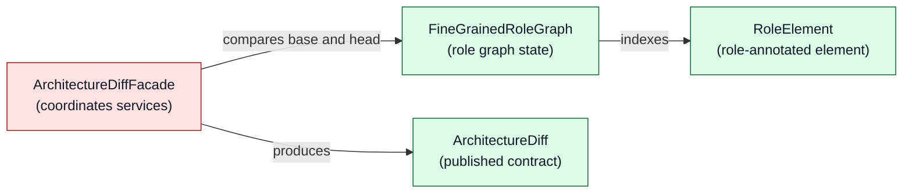
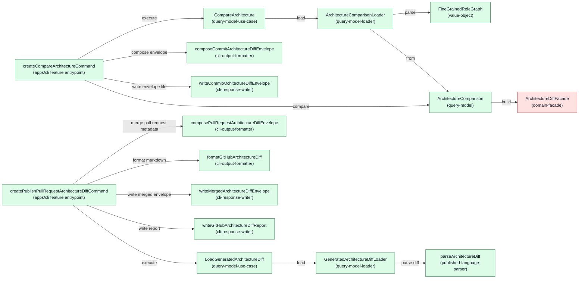

<!-- component-design-option-1:start -->
#### Option 1: DDD value objects and domain-facade comparison exposed as a query model

This option makes architecture comparison a read-side domain capability inside `riviere-architecture`. The comparison input is a pair of file paths; the `riviere-architecture` use-cases package owns loading its inputs (the two `fine-grained-role-graph` files) exactly like the canonical riviere-builder query loaders; the comparison rules (diffing, grouping, association detection, affected-aggregate resolution, totals) live in explicit `domain-service` functions coordinated by a `domain-facade`; and the capability is exposed to callers as a `query-model` loaded by a `query-model-loader` and orchestrated by a `query-model-use-case`. The shared `ArchitectureDiff` serialization contract lives in a published-language package; the tracked `.riviere/pr-diffs/riviere-architecture-diff.json` envelope is modelled as a second query so the PR-time GitHub Action merges its fields and formats the report from already-generated state without recalculating. `apps/cli` passes only options and formats/writes output; every comparison rule sits in the domain.

##### Domain model change



Legend: green = new, red = open decision (domain-facade instance awaiting `approvedInstances` approval), gray = existing, yellow = changed.

No aggregate here: the comparison only reads `base`/`head` and derives a result, so the owning class is a query model, and the behaviour is domain services plus a facade. `ArchitectureDiff` (green) is the published-language contract shown as a domain output, not a consumer-API mapping. The tracked-file envelope (`ArchitectureDiffEnvelope`) is deliberately **not** in this diagram: it is an app-facing read shape (query model), not a domain concept. There is no existing `riviere-architecture` subdomain, so all concepts are new.

##### Runtime call diagram



Legend: green = new, red = open decision (facade instance approval), gray = existing, yellow = changed. Left cluster = commit-hook phase; right cluster = PR-time Action phase.

##### State loading and persistence description

**Load 1 — comparison inputs (commit-hook phase):**

- **Loaded state:** exactly two `fine-grained-role-graph` files — `base` (the `main` revision) and `head` (the current commit). These are retained outputs of the two independently named Rivière workflows.
- **Owning component and role:** `ArchitectureComparisonLoader` (`query-model-loader`) in `packages/riviere-architecture/use-cases/src/features/architecture-diff/data-access/architecture-comparison/`. This honours the approved ownership "Expose architecture comparison to callers, including loading its inputs"; the CLI passes only paths and never reads files.
- **Exact load call:** `load(baseGraphPath, headGraphPath)`; per path it resolves the path against the working directory, checks `existsSync`, reads with `readFileSync`, `JSON.parse`s, then parses via `FineGrainedRoleGraph.parse` — mirroring `packages/riviere-builder/use-cases/src/features/query/data-access/graph/query-loaders.ts` (`loadQueryModel`/`resolveGraphPath`). Both paths are required; there is no default-path convention.
- **Load inputs and origins:** `CompareArchitectureInput = { baseGraphPath: string; headGraphPath: string }` ← CLI options `--base-graph` / `--head-graph` supplied by the commit-hook script. How the hook generates and materialises the base (`main`) and head graph files (retained output paths, worktree, or checkout) is **deferred to the approved first delivery ticket** (ARCH.md §6); the loader therefore takes explicit required paths and invents no path convention.
- **Loaded output:** `ArchitectureComparison` query model. `base` ← success value of `FineGrainedRoleGraph.parse(base file JSON)`; `head` ← success value of `FineGrainedRoleGraph.parse(head file JSON)`; combined via `ArchitectureComparison.from(base, head)`. Missing file → `FineGrainedRoleGraphNotFoundError`; unreadable/invalid JSON or failed parse → `FineGrainedRoleGraphCorruptedError` (both `data-access-error`).
- **Invoked by:** `CompareArchitecture.execute` only. Never invoked by an entrypoint.
- **Owning object after loading:** `ArchitectureComparison` holds both `FineGrainedRoleGraph` values as private read-only data members. Source location lives on each `RoleElement` (from `riviere-schema` `SourceLocation`); revision-specific URLs are composed at the app boundary inside the envelope metadata.

**Load 2 — tracked diff envelope (PR-time Action phase):**

- **Loaded state:** the tracked file `.riviere/pr-diffs/riviere-architecture-diff.json` (approved convention; used as the `envelopePathOption` default).
- **Owning component and role:** `GeneratedArchitectureDiffLoader` (`query-model-loader`) in `.../data-access/architecture-diff-envelope/`.
- **Exact load call:** `load(envelopePathOption)` → `readFileSync` → `JSON.parse` → `parseArchitectureDiff(envelope.diff)` (published-language parser, explicit success/failure result, no throwing validation).
- **Load inputs and origins:** `LoadGeneratedArchitectureDiffInput = { envelopePathOption: string | undefined }` ← CLI option `--envelope` (default `.riviere/pr-diffs/riviere-architecture-diff.json`) supplied by the workflow step.
- **Loaded output:** `ArchitectureDiffEnvelope`. `metadata` ← passthrough of the file's metadata object (`repository`, `baseRevision`, `headRevision`, `sourceLinks`, optional `pullRequest`); `diff` ← `parseArchitectureDiff` success value. Missing file → `ArchitectureDiffEnvelopeNotFoundError`; corrupt metadata or failed diff validation → `ArchitectureDiffEnvelopeCorruptedError` (`data-access-error`).
- **Invoked by:** `LoadGeneratedArchitectureDiff.execute` only.

**Persistence — tracked envelope writes (field-level ownership per ARCH.md):**

- **Commit-hook write:** `writeCommitArchitectureDiffEnvelope(envelope, outputPath)` (`cli-response-writer`) writes `{ metadata: { repository, baseRevision, headRevision, sourceLinks }, diff }`. Field origins: `repository` ← `git remote get-url origin`; `baseRevision` ← `git rev-parse main`; `headRevision` ← `git rev-parse HEAD` — each passed by the commit-hook script as `--repository` / `--base-revision` / `--head-revision` options (the CLI performs no git subprocess calls; no `external-client-service` role is allowed in `apps/cli`). `sourceLinks` ← composed by `composeCommitArchitectureDiffEnvelope` from repository + revisions as base/head blob-URL prefixes (`https://github.com/{repository}/blob/{revision}/`) used by both GitHub and Éclair to build element source-line links from `SourceLocation`. `diff` ← `architectureComparison.compare()`. `outputPath` ← `--output`, default `.riviere/pr-diffs/riviere-architecture-diff.json`.
- **PR-time write-back:** `writeMergedArchitectureDiffEnvelope(mergedEnvelope, envelopePath)` (`cli-response-writer`) writes the same file with only `metadata.pullRequest.{ number, title, description, url }` added by `composePullRequestArchitectureDiffEnvelope`. Field origins: GitHub Actions pull-request event context (`github.event.pull_request.number`, `.title`, `.body`, `.html_url`) passed as options by the workflow step. These fields do not exist at commit time.
- **Report write:** `writeGitHubArchitectureDiffReport(markdown, reportPath)` (`cli-response-writer`) writes the markdown file the workflow posts as the pull-request comment; the report is built from the parsed envelope, never recalculated.

##### Components

Subdomain packages (`packages/riviere-architecture/`):

| Component | Layer / path | Status | .riviere role | Responsibilities | Estimated size |
|---|---|---|---|---|---|
| `ArchitectureDiff` | `published-language/src/published-language` | New | `published-language-schema` | Root `diff` contract: subdomains, elements, associations, affected aggregates, totals. | Medium |
| `ArchitectureSubdomainChange` | published-language | New | `published-language-data-structure` | Subdomain change with status, affected aggregates, per-package-kind additions/removals. | Medium |
| `ArchitectureElementChange` | published-language | New | `published-language-data-structure` | Element change: direction, layer, group, before/after element reference, source evidence. | Large |
| `ApplicationAssociationChange` | published-language | New | `published-language-data-structure` | Application↔subdomain association change with base and head source evidence. | Small |
| `AffectedAggregate` | published-language | New | `published-language-data-structure` | Aggregate named as affected with separated added/removed members. | Small |
| `ArchitectureDiffTotals` | published-language | New | `published-language-data-structure` | changedSubdomains, changedPackages, affectedAggregates. | Small |
| `ARCHITECTURE_CHANGE_DIRECTION` / `ArchitectureChangeDirection` | published-language | New | `published-language-enumeration` / `published-language-enumeration-type` | `added` / `removed` / `modified`. | Small |
| `ARCHITECTURE_PACKAGE_KIND` / `ArchitecturePackageKind` | published-language | New | `published-language-enumeration` / `published-language-enumeration-type` | `use-cases` / `domain-model` / `published-language` / `application`. | Small |
| `ARCHITECTURE_LAYER_NAME` / `ArchitectureLayerName` | published-language | New | `published-language-enumeration` / `published-language-enumeration-type` | `entrypoints` / `use-cases` / `domain`. | Small |
| `architecture-diff-field-names` | published-language | New | `published-language-field-name` | String-literal field-name constants. | Small |
| `parseArchitectureDiff` | published-language | New | `published-language-parser` | Parse `unknown` → `ArchitectureDiff` or a declared failure shape; used by the envelope loader and by Éclair readers. | Medium |
| `FineGrainedRoleGraph` | `domain-model/src/domain/comparison` | New | `value-object` | Owns a validated `RiviereGraph`; exposes `elements()` as `RoleElement[]`. | Medium |
| `RoleElement` | domain-model | New | `value-object` | One role-annotated element: identity, `architectureRole`, `packageKind`, `aggregateOwnerId`, methods, source location; `sameAs`. | Medium |
| `diffRoleElements` | domain-model `domain/comparison` | New | `domain-service` | Produce `ArchitectureElementChange[]` (added/removed/modified) via `RoleElement` identity. | Medium |
| `groupChangesBySubdomainAndLayer` | domain-model | New | `domain-service` | Group element changes by subdomain → layer → direction → package/use-case/aggregate group. | Medium |
| `detectApplicationAssociationChanges` | domain-model | New | `domain-service` | Detect application↔subdomain reassignment with base and head evidence. | Medium |
| `resolveAffectedAggregates` | domain-model | New | `domain-service` | Enforce "changed on both sides ⇒ affected, not created+deleted". | Small |
| `summarizeDiffTotals` | domain-model | New | `domain-service` | Compute `ArchitectureDiffTotals` from changes, grouping, associations. | Small |
| `ArchitectureDiffFacade` | domain-model | New | `domain-facade` *(open decision)* | One stable `build(base, head)` interface coordinating the five comparison services held as private readonly members. | Small |
| `CompareArchitecture` | `use-cases/src/features/architecture-diff/queries` | New | `query-model-use-case` | Translate input into loader criteria; load and return the comparison query model. | Small |
| `CompareArchitectureInput` | use-cases `queries` | New | `query-model-use-case-input` | `{ baseGraphPath: string; headGraphPath: string }` — paths only, no file content. | Small |
| `ArchitectureComparison` | use-cases `queries` | New | `query-model` | Read model holding base+head; exposes `compare(): ArchitectureDiff` via the facade. | Small |
| `ArchitectureComparisonLoader` | use-cases `data-access/architecture-comparison` | New | `query-model-loader` | `load(baseGraphPath, headGraphPath)`: read both graph files via `node:fs`, parse value objects, construct the query model. Owns "loading its inputs". | Medium |
| `FineGrainedRoleGraphNotFoundError` / `FineGrainedRoleGraphCorruptedError` | use-cases `data-access/architecture-comparison` | New | `data-access-error` | Missing or corrupt/unparseable graph file (not a domain violation). | Small |
| `LoadGeneratedArchitectureDiff` | use-cases `queries` | New | `query-model-use-case` | Load and return the tracked envelope as a query model. | Small |
| `LoadGeneratedArchitectureDiffInput` | use-cases `queries` | New | `query-model-use-case-input` | `{ envelopePathOption: string \| undefined }`. | Small |
| `ArchitectureDiffEnvelope` | use-cases `queries` | New | `query-model` | `{ metadata, diff }` interface — the tracked-file read shape and app write target. | Small |
| `ArchitectureDiffEnvelopeMetadata` / `ArchitectureDiffPullRequestMetadata` | use-cases `queries` | New | `query-model-value` | Commit-time metadata (repository, revisions, sourceLinks, optional pullRequest) and PR-time metadata (number, title, description, url). | Small |
| `GeneratedArchitectureDiffLoader` | use-cases `data-access/architecture-diff-envelope` | New | `query-model-loader` | `load(envelopePathOption)`: read tracked file, validate `diff` via `parseArchitectureDiff`, return the envelope. | Medium |
| `ArchitectureDiffEnvelopeNotFoundError` / `ArchitectureDiffEnvelopeCorruptedError` | use-cases `data-access/architecture-diff-envelope` | New | `data-access-error` | Missing tracked file or invalid envelope/diff. | Small |

Consumer boundaries:

| Component | Layer / path | Status | .riviere role | Responsibilities | Estimated size |
|---|---|---|---|---|---|
| `createCompareArchitectureCommand` + `CompareArchitectureEntrypointDependencies` | `apps/cli/src/features/architecture-diff/entrypoint/compare-architecture` | New | `cli-entrypoint` + `cli-entrypoint-dependencies` | Register `--base-graph`/`--head-graph`/`--repository`/`--base-revision`/`--head-revision`/`--output` options; translate options into `CompareArchitectureInput` inline (canonical query pattern; **no input factory**); invoke query; call `compare()`; compose and write the commit-time envelope. | Small |
| `composeCommitArchitectureDiffEnvelope` | `apps/cli` `entrypoint/compare-architecture` | New | `cli-output-formatter` | Compose `{ metadata: { repository, baseRevision, headRevision, sourceLinks }, diff }` from the diff and git-context options; derive sourceLinks URL prefixes. | Small |
| `writeCommitArchitectureDiffEnvelope` | `apps/cli` `entrypoint/compare-architecture` | New | `cli-response-writer` | Write the envelope JSON to the tracked output path. | Small |
| `createPublishPullRequestArchitectureDiffCommand` + `PublishPullRequestArchitectureDiffEntrypointDependencies` | `apps/cli/src/features/architecture-diff/entrypoint/publish-pr-architecture-diff` | New | `cli-entrypoint` + `cli-entrypoint-dependencies` | Register `--envelope`/`--pull-request-number`/`--pull-request-title`/`--pull-request-description`/`--pull-request-url`/`--report-output` options; translate into `LoadGeneratedArchitectureDiffInput`; invoke query; merge, write back, format, and write the report. | Small |
| `composePullRequestArchitectureDiffEnvelope` | `apps/cli` `entrypoint/publish-pr-architecture-diff` | New | `cli-output-formatter` | Add only `metadata.pullRequest.*` to the loaded envelope (approved PR-time field ownership). | Small |
| `formatGitHubArchitectureDiff` (+ sibling section formatters) | `apps/cli` `entrypoint/publish-pr-architecture-diff` | New | `cli-output-formatter` | Format the parsed envelope (diff + sourceLinks) as the complete GitHub markdown report; decomposes into section formatter functions like the existing proof of concept. | Large |
| `writeMergedArchitectureDiffEnvelope` | `apps/cli` `entrypoint/publish-pr-architecture-diff` | New | `cli-response-writer` | Write the merged envelope back to the tracked file. | Small |
| `writeGitHubArchitectureDiffReport` | `apps/cli` `entrypoint/publish-pr-architecture-diff` | New | `cli-response-writer` | Write the markdown report file the workflow posts as the pull-request comment. | Small |
| `pr-diff` review page | `apps/eclair/src/features/pr-diff` | New | (Éclair is unassigned) | Public link load and private upload both validate `diff` via `parseArchitectureDiff`; presents metadata from the envelope. | — |
| Commit-hook script + PR workflow steps | `.githooks/` + `.github/workflows/` | Changed | (outside enforced packages) | Supply git context and GitHub event context as CLI options; invoke the two commands; post the report comment. | — |

### .riviere role options

| Element | Kind | Sublocation | Candidate roles | Preferred role | Reason | Open decision |
|---|---|---|---|---|---|---|
| `ArchitectureDiff` | interface | `riviere-architecture/published-language` | `published-language-schema`, `published-language-data-structure` | `published-language-schema` | Root cross-boundary contract, not a nested member shape. | none |
| `ArchitectureSubdomainChange`, `ArchitectureElementChange`, `ApplicationAssociationChange`, `AffectedAggregate`, `ArchitectureDiffTotals` | interfaces | published-language | `published-language-data-structure` | `published-language-data-structure` | Member shapes of the schema; must be data structures. | none |
| `ARCHITECTURE_CHANGE_DIRECTION`/`ArchitectureChangeDirection` (and package-kind, layer-name pairs) | variable + type alias | published-language | `published-language-enumeration` + `-enumeration-type` | same | Closed string unions follow the repo enumeration pair convention. | none |
| `architecture-diff-field-names` | const | published-language | `published-language-field-name` | `published-language-field-name` | Unchecked string-literal duplication is forbidden repo-wide. | none |
| `parseArchitectureDiff` | function | published-language | `published-language-parser` | `published-language-parser` | Parses the complete schema with an explicit failure branch; used by the envelope loader and Éclair. | none |
| `FineGrainedRoleGraph`, `RoleElement` | classes | `riviere-architecture/domain-model` `domain/comparison` | `value-object` | `value-object` | Immutable parsed graph state with `parse`/`from` factories and brand members; no invariants beyond integrity. | `RoleElement` terminology confirmation |
| `diffRoleElements`, `groupChangesBySubdomainAndLayer`, `detectApplicationAssociationChanges`, `resolveAffectedAggregates`, `summarizeDiffTotals` | functions | domain-model `domain/comparison` | `domain-service` | `domain-service` | Operate on two value-object states (base and head) that no single object owns; each carries the required justification ("comparison of two states has no single owning aggregate/value object"). | none |
| `ArchitectureDiffFacade` | class | domain-model `domain/comparison` | `domain-facade`, `domain-service` | `domain-facade` | Consumer (`ArchitectureComparison` query model) needs one stable interface over five services with sequencing; `domain-service` forbids depending on other domain services. Requires `approvedInstances` entry with justification answering the configured question. | **yes** — user approval required |
| `CompareArchitecture`, `LoadGeneratedArchitectureDiff` | classes | `riviere-architecture/use-cases` `features/architecture-diff/queries` | `query-model-use-case` | `query-model-use-case` | Read-only load-and-return orchestration. | none |
| `CompareArchitectureInput`, `LoadGeneratedArchitectureDiffInput` | interfaces | use-cases `queries` | `query-model-use-case-input` | `query-model-use-case-input` | Name matches `.*(Input\|Options)$`; paths/options only. | none |
| `ArchitectureComparison` | class | use-cases `queries` | `query-model` | `query-model` | Read model for the concrete compare read; depends on the facade (allowed dependent role). | none |
| `ArchitectureDiffEnvelope` | interface | use-cases `queries` | `query-model`, `query-model-value` | `query-model` | The tracked-file read shape returned by the query; `query-model` (interface target) is also accepted by `cli-response-writer.allowedInputs`. | none |
| `ArchitectureDiffEnvelopeMetadata`, `ArchitectureDiffPullRequestMetadata` | interfaces | use-cases `queries` | `query-model-value` | `query-model-value` | Result shapes flowing out of the envelope query model. | none |
| `ArchitectureComparisonLoader`, `GeneratedArchitectureDiffLoader` | classes | use-cases `data-access/{architecture-comparison, architecture-diff-envelope}` | `query-model-loader` | `query-model-loader` | Load concrete query models from persisted files; canonical `query-loaders.ts` shape; no save. | none |
| `FineGrainedRoleGraphNotFoundError`/`…CorruptedError`, `ArchitectureDiffEnvelopeNotFoundError`/`…CorruptedError` | classes | use-cases `data-access/*` | `data-access-error` | `data-access-error` | File-level failures, mirroring `GraphNotFoundError`/`GraphCorruptedError`. | none |
| `createCompareArchitectureCommand`, `createPublishPullRequestArchitectureDiffCommand` | functions | `apps/cli` `features/architecture-diff/entrypoint/*` | `cli-entrypoint` | `cli-entrypoint` | Register command, translate options into query input inline, invoke query, delegate formatting/writing. | none |
| `CompareArchitectureEntrypointDependencies`, `PublishPullRequestArchitectureDiffEntrypointDependencies` | interfaces | apps/cli entrypoints | `cli-entrypoint-dependencies` | `cli-entrypoint-dependencies` | Name matches `.*EntrypointDependencies$`; collaborator roles all allowed. | none |
| `composeCommitArchitectureDiffEnvelope`, `composePullRequestArchitectureDiffEnvelope`, `formatGitHubArchitectureDiff` (+ section formatters) | functions | apps/cli entrypoints | `cli-output-formatter` | `cli-output-formatter` | Decide envelope/report presentation from a typed result; no file I/O, no loading. | none |
| `writeCommitArchitectureDiffEnvelope`, `writeMergedArchitectureDiffEnvelope`, `writeGitHubArchitectureDiffReport` | functions | apps/cli entrypoints | `cli-response-writer` | `cli-response-writer` | Perform the output side effect (file writes); envelope input is a `query-model`. | none |

No `command-input-factory` appears on the query path: its `allowedOutputs`/`allowedDependencyRoles` only permit `command-use-case-input`, and the canonical "CLI Invoking Query Model Use Case" pattern has no factory — the `cli-entrypoint` translates options inline, matching `apps/cli/src/features/query/entrypoint/components/entrypoint.ts`.

### Canonical role pattern

Pattern: `CLI Invoking Query Model Use Case` and `Query Model Use Case loading and querying a query model` (from `.riviere/canonical-role-configurations.md`), applied twice. The commit-hook command invokes `CompareArchitecture` and formats/writes the envelope; the PR-time Action invokes `LoadGeneratedArchitectureDiff` and formats/writes the merged envelope plus report. Both loaders follow the canonical `query-loaders.ts` data-access shape (path option in, file read via `node:fs`, `data-access-error` on failure, concrete query model out).

### Tangled responsibility findings

- **Resolved:** the previous draft had the app-side entrypoint/factory read graph files and pass raw content — an "entrypoint directly imports persistence" tangle, plus a `command-input-factory` producing a `query-model-use-case-input` (incompatible role). Corrected: all file reading lives in `ArchitectureComparisonLoader`/`GeneratedArchitectureDiffLoader` (use-cases data-access); the factory is dropped.
- **Checked, not tangled:** the PR-time merge is presentation-side composition (`cli-output-formatter`) plus a `cli-response-writer` file write at the CLI output boundary — the same precedent as `writeFinalizedGraph`/`writePullRequestArchitectureDiff`. No write behaviour exists on a query model or loader, so the "write behind a query model" check passes.

No tangled responsibilities identified beyond the resolved finding above.

#### Output contract reconciliation

`CompareArchitecture.execute` returns `ArchitectureComparison` (role `query-model`), satisfying `allowedOutputs = ['query-model', 'query-model-value']`. Its `compare()` returns the published-language `ArchitectureDiff` via the facade. `LoadGeneratedArchitectureDiff.execute` returns `ArchitectureDiffEnvelope` (interface annotated `query-model`) whose `diff` member is the validated `ArchitectureDiff` and whose `metadata` members are `query-model-value` shapes. `apps/cli` never imports published-language directly (features may only import subdomain `queries`/`commands`): it consumes the `ArchitectureDiff` type via the query package's exported types and the envelope, and `parseArchitectureDiff` is invoked inside `GeneratedArchitectureDiffLoader` (data-access may import any subdomain published-language) and by Éclair. The envelope keeps GitHub-specific identity fields out of the language-agnostic `ArchitectureDiff` schema, per the approved rejection. Conformance between query results and the schema is asserted in use-cases tests by round-tripping through `parseArchitectureDiff`. The approved field-level write ownership is visible in the two composers: commit-time writes `repository`/`baseRevision`/`headRevision`/`sourceLinks`/`diff`; PR-time adds only `pullRequest.number`/`.title`/`.description`/`.url`.

##### Runtime call outline

```text
createCompareArchitectureCommand  (commit-hook phase)
  ├─ compareArchitecture.execute({ baseGraphPath, headGraphPath })
  │  └─ architectureComparisonLoader.load(baseGraphPath, headGraphPath)
  │     ├─ readFileSync(baseGraphPath)
  │     ├─ FineGrainedRoleGraph.parse(baseGraphJson)
  │     ├─ readFileSync(headGraphPath)
  │     ├─ FineGrainedRoleGraph.parse(headGraphJson)
  │     └─ ArchitectureComparison.from(base, head)
  ├─ architectureComparison.compare()
  │  └─ architectureDiffFacade.build(base, head)
  │     ├─ diffRoleElements(base.elements(), head.elements())
  │     ├─ groupChangesBySubdomainAndLayer(elementChanges, base, head)
  │     ├─ detectApplicationAssociationChanges(base.elements(), head.elements())
  │     ├─ resolveAffectedAggregates(elementChanges)
  │     └─ summarizeDiffTotals(elementChanges, grouping, associationChanges)
  ├─ composeCommitArchitectureDiffEnvelope(architectureDiff, commitContext)
  └─ writeCommitArchitectureDiffEnvelope(envelope, outputPath)

createPublishPullRequestArchitectureDiffCommand  (PR-time Action phase)
  ├─ loadGeneratedArchitectureDiff.execute({ envelopePathOption })
  │  └─ generatedArchitectureDiffLoader.load(envelopePathOption)
  │     ├─ readFileSync(envelopePath)
  │     └─ parseArchitectureDiff(envelopeJson.diff)
  ├─ composePullRequestArchitectureDiffEnvelope(envelope, pullRequestMetadata)
  ├─ writeMergedArchitectureDiffEnvelope(mergedEnvelope, envelopePath)
  ├─ formatGitHubArchitectureDiff(mergedEnvelope)
  └─ writeGitHubArchitectureDiffReport(markdown, reportPath)
```

##### Code stress test

```typescript
// ── riviere-architecture/use-cases: queries ──────────────────────────────
/** @riviere-role query-model-use-case */
export class CompareArchitecture {
  constructor(private readonly loader: ArchitectureComparisonLoader) {}
  execute(input: CompareArchitectureInput): ArchitectureComparison {
    return this.loader.load(input.baseGraphPath, input.headGraphPath)
  }
}

// ── riviere-architecture/use-cases: data-access (owns loading its inputs) ─
/** @riviere-role query-model-loader */
export class ArchitectureComparisonLoader {
  load(baseGraphPath: string, headGraphPath: string): ArchitectureComparison {
    const base = loadFineGrainedRoleGraph(baseGraphPath)
    const head = loadFineGrainedRoleGraph(headGraphPath)
    return ArchitectureComparison.from(base, head)
  }
}

function loadFineGrainedRoleGraph(graphPath: string): FineGrainedRoleGraph {
  if (!existsSync(graphPath)) {
    throw new FineGrainedRoleGraphNotFoundError(graphPath)
  }
  let json: unknown
  try {
    json = JSON.parse(readFileSync(graphPath, 'utf-8'))
  } catch (error) {
    throw new FineGrainedRoleGraphCorruptedError(graphPath, { cause: error })
  }
  const parsed = FineGrainedRoleGraph.parse(json)
  if (!parsed.success) {
    throw new FineGrainedRoleGraphCorruptedError(graphPath)
  }
  return parsed.graph
}

/** @riviere-role query-model */
export class ArchitectureComparison {
  private readonly facade = new ArchitectureDiffFacade()
  private constructor(
    private readonly base: FineGrainedRoleGraph,
    private readonly head: FineGrainedRoleGraph,
  ) {}
  static from(base: FineGrainedRoleGraph, head: FineGrainedRoleGraph): ArchitectureComparison {
    return new ArchitectureComparison(base, head)
  }
  compare(): ArchitectureDiff {
    return this.facade.build(this.base, this.head)
  }
}

// ── riviere-architecture/domain-model: facade holds its services ─────────
/** @riviere-role domain-facade */
export class ArchitectureDiffFacade {
  private readonly diffElements = diffRoleElements
  private readonly groupChanges = groupChangesBySubdomainAndLayer
  private readonly detectAssociationChanges = detectApplicationAssociationChanges
  private readonly resolveAffected = resolveAffectedAggregates
  private readonly summarizeTotals = summarizeDiffTotals

  build(base: FineGrainedRoleGraph, head: FineGrainedRoleGraph): ArchitectureDiff {
    const elements = this.diffElements(base.elements(), head.elements())
    const grouping = this.groupChanges(elements, base, head)
    const associations = this.detectAssociationChanges(base.elements(), head.elements())
    const affectedAggregates = this.resolveAffected(elements)
    const totals = this.summarizeTotals(elements, grouping, associations)
    return { subdomains: grouping.subdomains, elements, associations, affectedAggregates, totals }
  }
}

// ── domain service: element diff by stable identity (added/removed/modified)
/** @riviere-role domain-service */
export function diffRoleElements(
  base: readonly RoleElement[],
  head: readonly RoleElement[],
): readonly ArchitectureElementChange[] {
  const baseById = new Map(base.map((element) => [element.id, element]))
  const headById = new Map(head.map((element) => [element.id, element]))
  const added = [...headById.values()]
    .filter((element) => !baseById.has(element.id))
    .map((after) => ({ direction: 'added', after }) as ArchitectureElementChange)
  const removed = [...baseById.values()]
    .filter((element) => !headById.has(element.id))
    .map((before) => ({ direction: 'removed', before }) as ArchitectureElementChange)
  const modified = [...headById.values()]
    .filter((element) => baseById.has(element.id) && !baseById.get(element.id)!.sameAs(element))
    .map((after) => ({ direction: 'modified', before: baseById.get(after.id)!, after }) as ArchitectureElementChange)
  return [...added, ...removed, ...modified]
}

// ── apps/cli: approved field-level envelope ownership ────────────────────
/** @riviere-role cli-output-formatter */
export function composeCommitArchitectureDiffEnvelope(
  architectureDiff: ArchitectureDiff,
  commitContext: { repository: string; baseRevision: string; headRevision: string },
): ArchitectureDiffEnvelope {
  return {
    metadata: {
      repository: commitContext.repository,
      baseRevision: commitContext.baseRevision,
      headRevision: commitContext.headRevision,
      sourceLinks: {
        base: `https://github.com/${commitContext.repository}/blob/${commitContext.baseRevision}/`,
        head: `https://github.com/${commitContext.repository}/blob/${commitContext.headRevision}/`,
      },
    },
    diff: architectureDiff,
  }
}

/** @riviere-role cli-output-formatter */
export function composePullRequestArchitectureDiffEnvelope(
  envelope: ArchitectureDiffEnvelope,
  pullRequest: ArchitectureDiffPullRequestMetadata,
): ArchitectureDiffEnvelope {
  return { metadata: { ...envelope.metadata, pullRequest }, diff: envelope.diff }
}
```

`groupChangesBySubdomainAndLayer`, `detectApplicationAssociationChanges`, `resolveAffectedAggregates`, and `summarizeDiffTotals` keep the previous option's domain-service shapes (grouping by `RoleElement.domain`/`.layer`/`.packageKind`; association reassignment with base+head evidence; "changed on both sides ⇒ affected"; three totals). `RoleElement.sameAs(other)` implements structural equality over `architectureRole`, `packageKind`, `aggregateOwnerId`, `methods`, and `sourceLocation`, ignoring `id`.

##### New dependencies

| Dependency | Status | Used by | Purpose |
|---|---|---|---|
| `@living-architecture/riviere-schema-published-language` | Existing | `riviere-architecture-published-language`, `riviere-architecture-domain-model` | Reuse `Component`, `Link`, `SourceLocation`, `RiviereGraph` for element references and graph parsing. |
| `@living-architecture/riviere-architecture-published-language` | New | `riviere-architecture-domain-model`, `riviere-architecture-use-cases`, `apps/eclair` | The single shared `ArchitectureDiff` contract and `parseArchitectureDiff` for readers. |
| `@living-architecture/riviere-architecture-use-cases` | New | `apps/cli` | The two query use cases, query models, envelope types, and loaders; apps may only import subdomain queries/commands. |
| None | — | — | No runtime/adapter libraries; comparison is pure domain logic over parsed graphs; file access is `node:fs` in data-access and CLI writers only. |

##### Code shape

```text
packages/riviere-architecture/
  published-language/src/published-language/
    architecture-diff.ts                    (root schema)
    architecture-element-change.ts          (data structure)
    architecture-subdomain-change.ts
    application-association-change.ts
    affected-aggregate.ts
    architecture-diff-totals.ts
    architecture-change-direction.ts        (enumeration + type)
    architecture-package-kind.ts
    architecture-layer-name.ts
    architecture-diff-field-names.ts
    parse-architecture-diff.ts              (parser)
    index.ts
  domain-model/src/domain/comparison/
    fine-grained-role-graph.ts              (value-object)
    role-element.ts                         (value-object)
    diff-role-elements.ts                   (domain-service)
    group-changes-by-subdomain-and-layer.ts (domain-service)
    detect-application-association-changes.ts (domain-service)
    resolve-affected-aggregates.ts          (domain-service)
    summarize-diff-totals.ts                (domain-service)
    architecture-diff-facade.ts             (domain-facade)
  use-cases/src/features/architecture-diff/
    queries/compare-architecture.ts               (query-model-use-case)
    queries/compare-architecture-input.ts
    queries/architecture-comparison.ts            (query-model)
    queries/load-generated-architecture-diff.ts   (query-model-use-case)
    queries/load-generated-architecture-diff-input.ts
    queries/architecture-diff-envelope.ts         (query-model)
    queries/architecture-diff-envelope-metadata.ts        (query-model-value)
    queries/architecture-diff-pull-request-metadata.ts    (query-model-value)
    data-access/architecture-comparison/architecture-comparison-loader.ts
    data-access/architecture-comparison/fine-grained-role-graph-not-found-error.ts
    data-access/architecture-comparison/fine-grained-role-graph-corrupted-error.ts
    data-access/architecture-diff-envelope/generated-architecture-diff-loader.ts
    data-access/architecture-diff-envelope/architecture-diff-envelope-not-found-error.ts
    data-access/architecture-diff-envelope/architecture-diff-envelope-corrupted-error.ts
apps/cli/src/features/architecture-diff/entrypoint/
  compare-architecture/entrypoint.ts
  compare-architecture/compose-commit-architecture-diff-envelope.ts
  compare-architecture/write-commit-architecture-diff-envelope.ts
  publish-pr-architecture-diff/entrypoint.ts
  publish-pr-architecture-diff/compose-pull-request-architecture-diff-envelope.ts
  publish-pr-architecture-diff/format-github-architecture-diff.ts   (+ section formatters)
  publish-pr-architecture-diff/write-merged-architecture-diff-envelope.ts
  publish-pr-architecture-diff/write-github-architecture-diff-report.ts
apps/eclair/src/features/pr-diff/             (minimal review page)
```

##### Design validation

- **Domain terminology:** pass. `FineGrainedRoleGraph`, `ArchitectureDiff`, `ArchitectureComparison`, `ArchitectureDiffEnvelope`, `metadata`/`diff` envelope keys, `sourceLinks`, commit hook, and PR-time Action reuse PRD/ARCH terms. `RoleElement` is proposed for a single role-annotated element (no existing shared term).
- **Application/domain separation:** pass. Both use cases only translate-and-load-and-return; the comparison query model delegates computation to the facade; every comparison rule is a domain service; envelope merge and report formatting are presentation-side; no loops or private logic in use cases.
- **Role and location fit:** pass, with one open decision. Every element maps to a real role and an allowed sublocation; loading lives in use-cases data-access per the approved "including loading its inputs" ownership; no `command-input-factory` on the query path; writers take a `query-model`/strings. `ArchitectureDiffFacade` is a new `domain-facade` instance needing `approvedInstances` approval.
- **Implementability:** pass. ADR-002 allows domain-model→any published-language, use-cases→own domain + any published-language, and apps→subdomain queries only; the envelope query makes `parseArchitectureDiff` reachable without apps importing published-language; both file reads mirror the canonical `query-loaders.ts` pattern.

##### Rejected sub-ideas

- **Aggregate + aggregate-repository + command-use-case:** rejected — the comparison is read-only over immutable inputs and derives a result without mutating or persisting domain state, so the write-side roles are wrong.
- **App-side generic JSON reader passing raw content:** rejected — ARCH.md assigns input loading to `riviere-architecture/use-cases`, the canonical query loaders read files by path in data-access, and no reader role exists in `apps/cli`.
- **`command-input-factory` on the query path:** rejected — its role constraints only allow producing `command-use-case-input`; the canonical query pattern translates options in the `cli-entrypoint` with no factory.
- **Returning the published-language `ArchitectureDiff` directly from the use case:** rejected — `query-model-use-case` `allowedOutputs` are `query-model`/`query-model-value`; the query models own the read and the published-language package owns serialization.
- **A single monolithic `buildArchitectureDiff` domain-service:** rejected — it hides the grouping, association, affected-aggregate, and totals rules behind one entry point; the per-capability services make each rule reviewable.
- **Sequencing services inside the query model:** rejected — that would leak comparison orchestration into the query layer; the facade keeps it in the domain.
- **Moving grouping into the CLI formatter:** rejected — grouping and association detection are comparison rules, not presentation, and must stay consistent across GitHub and Éclair.
- **Modelling the PR-time merge as a command use case:** rejected — the merge adds presentation metadata to an already-generated file at the CLI output boundary; no domain state changes, so the writer/formatter pair is sufficient and matches `writeFinalizedGraph` precedent.

##### Open decisions

- **New domain-facade instance `ArchitectureDiffFacade`.** Requires approval to be added to `approvedInstances` in `.riviere/roles.ts`. Justification answering the configured question: the consumer is the `ArchitectureComparison` query model (plus any future query needing the same read); it needs one stable domain interface because correctly assembling the comparison requires five services in a fixed sequence (diff → group + detect associations → resolve affected aggregates → totals), a discovery and assembly burden that must not leak into the query layer.
- **`RoleElement` terminology.** Proposed domain term for a single role-annotated element in the fine-grained-role-graph; confirm before it becomes shared vocabulary.
<!-- component-design-option-1:end -->
