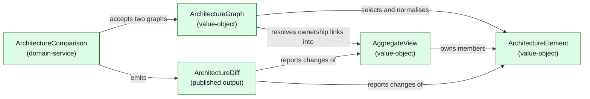
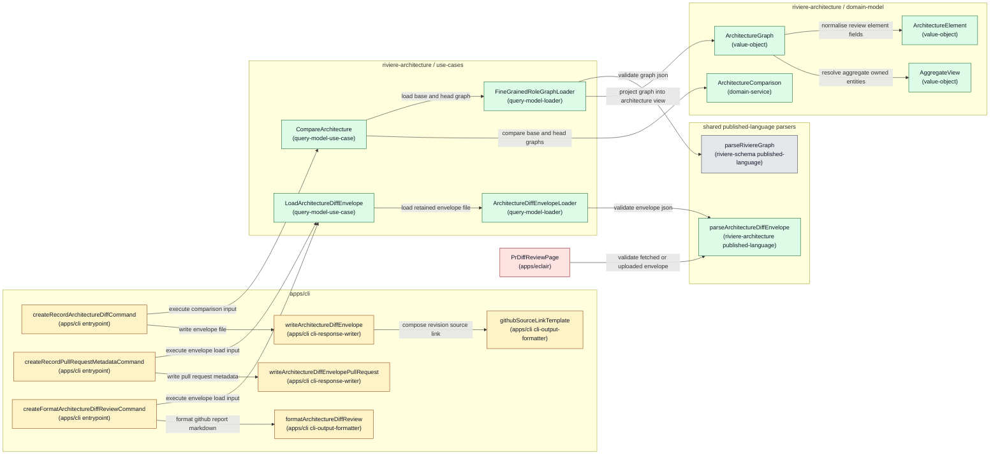

<!-- component-design-option-2:start -->
#### Option 2: Lean query-model-only comparison

Comparing two `fine-grained-role-graph` states is a **read-only** operation: a pure function over two immutable inputs producing one immutable result, so `riviere-architecture` stays **query-only** — one comparison query (`CompareArchitecture`) and one envelope-loading query (`LoadArchitectureDiffEnvelope`), with no aggregate, repository, or command use case in the subdomain. The graph-to-architecture projection — selecting review elements, resolving ownership links, grouping into subdomains and layers — is `ArchitectureGraph.from(riviereGraph)` in the domain-model, the architectural interpretation ARCH §2 assigns to `packages/riviere-architecture/domain-model`; the use-cases loaders own only reading and validating inputs. The retained file convention is delivered by two named `apps/cli` writers: the commit hook records the `ArchitectureDiff` plus commit-time metadata into `.riviere/pr-diffs/riviere-architecture-diff.json`, and the PR-time Action loads that same file, records `metadata.pullRequest`, and formats the GitHub report **from the file — never from a live comparison**. The envelope contract (`metadata` + `diff`, commit-time vs PR-time field split) is owned by `riviere-architecture/published-language`, and Éclair consumes the same envelope through its parser.

##### Domain model change

The comparison rules move from the dead `living-documentation` proof of concept into `riviere-architecture`, expressed **in Rivière graph concepts, not TypeScript symbols**. No aggregate is introduced: comparison has no lifecycle, protected state, or invariant beyond validity of inputs and output, and validity is owned by published-language parsing and value-object construction.



Legend: green = new domain concept. There are no changed or open-decision domain concepts in this option.

##### Runtime call diagram



Legend: green = new (the three `riviere-architecture` packages are new); yellow = changed (new commands added to the existing `apps/cli`); gray = existing (`parseRiviereGraph` in `riviere-schema-published-language`); red = open decision (`PrDiffReviewPage`, Éclair is explicitly unassigned).

##### Components

All three `packages/riviere-architecture/*` packages are new; `apps/cli` and `apps/eclair` are changed.

| Component | Layer / path | Status | .riviere role | Responsibilities | Estimated size |
|---|---|---|---|---|---|
| `ArchitectureGraph` | `packages/riviere-architecture/domain-model/src/domain/architecture-graph.ts` | New | `value-object` | Owns the architectural interpretation (ARCH §2): `from(riviereGraph)` selects `architecture-review-element` components, resolves `aggregate-owns-entity` and `supports-primary-element` links, groups members into subdomains/layers, splits application-owned elements out, canonicalises ordering. | Medium |
| `ArchitectureElement` | `packages/riviere-architecture/domain-model/src/domain/architecture-element.ts` | New | `value-object` | One role-annotated element; `fromReviewElementComponent` owns field normalisation: name, subdomain, `architectureRole`, `packageKind` into the closed union, `externalClient`, `methods`, related-to references, source evidence. | Small |
| `AggregateView` | `packages/riviere-architecture/domain-model/src/domain/aggregate-view.ts` | New | `value-object` | Read view of one aggregate; `fromAggregateComponent` owns field normalisation plus resolved owned-entity names: name, packageKind, methods, entities, source evidence. | Small |
| `InvalidArchitectureGraphError` | `packages/riviere-architecture/domain-model/src/domain/invalid-architecture-graph-error.ts` | New | `domain-error` | Thrown by the projection when a review element's required custom properties are missing or outside the closed unions (schema-valid graph, untrustworthy custom values). | Small |
| `ArchitectureComparison` | `packages/riviere-architecture/domain-model/src/domain/architecture-comparison.ts` | New | `domain-service` | Pure `compare(base, head) → ArchitectureDiff`; owns change direction, layer-change composition, aggregate member grouping, association-change detection. | Medium |
| `ArchitectureDiff` (+ nested change data structures, `ARCHITECTURE_PACKAGE_KIND`/`ArchitecturePackageKind` and `ARCHITECTURE_LAYER_NAME`/`ArchitectureLayerName` enumeration pairs) | `packages/riviere-architecture/published-language/src/published-language/architecture-diff.ts` | New | `published-language-schema`, `published-language-data-structure`, `published-language-enumeration`/`-enumeration-type` | Stable language-agnostic comparison contract (subdomain → layer → added/removed change sets); method-free. | Medium |
| `ArchitectureDiffEnvelope` (+ `ArchitectureDiffEnvelopeMetadata`, `RevisionReference`, source-link and pull-request structures) | `packages/riviere-architecture/published-language/src/published-language/architecture-diff-envelope.ts` | New | `published-language-schema`, `published-language-data-structure` | The retained-file contract: both top-level keys, with the commit-time (`repository`, `baseRevision`, `headRevision`, `sourceLinks`, `diff`) vs PR-time (`pullRequest`) field split. | Small |
| `parseArchitectureDiffEnvelope` | `packages/riviere-architecture/published-language/src/published-language/architecture-diff-envelope-parser.ts` | New | `published-language-parser` | Validates an unknown JSON value into an `ArchitectureDiffEnvelope`; commit-time fields required, `pullRequest` optional; browser-safe (no Node built-ins). | Small |
| `CompareArchitecture` (+ `CompareArchitectureInput`) | `packages/riviere-architecture/use-cases/src/features/comparison/queries/compare-architecture.ts` | New | `query-model-use-case` (+ `query-model-use-case-input`) | Load base → load head → compare → return `ArchitectureDiffView`; no domain decisions. | Small |
| `LoadArchitectureDiffEnvelope` (+ `LoadArchitectureDiffEnvelopeInput`) | `packages/riviere-architecture/use-cases/src/features/comparison/queries/load-architecture-diff-envelope.ts` | New | `query-model-use-case` (+ `query-model-use-case-input`) | Loads and validates the retained envelope file; returns `ArchitectureDiffEnvelopeView`. | Small |
| `ArchitectureDiffView` | `packages/riviere-architecture/use-cases/src/features/comparison/queries/architecture-diff-view.ts` | New | `query-model` | App-facing read shape: validated `ArchitectureDiff` plus base and head `RevisionReference`s. | Small |
| `ArchitectureDiffEnvelopeView` | `packages/riviere-architecture/use-cases/src/features/comparison/queries/architecture-diff-envelope-view.ts` | New | `query-model` | App-facing read shape wrapping the validated envelope. | Small |
| `FineGrainedRoleGraphView` | `packages/riviere-architecture/use-cases/src/features/comparison/queries/fine-grained-role-graph-view.ts` | New | `query-model` | One loaded `ArchitectureGraph` plus its `RevisionReference`. | Small |
| `FineGrainedRoleGraphLoader` (+ `ArchitectureGraphLoadError`) | `packages/riviere-architecture/use-cases/src/features/comparison/data-access/fine-grained-role-graph/` | New | `query-model-loader` (+ `data-access-error`) | Reads a retained graph file by required path, validates with `parseRiviereGraph`, invokes the domain factory `ArchitectureGraph.from`, attaches the `RevisionReference`. Contains no interpretation logic. | Small |
| `ArchitectureDiffEnvelopeLoader` (+ `ArchitectureDiffEnvelopeLoadError`) | `packages/riviere-architecture/use-cases/src/features/comparison/data-access/architecture-diff-envelope/` | New | `query-model-loader` (+ `data-access-error`) | Reads `.riviere/pr-diffs/riviere-architecture-diff.json` (default) by path and validates it with `parseArchitectureDiffEnvelope`. | Small |
| `createRecordArchitectureDiffCommand` + `RecordArchitectureDiffEntrypointDependencies` | `apps/cli/src/features/architecture-diff/entrypoint/record-architecture-diff/entrypoint.ts` | Changed | `cli-entrypoint` + `cli-entrypoint-dependencies` | Commit-hook command: receives exactly one dependencies interface (composition-root assembled) holding `compareArchitecture` and `writeArchitectureDiffEnvelope`; translates options into `CompareArchitectureInput` inline; executes the query; calls the writer through dependencies. | Small |
| `writeArchitectureDiffEnvelope` | `apps/cli/src/features/architecture-diff/entrypoint/record-architecture-diff/write-architecture-diff-envelope.ts` | Changed | `cli-response-writer` | Serialises the `ArchitectureDiff` plus commit-time metadata into the envelope and writes the retained file; composes `sourceLinks` via `githubSourceLinkTemplate`. | Small |
| `createRecordPullRequestMetadataCommand` + `RecordPullRequestMetadataEntrypointDependencies` | `apps/cli/src/features/architecture-diff/entrypoint/record-pull-request-metadata/entrypoint.ts` | Changed | `cli-entrypoint` + `cli-entrypoint-dependencies` | PR-time Action command: dependencies interface holding `loadArchitectureDiffEnvelope` and `writeArchitectureDiffEnvelopePullRequest`. | Small |
| `writeArchitectureDiffEnvelopePullRequest` | `apps/cli/src/features/architecture-diff/entrypoint/record-pull-request-metadata/write-architecture-diff-envelope-pull-request.ts` | Changed | `cli-response-writer` | Merges `metadata.pullRequest` into the loaded envelope and rewrites the retained file. | Small |
| `createFormatArchitectureDiffReviewCommand` + `FormatArchitectureDiffReviewEntrypointDependencies` | `apps/cli/src/features/architecture-diff/entrypoint/format-architecture-diff-review/entrypoint.ts` | Changed | `cli-entrypoint` + `cli-entrypoint-dependencies` | PR-time Action command: dependencies interface holding `loadArchitectureDiffEnvelope` and `formatArchitectureDiffReview`. | Small |
| `formatArchitectureDiffReview` | `apps/cli/src/features/architecture-diff/entrypoint/format-architecture-diff-review/format-architecture-diff-review.ts` | Changed | `cli-output-formatter` | Formats the complete GitHub Markdown report from the loaded envelope; builds evidence links from `metadata.sourceLinks`. | Medium |
| `githubSourceLinkTemplate` | `apps/cli/src/features/architecture-diff/entrypoint/_platform/cli/github-source-link-template.ts` | Changed | `cli-output-formatter` | Per-revision GitHub blob-link template; invoked inside `writeArchitectureDiffEnvelope` (not an entrypoint dependency — no `cli-entrypoint` calls it, and only `cli-entrypoint` forbids imported function calls). | Small |
| `PrDiffReviewPage` | `apps/eclair/src/features/comparison/...` | Changed | open role decision (Éclair unassigned) | Presents the approved review page from the validated envelope; public resolution and upload processing owned by Éclair (see Open decisions). | Medium |

##### .riviere role options

| Component(s) | Kind | Chosen role | Alternative considered and why not |
|---|---|---|---|
| `ArchitectureGraph`, `ArchitectureElement`, `AggregateView` | class | `value-object` | Projection inside `FineGrainedRoleGraphLoader` — rejected: ARCH §2 assigns "Architectural interpretation" to the domain-model, and the `value-object` static-factory contract (`from*`) is the natural owner of parsing/normalisation (per the look-for-missing-value-objects memory). `aggregate` — rejected: comparison state has no lifecycle or invariant to protect. |
| `ArchitectureComparison` | class | `domain-service` (with `@riviere-role-justification`) | Method on `ArchitectureGraph` — rejected: a change set spans two graphs; neither graph owns behaviour between revisions. |
| `InvalidArchitectureGraphError` | class | `domain-error` | `data-access-error` — rejected: it reports an invalid domain value (custom-property normalisation failure), not a file-access failure. |
| `ArchitectureDiff`, `ArchitectureDiffEnvelope` + nested structures and enumeration pairs | interface / variable / type-alias | `published-language-schema` / `published-language-data-structure` / `published-language-enumeration` + `-enumeration-type` | Domain-model value objects — rejected: the contract crosses package boundaries to `apps/cli` and `apps/eclair`. |
| `parseArchitectureDiffEnvelope` | function | `published-language-parser` | Validation inside a use-cases loader only — rejected: Éclair (browser) must validate envelopes without importing Node-dependent packages. |
| `CompareArchitecture`, `LoadArchitectureDiffEnvelope` | class | `query-model-use-case` | `command-use-case` — rejected: the subdomain performs no writes; the retained file is application delivery. |
| Query inputs, views | interface / class | `query-model-use-case-input`, `query-model` | — |
| `FineGrainedRoleGraphLoader`, `ArchitectureDiffEnvelopeLoader` | class | `query-model-loader` | `aggregate-repository` — rejected: there is no aggregate to reconstruct or persist. Loader-owned interpretation — rejected: the projection is domain behaviour and lives in `ArchitectureGraph.from`; the enforcement config permits data-access to import own-subdomain value objects, so the loader invokes the factory without containing interpretation logic. |
| `ArchitectureGraphLoadError`, `ArchitectureDiffEnvelopeLoadError` | class | `data-access-error` | `domain-error` — rejected: load failures are not domain failures (ADR-002). |
| `create*Command` functions | function | `cli-entrypoint` | Statically imported use case/writer calls — rejected: `cli-entrypoint` sets `forbiddenImportedFunctionCalls: true`; every callable arrives through the one dependencies interface. |
| `RecordArchitectureDiffEntrypointDependencies`, `RecordPullRequestMetadataEntrypointDependencies`, `FormatArchitectureDiffReviewEntrypointDependencies` | interface | `cli-entrypoint-dependencies` | Separate dependency parameters — rejected: the role contract requires exactly one dependencies interface (name `.*EntrypointDependencies$`) assembled by the composition root. `githubSourceLinkTemplate` is deliberately not a member: no entrypoint calls it; it is invoked inside the writer. |
| `writeArchitectureDiffEnvelope`, `writeArchitectureDiffEnvelopePullRequest` | function | `cli-response-writer` | Subdomain command use cases — rejected: ARCH §2 leaves how/when the diff is generated and committed to each application. |
| `formatArchitectureDiffReview`, `githubSourceLinkTemplate` | function | `cli-output-formatter` | — |
| `PrDiffReviewPage` | React component | open role decision | Éclair is explicitly unassigned in `.riviere/role-enforcement.config.ts`; no role may be invented for it. |

##### Canonical role pattern

Both CLI flows follow **CLI Invoking Query Model Use Case** from `.riviere/canonical-role-configurations.md`: each `cli-entrypoint` receives exactly one `*EntrypointDependencies` interface assembled by the composition root (the `createComponentsCommand`/`CreateComponentsCommandEntrypointDependencies` precedent), translates options into the `query-model-use-case-input` inline (no factory on the query path), executes the `query-model-use-case` through dependencies, and passes the returned `query-model` to the `cli-response-writer` / `cli-output-formatter`, also through dependencies. There is no command use case and no save step inside the subdomain; the app-level writer step matches the existing `finalize` → `writeFinalizedGraph` precedent in `apps/cli`. `githubSourceLinkTemplate` is invoked inside the writer because only the `cli-entrypoint` role forbids imported function calls. Éclair follows its own unassigned configuration (Dependency Cruiser rules remain active).

##### Tangled responsibility findings

- The existing POC query `GeneratePullRequestArchitectureDiff` (`living-documentation`) tangles comparison with delivery: it receives an `outputPath` and the app formats and writes the diff. This design splits them — the comparison query is delivery-free, and both envelope writes are named single-purpose app writers.
- Formatting the GitHub report from a live in-memory comparison (the tangle the review caught) would duplicate the diff pipeline at PR time and break the retained-file convention. Resolution: `formatArchitectureDiffReview` accepts only an `ArchitectureDiffEnvelopeView` loaded from the file.
- Projection buried in a data-access loader (an earlier draft of this option described it as loader-internal prose): resolved — the interpretation rules are `ArchitectureGraph.from(riviereGraph)` in the domain-model, exactly where ARCH §2 places "Architectural interpretation"; `FineGrainedRoleGraphLoader` reads, validates, invokes the factory, and attaches the revision.

No further tangled responsibilities identified.

##### State loading and persistence

**Loaded state 1 — base graph:** `FineGrainedRoleGraphLoader.load(graphPath: string, revision: RevisionReference): FineGrainedRoleGraphView` (role `query-model-loader`, `riviere-architecture/use-cases` data-access — ARCH §2 assigns use-cases "loading its inputs"). Inputs: `graphPath` ← **required** CLI option `--base-graph` with **no default** — this design invents no retained-graph path convention; how the hook materialises the base graph (retained output path, worktree, checkout) is deferred to the approved first delivery ticket (ARCH §1). `revision` ← CLI options `--repository` + `--base-commit`; the commit-hook script resolves the commit with `git rev-parse main` and the CLI runs no git subprocess. Exact internals: `existsSync`/`readFileSync` → `parseRiviereGraph` (missing file or schema-invalid JSON → `ArchitectureGraphLoadError`) → `ArchitectureGraph.from(riviereGraph)` — the architectural interpretation owned by the domain-model: it selects `Custom` components with `customTypeName === 'architecture-review-element'` (single named constant), resolves `aggregate-owns-entity` and `supports-primary-element` links, reads `architectureRole`, `packageKind`, `externalClient`, and `methods` custom properties (invalid values → `InvalidArchitectureGraphError`), and groups into subdomains/layers — the projection proven by the representation prototype → `FineGrainedRoleGraphView.from(graph, revision)`. Output: the `ArchitectureGraph` plus its `RevisionReference`. Element fields come from component `name`, `domain`, and custom properties; aggregate entities from `aggregate-owns-entity` link targets; source evidence from `metadata.sources[].repository`/`commit` plus each component's `sourceLocation`.

**Loaded state 2 — head graph:** the same loader call with `--head-graph` and `--head-commit` (the hook resolves it with `git rev-parse HEAD`); identical internals and output shape.

**Loaded state 3 — retained envelope (PR-time and review reads):** `ArchitectureDiffEnvelopeLoader.load(envelopePathOption: string | undefined): ArchitectureDiffEnvelopeView`. `envelopePathOption` ← CLI option `--envelope`, default `.riviere/pr-diffs/riviere-architecture-diff.json` (the approved convention; the `DEFAULT_GRAPH_PATH` precedent). Internals: `readFileSync` → `parseArchitectureDiffEnvelope` (throws `ArchitectureDiffEnvelopeLoadError`).

**Persisted state 1 — commit-time envelope write:** `writeArchitectureDiffEnvelope(view: ArchitectureDiffView, outputPath: string): void` (`apps/cli`, `cli-response-writer`), invoked by the entrypoint through `RecordArchitectureDiffEntrypointDependencies`. `outputPath` ← CLI option `--output`, default `.riviere/pr-diffs/riviere-architecture-diff.json`. Field origins: `diff` ← `view.diff`; `metadata.repository` and `metadata.baseRevision`/`headRevision` ← the view's revision references (hook-resolved options); `metadata.sourceLinks` ← `githubSourceLinkTemplate(repository, commit)` per revision (imported by the writer from `_platform/cli`). Writes the file with `writeFileSync` + `JSON.stringify`; the Action/commit hook then commits it to the branch (workflow mechanics, not CLI code). Output is validated by `parseArchitectureDiffEnvelope` on every read.

**Persisted state 2 — PR-time metadata write:** `writeArchitectureDiffEnvelopePullRequest(view: ArchitectureDiffEnvelopeView, pullRequest: { number; title; description; url }, outputPath: string): void`, invoked through `RecordPullRequestMetadataEntrypointDependencies`. Fields come from the Action environment (`github.event.pull_request.*`) via CLI options; `outputPath` is the loaded envelope path, so the writer merges into `metadata` by spread, leaves `diff` untouched, and rewrites the same file.

##### Runtime call outline

```text
createRecordArchitectureDiffCommand(dependencies)                 // commit hook — apps/cli
  ├─ dependencies.compareArchitecture.execute(input)              // input translated inline from options
  │  ├─ fineGrainedRoleGraphLoader.load(baseGraphPath, baseRevision)
  │  │  ├─ readFileSync(baseGraphPath)                            // retained fine-grained-role-graph, required option
  │  │  ├─ parseRiviereGraph(json)                                // riviere-schema parser
  │  │  ├─ ArchitectureGraph.from(riviereGraph)                   // domain-model interpretation (ARCH §2)
  │  │  │  ├─ ArchitectureElement.fromReviewElementComponent(component, relatedTo, revision)
  │  │  │  └─ AggregateView.fromAggregateComponent(component, ownedEntityNames, revision)
  │  │  └─ FineGrainedRoleGraphView.from(graph, baseRevision)
  │  ├─ fineGrainedRoleGraphLoader.load(headGraphPath, headRevision)
  │  │  ├─ readFileSync(headGraphPath)
  │  │  ├─ parseRiviereGraph(json)
  │  │  ├─ ArchitectureGraph.from(riviereGraph)
  │  │  │  ├─ ArchitectureElement.fromReviewElementComponent(component, relatedTo, revision)
  │  │  │  └─ AggregateView.fromAggregateComponent(component, ownedEntityNames, revision)
  │  │  └─ FineGrainedRoleGraphView.from(graph, headRevision)
  │  ├─ architectureComparison.compare(base.graph, head.graph)    // domain-service → ArchitectureDiff
  │  └─ ArchitectureDiffView.from(diff, base.revision, head.revision)
  └─ dependencies.writeArchitectureDiffEnvelope(diffView, outputPath)
     ├─ githubSourceLinkTemplate(repository, commit)              // per revision
     └─ writeFileSync(outputPath)                                 // default .riviere/pr-diffs/riviere-architecture-diff.json
createRecordPullRequestMetadataCommand(dependencies)              // PR-time Action — apps/cli
  ├─ dependencies.loadArchitectureDiffEnvelope.execute({ envelopePathOption })
  │  └─ architectureDiffEnvelopeLoader.load(envelopePathOption)
  │     ├─ readFileSync(envelopePath)                             // retained envelope, default path
  │     └─ parseArchitectureDiffEnvelope(json)                    // published-language-parser
  └─ dependencies.writeArchitectureDiffEnvelopePullRequest(view, pullRequest, envelopePath)
     └─ writeFileSync(envelopePath)
createFormatArchitectureDiffReviewCommand(dependencies)           // PR-time Action — apps/cli
  ├─ dependencies.loadArchitectureDiffEnvelope.execute({ envelopePathOption })
  │  └─ architectureDiffEnvelopeLoader.load(envelopePathOption)
  └─ dependencies.formatArchitectureDiffReview(view)              // cli-output-formatter → GitHub Markdown
PrDiffReviewPage(route, upload)                                   // apps/eclair — Éclair-owned, open
  ├─ fetch('api.github.com/repos/{owner}/{repository}/pulls/{id}')   // public mode — Éclair-owned
  ├─ fetch(rawEnvelopeUrl pinned to head.sha)                        // public mode — Éclair-owned
  └─ parseArchitectureDiffEnvelope(envelopeJson)                     // upload mode and public mode
```

##### Code stress test

```typescript
// --- domain-model: ArchitectureGraph.from owns the architectural interpretation ---
// ARCH §2 assigns "Architectural interpretation and comparison rules" to this package.
const ARCHITECTURE_REVIEW_ELEMENT_TYPE_NAME = 'architecture-review-element'
const AGGREGATE_OWNS_ENTITY_RELATIONSHIP = 'aggregate-owns-entity'
const SUPPORTS_PRIMARY_ELEMENT_RELATIONSHIP = 'supports-primary-element'
const AGGREGATE_ARCHITECTURE_ROLE = 'aggregate'

type LayerName = 'entrypoints' | 'use-cases' | 'domain'
type ArchitectureMember = ArchitectureElement | AggregateView // discriminated by the `kind` member; matched exhaustively, never with `in`
type SubdomainPackageKind = Exclude<ArchitecturePackageKind, 'application'>

/** @riviere-role value-object */
export class ArchitectureGraph {
  declare private readonly brand: 'ArchitectureGraph'

  private constructor(
    readonly subdomains: ReadonlyMap<string, SubdomainLayers>,
    readonly applicationElements: readonly ArchitectureElement[],
  ) {}

  static from(riviereGraph: RiviereGraph): ArchitectureGraph {
    const revision = revisionSourceOf(riviereGraph) // metadata.sources → { repository, commit }
    const reviewComponents = riviereGraph.components.filter(isArchitectureReviewElement)
    const elements = reviewComponents.map((component) =>
      ArchitectureElement.fromReviewElementComponent(
        component,
        supportedPrimaryNames(riviereGraph, component.id), // supports-primary-element link targets
        revision,
      ))
    const aggregates = reviewComponents
      .filter((component) => architectureRoleOf(component) === AGGREGATE_ARCHITECTURE_ROLE)
      .map((component) =>
        AggregateView.fromAggregateComponent(
          component,
          ownedEntityNames(riviereGraph, component.id),
          revision,
        ))
    return new ArchitectureGraph(
      groupIntoSubdomains(elements, aggregates), // subdomain ← element.domain; canonical sorted ordering
      elements.filter((element) => element.packageKind === 'application'),
    )
  }
}

// Element selection: schema-validated component union narrowed by type, no `in` operator.
function isArchitectureReviewElement(component: Component): component is CustomComponent {
  return component.type === 'Custom'
    && component.customTypeName === ARCHITECTURE_REVIEW_ELEMENT_TYPE_NAME
}

// aggregate-owns-entity resolution: aggregate source → owned entity target names.
function ownedEntityNames(riviereGraph: RiviereGraph, aggregateId: string): readonly string[] {
  return riviereGraph.links
    .filter((link) =>
      link.source === aggregateId
      && link.relationshipType === AGGREGATE_OWNS_ENTITY_RELATIONSHIP)
    .map((link) => componentName(riviereGraph, link.target))
}

// Subdomain/layer grouping rule (PRD lines 60–63): layer ← packageKind, exhaustive match;
// 'application' elements never enter a subdomain (they stay under their application owner).
function subdomainLayerOf(packageKind: SubdomainPackageKind): LayerName {
  switch (packageKind) {
    case 'use-cases': return 'use-cases'
    case 'entrypoints': return 'entrypoints'
    case 'domain-model': return 'domain'
    case 'published-language': return 'domain'
  }
}

// ArchitectureElement.fromReviewElementComponent normalises name, domain, architectureRole,
// packageKind (validated into the closed ARCHITECTURE_PACKAGE_KIND union), externalClient,
// methods, and combines component.sourceLocation with the revision into source evidence;
// AggregateView.fromAggregateComponent normalises the same fields plus the resolved
// owned-entity names. Both are private-constructor value objects; invalid custom-property
// values throw InvalidArchitectureGraphError (domain-error).
```

```typescript
// --- use-cases: load → invoke → return. No save step exists in the subdomain ---
/** @riviere-role query-model-use-case */
export class CompareArchitecture {
  constructor(
    private readonly graphs: FineGrainedRoleGraphLoader,
    private readonly comparison: ArchitectureComparison,
  ) {}

  execute(input: CompareArchitectureInput): ArchitectureDiffView {
    const base = this.graphs.load(input.baseGraphPath, input.baseRevision)
    const head = this.graphs.load(input.headGraphPath, input.headRevision)
    return ArchitectureDiffView.from(
      this.comparison.compare(base.graph, head.graph),
      base.revision,
      head.revision,
    )
  }
}

/** @riviere-role query-model-use-case-input */
export interface CompareArchitectureInput {
  readonly baseGraphPath: string          // required --base-graph option, no default
  readonly headGraphPath: string          // required --head-graph option, no default
  readonly baseRevision: RevisionReference // --repository + --base-commit (hook: git rev-parse main)
  readonly headRevision: RevisionReference // --repository + --head-commit (hook: git rev-parse HEAD)
}

/** @riviere-role query-model-loader */
export class FineGrainedRoleGraphLoader {
  load(graphPath: string, revision: RevisionReference): FineGrainedRoleGraphView {
    const riviereGraph = readValidatedGraph(graphPath)
    return FineGrainedRoleGraphView.from(ArchitectureGraph.from(riviereGraph), revision)
  }
}

function readValidatedGraph(graphPath: string): RiviereGraph {
  if (!existsSync(graphPath)) throw new ArchitectureGraphLoadError(graphPath)
  const parsed = parseRiviereGraph(JSON.parse(readFileSync(graphPath, 'utf8')))
  if (!parsed.success) throw new ArchitectureGraphLoadError(graphPath, parsed.issues)
  return parsed.graph
}

/** @riviere-role query-model-loader */
export class ArchitectureDiffEnvelopeLoader {
  load(envelopePathOption: string | undefined): ArchitectureDiffEnvelopeView {
    const path = envelopePathOption ?? '.riviere/pr-diffs/riviere-architecture-diff.json'
    const parsed = parseArchitectureDiffEnvelope(JSON.parse(readFileSync(path, 'utf8')))
    if (!parsed.success) throw new ArchitectureDiffEnvelopeLoadError(path)
    return ArchitectureDiffEnvelopeView.from(parsed.value)
  }
}
```

```typescript
// --- domain-model: ArchitectureComparison (domain-service) owns every comparison rule ---
/** @riviere-role domain-service
 *  @riviere-role-justification A change set spans two whole ArchitectureGraph
 *  states; no single graph, element, or aggregate view owns behaviour between
 *  two revisions, and no aggregate exists to hold it. */
export class ArchitectureComparison {
  compare(base: ArchitectureGraph, head: ArchitectureGraph): ArchitectureDiff {
    return buildDiff(base.subdomains, head.subdomains)
  }
}

// Layer-change composition: one added/removed change-set pair per layer for both sides.
function composite(
  base: Layers | undefined,
  head: Layers | undefined,
): Record<LayerName, ArchitectureLayerChange>

function subdomainChange(
  base: SubdomainArchitecture | undefined,
  head: SubdomainArchitecture | undefined,
): 'added' | 'changed' | 'removed'

function hasChanges(layers: Record<LayerName, ArchitectureLayerChange>): boolean
function emptyLayers(): Layers
function sourceEvidence(element: ArchitectureElement): ArchitectureSourceEvidence

function buildDiff(base: SubdomainMap, head: SubdomainMap): ArchitectureDiff {
  const names = new Set([...base.keys(), ...head.keys()])
  return { subdomains: [...names].sort().flatMap((name) => {
    const b = base.get(name); const h = head.get(name)
    const layers = composite(b?.layers ?? emptyLayers(), h?.layers ?? emptyLayers())
    return hasChanges(layers) ? [{ name, change: subdomainChange(b, h), layers }] : []
  }) }
}

// Association rule (PRD §4, lines 62–63): base/head application elements matched by
// (packageKind, role, name) that moved subdomain emit ONE association change carrying
// BOTH revisions' evidence — never a create + delete pair.
function associateApplicationElements(
  base: readonly ArchitectureElement[],
  head: readonly ArchitectureElement[],
): ArchitectureAssociationChange[] {
  const headByKey = new Map(head.map((element) => [element.key(), element]))
  return base.flatMap((baseElement) => {
    const headElement = headByKey.get(baseElement.key())
    return headElement !== undefined && headElement.subdomain !== baseElement.subdomain
      ? [{ from: sourceEvidence(baseElement), to: sourceEvidence(headElement) }]
      : []
  })
}
```

```typescript
// --- apps/cli: the entrypoint receives exactly one dependencies interface ---
/** @riviere-role cli-entrypoint-dependencies */
export interface RecordArchitectureDiffEntrypointDependencies {
  readonly compareArchitecture: CompareArchitecture
  readonly writeArchitectureDiffEnvelope: typeof writeArchitectureDiffEnvelope
}

/** @riviere-role cli-entrypoint */
export function createRecordArchitectureDiffCommand(
  dependencies: RecordArchitectureDiffEntrypointDependencies,
): Command {
  return new Command('record-architecture-diff')
    .description('Record the architecture diff envelope for the commit hook')
    .requiredOption('--base-graph <path>', 'Retained base fine-grained-role-graph path')
    .requiredOption('--head-graph <path>', 'Retained head fine-grained-role-graph path')
    .requiredOption('--repository <name>', 'Repository owner/name')
    .requiredOption('--base-commit <sha>', 'Base revision (hook: git rev-parse main)')
    .requiredOption('--head-commit <sha>', 'Head revision (hook: git rev-parse HEAD)')
    .option('--output <path>', 'Envelope output path', '.riviere/pr-diffs/riviere-architecture-diff.json')
    .action((options) => {
      const diffView = dependencies.compareArchitecture.execute({
        baseGraphPath: options.baseGraph,
        headGraphPath: options.headGraph,
        baseRevision: { repository: options.repository, commit: options.baseCommit },
        headRevision: { repository: options.repository, commit: options.headCommit },
      })
      dependencies.writeArchitectureDiffEnvelope(diffView, options.output)
    })
}

/** @riviere-role cli-response-writer */
export function writeArchitectureDiffEnvelope(
  view: ArchitectureDiffView, // query model returned by CompareArchitecture
  outputPath: string,
): void {
  const envelope = { // structural match of ArchitectureDiffEnvelope; parser-gated on every read
    metadata: {
      repository: view.baseRevision.repository,
      baseRevision: view.baseRevision,
      headRevision: view.headRevision,
      sourceLinks: {
        base: githubSourceLinkTemplate(view.baseRevision.repository, view.baseRevision.commit),
        head: githubSourceLinkTemplate(view.headRevision.repository, view.headRevision.commit),
      },
    },
    diff: view.diff,
  }
  writeFileSync(outputPath, JSON.stringify(envelope, null, 2), 'utf8')
}

/** @riviere-role cli-response-writer */
export function writeArchitectureDiffEnvelopePullRequest(
  view: ArchitectureDiffEnvelopeView, // query model returned by LoadArchitectureDiffEnvelope
  pullRequest: { number: number; title: string; description: string; url: string },
  outputPath: string,
): void {
  writeFileSync(outputPath, JSON.stringify({
    metadata: { ...view.envelope.metadata, pullRequest },
    diff: view.envelope.diff,
  }, null, 2), 'utf8')
}
```

```typescript
// --- published-language: the retained-file contract with the approved field split ---
/** @riviere-role published-language-schema */
export interface ArchitectureDiffEnvelope {
  readonly metadata: ArchitectureDiffEnvelopeMetadata
  readonly diff: ArchitectureDiff
}

/** @riviere-role published-language-data-structure */
export interface ArchitectureDiffEnvelopeMetadata {
  readonly repository: string                          // commit hook
  readonly baseRevision: RevisionReference             // commit hook
  readonly headRevision: RevisionReference             // commit hook
  readonly sourceLinks: { base: string; head: string } // commit hook — per-revision blob-link templates
  readonly pullRequest?: {                             // PR-time Action only
    readonly number: number; readonly title: string
    readonly description: string; readonly url: string
  }
}

/** @riviere-role published-language-data-structure */
export interface RevisionReference { readonly repository: string; readonly commit: string }

/** @riviere-role published-language-parser */
export function parseArchitectureDiffEnvelope(
  value: unknown,
): { success: true; value: ArchitectureDiffEnvelope } | { success: false; error: string }
```

The remaining grouping rule — an aggregate present on both sides is named once as affected while its added/removed members are distinguished (PRD line 70) — follows the same shape: `subdomainChange` derives the direction from presence, and the layer change sets group members by `AggregateView.key()`.

##### New dependencies

| Dependency | Status | Used by | Purpose |
|---|---|---|---|
| `@living-architecture/riviere-schema-published-language` | Existing | domain-model, use-cases | `RiviereGraph`/`Component`/`CustomComponent` types for the projection; `parseRiviereGraph` for input validation. |
| `@living-architecture/riviere-architecture-published-language` | New | domain-model, use-cases, apps/eclair | `ArchitectureDiff`, envelope contract, kind/layer enumerations, and `parseArchitectureDiffEnvelope`. |
| `@living-architecture/riviere-architecture-domain-model` | New | use-cases | Graph projection value objects and `ArchitectureComparison`. |
| `@living-architecture/riviere-architecture-use-cases` | New | apps/cli | The compare and envelope-loading queries. |

Enforced app packages (`apps/cli`) import only subdomain queries — the app import rule allows `anySubdomain: ['commands','queries','external-clients']` and forbids published-language, which is why the writers and formatter take query models and primitives. `apps/eclair` is explicitly unassigned; it imports `parseArchitectureDiffEnvelope` from the published-language package directly, mirroring its existing direct imports of `riviere-schema-published-language`. The published-language package must therefore stay browser-safe (schemas and parser only, no Node built-ins). The domain-model imports only schema **types** (plus nothing else); `parseRiviereGraph` is invoked by the use-cases loader, keeping file I/O out of the domain.

##### Code shape

```text
packages/riviere-architecture/                    (new subdomain packages)
  domain-model/src/domain/
    architecture-graph.ts                         ArchitectureGraph.from + selection/link/grouping helpers
    architecture-element.ts                       ArchitectureElement
    aggregate-view.ts                             AggregateView
    invalid-architecture-graph-error.ts           InvalidArchitectureGraphError
    architecture-comparison.ts                    ArchitectureComparison + helpers
  published-language/src/published-language/
    architecture-diff.ts                          ArchitectureDiff + change structures + kind/layer enumerations
    architecture-diff-envelope.ts                 envelope + metadata + RevisionReference
    architecture-diff-envelope-parser.ts          parseArchitectureDiffEnvelope
  use-cases/src/features/comparison/
    queries/
      compare-architecture.ts + compare-architecture-input.ts
      load-architecture-diff-envelope.ts + load-architecture-diff-envelope-input.ts
      architecture-diff-view.ts                   ArchitectureDiffView
      architecture-diff-envelope-view.ts          ArchitectureDiffEnvelopeView
      fine-grained-role-graph-view.ts             FineGrainedRoleGraphView
    data-access/fine-grained-role-graph/
      fine-grained-role-graph-loader.ts           + architecture-graph-load-error.ts
    data-access/architecture-diff-envelope/
      architecture-diff-envelope-loader.ts        + architecture-diff-envelope-load-error.ts
apps/cli/src/features/architecture-diff/entrypoint/
  record-architecture-diff/
    entrypoint.ts                                 createRecordArchitectureDiffCommand + RecordArchitectureDiffEntrypointDependencies
    write-architecture-diff-envelope.ts           writeArchitectureDiffEnvelope
  record-pull-request-metadata/
    entrypoint.ts                                 createRecordPullRequestMetadataCommand + RecordPullRequestMetadataEntrypointDependencies
    write-architecture-diff-envelope-pull-request.ts
  format-architecture-diff-review/
    entrypoint.ts                                 createFormatArchitectureDiffReviewCommand + FormatArchitectureDiffReviewEntrypointDependencies
    format-architecture-diff-review.ts            formatArchitectureDiffReview
  _platform/cli/
    github-source-link-template.ts                githubSourceLinkTemplate
.github/workflows/pr-architecture-review.yml      (rewritten to run the PR-time commands)
apps/eclair/src/features/comparison/...           (PrDiffReviewPage — Éclair-owned)
```

##### Design validation

- Domain terminology: **pass** — uses Rivière terms (`Component`, `Link`, `Domain`, `fine-grained-role-graph`, `ArchitectureDiff`); proposes `ArchitectureComparison`, `ArchitectureGraph`, `ArchitectureDiffEnvelope`, and `RevisionReference` as named new contract concepts rather than pretending they exist.
- Application/domain separation: **pass** — queries do load → invoke → return only; the architectural interpretation is `ArchitectureGraph.from` in the domain-model (ARCH §2) and the loaders contain no interpretation logic; both file writes are named app writers following the `finalize`/`writeFinalizedGraph` precedent; every comparison rule lives in `ArchitectureComparison`.
- Role and location fit: **pass** — every `riviere-architecture` and `apps/cli` element maps to a real role and allowed sublocation (data-access may import own-subdomain value objects per the enforcement config, so the loader invoking the domain factory is legal); each `cli-entrypoint` receives exactly one `*EntrypointDependencies` interface (composition-root assembled, no imported function calls); `PrDiffReviewPage` is the only open role decision because Éclair is explicitly unassigned; the `domain-service` carries a `@riviere-role-justification`.
- Implementability: **pass** — import rules hold (apps/cli → queries only; use-cases → own domain + any published-language; domain-model → published-language types; published-language imports no workspace package); base/head graph paths are required options so the load contract is total; envelope writes are structural at the app layer and parser-gated on every read; no `in`-operator use, exhaustive union matching, and no consumer-shaped method names on domain objects.

##### Open decisions

- `PrDiffReviewPage` is an open role decision because `apps/eclair` is explicitly unassigned in `.riviere/role-enforcement.config.ts`. Éclair's own architecture owns the approved public resolution steps (GitHub API pull request metadata → raw file URL pinned to the returned head SHA → load and validate) and the browser upload processing, consuming the envelope through `parseArchitectureDiffEnvelope`. Only the page's existence, its envelope-validation boundary, and its presentation responsibility are fixed here; its internal decomposition is deferred to Éclair's approved configuration.
- If `architecture-comparison.ts` approaches the 400-line limit as more layer rules land, the growth is a modelling signal about a missing domain concept, not a file-splitting decision. The role-valid responses are: identify missing value objects that own part of the composition (for example a `LayerChanges` value object owning per-layer added/removed composition, which removes the layer logic from the service), or — only if several capabilities genuinely need one stable interface — propose a `domain-facade` coordinator, which requires explicit user approval and an `approvedInstances` entry. Splitting into layer-scoped domain services is role-invalid because a `domain-service` may not depend on another `domain-service`. No decomposition is proposed now.
- Whether `ArchitectureGraph` should later expose a public query interface for direct Éclair exploration of the `fine-grained-role-graph` (PRD §4 line 51) is out of scope; the projection is comparison-only for now.

##### Rejected alternative sub-ideas

- **An `ArchitectureDiff` aggregate with an `ArchitectureDiffRepository`:** rejected — a diff has no lifecycle, invariant, or persistence need; an aggregate would invent state and a save step the product does not have.
- **The graph-to-architecture projection inside `FineGrainedRoleGraphLoader` (use-cases data-access):** rejected — ARCH §2 assigns "Architectural interpretation and comparison rules" to `packages/riviere-architecture/domain-model`; element selection, ownership-link resolution, and subdomain/layer grouping are domain behaviour, and the `value-object` static-factory contract makes `ArchitectureGraph.from(riviereGraph)` (with `ArchitectureElement`/`AggregateView` owning their field normalisation) the natural owner. The loader reads, validates, invokes the factory, and attaches the revision.
- **Envelope-writing command use cases in `riviere-architecture`:** rejected — ARCH §2 leaves how and when the diff is generated and committed to each application; write behaviour stays behind named app writers (`cli-response-writer`), keeping the subdomain query-only.
- **Enforced apps importing `riviere-architecture-published-language` directly:** rejected — the app import rule forbids it, so `apps/cli` receives everything through query-model outputs and primitives. Éclair is the explicit, already-established exception as an unassigned browser app, not an instance of this rejected alternative.
- **Comparison rules in the use case (loops/conditionals over change sets):** rejected — the transaction-script anti-pattern and the exact failure in `rejected-workflow-use-case-dumping-case-study.md`; grouping and direction belong in the domain service.
- **A `domain-facade` wrapper around comparison:** rejected — `domain-facade` is for several related capabilities with a common consumer; the comparison is one capability, so the query use case talks to the domain service directly.
<!-- component-design-option-2:end -->
