<!-- component-design-option-3:start -->
#### Option 3: Fine-grained comparison decomposition

This option decomposes the comparison into small, single-responsibility domain components: four `domain-service` comparisons that each span two revision snapshots (subdomain grouping, entrypoint layer, use-case layer, domain layer), three value objects that own behaviour over state a single object does hold (`ArchitectureSource` projection, `ArchitectureElementCollection` element diffing and evidence resolution, `AssociationMove` dual-evidence pairing), and one `domain-facade` composing them. It designs **both approved phases**: the **commit-hook command** compares two retained `fine-grained-role-graph` revisions, composes the commit-time metadata, and writes the tracked `{ metadata, diff }` envelope to `.riviere/pr-diffs/riviere-architecture-diff.json`; the **PR-time Action command** loads that tracked envelope, adds only `metadata.pullRequest.*`, writes the merged envelope back, and formats the GitHub report from the loaded JSON without recalculating the diff. Both commands follow the codebase's established query pattern exactly: the **query-model** consumes the facade, the **query-model-loader** owns file read + JSON parse, and the **query-model-use-case** only delegates and maps load failures. There is **no aggregate and no repository**: comparison and publication are read-only computations over already-persisted files, no method mutates state, and every rule stays in `domain-model`. Application-owned elements never enter subdomain layers; their association changes are paired into one recorded move with dual base/head evidence; an aggregate changed on both sides is published with machine-distinguishable `status: 'affected'`, never as created-plus-deleted.

##### Domain model change

No new aggregate. Comparison and publication mutate nothing and own no lifecycle invariant, so an `ArchitectureDiffAggregate` + repository would be a forced fit. The proof-of-concept's monolithic `Architecture` value object is replaced by: one per-revision facts value object, one element-collection value object that is the single shared home of element diffing and evidence resolution, one association-move value object, four justified cross-snapshot comparison services, and one facade. Published-contract changes this correction adds: `AggregateDiff.status` (`created` / `affected` / `removed`) so an aggregate affected on both sides is machine-distinguishable from a newly created one (the PRD summary rule), domain layer diffs carry a named `affectedAggregates` list, and element relationships are published as the POC-modelled `ArchitectureRelationship` collection (`relatedTo`) with `associatedSubdomains` rather than a single optional string. `ArchitectureElementCollection` and `AssociationMove` are proposed terms — there is no existing domain vocabulary for "one layer's element list at one revision" or for the PRD's "application association change" as a first-class concept.

```mermaid
flowchart LR
  architectureSource["ArchitectureSource<br/>(per revision facts)"]
  elementCollection["ArchitectureElementCollection<br/>(layer element list)"]
  associationMove["AssociationMove<br/>(changed association)"]
  architectureComparison["ArchitectureComparison"]
  groupSubdomainDiff["groupSubdomainDiff"]
  compareEntrypointLayer["compareEntrypointLayer"]
  compareUseCaseLayer["compareUseCaseLayer"]
  compareDomainLayer["compareDomainLayer"]
  aggregateDiff["AggregateDiff<br/>(status created affected removed)"]
  architectureDiff["ArchitectureDiff<br/>(compared facts)"]

  architectureComparison -->|"compares two"| architectureSource
  architectureSource -->|"contains per layer"| elementCollection
  elementCollection -->|"pairs both sides into"| associationMove
  architectureComparison -->|"pairs subdomains through"| groupSubdomainDiff
  groupSubdomainDiff -->|"labels presence of"| architectureSource
  architectureComparison -->|"compares entrypoint layer through"| compareEntrypointLayer
  compareEntrypointLayer -->|"diffs element lists through"| elementCollection
  architectureComparison -->|"compares use case layer through"| compareUseCaseLayer
  compareUseCaseLayer -->|"diffs element lists through"| elementCollection
  architectureComparison -->|"compares domain layer through"| compareDomainLayer
  compareDomainLayer -->|"diffs element lists through"| elementCollection
  compareDomainLayer -->|"labels each aggregate"| aggregateDiff
  architectureComparison -->|"diffs application associations through"| elementCollection
  associationMove -->|"carries dual evidence into"| architectureDiff
  aggregateDiff -->|"fills affectedAggregates of"| architectureDiff
  architectureComparison -->|"exposes result as"| architectureDiff

  classDef statusExisting fill:#e5e7eb,stroke:#374151,color:#111827
  classDef statusChanged fill:#fef3c7,stroke:#92400e,color:#111827
  classDef statusNew fill:#dcfce7,stroke:#166534,color:#111827
  classDef statusOpen fill:#fee2e2,stroke:#991b1b,color:#111827

  class architectureSource statusNew
  class elementCollection statusNew
  class associationMove statusNew
  class architectureComparison statusOpen
  class groupSubdomainDiff statusNew
  class compareEntrypointLayer statusNew
  class compareUseCaseLayer statusNew
  class compareDomainLayer statusNew
  class aggregateDiff statusNew
  class architectureDiff statusNew
```



Legend: gray = existing, yellow = changed, green = new, red = unclear/open decision. All concepts are new to the `riviere-architecture` subdomain, though `ArchitectureSource`, `ArchitectureDiff`, and the relationship vocabulary carry over the comparison-facts vocabulary validated in the `living-documentation` proof of concept. `ArchitectureComparison` is red because the new `domain-facade` instance awaits user approval (see Open decisions).

##### Runtime call diagram

```mermaid
flowchart LR
  generateEntrypoint["createGeneratePrArchitectureDiffCommand<br/>(apps/cli feature entrypoint)"]
  compareUseCase["CompareArchitectures<br/>(use-cases queries)"]
  graphLoader["ArchitectureDiffLoader<br/>(use-cases data-access)"]
  diffResult["ArchitectureDiffResult<br/>(use-cases queries)"]
  failureMapper["toArchitectureGraphLoadFailure<br/>(use-cases queries)"]
  facade["ArchitectureComparison<br/>(domain-model)"]
  architectureSource["ArchitectureSource<br/>(domain-model)"]
  groupSubdomainDiff["groupSubdomainDiff<br/>(domain-model)"]
  compareEntrypointLayer["compareEntrypointLayer<br/>(domain-model)"]
  compareUseCaseLayer["compareUseCaseLayer<br/>(domain-model)"]
  compareDomainLayer["compareDomainLayer<br/>(domain-model)"]
  elementCollection["ArchitectureElementCollection<br/>(domain-model)"]
  associationMove["AssociationMove<br/>(domain-model)"]
  commitComposer["composeCommitArchitectureDiffEnvelope<br/>(apps/cli feature entrypoint)"]
  envelopeWriter["writeArchitectureDiffEnvelope<br/>(apps/cli feature entrypoint)"]
  loadFailureFormatter["formatArchitectureGraphLoadFailure<br/>(apps/cli feature entrypoint)"]
  publishEntrypoint["createPublishPrArchitectureDiffCommand<br/>(apps/cli feature entrypoint)"]
  envelopeUseCase["LoadArchitectureDiffEnvelope<br/>(use-cases queries)"]
  envelopeLoader["ArchitectureDiffEnvelopeLoader<br/>(use-cases data-access)"]
  diffParser["parseArchitectureDiff<br/>(riviere-architecture published-language)"]
  envelopeFailureMapper["toArchitectureDiffEnvelopeLoadFailure<br/>(use-cases queries)"]
  envelopeFailureFormatter["formatArchitectureDiffEnvelopeLoadFailure<br/>(apps/cli feature entrypoint)"]
  prMetadataFormatter["withPullRequestMetadata<br/>(apps/cli feature entrypoint)"]
  envelopeWriteBack["writePublishedArchitectureDiffEnvelope<br/>(apps/cli feature entrypoint)"]
  reportFormatter["formatArchitectureDiffReport<br/>(apps/cli feature entrypoint)"]
  reportWriter["writeArchitectureDiffReport<br/>(apps/cli feature entrypoint)"]

  generateEntrypoint -->|execute| compareUseCase
  compareUseCase -->|load| graphLoader
  compareUseCase -->|toArchitectureGraphLoadFailure| failureMapper
  graphLoader -->|parse| diffResult
  diffResult -->|fromRevisions| facade
  diffResult -->|compare| facade
  facade -->|fromGraph| architectureSource
  facade -->|applicationElements| architectureSource
  facade -->|groupSubdomainDiff| groupSubdomainDiff
  groupSubdomainDiff -->|subdomainNames, subdomain| architectureSource
  facade -->|compareEntrypointLayer| compareEntrypointLayer
  compareEntrypointLayer -->|fromStates, addedIn, removedIn| elementCollection
  facade -->|compareUseCaseLayer| compareUseCaseLayer
  compareUseCaseLayer -->|fromStates, addedIn, removedIn| elementCollection
  facade -->|compareDomainLayer| compareDomainLayer
  compareDomainLayer -->|fromStates, addedIn, removedIn| elementCollection
  facade -->|applicationAssociationChanges| elementCollection
  elementCollection -->|fromStates| associationMove
  generateEntrypoint -->|formatArchitectureGraphLoadFailure| loadFailureFormatter
  generateEntrypoint -->|composeCommitArchitectureDiffEnvelope| commitComposer
  generateEntrypoint -->|writeArchitectureDiffEnvelope| envelopeWriter
  publishEntrypoint -->|execute| envelopeUseCase
  envelopeUseCase -->|load| envelopeLoader
  envelopeUseCase -->|toArchitectureDiffEnvelopeLoadFailure| envelopeFailureMapper
  envelopeLoader -->|parseArchitectureDiff| diffParser
  publishEntrypoint -->|formatArchitectureDiffEnvelopeLoadFailure| envelopeFailureFormatter
  publishEntrypoint -->|withPullRequestMetadata| prMetadataFormatter
  publishEntrypoint -->|writePublishedArchitectureDiffEnvelope| envelopeWriteBack
  publishEntrypoint -->|formatArchitectureDiffReport| reportFormatter
  publishEntrypoint -->|writeArchitectureDiffReport| reportWriter

  classDef statusExisting fill:#e5e7eb,stroke:#374151,color:#111827
  classDef statusChanged fill:#fef3c7,stroke:#92400e,color:#111827
  classDef statusNew fill:#dcfce7,stroke:#166534,color:#111827
  classDef statusOpen fill:#fee2e2,stroke:#991b1b,color:#111827

  class generateEntrypoint statusNew
  class compareUseCase statusNew
  class graphLoader statusNew
  class diffResult statusNew
  class failureMapper statusNew
  class facade statusOpen
  class architectureSource statusNew
  class groupSubdomainDiff statusNew
  class compareEntrypointLayer statusNew
  class compareUseCaseLayer statusNew
  class compareDomainLayer statusNew
  class elementCollection statusNew
  class associationMove statusNew
  class commitComposer statusNew
  class envelopeWriter statusNew
  class loadFailureFormatter statusNew
  class publishEntrypoint statusNew
  class envelopeUseCase statusNew
  class envelopeLoader statusNew
  class diffParser statusNew
  class envelopeFailureMapper statusNew
  class envelopeFailureFormatter statusNew
  class prMetadataFormatter statusNew
  class envelopeWriteBack statusNew
  class reportFormatter statusNew
  class reportWriter statusNew
```



Legend: gray = existing, yellow = changed, green = new, red = unclear ownership / open decision. `ArchitectureComparison` is red because the new `domain-facade` instance awaits user approval. Left cluster = commit-hook phase; right cluster = PR-time Action phase.

##### Components

| Component | Layer / path | Status | .riviere role | Responsibilities | Estimated size |
|---|---|---|---|---|---|
| `ArchitectureDiff` (+ `ApplicationDiff`, `SubdomainDiff`, `ArchitectureLayerDiff`, `ArchitectureChangeSet`, `UseCaseChangeGroup`, `ArchitectureElement`, `AggregateDiff`, `ArchitectureRelationship`, `SourceEvidence`) | `packages/riviere-architecture/published-language/src/published-language/architecture-diff.ts` | New | `published-language-schema` / `published-language-data-structure` | Minimal stable wire contract consumed by GitHub and Éclair. `SourceEvidence = { base?, head? }` reusing `SourceLocation`. `AggregateDiff.status: 'created' \| 'affected' \| 'removed'` makes an aggregate affected on both sides machine-distinguishable from a newly created one; domain layer diffs carry `affectedAggregates` only when non-empty. `ArchitectureElement.relatedTo` is an `ArchitectureRelationship[]` collection (`{ name, role }`, POC vocabulary) plus `associatedSubdomains: string[]`. `application.associationChanges` holds dual-evidence association moves recorded once. No application behaviour. | Medium |
| `SubdomainChange` / `ArchitecturePackageKind` / `ElementChangeDirection` / `AggregateChangeStatus` | same package | New | `published-language-union` | Closed unions: `added\|changed\|removed`, `application\|use-cases\|domain-model\|published-language`, `added\|removed`, `created\|affected\|removed`. | Small |
| `parseArchitectureDiff` | `.../published-language/parse-architecture-diff.ts` | New | `published-language-parser` | Parses `unknown` into `{ success: true, diff } \| { success: false, issues }`; consumed by the envelope loader (data-access may import any subdomain published-language) and later by Éclair. | Medium |
| `ArchitectureSource` | `packages/riviere-architecture/domain-model/src/domain/architecture-source.ts` | New | `value-object` | Projects one `RiviereGraph` into comparison facts via `static fromGraph` (custom-component filter, application/subdomain ownership split, layer mapping by `packageKind`, aggregate split, `aggregateOwnerId` resolution, **all** `supports-primary-element` links collected into a canonicalised relationship collection, source evidence); exposes `subdomain(name)`, `subdomainNames()`, `applicationElements()`. Internal fact shapes (`ElementState`, `ElementRelationship`, `AggregateState`, `ArchitectureLayerState`, `SubdomainFacts`) are inline-typed like the builder's `GraphDiff` nested shapes. | Medium |
| `ArchitectureElementCollection` | `.../domain/architecture-element-collection.ts` | New | `value-object` | The one shared home of element-list diffing: `fromStates`, `addedIn`, `removedIn` (single-side evidence resolved here), `applicationAssociationChanges` (identity pairing over the relationship collection, move/add/remove split). Owns the element identity key and the association identity. | Medium |
| `AssociationMove` | `.../domain/association-move.ts` | New | `value-object` | One application-owned element present on both sides whose association changed; `toElement()` records it once with dual base/head evidence. | Small |
| `InvalidArchitectureGraphError` | `.../domain/invalid-architecture-graph-error.ts` | New | `domain-error` | Thrown by the facade when a graph fails published-language validation; the loader surfaces it as `GraphCorruptedError`. | Small |
| `ArchitectureComparison` | `.../domain/architecture-comparison.ts` | New | `domain-facade` *(open decision)* | One stable interface over the four comparisons: `static fromRevisions(baseJson, headJson)` + `compare(): ArchitectureDiff`. Consumed by the query-model, not the use case. | Medium |
| `groupSubdomainDiff` | `.../domain/subdomain-grouper.ts` | New | `domain-service` (justified) | Pairs subdomain facts from the union of both snapshots' names and labels each pair's presence `added\|changed\|removed` (absorbs the former `classifyChange`). | Small |
| `compareEntrypointLayer` | `.../domain/entrypoint-layer-comparison.ts` | New | `domain-service` (justified) | Compares subdomain-owned entrypoint-layer items; returns `undefined` when unchanged. Application-owned entry points never reach it. | Small |
| `compareUseCaseLayer` | `.../domain/use-case-layer-comparison.ts` | New | `domain-service` (justified) | Compares use-case-layer items and groups changed supporting elements under each named use case from the element's `relatedTo` relationships (an element supporting several use cases appears in each named group, POC parity); unattached changes stay in `items` as the supporting group. | Small |
| `compareDomainLayer` | `.../domain/domain-layer-comparison.ts` | New | `domain-service` (justified) | Compares domain-layer aggregates and items; owns the both-sides rule: an aggregate present on both sides with member changes is published once with `status: 'affected'` in `affectedAggregates`, head-only aggregates get `status: 'created'` in `added.aggregates`, vanished ones `status: 'removed'` in `removed.aggregates` — never created-plus-deleted. | Medium |
| `CompareArchitectures` | `packages/riviere-architecture/use-cases/src/features/architecture-comparison/queries/compare-architectures.ts` | New | `query-model-use-case` | `execute(input)` → `loader.load(...)` in a try/catch that maps thrown data-access errors via `toArchitectureGraphLoadFailure` (mirrors `ListDomains`). One method, no domain logic. | Small |
| `CompareArchitecturesInput` | `.../queries/compare-architectures-input.ts` | New | `query-model-use-case-input` | `{ baseGraphPath: string; headGraphPath: string }` — the two retained graph file paths. | Small |
| `ArchitectureDiffResult` | `.../queries/architecture-diff-result.ts` | New | `query-model` | Concrete result class (private constructor + `static parse(baseJson, headJson)`) that consumes the facade: `ArchitectureComparison.fromRevisions(...).compare()`. | Small |
| `CompareArchitecturesResult` / `ArchitectureGraphLoadFailure` / `toArchitectureGraphLoadFailure` | `.../queries/compare-architectures-result.ts`, `.../queries/architecture-graph-load-failure.ts` | New | `query-model-value` / `query-model` | Result union `ArchitectureDiffResult \| ArchitectureGraphLoadFailure`; the mapper converts thrown `GraphNotFoundError`/`GraphCorruptedError` into the failure union. | Small |
| `ArchitectureDiffLoader` | `.../data-access/architecture-diff/architecture-diff-loader.ts` | New | `query-model-loader` | `load(baseGraphPath, headGraphPath)` reads both files (`node:fs`), `JSON.parse`s, and calls `ArchitectureDiffResult.parse`; wraps any parse/validation failure in `GraphCorruptedError`. | Small |
| `GraphNotFoundError` / `GraphCorruptedError` | `.../data-access/architecture-diff/` | New | `data-access-error` | Thrown by the graph loader; mapped onto `ArchitectureGraphLoadFailure` by the use case. | Small |
| `LoadArchitectureDiffEnvelope` | `.../queries/load-architecture-diff-envelope.ts` | New | `query-model-use-case` | `execute(input)` → `loader.load(...)` in a try/catch that maps thrown data-access errors via `toArchitectureDiffEnvelopeLoadFailure`. One method, no domain logic. | Small |
| `LoadArchitectureDiffEnvelopeInput` | `.../queries/load-architecture-diff-envelope-input.ts` | New | `query-model-use-case-input` | `{ envelopePathOption: string \| undefined }` — undefined means the tracked default path. | Small |
| `ArchitectureDiffEnvelope` | `.../queries/architecture-diff-envelope.ts` | New | `query-model` | `{ metadata, diff }` interface — the tracked-file read shape and the CLI write target; `diff` is the validated `ArchitectureDiff`, so apps consume the schema through this query export without importing published-language. | Small |
| `ArchitectureDiffEnvelopeMetadata` / `ArchitectureDiffSourceLinks` / `ArchitectureDiffPullRequestMetadata` | `.../queries/architecture-diff-envelope-metadata.ts` | New | `query-model-value` | Commit-time metadata (`repository`, `baseRevision`, `headRevision`, `sourceLinks`, optional `pullRequest`) and PR-time metadata (`number`, `title`, `description`, `url`); keeps GitHub-specific identity fields out of the language-agnostic diff schema per the approved rejection. | Small |
| `LoadArchitectureDiffEnvelopeResult` / `ArchitectureDiffEnvelopeLoadFailure` / `toArchitectureDiffEnvelopeLoadFailure` | `.../queries/load-architecture-diff-envelope-result.ts` | New | `query-model-value` / `query-model` | Result union `ArchitectureDiffEnvelope \| ArchitectureDiffEnvelopeLoadFailure`; the mapper converts thrown envelope data-access errors into the failure union. | Small |
| `ArchitectureDiffEnvelopeLoader` | `.../data-access/architecture-diff-envelope/architecture-diff-envelope-loader.ts` | New | `query-model-loader` | `load(envelopePathOption)` resolves the tracked default path, `existsSync`/`readFileSync`/`JSON.parse`s the envelope, validates `diff` via `parseArchitectureDiff` and the four commit-time metadata fields, and returns the envelope; failures throw the errors below. | Small |
| `ArchitectureDiffEnvelopeNotFoundError` / `ArchitectureDiffEnvelopeCorruptedError` | `.../data-access/architecture-diff-envelope/` | New | `data-access-error` | Missing tracked file or invalid envelope JSON/diff/metadata. | Small |
| `createGeneratePrArchitectureDiffCommand` + options/dependencies interfaces | `apps/cli/src/features/architecture-diff/entrypoint/generate-pr-architecture-diff/entrypoint.ts` | New | `cli-entrypoint` / `cli-entrypoint-dependencies` | Commit-hook command. Builds `CompareArchitecturesInput` directly from parsed `--base-graph`/`--head-graph` flags (canonical query pattern — no input factory), executes the use case, and on success composes the envelope from the result plus `--repository`/`--base-revision`/`--head-revision` and writes it to `--output` (default tracked path); on failure prints the formatted load failure. | Small |
| `composeCommitArchitectureDiffEnvelope` | `.../generate-pr-architecture-diff/compose-commit-architecture-diff-envelope.ts` | New | `cli-output-formatter` | Composes `{ metadata: { repository, baseRevision, headRevision, sourceLinks }, diff }` with explicit field origins: the three commit-context fields verbatim from the flags (supplied by the hook's git commands — the CLI runs no git subprocess), `sourceLinks` derived as base/head blob-URL prefixes, `diff` from the query result. Writes no `pullRequest` keys. | Small |
| `writeArchitectureDiffEnvelope` | `.../generate-pr-architecture-diff/write-architecture-diff-envelope.ts` | New | `cli-response-writer` | `writeArchitectureDiffEnvelope(envelope, outputPath)` — one `writeFile` of `JSON.stringify(envelope, null, 2)` to the tracked path (mirrors `writeFinalizedGraph`); input is the `query-model` envelope, satisfying `cli-response-writer.allowedInputs`. | Small |
| `formatArchitectureGraphLoadFailure` | `.../generate-pr-architecture-diff/format-architecture-graph-load-failure.ts` | New | `cli-output-formatter` | Formats `ArchitectureGraphLoadFailure` for CLI output. Lives in the feature entrypoint folder (not root infra) because it consumes the subdomain queries contract. | Small |
| `createPublishPrArchitectureDiffCommand` + options/dependencies interfaces | `apps/cli/src/features/architecture-diff/entrypoint/publish-pr-architecture-diff/entrypoint.ts` | New | `cli-entrypoint` / `cli-entrypoint-dependencies` | PR-time Action command. Builds `LoadArchitectureDiffEnvelopeInput` from `--envelope` (default tracked path), executes the envelope query — the diff is **never recalculated** — then merges `--pull-request-number/-title/-description/-url`, writes the merged envelope back, formats the report, and writes it to `--report-output`. | Small |
| `withPullRequestMetadata` | `.../publish-pr-architecture-diff/with-pull-request-metadata.ts` | New | `cli-output-formatter` | Adds only `metadata.pullRequest.{number,title,description,url}` to the loaded envelope (approved PR-time field ownership); touches no other field. | Small |
| `formatArchitectureDiffReport` (+ section formatters) | `.../publish-pr-architecture-diff/format-architecture-diff-report.ts` | New | `cli-output-formatter` | Formats the complete GitHub Markdown report from the merged envelope (`diff` facts + `sourceLinks`); selects affected aggregates for the summary via `status === 'affected'`; decomposes into section formatter files like the POC (`architecture-review-*.ts`) before any file reaches 400 lines. | Large |
| `formatArchitectureDiffEnvelopeLoadFailure` | `.../publish-pr-architecture-diff/format-architecture-diff-envelope-load-failure.ts` | New | `cli-output-formatter` | Formats `ArchitectureDiffEnvelopeLoadFailure` for CLI output. | Small |
| `writePublishedArchitectureDiffEnvelope` | `.../publish-pr-architecture-diff/write-published-architecture-diff-envelope.ts` | New | `cli-response-writer` | `writePublishedArchitectureDiffEnvelope(envelope, envelopePath)` — writes the merged envelope back to the tracked file; input is the `query-model` envelope. | Small |
| `writeArchitectureDiffReport` | `.../publish-pr-architecture-diff/write-architecture-diff-report.ts` | New | `cli-response-writer` | `writeArchitectureDiffReport(markdown, reportPath)` — writes the Markdown file the workflow posts as the pull-request comment. | Small |
| Éclair review page | `apps/eclair/src/features/pr-diff/...` | New | unassigned (`apps/eclair` is in `unassignedPackages`) | Boundary only. The Éclair feature design — public PR link resolution, upload-envelope parsing, the approved review page — is a deferred open decision (see Open decisions); the envelope and `ArchitectureDiff` above already fix the contract it consumes. | — (deferred) |
| Commit-hook script + PR workflow steps | `.githooks/` + `.github/workflows/` | Changed | outside enforced packages | The hook supplies `--base-graph`/`--head-graph` and the git-context flags (`git remote get-url origin`, `git rev-parse main`, `git rev-parse HEAD`); the PR workflow supplies the GitHub event-context flags and posts the written report as the comment. | — |

### .riviere role options

| Decision | Candidate roles considered | Preferred role | Reason | Open decision |
|---|---|---|---|---|
| Cross-revision comparison behaviour (subdomain grouping, three layer comparisons) | aggregate + `aggregate-repository`; methods on one `Architecture` value object; `domain-service` | `domain-service` (per declaration, each justified) | Aggregate rejected: comparison mutates nothing and owns no lifecycle invariant. Monolithic value object rejected: it would have to hold both revisions' facts. Each comparison spans two `ArchitectureSource` snapshots, so no single value object owns the state it reads. | None |
| Element-list diffing and evidence pairing | `domain-service`; unexported per-file helpers shared across layer files | `value-object` (`ArchitectureElementCollection`) | Identity keys and single-side evidence are behaviour of one layer's element list; two layer services need one shared legal home, and `domain-service`→`domain-service` dependencies are forbidden. | None |
| Application association change | `domain-service`; `value-object` | `value-object` (`AssociationMove`) | Pairs two states of one application-owned element; dual base/head evidence defines the concept, per the `look-for-missing-value-objects-before-domain-services` memory. | None |
| Stable compare interface | query-model calling each capability directly; `domain-facade` | `domain-facade` (`ArchitectureComparison`) | Query-model consumers need one stable interface over the grouper and layer comparisons instead of sequencing them (same rationale as approved `RiviereQuery`). | New facade instance requires explicit user approval (`roles.ts` `approvedInstances`). |
| Tracked-envelope query (load + validate the published JSON) | app-side JSON read; `query-model-loader` + `query-model-use-case` in the subdomain | `query-model-loader` (`ArchitectureDiffEnvelopeLoader`) + `query-model-use-case` (`LoadArchitectureDiffEnvelope`) | Approved ownership assigns loading its inputs to `riviere-architecture/use-cases`; mirrors `ListDomains` + `query-loaders.ts`; keeps the Action's read inside the canonical pattern with no write behaviour on the query side. | None |
| Envelope composition and PR-metadata merge | inside the writers; a command use case; `cli-output-formatter` | `cli-output-formatter` (`composeCommitArchitectureDiffEnvelope`, `withPullRequestMetadata`) | Pure presentation-side composition of already-generated facts with explicit field origins; no state change, no loading — same precedent as the POC formatter / `writeFinalizedGraph` separation. | None |
| Complete GitHub report formatting | root `infra/cli/presentation`; feature entrypoint folder | feature entrypoint folder (`cli-output-formatter`) | ADR-002 forbids root infra importing application/domain code and `app.ts` gives `/infra` own-subtree-only imports; the report consumes the full subdomain contract. POC precedent keeps `pull-request-architecture-diff-formatter.ts` in the feature entrypoint folder. | None |
| Output file writes | formatters writing directly; `cli-response-writer` | `cli-response-writer` (three small writers, one per entrypoint folder) | Writers perform the output side effect only; envelope writers take the `query-model` envelope, satisfying `allowedInputs: ['command-use-case-result', 'query-model']`. | None |
| Query input translation | `command-input-factory`; direct construction in `cli-entrypoint` | direct construction in `cli-entrypoint` | `command-input-factory` `allowedOutputs` is `command-use-case-input` only; the canonical "CLI Invoking Query Model Use Case" pattern and existing query entrypoints construct the query input in the entrypoint. | None |
| Load failure handling | loader returns a failure union; loader throws + use case maps | loader throws + use case maps via `query-model` mappers | Mirrors `ListDomains` + `toQueryGraphLoadFailure`; both loaders stay load-or-throw. | None |

### Canonical role pattern

This option follows **"CLI Invoking Query Model Use Case"** and **"Query Model Use Case loading and querying a query model"** from `.riviere/canonical-role-configurations.md`, applied to both commands: each `cli-entrypoint` orchestrates everything and constructs the `query-model-use-case-input` directly from parsed flags (no factory), each `query-model-use-case` injects its `query-model-loader` and maps load failures, each loader reads and parses its input files into a `query-model`, the comparison query model consumes the `domain-facade`, and there is no save step — publication writes happen through `cli-output-formatter` composition and `cli-response-writer` file writes at the CLI output boundary.

### Tangled responsibility findings

No tangled responsibilities identified in existing production code — the design creates the new `riviere-architecture` package rather than modifying existing packages. Tangles present in earlier drafts of this option were resolved: (1) `addedItems`/`itemKey` shared across two layer-comparison files with no legal role home now live once on the `ArchitectureElementCollection` value object; (2) source evidence resolved in a separate pass after layer comparison now resolves inside the collection and `AssociationMove` at the moment presence is decided; (3) the complete-diff formatter previously placed in root `infra/cli/presentation` — which ADR-002 and `app.ts` forbid from importing the subdomain contract — now lives in the feature entrypoint folder, matching the POC precedent, with only genuinely generic formatters left in root infra; (4) the envelope write path previously had no composition component and contradicted its own outline — the commit composer and the `query-model` envelope writer input now make prose, table, outline, and stress test agree; (5) the PR-time publication phase previously dismissed as "outside this command" is now fully designed rather than silently dropped.

#### State loading and persistence (constraint 4)

All file reading and parsing is owned inside `riviere-architecture` — never pushed to the app. Both envelope writes go through `cli-response-writer` functions whose envelope input is the `query-model` `ArchitectureDiffEnvelope`.

**Load 1 — comparison inputs (commit-hook phase).**

- **What is loaded:** two `fine-grained-role-graph` files on disk (base = retained `main` graph, head = current-commit graph), each a JSON-encoded `RiviereGraph` whose `CustomComponent`s have `customTypeName === 'architecture-review-element'` carrying `architectureRole`, `packageKind`, optionally `aggregateOwnerId`/`externalClient`/`methods`, connected by `supports-primary-element` links (`aggregateOwnerId` mirrors the `aggregate-owns-entity` link), each with a `sourceLocation`.
- **Loader:** `ArchitectureDiffLoader` (`query-model-loader`).
- **Load method:** `load(baseGraphPath: string, headGraphPath: string): ArchitectureDiffResult`.
- **Load inputs and provenance:** `input.baseGraphPath` ← CLI flag `--base-graph`; `input.headGraphPath` ← CLI flag `--head-graph`; the commit hook supplies both file paths. Per file, `readGraphJson` runs `existsSync` (missing → throws `GraphNotFoundError`), then `readFileSync` + `JSON.parse` (invalid JSON → throws `GraphCorruptedError`); any error thrown by `ArchitectureDiffResult.parse` (schema-invalid graph) is also wrapped as `GraphCorruptedError`.
- **Loaded output:** an `ArchitectureDiffResult` (query-model) wrapping the published `ArchitectureDiff`, or — after the use case maps a thrown data-access error via `toArchitectureGraphLoadFailure` — an `ArchitectureGraphLoadFailure`.
- **Projection into comparison facts (owned by domain):** `ArchitectureDiffResult.parse` calls `ArchitectureComparison.fromRevisions(baseJson, headJson)`, which builds two `ArchitectureSource` value objects via `ArchitectureSource.fromGraph(graph)`. The projection yields per-subdomain facts `layers: { entrypoints, useCases, domain }` (each `{ aggregates, items }`) plus one application-wide element collection.
- **Field provenance:** subdomain name ← element `domain`; application vs subdomain placement ← `packageKind === 'application'`; layer ← `packageKind`; aggregate-vs-item split ← `role === 'aggregate'`; aggregate `entities` ← element `aggregateOwnerId` resolved through `componentsById`; `relatedTo` ← **every** `supports-primary-element` link collected per supporting element and canonicalised (unique by role+name, sorted — POC `canonicalRelationships` parity, so multi-relationship elements lose no facts); `associatedSubdomains` ← sorted unique domains of those primaries; `name`/`role`/`externalClient`/`methods` ← element fields; `sourceEvidence` ← element `sourceLocation`.

**Persist 1 — commit-time tracked envelope write.**

- **Composer:** `composeCommitArchitectureDiffEnvelope(result: ArchitectureDiffResult, commitContext: ArchitectureDiffCommitContext): ArchitectureDiffEnvelope` (`cli-output-formatter`); `commitContext` is `{ repository, baseRevision, headRevision }` ← CLI flags `--repository`/`--base-revision`/`--head-revision`, each supplied by the commit hook from `git remote get-url origin`, `git rev-parse main`, and `git rev-parse HEAD` (the CLI runs no git subprocess). `metadata.sourceLinks` ← composer-derived base/head blob-URL prefixes `https://github.com/{repository}/blob/{revision}/` used by the GitHub formatter and Éclair to build source-line links from `SourceLocation`. `diff` ← `result.diff`. No `pullRequest` keys exist at commit time.
- **Writer:** `writeArchitectureDiffEnvelope(envelope: ArchitectureDiffEnvelope, outputPath: string): Promise<void>` (`cli-response-writer`) — one `writeFile(outputPath, JSON.stringify(envelope, null, 2))`; `outputPath` ← `--output`, default `.riviere/pr-diffs/riviere-architecture-diff.json`.

**Load 2 — tracked envelope (PR-time Action phase; the diff is never recalculated).**

- **What is loaded:** the tracked file `.riviere/pr-diffs/riviere-architecture-diff.json` — the `{ metadata, diff }` envelope written by Load/Persist 1 and committed to the head commit.
- **Loader:** `ArchitectureDiffEnvelopeLoader` (`query-model-loader`).
- **Load method:** `load(envelopePathOption: string | undefined): ArchitectureDiffEnvelope`.
- **Load inputs and provenance:** `input.envelopePathOption` ← CLI flag `--envelope` supplied by the workflow step; `undefined` resolves to the tracked default path. `existsSync` (missing → `ArchitectureDiffEnvelopeNotFoundError`), `readFileSync` + `JSON.parse` (invalid → `ArchitectureDiffEnvelopeCorruptedError`), `parseArchitectureDiff(json.diff)` (schema-invalid diff → `ArchitectureDiffEnvelopeCorruptedError`), and required-field validation of `metadata.repository`/`.baseRevision`/`.headRevision`/`.sourceLinks` (invalid → `ArchitectureDiffEnvelopeCorruptedError`).
- **Loaded output:** `ArchitectureDiffEnvelope` — `metadata` ← typed passthrough of the file's metadata block (including `pullRequest` when a previous publish already added it); `diff` ← the `parseArchitectureDiff` success value. Or, after the use case maps a thrown data-access error via `toArchitectureDiffEnvelopeLoadFailure`, an `ArchitectureDiffEnvelopeLoadFailure`.

**Persist 2 — PR-time write-back and report write.**

- **Merge:** `withPullRequestMetadata(envelope: ArchitectureDiffEnvelope, pullRequest: ArchitectureDiffPullRequestMetadata): ArchitectureDiffEnvelope` (`cli-output-formatter`); `pullRequest.number/.title/.description/.url` ← CLI flags `--pull-request-number/-title/-description/-url` supplied by the workflow step from the GitHub Actions pull-request event context. Only `metadata.pullRequest.*` is added — the approved PR-time field ownership.
- **Write-back:** `writePublishedArchitectureDiffEnvelope(publishedEnvelope: ArchitectureDiffEnvelope, envelopePath: string): Promise<void>` (`cli-response-writer`) — `writeFile` of the merged envelope to the same tracked path.
- **Report:** `formatArchitectureDiffReport(publishedEnvelope): string` (`cli-output-formatter`) then `writeArchitectureDiffReport(markdown: string, reportPath: string): Promise<void>` (`cli-response-writer`); `reportPath` ← `--report-output`. The workflow posts this file as the pull-request comment, so the pull request continues to present one architecture diff.

##### Code stress test

```typescript
// --- query-model-use-case (commit phase): load, map data-access failures, return ---
/** @riviere-role query-model-use-case */
export class CompareArchitectures {
  constructor(private readonly loader: ArchitectureDiffLoader) {}

  execute(input: CompareArchitecturesInput): CompareArchitecturesResult {
    try {
      return this.loader.load(input.baseGraphPath, input.headGraphPath)
    } catch (error) {
      const failure = toArchitectureGraphLoadFailure(error)
      if (failure !== undefined) return failure
      throw error
    }
  }
}

/** @riviere-role query-model-use-case-input */
export interface CompareArchitecturesInput {
  readonly baseGraphPath: string
  readonly headGraphPath: string
}

// --- query-model-use-case (PR-time phase): same canonical shape ---
/** @riviere-role query-model-use-case */
export class LoadArchitectureDiffEnvelope {
  constructor(private readonly loader: ArchitectureDiffEnvelopeLoader) {}

  execute(input: LoadArchitectureDiffEnvelopeInput): LoadArchitectureDiffEnvelopeResult {
    try {
      return this.loader.load(input.envelopePathOption)
    } catch (error) {
      const failure = toArchitectureDiffEnvelopeLoadFailure(error)
      if (failure !== undefined) return failure
      throw error
    }
  }
}

/** @riviere-role query-model-use-case-input */
export interface LoadArchitectureDiffEnvelopeInput {
  readonly envelopePathOption: string | undefined
}

// --- query-model-loader: owns the envelope file read + JSON parse + schema validation ---
/** @riviere-role query-model-loader */
export class ArchitectureDiffEnvelopeLoader {
  load(envelopePathOption: string | undefined): ArchitectureDiffEnvelope {
    const envelopePath = envelopePathOption ?? '.riviere/pr-diffs/riviere-architecture-diff.json'
    if (!existsSync(envelopePath)) throw new ArchitectureDiffEnvelopeNotFoundError(envelopePath)
    let json: unknown
    try {
      json = JSON.parse(readFileSync(envelopePath, 'utf-8'))
    } catch (error) {
      throw new ArchitectureDiffEnvelopeCorruptedError(envelopePath, { cause: error })
    }
    // validate diff through the published-language parser and the four commit-time metadata
    // fields; either failure throws ArchitectureDiffEnvelopeCorruptedError
    return toValidatedEnvelope(json, envelopePath)
  }
}

// --- query-model: the tracked-file read shape and the CLI write target ---
/** @riviere-role query-model */
export interface ArchitectureDiffEnvelope {
  readonly metadata: ArchitectureDiffEnvelopeMetadata
  readonly diff: ArchitectureDiff
}

/** @riviere-role query-model-value */
export interface ArchitectureDiffEnvelopeMetadata {
  readonly repository: string
  readonly baseRevision: string
  readonly headRevision: string
  readonly sourceLinks: ArchitectureDiffSourceLinks
  readonly pullRequest?: ArchitectureDiffPullRequestMetadata
}

/** @riviere-role query-model-value */
export interface ArchitectureDiffSourceLinks {
  readonly base: string
  readonly head: string
}

/** @riviere-role query-model-value */
export interface ArchitectureDiffPullRequestMetadata {
  readonly number: number
  readonly title: string
  readonly description: string
  readonly url: string
}

// --- query-model (commit phase): consumes the domain-facade
//     (mirrors DomainList.parse -> RiviereQuery.fromJSON) ---
/** @riviere-role query-model */
export class ArchitectureDiffResult {
  private constructor(readonly diff: ArchitectureDiff) {}

  static parse(baseJson: unknown, headJson: unknown): ArchitectureDiffResult {
    return new ArchitectureDiffResult(ArchitectureComparison.fromRevisions(baseJson, headJson).compare())
  }
}
```

```typescript
// --- cli-entrypoint (commit-hook phase): query, compose envelope with explicit origins, write ---
/** @riviere-role cli-entrypoint-dependencies */
export interface GeneratePrArchitectureDiffEntrypointDependencies {
  readonly compareArchitectures: CompareArchitectures
  readonly composeCommitArchitectureDiffEnvelope: typeof composeCommitArchitectureDiffEnvelope
  readonly writeArchitectureDiffEnvelope: typeof writeArchitectureDiffEnvelope
  readonly formatArchitectureGraphLoadFailure: typeof formatArchitectureGraphLoadFailure
}

/** @riviere-role cli-entrypoint */
export function createGeneratePrArchitectureDiffCommand(
  dependencies: GeneratePrArchitectureDiffEntrypointDependencies,
): Command {
  return new Command('generate-pr-architecture-diff')
    .requiredOption('--base-graph <path>', 'base fine-grained-role-graph file')
    .requiredOption('--head-graph <path>', 'head fine-grained-role-graph file')
    .requiredOption('--repository <ownerAndName>', 'repository owner/name')
    .requiredOption('--base-revision <sha>', 'base revision sha')
    .requiredOption('--head-revision <sha>', 'head revision sha')
    .option('--output <path>', 'tracked envelope output path', '.riviere/pr-diffs/riviere-architecture-diff.json')
    .action(async (options: GeneratePrArchitectureDiffOptions) => {
      const result = dependencies.compareArchitectures.execute({
        baseGraphPath: options.baseGraph,
        headGraphPath: options.headGraph,
      })
      if (!(result instanceof ArchitectureDiffResult)) {
        console.log(dependencies.formatArchitectureGraphLoadFailure(result))
        return
      }
      const envelope = dependencies.composeCommitArchitectureDiffEnvelope(result, {
        repository: options.repository,
        baseRevision: options.baseRevision,
        headRevision: options.headRevision,
      })
      await dependencies.writeArchitectureDiffEnvelope(envelope, options.output)
    })
}

// --- cli-output-formatter: composes the commit-time envelope; every field origin explicit ---
/** @riviere-role cli-output-formatter */
export function composeCommitArchitectureDiffEnvelope(
  result: ArchitectureDiffResult,
  commitContext: ArchitectureDiffCommitContext,
): ArchitectureDiffEnvelope {
  return {
    metadata: {
      repository: commitContext.repository,     // --repository  (hook: git remote get-url origin)
      baseRevision: commitContext.baseRevision, // --base-revision (hook: git rev-parse main)
      headRevision: commitContext.headRevision, // --head-revision (hook: git rev-parse HEAD)
      sourceLinks: {
        base: `https://github.com/${commitContext.repository}/blob/${commitContext.baseRevision}/`,
        head: `https://github.com/${commitContext.repository}/blob/${commitContext.headRevision}/`,
      },
    },
    diff: result.diff,
  }
}

// --- cli-response-writer: query-model input satisfies allowedInputs ---
/** @riviere-role cli-response-writer */
export async function writeArchitectureDiffEnvelope(
  envelope: ArchitectureDiffEnvelope,
  outputPath: string,
): Promise<void> {
  await writeFile(outputPath, JSON.stringify(envelope, null, 2), 'utf-8')
}

// --- cli-entrypoint (PR-time phase): load tracked JSON, add pullRequest metadata, write report ---
/** @riviere-role cli-entrypoint */
export function createPublishPrArchitectureDiffCommand(
  dependencies: PublishPrArchitectureDiffEntrypointDependencies,
): Command {
  return new Command('publish-pr-architecture-diff')
    .option('--envelope <path>', 'tracked diff envelope', '.riviere/pr-diffs/riviere-architecture-diff.json')
    .requiredOption('--pull-request-number <number>', 'pull request number')
    .requiredOption('--pull-request-title <title>', 'pull request title')
    .requiredOption('--pull-request-description <description>', 'pull request description')
    .requiredOption('--pull-request-url <url>', 'pull request URL')
    .requiredOption('--report-output <path>', 'GitHub report file to write')
    .action(async (options: PublishPrArchitectureDiffOptions) => {
      const loaded = dependencies.loadArchitectureDiffEnvelope.execute({
        envelopePathOption: options.envelope,
      })
      if ('kind' in loaded) {
        console.log(dependencies.formatArchitectureDiffEnvelopeLoadFailure(loaded))
        return
      }
      const published = dependencies.withPullRequestMetadata(loaded, {
        number: Number(options.pullRequestNumber),
        title: options.pullRequestTitle,
        description: options.pullRequestDescription,
        url: options.pullRequestUrl,
      })
      await dependencies.writePublishedArchitectureDiffEnvelope(
        published,
        options.envelope ?? '.riviere/pr-diffs/riviere-architecture-diff.json',
      )
      await dependencies.writeArchitectureDiffReport(
        dependencies.formatArchitectureDiffReport(published),
        options.reportOutput,
      )
    })
}

// --- cli-output-formatter: adds only the approved PR-time fields ---
/** @riviere-role cli-output-formatter */
export function withPullRequestMetadata(
  envelope: ArchitectureDiffEnvelope,
  pullRequest: ArchitectureDiffPullRequestMetadata,
): ArchitectureDiffEnvelope {
  return { metadata: { ...envelope.metadata, pullRequest }, diff: envelope.diff }
}

// --- cli-output-formatter: GitHub markdown from the envelope, never recalculated ---
/** @riviere-role cli-output-formatter */
export function formatArchitectureDiffReport(envelope: ArchitectureDiffEnvelope): string {
  // affected aggregates are machine-distinguishable from created ones via status
  const affectedAggregates = envelope.diff.subdomains.flatMap((subdomain) =>
    subdomain.layers.domain?.affectedAggregates ?? [],
  )
  return [
    formatReportSummary(envelope, affectedAggregates),
    ...formatApplicationSections(envelope),
    ...formatSubdomainSections(envelope),
  ].join('\n')
}
```

```typescript
// --- domain-facade: one stable compare interface for query-model consumers ---
/** @riviere-role domain-facade
 *  @riviere-role-justification Query-model consumers (ArchitectureDiffResult.parse) need one stable
 *  compare(base, head) interface over the subdomain grouper and the three layer comparisons instead
 *  of discovering and sequencing each comparison capability themselves. */
export class ArchitectureComparison {
  private constructor(
    private readonly base: ArchitectureSource,
    private readonly head: ArchitectureSource,
  ) {}

  static fromRevisions(baseJson: unknown, headJson: unknown): ArchitectureComparison {
    return new ArchitectureComparison(
      ArchitectureSource.fromGraph(ArchitectureComparison.requireValidGraph(baseJson)),
      ArchitectureSource.fromGraph(ArchitectureComparison.requireValidGraph(headJson)),
    )
  }

  private static requireValidGraph(json: unknown): RiviereGraph {
    const parsed = parseRiviereGraph(json)
    if (parsed.success) return parsed.graph
    throw new InvalidArchitectureGraphError(parsed.issues) // the loader surfaces this as GraphCorruptedError
  }

  compare(): ArchitectureDiff {
    const changes = this.base.applicationElements().applicationAssociationChanges(this.head.applicationElements())
    const application =
      changes.moves.length === 0 && changes.added.length === 0 && changes.removed.length === 0
        ? undefined
        : {
            associationChanges: changes.moves.map((move) => move.toElement()),
            added: changes.added,
            removed: changes.removed,
          }
    const subdomains = groupSubdomainDiff(this.base, this.head).flatMap((subdomain) => {
      const entrypoints = compareEntrypointLayer(subdomain.base?.layers.entrypoints, subdomain.head?.layers.entrypoints)
      const useCases = compareUseCaseLayer(subdomain.base?.layers.useCases, subdomain.head?.layers.useCases)
      const domain = compareDomainLayer(subdomain.base?.layers.domain, subdomain.head?.layers.domain)
      return entrypoints === undefined && useCases === undefined && domain === undefined
        ? []
        : [{ name: subdomain.name, change: subdomain.change, layers: { entrypoints, useCases, domain } }]
    })
    return { application, subdomains }
  }
}

// --- domain-service: subdomain pairing + presence labelling (absorbs classifyChange) ---
/** @riviere-role domain-service
 *  @riviere-role-justification Pairs subdomain facts drawn from two different ArchitectureSource
 *  snapshots and labels each pair's presence. No aggregate exists because comparison mutates no
 *  state, and no single value object owns both sides of a base/head revision pair. */
export function groupSubdomainDiff(
  base: ArchitectureSource,
  head: ArchitectureSource,
): readonly {
  readonly name: string
  readonly change: SubdomainChange
  readonly base: SubdomainFacts | undefined
  readonly head: SubdomainFacts | undefined
}[] {
  const names = [...new Set([...base.subdomainNames(), ...head.subdomainNames()])]
  return names.map((name) => {
    const baseFacts = base.subdomain(name)
    const headFacts = head.subdomain(name)
    return {
      name,
      base: baseFacts,
      head: headFacts,
      change: baseFacts === undefined ? 'added' : headFacts === undefined ? 'removed' : 'changed',
    }
  })
}

// --- domain-service: subdomain-owned entrypoint layer comparison ---
/** @riviere-role domain-service
 *  @riviere-role-justification Entrypoint-layer comparison spans layer facts from two
 *  ArchitectureSource snapshots and owns the ownership boundary: only genuinely subdomain-owned
 *  entry points appear in a subdomain's entrypoint layer, because application-owned ones are
 *  compared as application associations. No single value object owns both sides, and no aggregate
 *  exists because comparison mutates nothing. */
export function compareEntrypointLayer(
  base: ArchitectureLayerState | undefined,
  head: ArchitectureLayerState | undefined,
): ArchitectureLayerDiff | undefined {
  const baseElements = ArchitectureElementCollection.fromStates(base?.items ?? [])
  const headElements = ArchitectureElementCollection.fromStates(head?.items ?? [])
  const added = baseElements.addedIn(headElements)
  const removed = baseElements.removedIn(headElements)
  if (added.length === 0 && removed.length === 0) return undefined
  return { added: { aggregates: [], items: added }, removed: { aggregates: [], items: removed } }
}

// --- domain-service: use-case layer comparison with named-use-case grouping ---
/** @riviere-role domain-service
 *  @riviere-role-justification Use-case-layer grouping spans layer facts from two
 *  ArchitectureSource snapshots; no single value object owns both sides of a revision pair, and no
 *  aggregate exists because comparison mutates nothing. */
export function compareUseCaseLayer(
  base: ArchitectureLayerState | undefined,
  head: ArchitectureLayerState | undefined,
): ArchitectureLayerDiff | undefined {
  const baseElements = ArchitectureElementCollection.fromStates(base?.items ?? [])
  const headElements = ArchitectureElementCollection.fromStates(head?.items ?? [])
  const added = baseElements.addedIn(headElements)
  const removed = baseElements.removedIn(headElements)
  if (added.length === 0 && removed.length === 0) return undefined
  // changed supporting elements group under EACH named use case they support (relatedTo is a
  // canonicalised collection); changed elements without relationships stay in items
  const groupsFor = (
    direction: ElementChangeDirection,
    elements: readonly ArchitectureElement[],
  ): readonly UseCaseChangeGroup[] => {
    const grouped = new Map<string, ArchitectureElement[]>()
    for (const element of elements) {
      for (const relationship of element.relatedTo) {
        const items = grouped.get(relationship.name) ?? []
        grouped.set(relationship.name, [...items, element])
      }
    }
    return [...grouped].map(([useCaseName, items]) => ({ useCaseName, direction, items }))
  }
  return {
    added: { aggregates: [], items: added },
    removed: { aggregates: [], items: removed },
    useCaseGroups: [...groupsFor('added', added), ...groupsFor('removed', removed)],
  }
}

// --- domain-service: domain layer with the both-sides-affected rule ---
/** @riviere-role domain-service
 *  @riviere-role-justification Aggregate-member comparison spans domain-layer facts from two
 *  ArchitectureSource snapshots; neither snapshot's value objects own both sides, and no aggregate
 *  exists because comparison mutates nothing. */
export function compareDomainLayer(
  base: ArchitectureLayerState | undefined,
  head: ArchitectureLayerState | undefined,
): ArchitectureLayerDiff | undefined {
  const baseElements = ArchitectureElementCollection.fromStates(base?.items ?? [])
  const headElements = ArchitectureElementCollection.fromStates(head?.items ?? [])
  const addedItems = baseElements.addedIn(headElements)
  const removedItems = baseElements.removedIn(headElements)
  const baseAggregates = base?.aggregates ?? []
  const headAggregates = head?.aggregates ?? []
  const baseByKey = new Map(baseAggregates.map((aggregate) => [aggregateKey(aggregate), aggregate]))
  const headKeys = new Set(headAggregates.map((aggregate) => aggregateKey(aggregate)))
  const created: AggregateDiff[] = []
  const affected: AggregateDiff[] = []
  const removedAggregates: AggregateDiff[] = []
  for (const aggregate of headAggregates) {
    const before = baseByKey.get(aggregateKey(aggregate))
    const diff = memberDiff(before, aggregate)
    if (diff === undefined) continue
    // present on both sides => affected, published once with member changes (PRD rule);
    // head-only => created; never created-plus-deleted
    if (before === undefined) created.push(diff)
    else affected.push(diff)
  }
  for (const aggregate of baseAggregates) {
    if (!headKeys.has(aggregateKey(aggregate))) removedAggregates.push(removedAggregateDiff(aggregate))
  }
  if (
    created.length === 0 && affected.length === 0 && removedAggregates.length === 0 &&
    addedItems.length === 0 && removedItems.length === 0
  ) {
    return undefined
  }
  return {
    added: { aggregates: created, items: addedItems },
    removed: { aggregates: removedAggregates, items: removedItems },
    affectedAggregates: affected,
  }
}

function memberDiff(base: AggregateState | undefined, head: AggregateState): AggregateDiff | undefined {
  const baseEntities = ArchitectureElementCollection.fromStates(base?.entities ?? [])
  const headEntities = ArchitectureElementCollection.fromStates(head.entities)
  const addedEntities = baseEntities.addedIn(headEntities)
  const removedEntities = baseEntities.removedIn(headEntities)
  const baseMethods = base?.methods ?? []
  const addedMethods = head.methods.filter((method) => !baseMethods.includes(method))
  const removedMethods = baseMethods.filter((method) => !head.methods.includes(method))
  // a creation is itself a change even with zero members; a both-sides aggregate with no
  // member changes is unchanged and not reported
  if (
    base !== undefined &&
    addedEntities.length === 0 && removedEntities.length === 0 &&
    addedMethods.length === 0 && removedMethods.length === 0
  ) {
    return undefined
  }
  return {
    status: base === undefined ? 'created' : 'affected',
    name: head.name,
    packageKind: head.packageKind,
    sourceEvidence:
      base === undefined
        ? { head: head.sourceEvidence }
        : { base: base.sourceEvidence, head: head.sourceEvidence },
    addedEntities,
    removedEntities,
    addedMethods,
    removedMethods,
  }
}

function removedAggregateDiff(aggregate: AggregateState): AggregateDiff {
  return {
    status: 'removed',
    name: aggregate.name,
    packageKind: aggregate.packageKind,
    sourceEvidence: { base: aggregate.sourceEvidence },
    addedEntities: [],
    removedEntities: ArchitectureElementCollection.fromStates(aggregate.entities).removedIn(
      ArchitectureElementCollection.fromStates([]),
    ),
    addedMethods: [],
    removedMethods: [...aggregate.methods],
  }
}

function aggregateKey(aggregate: { packageKind: string; name: string }): string {
  return `${aggregate.packageKind}:${aggregate.name}`
}
```

```typescript
// --- value-object: the one legal home for shared element diffing and evidence resolution ---
/** @riviere-role value-object */
export class ArchitectureElementCollection {
  declare private readonly brand: 'ArchitectureElementCollection'

  private constructor(private readonly items: readonly ElementState[]) {}

  static fromStates(items: readonly ElementState[]): ArchitectureElementCollection {
    return new ArchitectureElementCollection(items)
  }

  /** head elements whose full identity is absent here; evidence resolves to the head revision */
  addedIn(head: ArchitectureElementCollection): readonly ArchitectureElement[] {
    const present = new Set(this.items.map((item) => this.elementKey(item)))
    return head.items
      .filter((item) => !present.has(this.elementKey(item)))
      .map((item) => this.toElement(item, { head: item.sourceEvidence }))
  }

  /** base elements whose full identity is absent from the head; evidence resolves to the base revision */
  removedIn(head: ArchitectureElementCollection): readonly ArchitectureElement[] {
    const present = new Set(head.items.map((item) => this.elementKey(item)))
    return this.items
      .filter((item) => !present.has(this.elementKey(item)))
      .map((item) => this.toElement(item, { base: item.sourceEvidence }))
  }

  /** application pairing: same identity on both sides with any changed association is ONE move
   *  with dual evidence, never created-plus-deleted; new identities are added, vanished ones removed */
  applicationAssociationChanges(head: ArchitectureElementCollection): {
    readonly moves: readonly AssociationMove[]
    readonly added: readonly ArchitectureElement[]
    readonly removed: readonly ArchitectureElement[]
  } {
    const baseByIdentity = new Map(this.items.map((item) => [this.associationIdentity(item), item]))
    const headIdentities = new Set(head.items.map((item) => this.associationIdentity(item)))
    const moves: AssociationMove[] = []
    const added: ArchitectureElement[] = []
    for (const item of head.items) {
      const before = baseByIdentity.get(this.associationIdentity(item))
      if (before === undefined) {
        added.push(this.toElement(item, { head: item.sourceEvidence }))
      } else if (!this.sameRelationships(before.relatedTo, item.relatedTo)) {
        moves.push(AssociationMove.fromStates(before, item))
      }
    }
    const removed = this.items
      .filter((item) => !headIdentities.has(this.associationIdentity(item)))
      .map((item) => this.toElement(item, { base: item.sourceEvidence }))
    return { moves, added, removed }
  }

  private elementKey(item: ElementState): string {
    return JSON.stringify([
      item.packageKind,
      item.role,
      item.name,
      item.externalClient ?? null,
      item.relatedTo,
    ])
  }

  /** association identity is what the element IS, excluding the relationship collection */
  private associationIdentity(item: ElementState): string {
    return JSON.stringify([item.packageKind, item.role, item.name, item.externalClient ?? null])
  }

  /** both collections are canonicalised (unique + sorted), so index-wise comparison is equality */
  private sameRelationships(
    left: readonly ElementRelationship[],
    right: readonly ElementRelationship[],
  ): boolean {
    return (
      left.length === right.length &&
      left.every((relationship, index) =>
        relationship.name === right[index].name && relationship.role === right[index].role)
    )
  }

  private toElement(item: ElementState, sourceEvidence: SourceEvidence): ArchitectureElement {
    return {
      name: item.name,
      role: item.role,
      packageKind: item.packageKind,
      externalClient: item.externalClient,
      relatedTo: item.relatedTo.map(({ name, role }) => ({ name, role })),
      associatedSubdomains: [...item.associatedSubdomains],
      methods: [...item.methods],
      sourceEvidence,
    }
  }
}

/** @riviere-role value-object */
export class AssociationMove {
  declare private readonly brand: 'AssociationMove'

  private constructor(
    private readonly base: ElementState,
    private readonly head: ElementState,
  ) {}

  /** invariant: both states share one application-owned identity and differ in association */
  static fromStates(base: ElementState, head: ElementState): AssociationMove {
    return new AssociationMove(base, head)
  }

  /** an association change carries BOTH revisions' evidence — recorded once */
  toElement(): ArchitectureElement {
    return {
      name: this.head.name,
      role: this.head.role,
      packageKind: this.head.packageKind,
      externalClient: this.head.externalClient,
      relatedTo: this.head.relatedTo.map(({ name, role }) => ({ name, role })),
      associatedSubdomains: [...this.head.associatedSubdomains],
      methods: [...this.head.methods],
      sourceEvidence: { base: this.base.sourceEvidence, head: this.head.sourceEvidence },
    }
  }
}
```

```typescript
// internal comparison facts (inline-typed like the builder's GraphDiff nested shapes)
interface ElementRelationship {
  readonly name: string
  readonly role: string
  readonly subdomain: string
}
interface ElementState {
  readonly name: string
  readonly role: string
  readonly packageKind: ArchitecturePackageKind
  readonly externalClient?: string
  readonly methods: readonly string[]
  readonly relatedTo: readonly ElementRelationship[]
  readonly associatedSubdomains: readonly string[]
  readonly sourceEvidence: SourceLocation
}
interface AggregateState {
  readonly name: string
  readonly packageKind: ArchitecturePackageKind
  readonly entities: readonly ElementState[]
  readonly methods: readonly string[]
  readonly sourceEvidence: SourceLocation
}
interface ArchitectureLayerState {
  readonly aggregates: readonly AggregateState[]
  readonly items: readonly ElementState[]
}
interface SubdomainFacts {
  readonly layers: {
    readonly entrypoints: ArchitectureLayerState
    readonly useCases: ArchitectureLayerState
    readonly domain: ArchitectureLayerState
  }
}

// --- value-object: projects one fine-grained-role-graph into comparison facts ---
/** @riviere-role value-object */
export class ArchitectureSource {
  declare private readonly brand: 'ArchitectureSource'

  private constructor(
    private readonly subdomains: ReadonlyMap<string, SubdomainFacts>,
    private readonly application: ArchitectureElementCollection,
  ) {}

  static fromGraph(graph: RiviereGraph): ArchitectureSource {
    const componentsById = new Map(graph.components.map((component) => [component.id, component]))
    const primariesBySupportingId = supportingPrimaries(graph, componentsById)
    const subdomains = new Map<string, SubdomainFacts>()
    const application: ElementState[] = []
    for (const component of graph.components) {
      if (component.type !== 'Custom' || component.customTypeName !== 'architecture-review-element') {
        continue
      }
      const packageKind = typeof component.packageKind === 'string' ? component.packageKind : 'domain-model'
      const relationships = primariesBySupportingId.get(component.id) ?? []
      const state: ElementState = {
        name: component.name,
        role: typeof component.architectureRole === 'string' ? component.architectureRole : '',
        packageKind,
        externalClient: typeof component.externalClient === 'string' ? component.externalClient : undefined,
        methods: stringArray(component.methods),
        relatedTo: relationships,
        associatedSubdomains: uniqueSorted(relationships.map(({ subdomain }) => subdomain)),
        sourceEvidence: component.sourceLocation,
      }
      if (packageKind === 'application') {
        application.push(state) // application-owned elements never join subdomain layers (PRD ownership rule)
        continue
      }
      // aggregateOwnerId mirrors the aggregate-owns-entity link for entity elements
      const ownerName =
        typeof component.aggregateOwnerId === 'string'
          ? componentsById.get(component.aggregateOwnerId)?.name
          : undefined
      subdomains.set(component.domain, withElement(subdomains.get(component.domain), state, ownerName))
    }
    return new ArchitectureSource(subdomains, ArchitectureElementCollection.fromStates(application))
  }

  subdomain(name: string): SubdomainFacts | undefined {
    return this.subdomains.get(name)
  }

  subdomainNames(): readonly string[] {
    return [...this.subdomains.keys()].sort()
  }

  applicationElements(): ArchitectureElementCollection {
    return this.application
  }
}

/** link resolution: supports-primary-element points from primary to supporting element; EVERY link
 *  is collected so multi-relationship elements keep all facts (POC canonicalRelationships parity) */
function supportingPrimaries(
  graph: RiviereGraph,
  componentsById: ReadonlyMap<string, RiviereGraph['components'][number]>,
): ReadonlyMap<string, readonly ElementRelationship[]> {
  const bySupportingId = new Map<string, ElementRelationship[]>()
  for (const link of graph.links) {
    if (link.relationshipType !== 'supports-primary-element') continue
    const primary = componentsById.get(link.source)
    if (primary === undefined) continue
    const relationship: ElementRelationship = {
      name: primary.name,
      role: typeof primary.architectureRole === 'string' ? primary.architectureRole : '',
      subdomain: primary.domain,
    }
    const existing = bySupportingId.get(link.target) ?? []
    bySupportingId.set(link.target, canonicalRelationships([...existing, relationship]))
  }
  return bySupportingId
}

/** canonicalisation: unique by role+name, sorted — preserves every relationship */
function canonicalRelationships(
  relationships: readonly ElementRelationship[],
): readonly ElementRelationship[] {
  const unique = new Map(
    relationships.map((relationship) => [`${relationship.role}:${relationship.name}`, relationship]),
  )
  return [...unique.values()].sort((left, right) => left.name.localeCompare(right.name, 'en'))
}

function uniqueSorted(values: readonly string[]): readonly string[] {
  return [...new Set(values)].sort((left, right) => left.localeCompare(right, 'en'))
}

function stringArray(value: unknown): readonly string[] {
  return Array.isArray(value) && value.every((entry) => typeof entry === 'string') ? value : []
}

/** layer mapping and aggregate split: one element joins exactly one layer of one subdomain */
function withElement(
  subdomain: SubdomainFacts | undefined,
  element: ElementState,
  ownerName: string | undefined,
): SubdomainFacts {
  const layers =
    subdomain?.layers ??
    ({
      entrypoints: { aggregates: [], items: [] },
      useCases: { aggregates: [], items: [] },
      domain: { aggregates: [], items: [] },
    } satisfies SubdomainFacts['layers'])
  if (element.packageKind === 'use-cases') {
    return { layers: { ...layers, useCases: { ...layers.useCases, items: [...layers.useCases.items, element] } } }
  }
  if (element.packageKind === 'domain-model' || element.packageKind === 'published-language') {
    return { layers: { ...layers, domain: withDomainElement(layers.domain, element, ownerName) } }
  }
  return { layers: { ...layers, entrypoints: { ...layers.entrypoints, items: [...layers.entrypoints.items, element] } } }
}

function withDomainElement(
  domain: ArchitectureLayerState,
  element: ElementState,
  ownerName: string | undefined,
): ArchitectureLayerState {
  if (ownerName !== undefined) {
    // entity: attaches to its aggregate through aggregateOwnerId (create-or-attach handles link order)
    const exists = domain.aggregates.some((aggregate) => aggregate.name === ownerName)
    const aggregates = exists
      ? domain.aggregates.map((aggregate) =>
          aggregate.name === ownerName ? { ...aggregate, entities: [...aggregate.entities, element] } : aggregate,
        )
      : [
          ...domain.aggregates,
          { name: ownerName, packageKind: element.packageKind, entities: [element], methods: [], sourceEvidence: element.sourceEvidence },
        ]
    return { ...domain, aggregates }
  }
  if (element.role === 'aggregate') {
    const exists = domain.aggregates.some((aggregate) => aggregate.name === element.name)
    const aggregates = exists
      ? domain.aggregates.map((aggregate) =>
          aggregate.name === element.name
            ? { ...aggregate, packageKind: element.packageKind, methods: element.methods, sourceEvidence: element.sourceEvidence }
            : aggregate,
        )
      : [
          ...domain.aggregates,
          { name: element.name, packageKind: element.packageKind, entities: [], methods: element.methods, sourceEvidence: element.sourceEvidence },
        ]
    return { ...domain, aggregates }
  }
  return { ...domain, items: [...domain.items, element] }
}
```

##### New dependencies

| Dependency | Status | Used by | Purpose |
|---|---|---|---|
| `@living-architecture/riviere-schema-published-language` | Existing | `domain-model` (`ArchitectureComparison`, `ArchitectureSource`) | Reuse `RiviereGraph`, `CustomComponent`, `Link`, `SourceLocation`, `parseRiviereGraph` to validate and project graph input into comparison facts. |
| `@living-architecture/riviere-schema-published-language` | Existing | `published-language` | Reuse `SourceLocation` in `SourceEvidence`. |
| `@living-architecture/riviere-architecture-published-language` | New | `riviere-architecture-domain-model`, `riviere-architecture-use-cases` | The shared `ArchitectureDiff` contract and `parseArchitectureDiff`; apps consume the types through the use-cases query exports (envelope, results), never directly. |
| `@living-architecture/riviere-architecture-use-cases` | New | `apps/cli` | The two query use cases, query models, envelope types, failure unions, and loaders; apps may only import subdomain queries. |

##### Code shape

```text
packages/riviere-architecture/
├── published-language/src/published-language/
│   ├── architecture-diff.ts                 contract incl. AggregateDiff.status, affectedAggregates,
│   │                                        ArchitectureRelationship collection
│   └── parse-architecture-diff.ts           published-language-parser
├── domain-model/src/domain/
│   ├── architecture-source.ts               ArchitectureSource + fact shapes + projection helpers
│   ├── architecture-element-collection.ts
│   ├── association-move.ts
│   ├── architecture-comparison.ts           facade
│   ├── invalid-architecture-graph-error.ts
│   ├── entrypoint-layer-comparison.ts
│   ├── use-case-layer-comparison.ts
│   ├── domain-layer-comparison.ts           + memberDiff + removedAggregateDiff + aggregateKey
│   └── subdomain-grouper.ts
├── use-cases/src/features/architecture-comparison/
│   ├── queries/{compare-architectures,compare-architectures-input,compare-architectures-result,
│   │           architecture-diff-result,architecture-graph-load-failure,
│   │           load-architecture-diff-envelope,load-architecture-diff-envelope-input,
│   │           load-architecture-diff-envelope-result,architecture-diff-envelope,
│   │           architecture-diff-envelope-metadata}.ts
│   └── data-access/
│       ├── architecture-diff/{architecture-diff-loader,graph-not-found-error,graph-corrupted-error}.ts
│       └── architecture-diff-envelope/{architecture-diff-envelope-loader,
│           architecture-diff-envelope-not-found-error,architecture-diff-envelope-corrupted-error}.ts
apps/cli/src/features/architecture-diff/entrypoint/
├── generate-pr-architecture-diff/
│   ├── entrypoint.ts                        commit-hook command; graph + git-context flags from the hook
│   ├── compose-commit-architecture-diff-envelope.ts
│   ├── write-architecture-diff-envelope.ts
│   └── format-architecture-graph-load-failure.ts
└── publish-pr-architecture-diff/
    ├── entrypoint.ts                        PR-time Action command
    ├── with-pull-request-metadata.ts
    ├── format-architecture-diff-report.ts   + section formatters
    ├── format-architecture-diff-envelope-load-failure.ts
    ├── write-published-architecture-diff-envelope.ts
    └── write-architecture-diff-report.ts
apps/eclair/src/features/pr-diff/...         boundary only; feature design deferred
.githooks/ + .github/workflows/               hook script and PR workflow steps (outside enforced packages)
```

No file of this feature remains in `apps/cli/src/infra/cli/presentation/`: the complete-diff and load-failure formatters consume the subdomain queries contract, which root infra cannot import.

##### Runtime call outline

```text
createGeneratePrArchitectureDiffCommand  (commit-hook phase)
  ├─ compareArchitectures.execute({ baseGraphPath, headGraphPath })   input built directly from parsed flags
  │  ├─ architectureDiffLoader.load(input.baseGraphPath, input.headGraphPath)
  │  │  ├─ readGraphJson(baseGraphPath)                      node:fs existsSync, readFileSync, JSON.parse
  │  │  ├─ readGraphJson(headGraphPath)                      throws GraphNotFoundError or GraphCorruptedError
  │  │  └─ architectureDiffResult.parse(baseJson, headJson)
  │  │     └─ architectureComparison.fromRevisions(baseJson, headJson).compare()
  │  │        ├─ architectureSource.fromGraph(baseGraph)
  │  │        ├─ architectureSource.fromGraph(headGraph)
  │  │        └─ architectureComparison.compare()
  │  │           ├─ base.applicationElements()
  │  │           ├─ baseCollection.applicationAssociationChanges(headCollection)
  │  │           │  └─ associationMove.fromStates(baseState, headState)
  │  │           ├─ groupSubdomainDiff(base, head)
  │  │           │  ├─ base.subdomainNames()
  │  │           │  ├─ head.subdomainNames()
  │  │           │  ├─ base.subdomain(name)
  │  │           │  └─ head.subdomain(name)
  │  │           ├─ compareEntrypointLayer(pair.base, pair.head)      per compared subdomain pair
  │  │           │  ├─ architectureElementCollection.fromStates(items)
  │  │           │  ├─ baseCollection.addedIn(headCollection)
  │  │           │  └─ baseCollection.removedIn(headCollection)
  │  │           ├─ compareUseCaseLayer(pair.base, pair.head)         per compared subdomain pair
  │  │           │  ├─ architectureElementCollection.fromStates(items)
  │  │           │  ├─ baseCollection.addedIn(headCollection)
  │  │           │  └─ baseCollection.removedIn(headCollection)
  │  │           └─ compareDomainLayer(pair.base, pair.head)          per compared subdomain pair
  │  │              ├─ architectureElementCollection.fromStates(items)
  │  │              ├─ baseCollection.addedIn(headCollection)
  │  │              ├─ baseCollection.removedIn(headCollection)
  │  │              ├─ memberDiff(baseAggregate, headAggregate)       sets status created or affected
  │  │              └─ removedAggregateDiff(baseAggregate)            sets status removed
  │  └─ toArchitectureGraphLoadFailure(error)                when load threw a data-access error
  ├─ formatArchitectureGraphLoadFailure(failure)             failure path
  ├─ composeCommitArchitectureDiffEnvelope(result, commitContext)     success path
  └─ writeArchitectureDiffEnvelope(envelope, outputPath)     writes .riviere/pr-diffs/riviere-architecture-diff.json

createPublishPrArchitectureDiffCommand  (PR-time Action phase)
  ├─ loadArchitectureDiffEnvelope.execute({ envelopePathOption })
  │  ├─ architectureDiffEnvelopeLoader.load(input.envelopePathOption)
  │  │  ├─ existsSync(envelopePath)                          default .riviere/pr-diffs/riviere-architecture-diff.json
  │  │  ├─ readFileSync(envelopePath), JSON.parse            throws ArchitectureDiffEnvelopeNotFoundError
  │  │  │                                                    or ArchitectureDiffEnvelopeCorruptedError
  │  │  └─ parseArchitectureDiff(envelopeJson.diff)          published-language validation of diff
  │  └─ toArchitectureDiffEnvelopeLoadFailure(error)         when load threw a data-access error
  ├─ formatArchitectureDiffEnvelopeLoadFailure(failure)      failure path
  ├─ withPullRequestMetadata(envelope, pullRequestMetadata)  adds metadata.pullRequest.* only
  ├─ writePublishedArchitectureDiffEnvelope(publishedEnvelope, envelopePath)
  ├─ formatArchitectureDiffReport(publishedEnvelope)         GitHub markdown from the envelope
  └─ writeArchitectureDiffReport(markdown, reportOutput)     report file the workflow posts as the comment
```

##### Design validation

- Domain terminology: pass — reuses established Rivière terms (`Component`, `Domain`, `Entry Point`, source evidence) and the proof-of-concept comparison vocabulary (`subdomain`, `layer`, `aggregate`, `added`/`removed`, `relatedTo` relationships); `affected`/`created` match the PRD's own wording for the both-sides aggregate rule; `AssociationMove` names the PRD's application association change, and `ArchitectureElementCollection` is flagged above as a proposed term.
- Application/domain separation: pass — both use cases are try/catch load delegation plus failure mapping only; loaders only read + parse JSON (and validate through the published-language parser); the query models only wrap the facade result; every comparison rule lives in the domain value objects and services; envelope composition, PR-metadata merge, and report formatting are presentation-side. Closed unions are matched exhaustively and domain code uses no TypeScript `in` operator.
- Role and location fit: pass — every `domain-service` declaration carries a per-declaration `@riviere-role-justification` answering the configured aggregate-first/value-object-second question; shared element diffing lives once on a `value-object`; the facade is consumed by a `query-model`; domain-model imports only published-language; use-cases own file reading/parsing in data-access; both cli-entrypoints build their query inputs directly per the canonical query pattern; all formatters and writers live in feature entrypoint folders where consuming the subdomain queries contract is legal (root infra cannot); envelope writers take a `query-model` input, satisfying `cli-response-writer.allowedInputs`.
- Implementability: pass — mirrors the existing `ListDomains`/`DomainListLoader`/`query-loaders`/`writeFinalizedGraph` patterns and the POC `generate-pr-architecture-diff` entrypoint/formatter/writer placement; respects ADR-002 and `.riviere/role-enforcement.config.ts` template paths (`packages/{subdomain}/...`), so the new package needs no enforcement-config change; no package imports an app; the PR-time phase implements the approved ARCH.md §2 convention exactly (load the tracked JSON, write `metadata.pullRequest.*`, build the report without recalculating the diff).

##### Open decisions

- `ArchitectureComparison` is a new `domain-facade` instance; `.riviere/roles.ts` lists approved instances (currently only `RiviereQuery`), so this facade requires explicit user approval.
- The Éclair review page feature design (public PR link resolution, upload-envelope parsing, the approved page) is deliberately deferred, as in earlier rounds: `apps/eclair` is in `unassignedPackages`, and the envelope plus `ArchitectureDiff` published here already fix the contract it must consume.
- How the commit hook materialises the retained `main` graph before invoking the command (worktree, checkout, or cached artifact) is a delivery-planning decision outside this component design; the command takes explicit `--base-graph`/`--head-graph` paths and invents no path convention.

##### Rejected alternative sub-ideas

- Deferring the PR-time publication phase as an open decision (rejected: approved ARCH.md §2 fully specifies the phase — load the tracked JSON, write `metadata.pullRequest.*`, build the report without recalculating — so a complete implementable design must include it; this correction adds the envelope query, merge formatter, and report writer/writers).
- The complete-diff formatter in root `infra/cli/presentation` (rejected: ADR-002 states root infra cannot import application or domain code, and `app.ts` gives `/infra` own-subtree-only imports; formatting the complete `ArchitectureDiff` needs the full subdomain contract; the POC keeps its formatter in the feature entrypoint folder).
- Registering no metadata flags and letting the writer receive only the query result (rejected: nothing would compose the approved `{ metadata, diff }` envelope; the composer with explicit field origins and the `query-model` writer input make every field's provenance named and consistent across prose, table, outline, and stress test).
- Publishing affected aggregates inside `added.aggregates` with no discriminator (rejected: the PRD requires an aggregate changed on both sides to be named as affected while remaining distinguishable from a newly created aggregate; `AggregateDiff.status` plus the layer's `affectedAggregates` list makes the rule machine-checkable for the GitHub and Éclair summaries).
- `relatedTo` as a single optional string built from a link map keyed by target (rejected: the POC models `relatedTo` as a canonicalised relationship collection — `canonicalRelationships(item.relatedTo ?? [])` — and a single-valued map keeps only the last link, silently dropping multi-relationship facts and breaking complete-output parity).
- A single monolithic `Architecture` value object holding all comparison logic (rejected: it grows past a clean single-responsibility boundary and hides the layer-specific rules; the direction requires fine-grained decomposition).
- Separate `classifyChange` and `resolveSourceEvidence` domain services (rejected per the `look-for-missing-value-objects-before-domain-services` memory: presence labelling is a three-branch check absorbed into `groupSubdomainDiff`, and evidence pairing moved onto `ArchitectureElementCollection`/`AssociationMove` where both revision states meet — value objects own the state they label).
- `addedItems`/`itemKey` duplicated per layer-comparison file (rejected: sharing across files needs an exported role; a `domain-service` home would create a forbidden domain-service→domain-service dependency — the collection value object is the one legal home).
- Handling application association moves inside per-subdomain entrypoint layers (rejected: a move pairs an application element across the whole revision pair, so per-layer pairing cannot see it; moves are recorded once in the diff's application section with dual evidence, per the PRD ownership rule).
- A `command-input-factory` for either query input (rejected: that role may only produce `command-use-case-input`; the canonical "CLI Invoking Query Model Use Case" pattern constructs query inputs in the cli-entrypoint).
- `ArchitectureSource` wrapping a use-cases `query-model` via `fromState` (rejected: domain-model cannot import use-cases; projection now lives on the value object from the published-language graph, resolving the single-home requirement).
- `CompareArchitectures` returning an alias of the published-language `ArchitectureDiff` (rejected as an unresolved `forbiddenSupertypes` risk; the use case returns a concrete `query-model` result union wrapping the schema).
- Letting the app supply already-parsed graphs (rejected: approved ownership assigns loading its inputs to use-cases; the loader now owns the two graph files' read + parse).
- An `ArchitectureDiffAggregate` + `ArchitectureDiffRepository` (rejected: comparison never mutates persisted state and owns no lifecycle invariant, so aggregate/repository would be a forced fit violating the query-side rule).
- Resolving source evidence inside the use case (rejected: evidence resolution is domain logic and must stay out of orchestration).
- Modelling the PR-time merge as a command use case (rejected: the merge adds presentation metadata to an already-generated file at the CLI output boundary; no domain state changes, so the formatter + writer pair is sufficient and matches the `writeFinalizedGraph` precedent).

<!-- component-design-option-3:end -->
