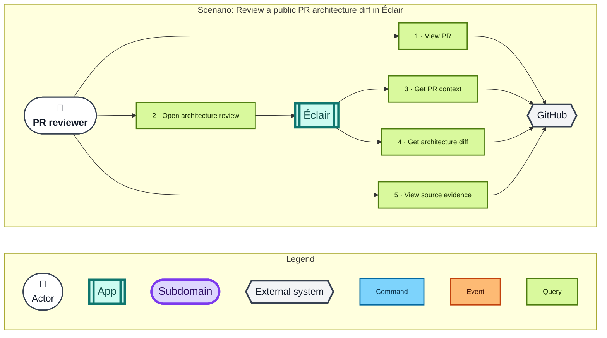

# Option 1: Resolve the retained head diff from the PR

Éclair receives a repository and PR ID rather than a direct file URL. It asks GitHub for the current PR context, uses the returned head repository and commit SHA to load the retained `ArchitectureDiff`, and presents the focused review. This keeps the public link stable as the PR changes while pinning each loaded diff and its source evidence to a specific revision.

## Message details

| # | Type | Message | Sender → recipient | Significant data |
| ---: | --- | --- | --- | --- |
| 1 | Query | View PR | PR reviewer → GitHub | Request: repository and PR ID. Response: PR page and architecture review link. |
| 2 | Query | Open architecture review | PR reviewer → Éclair | Request: repository and PR ID. Response after messages 3 and 4: focused architecture review. |
| 3 | Query | Get PR context | Éclair → GitHub | Request: repository and PR ID. Response: title, description, PR link, head repository, and head commit SHA. |
| 4 | Query | Get architecture diff | Éclair → GitHub | Request: head repository, head commit SHA, and `.riviere/pr-diffs/riviere-architecture-diff.json`. Response: `ArchitectureDiff` JSON. |
| 5 | Query | View source evidence | PR reviewer → GitHub | Request: repository, base or head revision, file path, and source lines. Response: source code at that revision. |

## Pros

- The link needs only the repository and PR ID, so it remains usable when the PR head changes.
- Resolving `head.repo.full_name` supports PRs raised from forks.
- Loading the diff from the returned head commit SHA avoids following a moving branch during one review load.
- Éclair obtains current public PR context without requiring its own backend.
- The reviewer can move from architecture changes to source evidence at the relevant revision.

## Cons

- This flow works only for public repositories; private repositories need the separate upload flow.
- The retained diff must already exist at the conventional path in the PR head commit.
- Reopening the same link resolves the PR's current head rather than preserving an earlier comparison.
- The loading failure behaviour remains unresolved when PR metadata or the retained diff cannot be fetched or validated.
- Diff generation timing and the process that puts the retained diff into the head commit remain unresolved outside this option.
