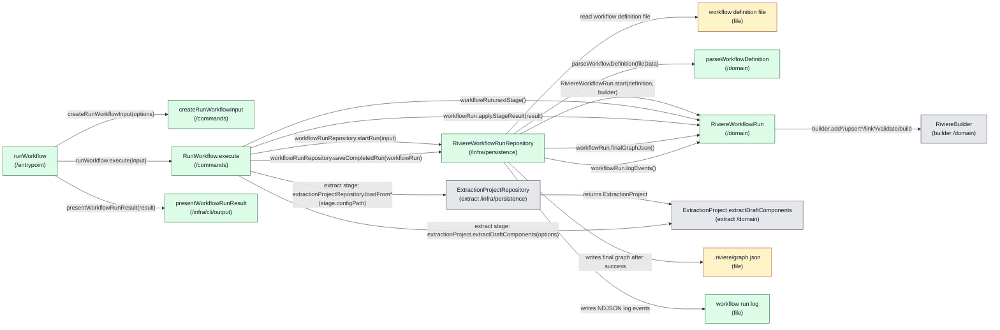
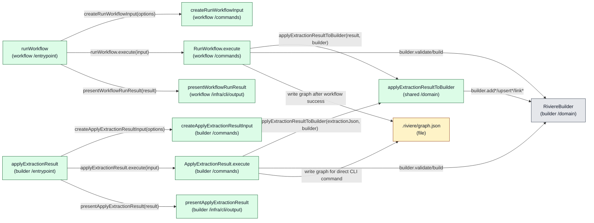

# Architecture: Riviere Extraction Workflows V1

**Status:** Draft

---

## 1. Product feasibility check

**Decision status:** Approved

Feasibility is still plausible, the approved PRD remains valid, and architecture drafting can continue.

The V1 product scope deliberately excludes AI-assisted stages so the first slice can be delivered faster. However, AI is expected future product work. The architecture must therefore avoid a V1 shape that assumes every future workflow stage is deterministic TypeScript extraction. V1 must not implement AI-assisted stages, but it should leave a clear future stage-extension seam so AI can later fit into the workflow model as a Rivière-owned stage with defined outputs and hard failure behaviour.

All-or-nothing graph integrity is a key architectural concern. The architecture must keep workflow graph-building state separate from the existing final graph until all stages succeed, so a failed run leaves the previous final graph unchanged.

## 2. Ownership and boundaries

**Decision status:** Approved

Top-level ownership is approved as a dedicated workflow feature inside `packages/riviere-cli/src/features/workflow`.

The workflow must not simply wrap or chain existing CLI commands. Existing builder commands load and save graph state command-by-command. Using workflows as wrappers around those commands would require saving, reloading, and cleaning up temporary files, which would likely make the implementation more complex and more awkward while fighting the PRD's all-or-nothing graph integrity promise.

The workflow feature should instead orchestrate workflow execution in memory and write the final graph only after all stages succeed. Existing lower-level Rivière capabilities such as deterministic extraction, graph building, linking, validation, and graph serialisation remain owned by their existing packages and command/use-case layers.

Important product boundary: workflows must not provide Rivière capabilities that the CLI does not provide. The CLI must not become “a watered down version of the full product.” Workflow execution may compose capabilities differently to protect all-or-nothing execution, but the underlying product capabilities should remain available through CLI surfaces rather than being hidden only inside workflow execution.

Rejected ownership options:

- A workflow wrapper around existing CLI commands was rejected because it would require graph state to be saved and reloaded between stages and would create cleanup complexity.
- A new `packages/riviere-workflow` package was not selected for V1 because it adds package and API surface area before the first workflow slice is proven. It remains a possible future evolution if workflows need to be consumed outside the CLI.
- `packages/riviere-builder` was rejected as the top-level workflow owner because workflow concerns include project-local workflow files, extraction config resolution, run logs, CLI progress, and future stage orchestration beyond pure graph building.
- `packages/riviere-extract-ts` was rejected because workflows include linking, validation, graph writing, and future non-deterministic AI-assisted stages; `riviere-extract-ts` should remain deterministic extraction only.

Future evolution notes:

- Consumers will import or invoke the CLI for V1 workflows because CLIs trigger workflows in this slice.
- Future workflows may be usable from code without YAML, but that is not part of V1.
- AI-assisted stages are future product work. V1 architecture should leave a stage-extension seam without implementing AI-assisted execution now.

## 3. Component design

**Decision status:** Waiting for user review

The options in this section are draft decision material, not an approved architecture direction. Only viable candidate options should be recorded here.

### Design drivers

- Preserve the approved V1 product model: a Rivière-only graph-building workflow using `extract → link → validate → write graph`.
- Preserve all-or-nothing graph integrity by keeping the workflow run's graph-building state separate from the existing final graph until every stage succeeds.
- Do not implement workflows as wrappers around existing CLI commands, because that would require graph state to be saved, reloaded, and cleaned up between stages.
- Keep the CLI as a full product surface. Workflows must not provide Rivière capabilities that the CLI does not provide.
- Leave a future stage-extension seam for AI-assisted Rivière stages without implementing AI-assisted stages in V1.
- Keep extraction and linking semantics in Rivière configuration and lower-level Rivière capabilities, not in the workflow file.
- Respect `.riviere/role-enforcement.config.ts`: entrypoints live in `/entrypoint`, use cases and input factories in `/commands`, domain concepts in `/domain`, persistence in `/infra/persistence`, and CLI output in `/infra/cli/output`.

### Option 1: Workflow run aggregate — preferred for discussion

This option models the workflow run itself as a domain aggregate. The aggregate owns the graph-state fold, stage lifecycle, abort state, log event generation, and all-or-nothing invariant. The command use case handles external effects such as loading configs, running deterministic extraction, and asking the repository to persist the successful final graph and run log.

Selecting this option requires explicit approval for `RiviereWorkflowRun` as a new aggregate.

#### Diagram

Diagram rules for this option:

- Each box is a component and includes its intended layer.
- Each line is a direct runtime function or method call.
- Data passed between calls appears in the line label, not as a separate dependency unless it has behaviour that is called.
- The diagram intentionally does not show compile-time type imports.



Legend:

- gray = existing
- yellow = changed
- green = new
- red = unclear ownership

#### Components

| Component | Layer / path | Status | .riviere role | Responsibilities | Estimated Size |
|---|---|---|---|---|---|
| `runWorkflow` | `features/workflow/entrypoint` | New | `cli-entrypoint` | <ul><li>Register `riviere workflow run`.</li><li>Call `createRunWorkflowInput(options)`.</li><li>Call `runWorkflow.execute(input)`.</li><li>Call `presentWorkflowRunResult(result)`.</li></ul> | Small |
| `createRunWorkflowInput` | `features/workflow/commands` | New | `command-input-factory` | <ul><li>Create typed workflow run input from CLI options.</li><li>Does not call `RunWorkflow`; it only returns input.</li></ul> | Small |
| `RunWorkflow` | `features/workflow/commands` | New | `command-use-case` | <ul><li>Call `workflowRunRepository.startRun(input)`.</li><li>Loop through stages using `workflowRun.nextStage()`.</li><li>Execute external stage effects such as deterministic extraction.</li><li>Call `workflowRun.applyStageResult(result)` after stage execution.</li><li>Stop at the first failed stage.</li><li>Call `workflowRunRepository.saveCompletedRun(workflowRun)`.</li></ul> | Medium |
| `RiviereWorkflowRunRepository` | `features/workflow/infra/persistence` | New | `aggregate-repository` | <ul><li>Read the workflow definition file.</li><li>Use `parseWorkflowDefinition(fileData)`.</li><li>Create a workflow run from the parsed definition and empty graph state.</li><li>Persist final graph and run log for completed successful runs.</li></ul> | Medium |
| `RiviereWorkflowRun` | `features/workflow/domain` | New | `aggregate` | <ul><li>Own graph-building state for one run.</li><li>Own the workflow stage loop state.</li><li>Apply the graph-state fold.</li><li>Generate lifecycle/failure events.</li><li>Enforce abort and final-write eligibility invariants.</li><li>Expose final graph and log events for repository persistence.</li><li>Leave a stage-result seam for future Rivière-owned stages such as AI-assisted stages.</li></ul> | Medium |
| `WorkflowDefinition` | `features/workflow/domain` | New | `value-object` | <ul><li>Represent project-local workflow name and ordered Rivière stages.</li></ul> | Small |
| `WorkflowStage` | `features/workflow/domain` | New | `value-object` | <ul><li>Represent V1 stage union and future extension seam.</li></ul> | Small |
| `WorkflowStageResult` | `features/workflow/domain` | New | `value-object` | <ul><li>Represent the output of a completed stage before the workflow run accepts or rejects it.</li></ul> | Small |
| `WorkflowLogEvent` | `features/workflow/domain` | New | `value-object` | <ul><li>Represent NDJSON structured lifecycle and failure events.</li></ul> | Small |
| `parseWorkflowDefinition` | `features/workflow/domain` | New | `domain-service` | <ul><li>Pure parsing/validation into Rivière-only workflow vocabulary.</li><li>Reject arbitrary shell or non-Rivière stages.</li></ul> | Medium |
| `presentWorkflowRunResult` | `features/workflow/infra/cli/output` | New | `cli-output-formatter` | <ul><li>Format workflow run result and run-log location for CLI output.</li></ul> | Small |

#### Runtime call outline

```text
runWorkflow
  ├─ createRunWorkflowInput(options)
  ├─ runWorkflow.execute(input)
  │    ├─ workflowRunRepository.startRun(input)
  │    │    ├─ read workflow definition file
  │    │    ├─ parseWorkflowDefinition(fileData)
  │    │    └─ RiviereWorkflowRun.start(definition, builder)
  │    ├─ while workflowRun.hasRunnableStage()
  │    │    ├─ workflowRun.nextStage()
  │    │    ├─ execute stage by type
  │    │    │    ├─ extract: extractionProjectRepository.loadFrom*(stage.configPath)
  │    │    │    ├─ extract: extractionProject.extractDraftComponents(options)
  │    │    │    ├─ link: workflowRun.applyLinkStage(stage)
  │    │    │    └─ validate: workflowRun.validateCurrentGraph()
  │    │    └─ workflowRun.applyStageResult(result)
  │    │         └─ builder.add*/upsert*/link*/validate/build
  │    └─ workflowRunRepository.saveCompletedRun(workflowRun)
  │         ├─ workflowRun.finalGraphJson()
  │         ├─ workflowRun.logEvents()
  │         ├─ writes .riviere/graph.json only after success
  │         └─ writes workflow run log
  └─ presentWorkflowRunResult(result)
```

#### New Dependencies

| Dependency | Status | Used By | Purpose |
|---|---|---|---|
| `@living-architecture/riviere-builder` | Existing | `RiviereWorkflowRun`, `RiviereWorkflowRunRepository` | Hold in-memory graph-building state and produce final graph JSON. |
| `@living-architecture/riviere-extract-ts` / existing extraction feature | Existing | `RunWorkflow` | Execute deterministic extraction stages using Rivière extraction config. |
| `yaml` | Existing in `riviere-cli` | `RiviereWorkflowRunRepository` | Parse project-local workflow definition if YAML is selected for V1. |

#### Code Shape

```text
packages/riviere-cli/src/features/workflow/
  entrypoint/
    run-workflow.ts                    [new]
  commands/
    create-run-workflow-input.ts       [new]
    run-workflow.ts                    [new]
    run-workflow-input.ts              [new]
    run-workflow-result.ts             [new]
  domain/
    riviere-workflow-run.ts            [new]
    workflow-definition.ts             [new]
    workflow-stage.ts                  [new]
    workflow-stage-result.ts           [new]
    workflow-log-event.ts              [new]
    parse-workflow-definition.ts       [new]
  infra/
    persistence/
      riviere-workflow-run-repository.ts [new]
    cli/output/
      present-workflow-run-result.ts   [new]
```

#### Why This Option Is Unique

- **Number of components:** more components than a non-aggregate lean sketch, because workflow state has an explicit aggregate and repository.
- **Size of components:** keeps `RunWorkflow` medium-sized by moving invariants into `RiviereWorkflowRun`.
- **Touching existing code vs adding new code:** mostly additive, with shell wiring changed.
- **Introducing dependencies:** no new package dependency expected.

#### .riviere role options

| Element | Kind | Sublocation | Candidate roles | Preferred role | Reason | Open decision |
| --- | --- | --- | --- | --- | --- | --- |
| `runWorkflow` | function | `packages/riviere-cli/src/features/workflow/entrypoint` | `cli-entrypoint` | `cli-entrypoint` | Registers and wires the CLI command. | None |
| `createRunWorkflowInput` | function | `packages/riviere-cli/src/features/workflow/commands` | `command-input-factory` | `command-input-factory` | Converts raw CLI options into typed command input. | None |
| `RunWorkflow` | class | `packages/riviere-cli/src/features/workflow/commands` | `command-use-case` | `command-use-case` | Orchestrates the write-side workflow by loading a workflow run aggregate, invoking it with stage results, and asking the repository to persist. | Confirm stage-effect execution does not become a second aggregate orchestration smell. |
| `RunWorkflowInput` | interface/type alias | `packages/riviere-cli/src/features/workflow/commands` | `command-use-case-input` | `command-use-case-input` | Specific input contract for `RunWorkflow`. | None |
| `RunWorkflowResult` | interface/type alias | `packages/riviere-cli/src/features/workflow/commands` | `command-use-case-result` | `command-use-case-result` | Specific result contract for `RunWorkflow`. | None |
| `RiviereWorkflowRunRepository` | class | `packages/riviere-cli/src/features/workflow/infra/persistence` | `aggregate-repository` | `aggregate-repository` | Loads and saves the workflow run aggregate and its persisted outputs. | None if aggregate is approved. |
| `RiviereWorkflowRun` | class | `packages/riviere-cli/src/features/workflow/domain` | `aggregate`, `domain-service`, `query-model` | `aggregate` | Owns mutable graph-building state and enforces workflow-run invariants. | Explicit aggregate approval required. |
| `WorkflowDefinition` | interface/type alias | `packages/riviere-cli/src/features/workflow/domain` | `value-object` | `value-object` | Domain concept describing a workflow. | Confirm value-object shape if role lint requires branding. |
| `WorkflowStage` | interface/type alias | `packages/riviere-cli/src/features/workflow/domain` | `value-object` | `value-object` | Domain concept describing an ordered Rivière stage. | None |
| `WorkflowStageResult` | interface/type alias | `packages/riviere-cli/src/features/workflow/domain` | `value-object` | `value-object` | Domain concept passed from stage execution into workflow run. | None |
| `WorkflowLogEvent` | interface/type alias | `packages/riviere-cli/src/features/workflow/domain` | `value-object` | `value-object` | Domain event-like log record for NDJSON output. | Could be `domain-event`, but name is not currently `*Event` and the events are run-log records rather than published domain events. |
| `parseWorkflowDefinition` | function | `packages/riviere-cli/src/features/workflow/domain` | `domain-service`, `cli-input-validator` | `domain-service` | Pure parsing/validation into Rivière-only workflow domain vocabulary. | File I/O must stay in repository. |
| `presentWorkflowRunResult` | function | `packages/riviere-cli/src/features/workflow/infra/cli/output` | `cli-output-formatter` | `cli-output-formatter` | Formats workflow run result for CLI output. | None |

#### Canonical role pattern

Pattern: `CLI Invoking Command Use Case` + `Command Use Case loading, invoking, and saving aggregate`

#### Tangled responsibility findings

- `RiviereWorkflowRun` requires explicit aggregate approval because it would be a new domain model centre for workflow execution.
- `RunWorkflow` still has an important open design question: where should stage-effect dispatch live? Keeping the stage loop in `RunWorkflow` may be acceptable for V1, but if it grows into a reusable `WorkflowStageExecutor` class, the current `.riviere` roles do not fit cleanly.
- `RunWorkflow` must not depend on existing command use cases such as `ExtractDraftComponents`; `command-use-case` depends on another `command-use-case` is forbidden. It should either use lower-level repositories/aggregates directly with care, or the extraction capability needs a clearer lower-level interface.
- Loading `ExtractionProject` from within `RunWorkflow` is now explicit, but it remains a nuance to discuss because the workflow use case would coordinate both the workflow-run aggregate and extraction aggregate behaviour.
- `RiviereWorkflowRunRepository` must genuinely assemble and persist workflow-run state/output. If it only reads a workflow file and writes unrelated files, it would be a weak repository abstraction.

### Option 2: Direct CLI parity surface — unclear concept

This option adds the workflow feature and also adds an explicit CLI-accessible graph-application capability so workflow execution does not gain hidden powers.

After review, this concept needs discussion before it can be treated as a real option. The previous `ImportExtractedGraph` naming was confusing because it blurred the verb and noun boundary. The clearer possible concept is something like “apply an extraction result to a graph”, but that CLI capability is not product-approved and may not be needed in V1.

#### Diagram

Diagram rules for this option:

- Each box is a component and includes its intended layer.
- Each line is a direct runtime function or method call, file read, or file write.
- Data passed between calls appears in the line label, not as a separate dependency unless it has behaviour that is called.
- The diagram intentionally does not show compile-time type imports.



Legend:

- gray = existing
- yellow = changed
- green = new
- red = unclear ownership

#### Components

| Component | Layer / path | Status | .riviere role | Responsibilities | Estimated Size |
|---|---|---|---|---|---|
| `runWorkflow` | `features/workflow/entrypoint` | New | `cli-entrypoint` | <ul><li>Register workflow run command.</li><li>Call workflow input factory.</li><li>Call workflow run use case.</li><li>Call workflow result presenter.</li></ul> | Small |
| `createRunWorkflowInput` | `features/workflow/commands` | New | `command-input-factory` | <ul><li>Create typed workflow run input from CLI options.</li></ul> | Small |
| `RunWorkflow` | `features/workflow/commands` | New | `command-use-case` | <ul><li>Run workflow stages.</li><li>Call shared graph-application behaviour if that concept is approved.</li><li>Write final graph only after workflow success.</li></ul> | Medium |
| `presentWorkflowRunResult` | `features/workflow/infra/cli/output` | New | `cli-output-formatter` | <ul><li>Format workflow result for CLI output.</li></ul> | Small |
| `applyExtractionResult` | `features/builder/entrypoint` | New | `cli-entrypoint` | <ul><li>Expose extraction-result graph application through the CLI if product-approved.</li><li>Call input factory.</li><li>Call apply use case.</li><li>Call result presenter.</li></ul> | Small |
| `createApplyExtractionResultInput` | `features/builder/commands` | New | `command-input-factory` | <ul><li>Create typed apply command input from CLI options.</li></ul> | Small |
| `ApplyExtractionResult` | `features/builder/commands` | New | `command-use-case` | <ul><li>Load an extraction result JSON file or stream.</li><li>Apply it to graph state.</li><li>Save graph through normal builder persistence.</li></ul> | Medium |
| `ApplyExtractionResultInput` | `features/builder/commands` | New | `command-use-case-input` | <ul><li>Typed input contract for the apply command.</li></ul> | Small |
| `ApplyExtractionResultResult` | `features/builder/commands` | New | `command-use-case-result` | <ul><li>Typed result contract for the apply command.</li></ul> | Small |
| `applyExtractionResultToBuilder` | `shared /domain` or `platform/domain` | New | `domain-service` | <ul><li>Shared pure graph application logic used by workflow and direct CLI surface.</li></ul> | Medium |
| `presentApplyExtractionResult` | `features/builder/infra/cli/output` | New | `cli-output-formatter` | <ul><li>Format apply result for CLI output.</li></ul> | Small |

#### Runtime call outline

```text
runWorkflow
  ├─ createRunWorkflowInput(options)
  ├─ runWorkflow.execute(input)
  │    ├─ applyExtractionResultToBuilder(result, builder)
  │    │    └─ builder.add*/upsert*/link*
  │    ├─ builder.validate/build
  │    └─ writes .riviere/graph.json only after workflow success
  └─ presentWorkflowRunResult(result)

applyExtractionResult
  ├─ createApplyExtractionResultInput(options)
  ├─ applyExtractionResult.execute(input)
  │    ├─ applyExtractionResultToBuilder(extractionJson, builder)
  │    │    └─ builder.add*/upsert*/link*
  │    ├─ builder.validate/build
  │    └─ writes .riviere/graph.json for direct CLI command
  └─ presentApplyExtractionResult(result)
```

#### New Dependencies

| Dependency | Status | Used By | Purpose |
|---|---|---|---|
| `@living-architecture/riviere-builder` | Existing | `ApplyExtractionResult`, `RunWorkflow`, `applyExtractionResultToBuilder` | Hold and persist graph state. |
| `@living-architecture/riviere-extract-ts` types | Existing | `ApplyExtractionResult`, `applyExtractionResultToBuilder` | Type extracted components and links. |

#### Code Shape

```text
packages/riviere-cli/src/features/workflow/
  entrypoint/
    run-workflow.ts                  [new]
  commands/
    create-run-workflow-input.ts     [new]
    run-workflow.ts                  [new]
    run-workflow-input.ts            [new]
    run-workflow-result.ts           [new]
  domain/
    apply-extraction-result-to-builder.ts [new, if concept survives]
  infra/
    cli/output/
      present-workflow-run-result.ts [new]

packages/riviere-cli/src/features/builder/
  entrypoint/
    apply-extraction-result.ts       [new]
  commands/
    create-apply-extraction-result-input.ts [new]
    apply-extraction-result.ts       [new]
    apply-extraction-result-input.ts [new]
    apply-extraction-result-result.ts [new, name needs refinement]
  infra/
    cli/output/
      present-apply-extraction-result.ts [new]
```

#### Why This Option Is Unique

- **Number of components:** adds both workflow components and a new builder CLI command path.
- **Size of components:** shared graph-application logic reduces workflow-specific size.
- **Touching existing code vs adding new code:** touches both `workflow` and existing `builder` feature surfaces.
- **Introducing dependencies:** no new package dependency expected, but it introduces extra user-facing CLI surface.

#### .riviere role options

| Element | Kind | Sublocation | Candidate roles | Preferred role | Reason | Open decision |
| --- | --- | --- | --- | --- | --- | --- |
| `runWorkflow` | function | `packages/riviere-cli/src/features/workflow/entrypoint` | `cli-entrypoint` | `cli-entrypoint` | Registers workflow command. | None |
| `createRunWorkflowInput` | function | `packages/riviere-cli/src/features/workflow/commands` | `command-input-factory` | `command-input-factory` | Converts raw CLI options into typed workflow run input. | None |
| `RunWorkflow` | class | `packages/riviere-cli/src/features/workflow/commands` | `command-use-case` | `command-use-case` | Orchestrates workflow run. | Same workflow-stage execution concern as Options 1 and 2. |
| `presentWorkflowRunResult` | function | `packages/riviere-cli/src/features/workflow/infra/cli/output` | `cli-output-formatter` | `cli-output-formatter` | Formats workflow result for terminal output. | None |
| `applyExtractionResult` | function | `packages/riviere-cli/src/features/builder/entrypoint` | `cli-entrypoint` | `cli-entrypoint` | Registers a possible direct CLI surface for graph application. | Product approval required because this is new CLI capability. |
| `createApplyExtractionResultInput` | function | `packages/riviere-cli/src/features/builder/commands` | `command-input-factory` | `command-input-factory` | Converts raw CLI options into typed apply command input. | None if command is approved. |
| `ApplyExtractionResult` | class | `packages/riviere-cli/src/features/builder/commands` | `command-use-case` | `command-use-case` | Loads graph state, applies extraction result, saves graph. | Product approval required. |
| `ApplyExtractionResultInput` | interface/type alias | `packages/riviere-cli/src/features/builder/commands` | `command-use-case-input` | `command-use-case-input` | Specific input for apply command. | None if command is approved. |
| `ApplyExtractionResultResult` | interface/type alias | `packages/riviere-cli/src/features/builder/commands` | `command-use-case-result` | `command-use-case-result` | Specific result for apply command. | Name is awkward; refine if concept survives. |
| `applyExtractionResultToBuilder` | function | `packages/riviere-cli/src/features/workflow/domain` or shared platform/domain | `domain-service` | `domain-service` | Shared pure graph application behaviour. | Confirm placement if used by both workflow and builder feature. |
| `presentApplyExtractionResult` | function | `packages/riviere-cli/src/features/builder/infra/cli/output` | `cli-output-formatter` | `cli-output-formatter` | Formats direct apply command output. | None if command is approved. |

#### Canonical role pattern

Pattern: `CLI Invoking Command Use Case`, repeated for workflow and possible direct apply command.

#### Tangled responsibility findings

- This option best protects the principle that workflows should not expose hidden capabilities, but it may create a user-facing import command mainly to satisfy architectural parity rather than a confirmed V1 user need.
- The placeholder direct CLI command name and capability are not product-approved.
- The concept “apply an extraction result to a graph” needs discussion before it should be included in V1.
- Shared placement for `applyExtractionResultToBuilder` needs care: if both `workflow` and `builder` use it, `platform/domain` may be more honest than hiding it in one feature.
- `applyExtractionResultToBuilder` may not actually be a valid `domain-service` if it mutates `RiviereBuilder`; this concept needs role review if the option survives.

### Recommendation for next discussion

Recommendation for discussion: focus on Option 1 first.

Option 1 best matches the repository → aggregate → save pattern that should apply to most command use cases. It also gives a clearer home for the workflow stage loop and the all-or-nothing graph-state fold.

However, Option 1 still has open architecture questions: where stage-effect dispatch should live, whether loading `ExtractionProject` from `RunWorkflow` is acceptable, and whether `RiviereWorkflowRunRepository` is a genuine aggregate repository or just a file loader/writer. Those need discussion before approval.

### Approval

Before this can become the approved component design, the following decisions need user review:

- Choose Option 1, Option 2, or a combination.
- If Option 1 is selected, explicitly approve or reject `RiviereWorkflowRun` as a new aggregate.
- Decide whether the workflow stage-effect loop lives inside `RunWorkflow`, inside `RiviereWorkflowRun`, or needs another component/role.
- Decide whether `RunWorkflow` may load `ExtractionProject` directly as part of executing an extract stage, or whether extraction needs a cleaner lower-level interface.
- Discuss whether the CLI-parity principle requires a new direct CLI command in V1, or whether it is enough to record the rule and add direct CLI surface only when workflow execution introduces a genuinely new underlying capability.

## 4. Feasibility confirmations

**Decision status:** Pending

## 5. Product impact notes

No product-impact changes identified.

## 6. Task generation consequences

**Decision status:** Pending
