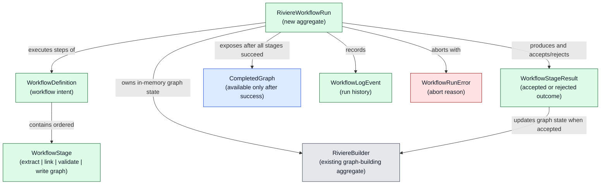
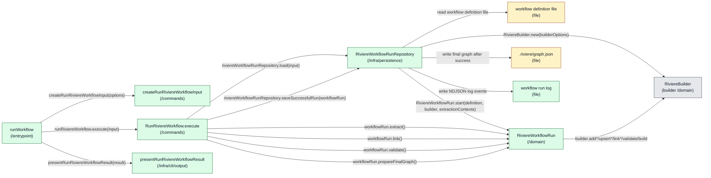
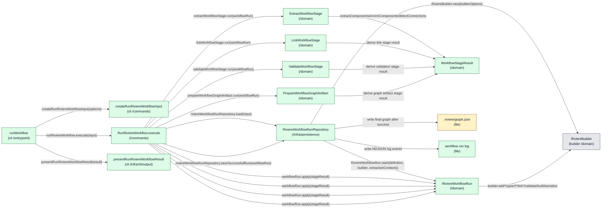

```mermaid
flowchart LR
  cli["runWorkflow<br/>(/entrypoint)"]
  inputFactory["createRunRiviereWorkflowInput<br/>(/commands)"]
  usecase["RunRiviereWorkflow.execute<br/>(/commands)"]
  repository["RiviereWorkflowRunRepository<br/>(/infra/persistence)"]
  workflowFile["workflow definition file<br/>(file)"]
  workflowRun["RiviereWorkflowRun<br/>(/domain)"]
  extractor["riviere-extract-ts functions<br/>(extract-ts /domain)"]
  builder["RiviereBuilder<br/>(builder /domain)"]
  presenter["presentRunRiviereWorkflowResult<br/>(/infra/cli/output)"]
  finalGraph[".riviere/graph.json<br/>(file)"]
  runLog["workflow run log<br/>(file)"]

  cli -->|"createRunRiviereWorkflowInput(options)"| inputFactory
  cli -->|"runRiviereWorkflow.execute(input)"| usecase
  cli -->|"presentRunRiviereWorkflowResult(result)"| presenter

  usecase -->|"riviereWorkflowRunRepository.load(input)"| repository
  repository -->|"read workflow definition file"| workflowFile
  repository -->|"RiviereWorkflowRun.start(definition, builderOptions, extractionContexts)"| workflowRun

  usecase -->|"workflowRun.runToCompletion()"| workflowRun
  workflowRun -->|"RiviereBuilder.new(builderOptions)"| builder
  workflowRun -->|"extractComponents/enrich/detectConnections"| extractor
  workflowRun -->|"builder.add*/upsert*/link*/validate/build"| builder

  usecase -->|"riviereWorkflowRunRepository.saveSuccessfulRun(workflowRun)"| repository
  repository -->|"workflowRun.completedGraph()"| workflowRun
  repository -->|"workflowRun.logEvents()"| workflowRun
  repository -->|"serialize graph for persistence"| finalGraph
  repository -->|"write final graph after success"| finalGraph
  repository -->|"write NDJSON log events"| runLog

  classDef existing fill:#e5e7eb,stroke:#374151,color:#111827
  classDef changed fill:#fef3c7,stroke:#92400e,color:#111827
  classDef new fill:#dcfce7,stroke:#166534,color:#111827
  classDef unclear fill:#fee2e2,stroke:#991b1b,color:#111827

  class extractor,builder existing
  class cli,inputFactory,usecase,repository,workflowRun,presenter,runLog new
  class workflowFile,finalGraph changed
```

# Architecture: Riviere Extraction Workflows V1

**Status:** Draft

---

## 1. Product feasibility check

**Decision status:** Approved

Feasibility is still plausible, the approved PRD remains valid, and architecture drafting can continue.

The V1 product scope deliberately excludes AI-assisted stages so the first slice can be delivered faster. However, AI is expected future product work. The architecture must therefore avoid a V1 shape that assumes every future workflow stage is deterministic TypeScript extraction. V1 must not implement AI-assisted stages, but it should leave a clear future stage-extension seam so AI can later fit into the workflow model as a Rivière-owned stage with defined outputs and hard failure behaviour.

All-or-nothing graph integrity is a key architectural concern. The architecture must keep workflow graph-building state separate from the existing final graph until all stages succeed, so a failed run leaves the previous final graph unchanged.

## 2. Ownership and boundaries

**Decision status:** Approved

Top-level ownership is approved as a dedicated workflow feature inside `packages/riviere-cli/src/features/workflow`.

The workflow must not simply wrap or chain existing CLI commands. Existing builder commands load and save graph state command-by-command. Using workflows as wrappers around those commands would require saving, reloading, and cleaning up temporary files, which would likely make the implementation more complex and more awkward while fighting the PRD's all-or-nothing graph integrity promise.

The workflow feature should instead orchestrate workflow execution in memory and write the final graph only after all stages succeed. Existing lower-level Rivière capabilities such as deterministic extraction, graph building, linking, validation, and graph serialisation remain owned by their existing packages and command/use-case layers.

Important product boundary: workflows must not provide Rivière capabilities that the CLI does not provide. The CLI must not become “a watered down version of the full product.” Workflow execution may compose capabilities differently to protect all-or-nothing execution, but the underlying product capabilities should remain available through CLI surfaces rather than being hidden only inside workflow execution.

Rejected ownership options:

- A workflow wrapper around existing CLI commands was rejected because it would require graph state to be saved and reloaded between stages and would create cleanup complexity.
- A new `packages/riviere-workflow` package was not selected for V1 because it adds package and API surface area before the first workflow slice is proven. It remains a possible future evolution if workflows need to be consumed outside the CLI.
- `packages/riviere-builder` was rejected as the top-level workflow owner because workflow concerns include project-local workflow files, extraction config resolution, run logs, CLI progress, and future stage orchestration beyond pure graph building.
- `packages/riviere-extract-ts` was rejected because workflows include linking, validation, graph writing, and future non-deterministic AI-assisted stages; `riviere-extract-ts` should remain deterministic extraction only.

Future evolution notes:

- Consumers will import or invoke the CLI for V1 workflows because CLIs trigger workflows in this slice.
- Future workflows may be usable from code without YAML, but that is not part of V1.
- AI-assisted stages are future product work. V1 architecture should leave a stage-extension seam without implementing AI-assisted execution now.

## 3. Component design

**Decision status:** Waiting for user review

The options in this section are draft decision material, not an approved architecture direction. Only viable candidate options should be recorded here.

The ownership boundary is not under review in this section. Every option below keeps top-level workflow ownership inside `packages/riviere-cli/src/features/workflow`; the options vary only the component decomposition inside that approved boundary.

### Design drivers

- Preserve the approved V1 product model: a Rivière-only graph-building workflow using `extract → link → validate → write graph`.
- Preserve all-or-nothing graph integrity by keeping the workflow run's graph-building state separate from the existing final graph until every stage succeeds.
- Do not implement workflows as wrappers around existing CLI commands, because that would require graph state to be saved, reloaded, and cleaned up between stages.
- Keep the CLI as a full product surface. Workflows must not provide Rivière capabilities that the CLI does not provide.
- Leave a future stage-extension seam for AI-assisted Rivière stages without implementing AI-assisted stages in V1.
- Keep extraction and linking semantics in Rivière configuration and lower-level Rivière capabilities, not in the workflow file.
- Respect `.riviere/role-enforcement.config.ts`: entrypoints live in `/entrypoint`, use cases and input factories in `/commands`, domain concepts in `/domain`, persistence in `/infra/persistence`, and CLI output in `/infra/cli/output`.
- Do not cross-import existing CLI feature code from `features/extract` or other CLI features. If existing extraction setup needs reuse, move the reusable lower-level code into the package that owns that lower-level capability, or call the lower-level package directly from the workflow feature's repository/aggregate.
- Do not make the command use case depend on another command use case.
- Do not use a query model or query-model loader to execute write behaviour.
- Do not make one repository depend on another repository.
- Do not let domain import infra.
- Do not record invalid drafts as candidate options.

### Option 1: Aggregate-owned stage runner

This option puts the workflow stage loop inside the `RiviereWorkflowRun` aggregate. The command use case stays canonical: load the aggregate, invoke one aggregate method, and persist only after success.

Selecting this option requires explicit approval for `RiviereWorkflowRun` as a new aggregate.

#### Domain model change

This view shows the conceptual model change only. It intentionally excludes entrypoints, repositories, files, package imports, and CLI output formatting.



Key domain changes:

- `RiviereWorkflowRun` becomes the new aggregate that owns the workflow's in-memory graph-building journey.
- `RiviereBuilder` remains the existing graph-building aggregate, but in this option it is internal state owned by a workflow run until the run succeeds.
- `WorkflowDefinition` and `WorkflowStage` are write-side domain value objects for workflow execution, not read-side query models.
- `WorkflowStageResult` is the boundary where a stage outcome is accepted or rejected by the aggregate.
- `CompletedGraph` is a conceptual graph/schema value exposed only after all stages succeed. It is not formatted JSON; persistence serialises it later.
- `WorkflowLogEvent` records domain-level lifecycle and failure history. The repository later formats these events as NDJSON.

#### Diagram



Legend: gray = existing, yellow = changed, green = new, red = unclear ownership.

#### Components

| Component | Layer / path | Status | .riviere role | Responsibilities | Estimated Size |
|---|---|---|---|---|---|
| `runWorkflow` | `packages/riviere-cli/src/features/workflow/entrypoint` | New | `cli-entrypoint` | <ul><li>Register `riviere workflow run`.</li><li>Call the input factory, command use case, and output formatter.</li></ul> | Small |
| `createRunRiviereWorkflowInput` | `packages/riviere-cli/src/features/workflow/commands` | New | `command-input-factory` | <ul><li>Convert raw CLI options into `RunRiviereWorkflowInput`.</li></ul> | Small |
| `RunRiviereWorkflow` | `packages/riviere-cli/src/features/workflow/commands` | New | `command-use-case` | <ul><li>Load `RiviereWorkflowRun` through its repository.</li><li>Invoke `workflowRun.runToCompletion()`.</li><li>Save only a successful run.</li></ul> | Small/Medium |
| `RunRiviereWorkflowInput` | `packages/riviere-cli/src/features/workflow/commands` | New | `command-use-case-input` | <ul><li>Carry typed workflow path, project root, config path, and output path.</li></ul> | Small |
| `RunRiviereWorkflowResult` | `packages/riviere-cli/src/features/workflow/commands` | New | `command-use-case-result` | <ul><li>Return success/failure status, final graph path, and run-log path.</li></ul> | Small |
| `RiviereWorkflowRunRepository` | `packages/riviere-cli/src/features/workflow/infra/persistence` | New | `aggregate-repository` | <ul><li>Read the workflow definition file.</li><li>Resolve paths and load extraction contexts.</li><li>Assemble the workflow-run aggregate with builder options, not by performing graph-building behaviour.</li><li>Persist the completed graph and run log after success only.</li><li>Serialise the completed graph for file persistence.</li></ul> | Medium/Large |
| `RiviereWorkflowRun` | `packages/riviere-cli/src/features/workflow/domain` | New | `aggregate` | <ul><li>Own workflow stage state, graph-building state, abort state, and log events.</li><li>Create/use the in-memory `RiviereBuilder` during workflow execution.</li><li>Execute `extract → link → validate → write graph` as an internal graph-state fold.</li><li>Reject invalid draft output before the final graph can be exposed for persistence.</li><li>Expose the completed graph as a graph/schema value after success, not formatted JSON.</li><li>Expose a future stage-result seam for AI-assisted stages.</li></ul> | Large |
| `WorkflowDefinition` / `WorkflowStage` / `WorkflowStageResult` / `WorkflowLogEvent` | `packages/riviere-cli/src/features/workflow/domain` | New | `value-object` | <ul><li>Represent workflow vocabulary, stage results, and structured run-log events.</li></ul> | Small |
| `WorkflowDefinitionError` / `WorkflowRunError` | `packages/riviere-cli/src/features/workflow/domain` | New | `domain-error` | <ul><li>Represent invalid workflow definitions, failed stages, invalid drafts, and validation failures.</li></ul> | Small |
| `presentRunRiviereWorkflowResult` | `packages/riviere-cli/src/features/workflow/infra/cli/output` | New | `cli-output-formatter` | <ul><li>Format workflow result and run-log location for CLI output.</li></ul> | Small |

#### Runtime call outline

```text
runWorkflow
  ├─ createRunRiviereWorkflowInput(options)
  ├─ runRiviereWorkflow.execute(input)
  │    ├─ riviereWorkflowRunRepository.load(input)
  │    │    ├─ read workflow definition file
  │    │    ├─ load extraction configuration
  │    │    ├─ create TypeScript project/extraction contexts
  │    │    └─ RiviereWorkflowRun.start(definition, builderOptions, extractionContexts)
  │    ├─ workflowRun.runToCompletion()
  │    │    ├─ RiviereBuilder.new(builderOptions)
  │    │    ├─ extract stage calls extractComponents/enrichComponents/detectConnections
  │    │    ├─ extract stage calls builder.add*/upsert* for valid extracted components only
  │    │    ├─ link stage calls builder.link*
  │    │    ├─ validate stage calls builder.validate
  │    │    └─ write-graph stage calls builder.build()
  │    └─ riviereWorkflowRunRepository.saveSuccessfulRun(workflowRun)
  │         ├─ workflowRun.completedGraph()
  │         ├─ workflowRun.logEvents()
  │         ├─ serializes completed graph
  │         ├─ writes .riviere/graph.json only after success
  │         └─ writes workflow run log
  └─ presentRunRiviereWorkflowResult(result)
```

#### Why This Option Is Unique

- **Loop ownership:** the aggregate owns the whole stage loop.
- **Size of components:** the command use case stays small; `RiviereWorkflowRun` is the largest component.
- **Stage-extension seam:** future stages are aggregate stage methods and `WorkflowStageResult` variants.
- **Dependencies:** no cross-feature CLI imports and no command-use-case chaining.

#### Canonical role pattern

Pattern: `CLI Invoking Command Use Case` + `Command Use Case loading, invoking, and saving aggregate`.

#### Tangled responsibility findings

- `RiviereWorkflowRun` requires explicit aggregate approval.
- `RiviereWorkflowRun` may become large because it owns stage execution and graph folding.
- Care is needed to avoid duplicating existing extraction setup logic; if existing extraction code must be reused, reusable lower-level code should be moved rather than imported across CLI feature boundaries.

### Option 2: Command-owned explicit stage sequence

This option keeps the aggregate pure but moves the visible stage sequence into the `RunRiviereWorkflow` command use case. The command still delegates all business behaviour to the same aggregate and saves only after success. This is valid because the command invokes multiple methods on the same aggregate and does not call another command use case, query model, or query-model loader.

Selecting this option requires explicit approval for `RiviereWorkflowRun` as a new aggregate.

#### Diagram



Legend: gray = existing, yellow = changed, green = new, red = unclear ownership.

#### Components

| Component | Layer / path | Status | .riviere role | Responsibilities | Estimated Size |
|---|---|---|---|---|---|
| `runWorkflow` | `packages/riviere-cli/src/features/workflow/entrypoint` | New | `cli-entrypoint` | <ul><li>Register `riviere workflow run`.</li><li>Call the input factory, command use case, and output formatter.</li></ul> | Small |
| `createRunRiviereWorkflowInput` | `packages/riviere-cli/src/features/workflow/commands` | New | `command-input-factory` | <ul><li>Convert raw CLI options into `RunRiviereWorkflowInput`.</li></ul> | Small |
| `RunRiviereWorkflow` | `packages/riviere-cli/src/features/workflow/commands` | New | `command-use-case` | <ul><li>Load `RiviereWorkflowRun` through its repository.</li><li>Invoke the explicit aggregate stage methods in V1 order.</li><li>Persist final graph and run log only after every aggregate method succeeds.</li></ul> | Medium |
| `RunRiviereWorkflowInput` | `packages/riviere-cli/src/features/workflow/commands` | New | `command-use-case-input` | <ul><li>Carry typed workflow path, project root, config path, and output path.</li></ul> | Small |
| `RunRiviereWorkflowResult` | `packages/riviere-cli/src/features/workflow/commands` | New | `command-use-case-result` | <ul><li>Return success/failure status, final graph path, and run-log path.</li></ul> | Small |
| `RiviereWorkflowRunRepository` | `packages/riviere-cli/src/features/workflow/infra/persistence` | New | `aggregate-repository` | <ul><li>Read workflow definition and load extraction contexts.</li><li>Create the in-memory builder and aggregate.</li><li>Persist final graph and run log after success only.</li></ul> | Medium/Large |
| `RiviereWorkflowRun` | `packages/riviere-cli/src/features/workflow/domain` | New | `aggregate` | <ul><li>Expose separate `extract`, `link`, `validate`, and `prepareFinalGraph` behaviours.</li><li>Own graph-state transitions and stage precondition checks.</li><li>Prevent invalid drafts from reaching final graph output.</li></ul> | Medium/Large |
| `WorkflowDefinition` / `WorkflowStage` / `WorkflowLogEvent` | `packages/riviere-cli/src/features/workflow/domain` | New | `value-object` | <ul><li>Represent workflow vocabulary and structured run-log events.</li></ul> | Small |
| `WorkflowDefinitionError` / `WorkflowRunError` | `packages/riviere-cli/src/features/workflow/domain` | New | `domain-error` | <ul><li>Represent invalid definitions, out-of-order stage calls, invalid drafts, and validation failures.</li></ul> | Small |
| `presentRunRiviereWorkflowResult` | `packages/riviere-cli/src/features/workflow/infra/cli/output` | New | `cli-output-formatter` | <ul><li>Format workflow result and run-log location for CLI output.</li></ul> | Small |

#### Runtime call outline

```text
runWorkflow
  ├─ createRunRiviereWorkflowInput(options)
  ├─ runRiviereWorkflow.execute(input)
  │    ├─ riviereWorkflowRunRepository.load(input)
  │    │    ├─ read workflow definition file
  │    │    ├─ RiviereBuilder.new(builderOptions)
  │    │    ├─ load extraction configuration
  │    │    ├─ create TypeScript project/extraction contexts
  │    │    └─ RiviereWorkflowRun.start(definition, builder, extractionContexts)
  │    ├─ workflowRun.extract()
  │    │    ├─ extractComponents/enrichComponents/detectConnections
  │    │    └─ builder.add*/upsert* for valid extracted components only
  │    ├─ workflowRun.link()
  │    │    └─ builder.link*
  │    ├─ workflowRun.validate()
  │    │    └─ builder.validate
  │    ├─ workflowRun.prepareFinalGraph()
  │    │    └─ builder.buildGraphJson
  │    └─ riviereWorkflowRunRepository.saveSuccessfulRun(workflowRun)
  │         ├─ workflowRun.finalGraphJson()
  │         ├─ workflowRun.logEvents()
  │         ├─ writes .riviere/graph.json only after success
  │         └─ writes workflow run log
  └─ presentRunRiviereWorkflowResult(result)
```

#### Why This Option Is Unique

- **Loop ownership:** the command use case owns the fixed V1 sequence and the aggregate owns each state transition.
- **Size of components:** the command is larger than Option 1, while the aggregate methods are smaller and stage-specific.
- **Stage-extension seam:** future stages are new aggregate methods plus one additional command dispatch line.
- **Dependencies:** no cross-feature CLI imports, no command-use-case chaining, no query loader used for write behaviour, and no repository-to-repository dependency.

#### Canonical role pattern

Pattern: `CLI Invoking Command Use Case` + `Command Use Case loading, invoking, and saving aggregate`.

#### Tangled responsibility findings

- `RiviereWorkflowRun` requires explicit aggregate approval.
- The command use case can become too procedural if stage preconditions or graph-state decisions move out of the aggregate. Those checks must remain aggregate methods/domain errors.
- Adding many future stages may make `RunRiviereWorkflow.execute` longer than the canonical command-use-case shape, even though it still invokes only one aggregate.

### Option 3: Stage-result fold with domain services

This option decomposes stage execution into pure domain services that return `WorkflowStageResult` value objects. The `RiviereWorkflowRun` aggregate owns the graph-state fold by applying those results in order. The command use case performs explicit dispatch to domain services, but all stage validity, invalid-draft rejection, and final graph readiness remain in the aggregate.

Selecting this option requires explicit approval for `RiviereWorkflowRun` as a new aggregate.

#### Diagram



Legend: gray = existing, yellow = changed, green = new, red = unclear ownership.

#### Components

| Component | Layer / path | Status | .riviere role | Responsibilities | Estimated Size |
|---|---|---|---|---|---|
| `runWorkflow` | `packages/riviere-cli/src/features/workflow/entrypoint` | New | `cli-entrypoint` | <ul><li>Register `riviere workflow run`.</li><li>Call the input factory, command use case, and output formatter.</li></ul> | Small |
| `createRunRiviereWorkflowInput` | `packages/riviere-cli/src/features/workflow/commands` | New | `command-input-factory` | <ul><li>Convert raw CLI options into `RunRiviereWorkflowInput`.</li></ul> | Small |
| `RunRiviereWorkflow` | `packages/riviere-cli/src/features/workflow/commands` | New | `command-use-case` | <ul><li>Load `RiviereWorkflowRun` through its repository.</li><li>Call stage domain services in V1 order.</li><li>Apply each `WorkflowStageResult` to the aggregate.</li><li>Persist final graph and run log only after every result is accepted by the aggregate.</li></ul> | Medium/Large |
| `RunRiviereWorkflowInput` | `packages/riviere-cli/src/features/workflow/commands` | New | `command-use-case-input` | <ul><li>Carry typed workflow path, project root, config path, and output path.</li></ul> | Small |
| `RunRiviereWorkflowResult` | `packages/riviere-cli/src/features/workflow/commands` | New | `command-use-case-result` | <ul><li>Return success/failure status, final graph path, and run-log path.</li></ul> | Small |
| `RiviereWorkflowRunRepository` | `packages/riviere-cli/src/features/workflow/infra/persistence` | New | `aggregate-repository` | <ul><li>Read workflow definition and load extraction contexts.</li><li>Create the in-memory builder and aggregate.</li><li>Persist final graph and run log after success only.</li></ul> | Medium/Large |
| `RiviereWorkflowRun` | `packages/riviere-cli/src/features/workflow/domain` | New | `aggregate` | <ul><li>Own graph-state fold and current workflow state.</li><li>Apply `WorkflowStageResult` value objects in valid order.</li><li>Reject invalid drafts and out-of-order results.</li><li>Expose the final graph JSON only after successful validation and graph-artifact preparation.</li></ul> | Medium |
| `ExtractWorkflowStage` / `LinkWorkflowStage` / `ValidateWorkflowStage` / `PrepareWorkflowGraphArtifact` | `packages/riviere-cli/src/features/workflow/domain` | New | `domain-service` | <ul><li>Run pure stage-result calculation against aggregate state and lower-level in-memory extraction contexts.</li><li>Return `WorkflowStageResult` value objects without doing file I/O or mutating graph state directly.</li></ul> | Small/Medium each |
| `WorkflowDefinition` / `WorkflowStage` / `WorkflowStageResult` / `WorkflowLogEvent` | `packages/riviere-cli/src/features/workflow/domain` | New | `value-object` | <ul><li>Represent workflow vocabulary, stage outputs, and structured run-log events.</li></ul> | Small |
| `WorkflowDefinitionError` / `WorkflowRunError` | `packages/riviere-cli/src/features/workflow/domain` | New | `domain-error` | <ul><li>Represent invalid definitions, invalid stage results, invalid drafts, and validation failures.</li></ul> | Small |
| `presentRunRiviereWorkflowResult` | `packages/riviere-cli/src/features/workflow/infra/cli/output` | New | `cli-output-formatter` | <ul><li>Format workflow result and run-log location for CLI output.</li></ul> | Small |

#### Runtime call outline

```text
runWorkflow
  ├─ createRunRiviereWorkflowInput(options)
  ├─ runRiviereWorkflow.execute(input)
  │    ├─ riviereWorkflowRunRepository.load(input)
  │    │    ├─ read workflow definition file
  │    │    ├─ RiviereBuilder.new(builderOptions)
  │    │    ├─ load extraction configuration
  │    │    ├─ create TypeScript project/extraction contexts
  │    │    └─ RiviereWorkflowRun.start(definition, builder, extractionContexts)
  │    ├─ extractWorkflowStage.run(workflowRun)
  │    │    └─ extractComponents/enrichComponents/detectConnections
  │    ├─ workflowRun.apply(extractStageResult)
  │    │    └─ builder.add*/upsert* for valid extracted components only
  │    ├─ linkWorkflowStage.run(workflowRun)
  │    │    └─ derive link stage result
  │    ├─ workflowRun.apply(linkStageResult)
  │    │    └─ builder.link*
  │    ├─ validateWorkflowStage.run(workflowRun)
  │    │    └─ derive validation stage result
  │    ├─ workflowRun.apply(validateStageResult)
  │    │    └─ builder.validate
  │    ├─ prepareWorkflowGraphArtifact.run(workflowRun)
  │    │    └─ derive graph artifact stage result
  │    ├─ workflowRun.apply(graphArtifactStageResult)
  │    │    └─ builder.build()/serialize()
  │    └─ riviereWorkflowRunRepository.saveSuccessfulRun(workflowRun)
  │         ├─ workflowRun.finalGraphJson()
  │         ├─ workflowRun.logEvents()
  │         ├─ writes .riviere/graph.json only after success
  │         └─ writes workflow run log
  └─ presentRunRiviereWorkflowResult(result)
```

#### Why This Option Is Unique

- **Loop ownership:** the command use case owns stage dispatch; the aggregate owns result application and graph-state validity.
- **Size of components:** more components than Options 1 and 2, but each stage service stays smaller.
- **Stage-extension seam:** future AI-assisted work can be introduced as another stage domain service returning a `WorkflowStageResult` variant, provided the service remains pure or the needed infrastructure role is explicitly added later.
- **Dependencies:** no cross-feature CLI imports, no command-use-case chaining, no query loader used for write behaviour, no repository-to-repository dependency, and domain imports no infra.

#### Canonical role pattern

Pattern: `CLI Invoking Command Use Case` + `Command Use Case loading, invoking domain services/aggregate, and saving aggregate`.

#### Tangled responsibility findings

- `RiviereWorkflowRun` requires explicit aggregate approval.
- This option creates more domain components than Options 1 and 2.
- Stage services must stay pure and must not read/write files or import infra. If a future AI stage requires external I/O, that future work must add an architecturally valid infra role/adapter rather than putting external calls in domain.

### Cross-cutting guardrail: CLI parity

Whichever option is selected, workflows must not become a hidden, more powerful product surface. Any genuinely new Rivière capability introduced for workflow execution must either already exist through the CLI or be deliberately surfaced through the CLI. A direct command such as “apply extraction result to graph” is not currently a selected component option; it remains an open product/architecture question if workflow implementation reveals a hidden capability.

### Recommendation for next discussion

Recommendation for discussion: start with Option 2.

Option 2 preserves the approved `features/workflow` ownership while making the V1 runtime call outline easiest to review: each stage is a direct aggregate call and each final file operation is isolated in the repository save step. Option 1 is the smallest command-use-case shape but concentrates more behaviour in the aggregate. Option 3 has the clearest future stage-result seam but creates more domain components and requires stricter discipline to keep stage services pure.

### Approval

Before this can become the approved component design, the following decisions need user review:

- Choose Option 1, Option 2, Option 3, or a combination.
- Explicitly approve or reject `RiviereWorkflowRun` as a new aggregate.
- Decide whether the CLI-parity guardrail requires any additional direct CLI surface in V1.

## 4. Feasibility confirmations

**Decision status:** Pending

## 5. Product impact notes

No product-impact changes identified.

## 6. Task generation consequences

**Decision status:** Pending
