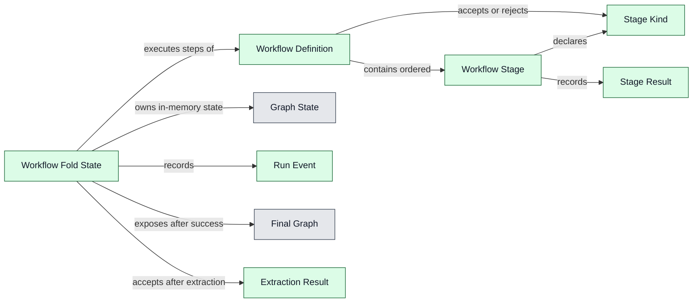
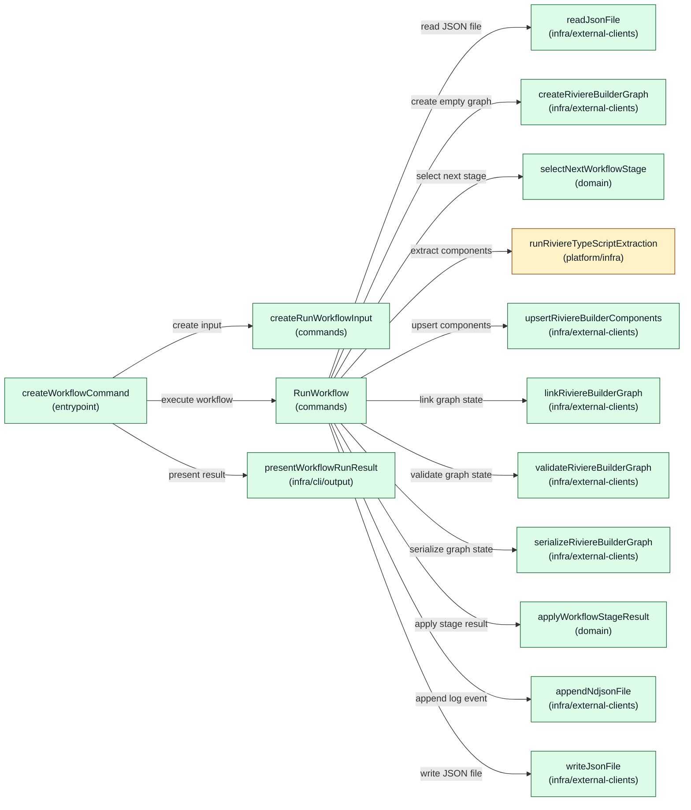
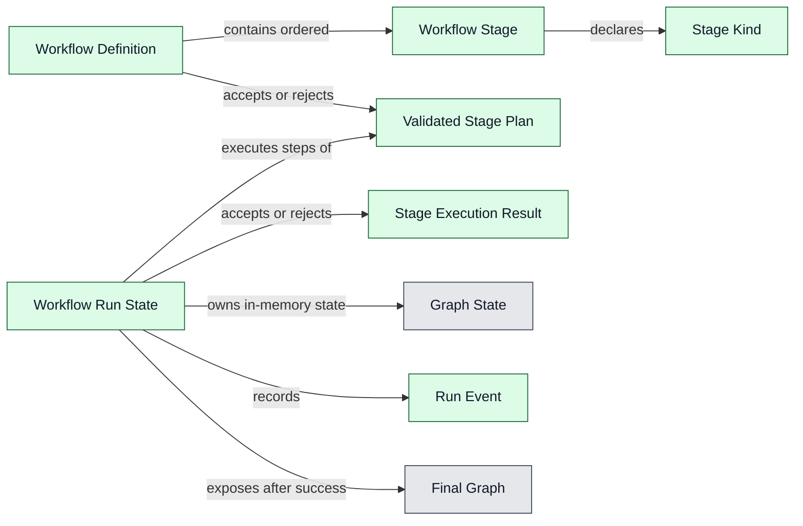
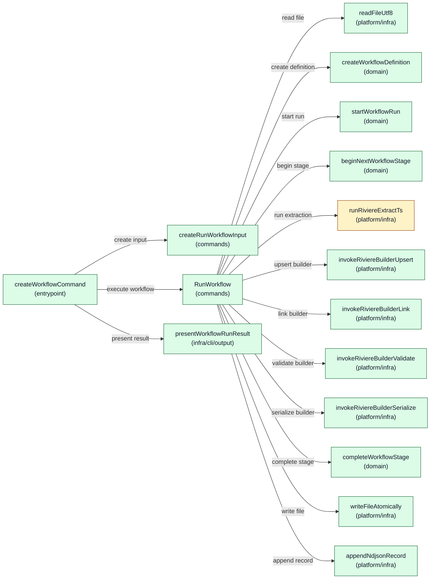

# Architecture: Riviere Extraction Workflows V1

**Status:** Draft

---

## 1. Product feasibility check

**Decision status:** Approved

Feasibility is still plausible, the approved PRD remains valid, and architecture drafting can continue.

The V1 product scope deliberately excludes AI-assisted stages so the first slice can be delivered faster. However, AI is expected future product work. The architecture must therefore avoid a V1 shape that assumes every future workflow stage is deterministic TypeScript extraction. V1 must not implement AI-assisted stages, but it should leave a clear future stage-extension seam so AI can later fit into the workflow model as a Rivière-owned stage with defined outputs and hard failure behaviour.

All-or-nothing graph integrity is a key architectural concern. The architecture must keep workflow graph-building state separate from the existing final graph until all stages succeed, so a failed run leaves the previous final graph unchanged.

## 2. Ownership and boundaries

**Decision status:** Approved

Top-level ownership is approved as a dedicated workflow feature inside `packages/riviere-cli/src/features/workflow`.

The workflow must not simply wrap or chain existing CLI commands. Existing builder commands load and save graph state command-by-command. Using workflows as wrappers around those commands would require saving, reloading, and cleaning up temporary files, which would likely make the implementation more complex and more awkward while fighting the PRD's all-or-nothing graph integrity promise.

The workflow feature should instead orchestrate workflow execution in memory and write the final graph only after all stages succeed. Existing lower-level Rivière capabilities such as deterministic extraction, graph building, linking, validation, and graph serialisation remain owned by their existing packages and command/use-case layers.

Important product boundary: workflows must not provide Rivière capabilities that the CLI does not provide. The CLI must not become “a watered down version of the full product.” Workflow execution may compose capabilities differently to protect all-or-nothing execution, but the underlying product capabilities should remain available through CLI surfaces rather than being hidden only inside workflow execution.

Rejected ownership options:

- A workflow wrapper around existing CLI commands was rejected because it would require graph state to be saved and reloaded between stages and would create cleanup complexity.
- A new `packages/riviere-workflow` package was not selected for V1 because it adds package and API surface area before the first workflow slice is proven. It remains a possible future evolution if workflows need to be consumed outside the CLI.
- `packages/riviere-builder` was rejected as the top-level workflow owner because workflow concerns include project-local workflow files, extraction config resolution, run logs, CLI progress, and future stage orchestration beyond pure graph building.
- `packages/riviere-extract-ts` was rejected because workflows include linking, validation, graph writing, and future non-deterministic AI-assisted stages; `riviere-extract-ts` should remain deterministic extraction only.

Future evolution notes:

- Consumers will import or invoke the CLI for V1 workflows because CLIs trigger workflows in this slice.
- Future workflows may be usable from code without YAML, but that is not part of V1.
- AI-assisted stages are future product work. V1 architecture should leave a stage-extension seam without implementing AI-assisted execution now.

## 3. Component design

**Decision status:** Pending

### Design Options: Riviere Extraction Workflows V1

<!-- component-design-option-1:start -->
#### Option 1: Domain-Gated Fold with External Stage Execution

This design keeps the workflow feature inside `riviere-cli` without introducing a new aggregate. The command use case runs a mechanical loop, but pure domain services decide the next expected stage, apply already-produced stage results, enforce fail-fast state, and expose a final graph only after the valid write graph transition. Extraction reuse is moved behind a package/platform seam so `features/workflow` does not import `features/extract` internals.

##### Domain model change



- gray = existing
- yellow = changed
- green = new
- red = unclear ownership / open decision

`Workflow Definition`, `Workflow Stage`, `Stage Kind`, `Stage Result`, `Workflow Fold State`, `Workflow Extraction Result`, and `Run Event` are proposed V1 domain terms because the glossary does not yet define workflow-specific terminology. `Graph State` and `Final Graph` use existing Rivière graph representation concepts.

##### Runtime call diagram



- gray = existing
- yellow = changed
- green = new
- red = unclear ownership / open decision

##### Components

| Component | Layer / path | Status | .riviere role | Responsibilities | Estimated size |
|---|---|---|---|---|---|
| `createWorkflowCommand` | `packages/riviere-cli/src/features/workflow/entrypoint/workflow.ts` | New | `cli-entrypoint` | Register `riviere workflow run`, translate Commander options, call input factory, execute the command use case, present success/failure. | Medium |
| `createRunWorkflowInput` | `packages/riviere-cli/src/features/workflow/commands/create-run-workflow-input.ts` | New | `command-input-factory` | Convert CLI options into `RunWorkflowInput` without reading workflow files or executing stages. | Small |
| `RunWorkflowInput` | `packages/riviere-cli/src/features/workflow/commands/run-workflow-input.ts` | New | `command-use-case-input` | Typed command input for workflow name/path, project root, graph output, and log output. | Small |
| `RunWorkflowResult` | `packages/riviere-cli/src/features/workflow/commands/run-workflow-result.ts` | New | `command-use-case-result` | Return workflow outcome, stage summaries, graph output path, log path, and failure detail. | Small |
| `RunWorkflow` | `packages/riviere-cli/src/features/workflow/commands/run-workflow.ts` | New | `command-use-case` | Read technical inputs, mechanically execute the next domain-selected stage, apply stage results through domain services, write run logs, commit final graph JSON only on success, and return typed result. | Medium |
| `WorkflowFoldState` | `packages/riviere-cli/src/features/workflow/domain/workflow-fold-state.ts` | New | `value-object` | Immutable workflow fold state containing current stage index, graph state, stage results, events, outcome, and optional final graph. | Small |
| `createWorkflowFoldState` | `packages/riviere-cli/src/features/workflow/domain/create-workflow-fold-state.ts` | New | `domain-service` | Create the initial running fold state and first run event. | Small |
| `selectNextWorkflowStage` | `packages/riviere-cli/src/features/workflow/domain/select-next-workflow-stage.ts` | New | `domain-service` | Decide whether the fold is waiting for the next stage, failed, or ready for final graph commit. | Small |
| `applyWorkflowStageResult` | `packages/riviere-cli/src/features/workflow/domain/apply-workflow-stage-result.ts` | New | `domain-service` | Apply already-produced stage results, enforce fail-fast progression, update graph state, record lifecycle events, and gate final graph exposure. | Medium |
| `WorkflowDefinition` | `packages/riviere-cli/src/features/workflow/domain/workflow-definition.ts` | New | `value-object` | Represent a named ordered workflow definition. | Small |
| `createWorkflowDefinition` | `packages/riviere-cli/src/features/workflow/domain/create-workflow-definition.ts` | New | `domain-service` | Reject definitions missing extract, link, validate, or final write graph stage order. | Medium |
| `WorkflowStage` | `packages/riviere-cli/src/features/workflow/domain/workflow-stage.ts` | New | `value-object` | Represent one ordered stage and its stage-specific references, such as extraction config path or graph output. | Small |
| `WorkflowStageResult` | `packages/riviere-cli/src/features/workflow/domain/workflow-stage-result.ts` | New | `value-object` | Represent a stage success/failure without CLI presentation or file-writing concerns. | Small |
| `WorkflowRunEvent` | `packages/riviere-cli/src/features/workflow/domain/workflow-run-event.ts` | New | `domain-event` | Represent lifecycle events including `StartStep`, `StepCompleted`, `StepFailed`, `RunCompleted`, and `RunFailed`. | Small |
| `WorkflowDefinitionError` | `packages/riviere-cli/src/features/workflow/domain/workflow-definition-error.ts` | New | `domain-error` | Explain invalid workflow definitions before any graph state is built. | Small |
| `WorkflowStageFailedError` | `packages/riviere-cli/src/features/workflow/domain/workflow-stage-failed-error.ts` | New | `domain-error` | Represent a failed stage reason without CLI or file-system concerns. | Small |
| `WorkflowExtractionResult` | `packages/riviere-cli/src/features/workflow/domain/workflow-extraction-result.ts` | New | `value-object` | Workflow-owned extraction output shape passed from TypeScript extraction adapter into the RiviereBuilder upsert adapter; does not expose `features/extract` internals. | Small |
| `upsertRiviereBuilderComponents` | `packages/riviere-cli/src/features/workflow/infra/external-clients/riviere-builder/upsert-riviere-builder-components.ts` | New | `external-client-service` | Apply extracted components to the current `RiviereBuilder` graph state and return a workflow-owned stage result. | Small |
| `linkRiviereBuilderGraph` | `packages/riviere-cli/src/features/workflow/infra/external-clients/riviere-builder/link-riviere-builder-graph.ts` | New | `external-client-service` | Wrap the `RiviereBuilder` link capability and return a workflow-owned stage result. | Small |
| `validateRiviereBuilderGraph` | `packages/riviere-cli/src/features/workflow/infra/external-clients/riviere-builder/validate-riviere-builder-graph.ts` | New | `external-client-service` | Wrap the `RiviereBuilder` validation capability and return a workflow-owned stage result. | Small |
| `serializeRiviereBuilderGraph` | `packages/riviere-cli/src/features/workflow/infra/external-clients/riviere-builder/serialize-riviere-builder-graph.ts` | New | `external-client-service` | Wrap the `RiviereBuilder` serialization capability and return a workflow-owned final graph result. | Small |
| `readJsonFile` | `packages/riviere-cli/src/platform/infra/external-clients/node-fs/read-json-file.ts` | Existing / Changed | `external-client-service` | Read JSON from the filesystem; workflow command maps the raw JSON into `WorkflowDefinition` through domain validation. | Small |
| `createRiviereBuilderGraph` | `packages/riviere-cli/src/features/workflow/infra/external-clients/riviere-builder/create-riviere-builder-graph.ts` | New | `external-client-service` | Wrap `RiviereBuilder.new` to create a new empty graph state for each run. | Small |
| `runRiviereTypeScriptExtraction` | `packages/riviere-cli/src/platform/infra/external-clients/riviere-extract-ts/run-riviere-typescript-extraction.ts` | Changed | `external-client-service` | Public CLI platform adapter over `@living-architecture/riviere-extract-ts` that extracts one configured TypeScript stage into `WorkflowExtractionResult` without importing `features/extract`. | Medium |
| `extractComponentsForWorkflowStage` | `packages/riviere-extract-ts/src/features/extraction/domain/extract-components-for-workflow-stage.ts` | Changed | `domain-service` | Package-owned deterministic extraction API that both CLI extraction and workflow adapters can call without cross-feature imports. | Medium |
| `appendNdjsonFile` | `packages/riviere-cli/src/platform/infra/external-clients/node-fs/append-ndjson-file.ts` | New | `external-client-service` | Append newline-delimited JSON records to a filesystem path. | Small |
| `writeJsonFile` | `packages/riviere-cli/src/platform/infra/external-clients/node-fs/write-json-file.ts` | Existing / Changed | `external-client-service` | Atomically write JSON content to a filesystem path. | Small |
| `presentWorkflowRunResult` | `packages/riviere-cli/src/features/workflow/infra/cli/output/present-workflow-run-result.ts` | New | `cli-output-formatter` | Show clear stage progress summary and failure details without deciding workflow semantics. | Small |
| `createProgram` | `packages/riviere-cli/src/shell/cli.ts` | Changed | `main` | Wire workflow repositories, operations, command use case, and entrypoint into the existing Commander program. | Small |

##### Runtime call outline

```text
createWorkflowCommand
  ├─ createRunWorkflowInput(options)
  ├─ RunWorkflow.execute(input)
  │  ├─ readJsonFile(input.workflowPath)
  │  ├─ createWorkflowDefinition(rawDefinition)
  │  ├─ createRiviereBuilderGraph(input.projectRoot)
  │  ├─ selectNextWorkflowStage(foldState)
  │  ├─ runRiviereTypeScriptExtraction(stage)
  │  ├─ upsertRiviereBuilderComponents(stage, graphState, extractionResult)
  │  ├─ linkRiviereBuilderGraph(stage, graphState)
  │  ├─ validateRiviereBuilderGraph(stage, graphState)
  │  ├─ serializeRiviereBuilderGraph(stage, graphState)
  │  ├─ applyWorkflowStageResult(foldState, stageResult)
  │  ├─ appendNdjsonFile(event)
  │  └─ writeJsonFile(finalGraph)
  └─ presentWorkflowRunResult(result)
```

##### Code stress test

```typescript
/** @riviere-role command-use-case */
export class RunWorkflow {
  constructor(
    private readonly readJson: typeof readJsonFile,
    private readonly createGraph: typeof createRiviereBuilderGraph,
    private readonly runExtraction: typeof runRiviereTypeScriptExtraction,
    private readonly upsertComponents: typeof upsertRiviereBuilderComponents,
    private readonly linkGraph: typeof linkRiviereBuilderGraph,
    private readonly validateGraph: typeof validateRiviereBuilderGraph,
    private readonly serializeGraph: typeof serializeRiviereBuilderGraph,
    private readonly appendLog: typeof appendNdjsonFile,
    private readonly writeGraph: typeof writeJsonFile,
  ) {}

  execute(input: RunWorkflowInput): RunWorkflowResult {
    const definition = createWorkflowDefinition(this.readJson(input.workflowPath))
    let foldState = createWorkflowFoldState(definition, this.createGraph(input.projectRoot))
    while (selectNextWorkflowStage(foldState).kind === 'stageExpected') {
      const next = selectNextWorkflowStage(foldState)
      const stageResult = this.executeExpectedStage(next.stage, foldState.graphState)
      foldState = applyWorkflowStageResult(foldState, stageResult)
    }
    this.appendLog(input.logPath, foldState.events)
    if (foldState.outcome === 'succeeded') this.writeGraph(input.graphPath, foldState.finalGraph)
    return { outcome: foldState.outcome, stages: foldState.stages, logPath: input.logPath, graphPath: input.graphPath }
  }

  private executeExpectedStage(stage: WorkflowStage, graphState: RiviereBuilder): WorkflowStageResult {
    if (stage.kind === 'extract') {
      const extraction = this.runExtraction(stage)
      return this.upsertComponents(stage, graphState, extraction)
    }
    if (stage.kind === 'link') return this.linkGraph(stage, graphState)
    if (stage.kind === 'validate') return this.validateGraph(stage, graphState)
    return this.serializeGraph(stage, graphState)
  }
}

/** @riviere-role domain-service */
export function selectNextWorkflowStage(state: WorkflowFoldState): WorkflowStageExpectation {
  if (state.outcome !== 'running') return { kind: state.outcome }
  return { kind: 'stageExpected', stage: state.definition.stages[state.stageIndex] }
}

/** @riviere-role domain-service */
export function applyWorkflowStageResult(state: WorkflowFoldState, result: WorkflowStageResult): WorkflowFoldState {
  const expectedStage = state.definition.stages[state.stageIndex]
  const started = [...state.events, { type: 'StartStep', stage: expectedStage.name, operation: expectedStage.kind }]
  if (result.outcome === 'failed') {
    return { ...state, outcome: 'failed', stages: [...state.stages, result], events: [...started, { type: 'StepFailed', stage: expectedStage.name, reason: result.reason }, { type: 'RunFailed', workflow: state.definition.name }] }
  }
  if (expectedStage.kind === 'writeGraph') {
    return { ...state, outcome: 'succeeded', finalGraph: result.finalGraph, stages: [...state.stages, result], events: [...started, { type: 'StepCompleted', stage: expectedStage.name, operation: expectedStage.kind }, { type: 'RunCompleted', workflow: state.definition.name }] }
  }
  return { ...state, stageIndex: state.stageIndex + 1, graphState: result.graphState, stages: [...state.stages, result], events: [...started, { type: 'StepCompleted', stage: expectedStage.name, operation: expectedStage.kind }] }
}

/** @riviere-role value-object */
export interface WorkflowExtractionResult {
  outcome: 'succeeded' | 'failed'
  components: ExtractedGraphComponent[]
  reason?: string
}

/** @riviere-role external-client-service */
export function upsertRiviereBuilderComponents(stage: WorkflowStage, graphState: RiviereBuilder, extraction: WorkflowExtractionResult): WorkflowStageResult {
  if (extraction.outcome === 'failed') return { outcome: 'failed', stage: stage.name, reason: extraction.reason ?? 'Extraction failed' }
  if (extraction.components.length === 0) return { outcome: 'failed', stage: stage.name, reason: 'Extraction produced no valid components' }
  return { outcome: 'succeeded', stage: stage.name, graphState: graphState.upsertComponents(extraction.components) }
}

/** @riviere-role domain-service */
export function createWorkflowDefinition(input: { name: string; stages: WorkflowStage[] }): WorkflowDefinition {
  const kinds = input.stages.map(stage => stage.kind)
  if (kinds.length < 4) throw new WorkflowDefinitionError('Workflow requires extract, link, validate, and writeGraph stages')
  if (!kinds.includes('extract')) throw new WorkflowDefinitionError('Workflow requires at least one extract stage')
  if (!kinds.includes('link')) throw new WorkflowDefinitionError('Workflow requires at least one link stage')
  if (!kinds.includes('validate')) throw new WorkflowDefinitionError('Workflow requires at least one validate stage')
  if (kinds[kinds.length - 1] !== 'writeGraph') throw new WorkflowDefinitionError('writeGraph must be the final stage')
  const firstWriteGraph = kinds.indexOf('writeGraph')
  if (firstWriteGraph !== kinds.length - 1) throw new WorkflowDefinitionError('writeGraph may only appear once as the final stage')
  const lastExtract = kinds.lastIndexOf('extract')
  const lastLink = kinds.lastIndexOf('link')
  const lastValidate = kinds.lastIndexOf('validate')
  if (lastLink < lastExtract) throw new WorkflowDefinitionError('At least one link stage must run after the final extract stage')
  if (lastValidate < lastLink) throw new WorkflowDefinitionError('At least one validate stage must run after the final link stage')
  return { name: input.name, stages: input.stages }
}

```

The command loop is mechanical: ask the domain for the next expected stage, execute the external work for that stage, then pass the already-produced `WorkflowStageResult` back to the domain. The domain never calls extraction, builder adapters, serialization, logging, or file I/O; it owns progression decisions, fail-fast state, lifecycle event recording, and final-write gating.

##### New dependencies

| Dependency | Status | Used by | Purpose |
|---|---|---|---|
| `@living-architecture/riviere-builder` | Existing | `createRiviereBuilderGraph`, `upsertRiviereBuilderComponents`, `linkRiviereBuilderGraph`, `validateRiviereBuilderGraph`, `serializeRiviereBuilderGraph` | Create empty graph state, upsert extracted components, apply link and validate semantics in memory, and serialize the final graph through technical adapters. |
| `@living-architecture/riviere-extract-ts` public workflow extraction API | Changed | `runRiviereTypeScriptExtraction` | Preserve deterministic TypeScript extraction ownership and avoid importing `features/extract` internals. |
| Node file system APIs | Existing | `readJsonFile`, `appendNdjsonFile`, `writeJsonFile` | Read workflow JSON, append NDJSON logs, and commit final graph JSON only after success. |

##### Code shape

```text
packages/riviere-cli/src/features/workflow/
  entrypoint/workflow.ts
  commands/create-run-workflow-input.ts
  commands/run-workflow-input.ts
  commands/run-workflow-result.ts
  commands/run-workflow.ts
  domain/workflow-fold-state.ts
  domain/create-workflow-fold-state.ts
  domain/select-next-workflow-stage.ts
  domain/apply-workflow-stage-result.ts
  domain/workflow-definition.ts
  domain/create-workflow-definition.ts
  domain/workflow-stage.ts
  domain/workflow-stage-result.ts
  domain/workflow-run-event.ts
  domain/workflow-definition-error.ts
  domain/workflow-stage-failed-error.ts
  infra/external-clients/riviere-builder/create-riviere-builder-graph.ts
  infra/external-clients/riviere-builder/upsert-riviere-builder-components.ts
  infra/external-clients/riviere-builder/link-riviere-builder-graph.ts
  infra/external-clients/riviere-builder/validate-riviere-builder-graph.ts
  infra/external-clients/riviere-builder/serialize-riviere-builder-graph.ts
  infra/cli/output/present-workflow-run-result.ts
packages/riviere-cli/src/platform/infra/external-clients/riviere-extract-ts/run-riviere-typescript-extraction.ts
packages/riviere-cli/src/platform/infra/external-clients/node-fs/read-json-file.ts
packages/riviere-cli/src/platform/infra/external-clients/node-fs/append-ndjson-file.ts
packages/riviere-cli/src/platform/infra/external-clients/node-fs/write-json-file.ts
packages/riviere-extract-ts/src/features/extraction/domain/extract-components-for-workflow-stage.ts
packages/riviere-cli/src/shell/cli.ts
ecommerce-demo-app/.riviere/workflows/rebuild-graph.json
ecommerce-demo-app/package.json
ecommerce-demo-app/.github/workflows/*
```

##### .riviere role options

| Declaration | Candidate roles | Preferred role | Reason | Open decision |
|---|---|---|---|---|
| `createWorkflowCommand` function | `cli-entrypoint` | `cli-entrypoint` | Handles raw Commander command registration and calls the command use case. | None. |
| `createRunWorkflowInput` function | `command-input-factory`, `cli-input-validator` | `command-input-factory` | Builds typed command input from CLI options; validation is limited to input shape. | None. |
| `RunWorkflowInput` interface | `command-use-case-input` | `command-use-case-input` | Dedicated input for `RunWorkflow.execute`. | None. |
| `RunWorkflowResult` type | `command-use-case-result` | `command-use-case-result` | Dedicated result for `RunWorkflow.execute`. | None. |
| `WorkflowStageSummary` type | `command-use-case-result-value`, `value-object` | `command-use-case-result-value` | It exists to describe the command result to the entrypoint. | None. |
| `RunWorkflow` class | `command-use-case` | `command-use-case` | Mechanically executes externally required stage work between pure domain fold decisions. | None. |
| `createWorkflowFoldState` function | `domain-service` | `domain-service` | Creates the initial running fold state and first run event. | None. |
| `selectNextWorkflowStage` function | `domain-service` | `domain-service` | Selects the next expected stage or reports terminal fold state without executing stage work. | None. |
| `applyWorkflowStageResult` function | `domain-service` | `domain-service` | Applies already-produced stage results, records lifecycle events, and gates final graph exposure. | None. |
| `WorkflowDefinition` interface | `value-object`, `aggregate` | `value-object` | Immutable ordered workflow definition and does not own persisted identity or state transitions. | None. |
| `createWorkflowDefinition` function | `domain-service` | `domain-service` | Validates V1 minimum stage requirements and creates a workflow definition value. | None. |
| `WorkflowStage` type | `value-object` | `value-object` | Immutable representation of a Rivière stage. | None. |
| `WorkflowStageResult` type | `value-object`, `command-use-case-result-value` | `value-object` | Domain concept for stage outcome used before CLI result mapping. | None. |
| `WorkflowExtractionResult` type | `value-object` | `value-object` | Workflow-owned extraction output shape consumed by extract stage transition. | None. |
| `WorkflowFoldState` interface | `value-object` | `value-object` | Immutable fold state value passed between pure domain transition functions. | None. |
| `WorkflowRunEvent` type | `domain-event` | `domain-event` | Domain lifecycle event type for structured run logging. | None. |
| `WorkflowDefinitionError` class | `domain-error` | `domain-error` | Domain error for invalid workflow definition. | None. |
| `WorkflowStageFailedError` class | `domain-error` | `domain-error` | Domain error for stage failure reasons. | None. |
| `upsertRiviereBuilderComponents` function | `external-client-service` | `external-client-service` | Invokes approved `RiviereBuilder` upsert behaviour and maps it to a workflow stage result. | None. |
| `linkRiviereBuilderGraph` function | `external-client-service` | `external-client-service` | Invokes approved `RiviereBuilder` link behaviour and maps it to a workflow stage result. | None. |
| `validateRiviereBuilderGraph` function | `external-client-service` | `external-client-service` | Invokes approved `RiviereBuilder` validation and maps invalid output to a failed workflow stage result. | None. |
| `serializeRiviereBuilderGraph` function | `external-client-service` | `external-client-service` | Invokes approved `RiviereBuilder` serialization and maps it to a write graph stage result. | None. |
| `readJsonFile` function | `external-client-service` | `external-client-service` | Interacts with Node filesystem JSON reading only. | None. |
| `createRiviereBuilderGraph` function | `external-client-service` | `external-client-service` | Wraps `RiviereBuilder.new` to create an empty graph state. | None. |
| `runRiviereTypeScriptExtraction` function | `external-client-service` | `external-client-service` | Uses the public `@living-architecture/riviere-extract-ts` TypeScript extraction API and maps results into `WorkflowExtractionResult`. | None. |
| `extractComponentsForWorkflowStage` function | `domain-service` | `domain-service` | Package-owned deterministic extraction behaviour in `riviere-extract-ts`, not a CLI feature internal. | None. |
| `appendNdjsonFile` function | `external-client-service` | `external-client-service` | Interacts with Node filesystem append APIs to write NDJSON records. | None. |
| `writeJsonFile` function | `external-client-service` | `external-client-service` | Interacts with Node filesystem write APIs to atomically write JSON. | None. |
| `presentWorkflowRunResult` function | `cli-output-formatter` | `cli-output-formatter` | Converts typed command result into user-facing CLI output. | None. |
| `createProgram` function | `main` | `main` | Existing shell wiring only. | None. |

##### Canonical role pattern and tangled responsibility findings

- Canonical pattern used: CLI invoking command use case, with `createWorkflowCommand` calling the input factory, `RunWorkflow.execute`, and output formatter.
- Canonical pattern adapted: `RunWorkflow` performs I/O setup, mechanically runs the domain-selected next stage, applies each stage result through pure domain services, writes final outputs based on the domain-gated result, and returns a typed result.
- Canonical pattern tension resolved without a new aggregate: the workflow progression decisions are not in infra and external stage execution is not hidden inside domain callbacks.
- Tangled responsibility avoided: workflow definitions do not contain extraction rules, linking rules, custom types, detection predicates, or extraction semantics.
- Tangled responsibility avoided: external-client services only perform file I/O, builder package calls, or package-owned extraction; workflow progression and final-write gating live in domain services.
- Tangled responsibility avoided: `write graph` is represented as a domain stage transition that exposes a final graph, while `RunWorkflow` performs the durable write only if the fold result succeeded.

##### Design validation

- Domain terminology: open issue, because `Workflow Definition`, `Workflow Stage`, `Stage Kind`, `Stage Result`, `Workflow Fold State`, `Workflow Extraction Result`, `Run Event`, and `Graph State` need glossary approval if this option is selected.
- Application/domain separation: pass, because workflow progression and graph-state transition rules live in domain components, while file reading, log writing, and durable graph writing remain outside `domain/`.
- Role and location fit: pass, because all critical components use existing approved roles and no new aggregate approval is required.
- Implementability: pass, because the critical path uses `command-use-case`, `domain-service`, `value-object`, `domain-event`, `domain-error`, `external-client-service`, and `cli-output-formatter` roles only.

##### Open decisions

- Approve proposed workflow domain terminology and add it to `docs/architecture/domain-terminology/contextive/definitions.glossary.yml` if this option is selected.
<!-- component-design-option-1:end -->

<!-- component-design-option-2:start -->
#### Option 2: Validated Stage Plan with Domain Run State

This design keeps Option 2's distinct direction: workflow ordering is validated up front into a concrete stage plan, then a domain run state owns progression, fail-fast transitions, graph-state advancement, and final-write gating. The command use case has individual role-valid dependencies and only performs externally required Rivière operations for the domain-declared current stage.

##### Domain model change



- gray = existing
- yellow = changed
- green = new
- red = unclear ownership / open decision

`Workflow Definition`, `Workflow Stage`, `Stage Kind`, `Validated Stage Plan`, `Workflow Run State`, `Stage Execution Result`, and `Run Event` are proposed V1 domain terms because the glossary does not yet define workflow-specific terminology. `Graph State` and `Final Graph` use existing Rivière graph representation concepts.

##### Runtime call diagram



- gray = existing
- yellow = changed
- green = new
- red = unclear ownership / open decision

##### Components

| Component | Layer / path | Status | .riviere role | Responsibilities | Estimated size |
|---|---|---|---|---|---|
| `createWorkflowCommand` | `packages/riviere-cli/src/features/workflow/entrypoint/workflow.ts` | New | `cli-entrypoint` | Register `riviere workflow run`, translate Commander input, call input factory, execute use case, and present result. | Medium |
| `createRunWorkflowInput` | `packages/riviere-cli/src/features/workflow/commands/create-run-workflow-input.ts` | New | `command-input-factory` | Convert CLI options into `RunWorkflowInput` without file reads or workflow semantics. | Small |
| `RunWorkflowInput` | `packages/riviere-cli/src/features/workflow/commands/run-workflow-input.ts` | New | `command-use-case-input` | Typed command input for workflow path, project root, graph output, and log output. | Small |
| `RunWorkflowResult` | `packages/riviere-cli/src/features/workflow/commands/run-workflow-result.ts` | New | `command-use-case-result` | Typed command result with run outcome, stage summaries, paths, and failure detail. | Small |
| `WorkflowStageSummary` | `packages/riviere-cli/src/features/workflow/commands/workflow-stage-summary.ts` | New | `command-use-case-result-value` | Command-result value for executed stage summaries. | Small |
| `RunWorkflow` | `packages/riviere-cli/src/features/workflow/commands/run-workflow.ts` | New | `command-use-case` | Load workflow file, invoke domain run-state transitions, execute external stage work for the current domain-declared stage, append log records, and write final graph only when the domain returns a commit instruction. | Medium |
| `WorkflowDefinition` | `packages/riviere-cli/src/features/workflow/domain/workflow-definition.ts` | New | `value-object` | Branded immutable ordered workflow definition. | Small |
| `WorkflowStage` | `packages/riviere-cli/src/features/workflow/domain/workflow-stage.ts` | New | `value-object` | Branded immutable Rivière stage with allowed stage references. | Small |
| `WorkflowStageKind` | `packages/riviere-cli/src/features/workflow/domain/workflow-stage-kind.ts` | New | `value-object` | Branded enum-like kind for `extract`, `link`, `validate`, and `writeGraph`. | Small |
| `createWorkflowDefinition` | `packages/riviere-cli/src/features/workflow/domain/create-workflow-definition.ts` | New | `domain-service` | Parse raw workflow data into a validated plan and reject `extract → write graph`, missing `link`, missing `validate`, repeated or early `write graph`, and invalid ordering. | Medium |
| `WorkflowRunState` | `packages/riviere-cli/src/features/workflow/domain/workflow-run-state.ts` | New | `value-object` | Branded immutable run state containing current stage index, graph state, outcome, pending events, summaries, and optional final graph. | Small |
| `WorkflowGraphState` | `packages/riviere-cli/src/features/workflow/domain/workflow-graph-state.ts` | New | `value-object` | Branded opaque graph-building state value carried through domain transitions without domain importing builder APIs. | Small |
| `startWorkflowRun` | `packages/riviere-cli/src/features/workflow/domain/start-workflow-run.ts` | New | `domain-service` | Create initial run state from a validated definition and empty graph state. | Small |
| `beginNextWorkflowStage` | `packages/riviere-cli/src/features/workflow/domain/begin-next-workflow-stage.ts` | New | `domain-service` | Enforce fail-fast state, expose only the next expected stage, and record `StartStep`. | Small |
| `completeWorkflowStage` | `packages/riviere-cli/src/features/workflow/domain/complete-workflow-stage.ts` | New | `domain-service` | Accept a `StageExecutionResult`, advance graph state on success, fail the run on failure, record lifecycle events, and return final-graph commit instructions only after a successful final stage. | Medium |
| `StageExecutionResult` | `packages/riviere-cli/src/features/workflow/domain/stage-execution-result.ts` | New | `value-object` | Branded stage result contract for success, updated graph state, final graph JSON, and failure reasons including missing config, no matched files, invalid extraction output, builder failure, validation failure, and serialization failure. | Small |
| `WorkflowRunEvent` | `packages/riviere-cli/src/features/workflow/domain/workflow-run-event.ts` | New | `domain-event` | Structured event union for `RunStarted`, `StartStep`, `StepCompleted`, `StepFailed`, `RunCompleted`, and `RunFailed`. | Small |
| `WorkflowDefinitionError` | `packages/riviere-cli/src/features/workflow/domain/workflow-definition-error.ts` | New | `domain-error` | Invalid workflow definition failure. | Small |
| `WorkflowStageError` | `packages/riviere-cli/src/features/workflow/domain/workflow-stage-error.ts` | New | `domain-error` | Stage transition failure without CLI or filesystem concerns. | Small |
| `readFileUtf8` | `packages/riviere-cli/src/platform/infra/external-clients/node-fs/read-file-utf8.ts` | New | `external-client-service` | Wrap Node filesystem text reads for workflow files. | Small |
| `writeFileAtomically` | `packages/riviere-cli/src/platform/infra/external-clients/node-fs/write-file-atomically.ts` | New | `external-client-service` | Atomically write final graph JSON when the domain returns a commit instruction. | Small |
| `appendNdjsonRecord` | `packages/riviere-cli/src/platform/infra/external-clients/node-fs/append-ndjson-record.ts` | New | `external-client-service` | Append one structured JSON record per line to the run log. | Small |
| `createRiviereBuilder` | `packages/riviere-cli/src/platform/infra/external-clients/riviere-builder/create-riviere-builder.ts` | New | `external-client-service` | Wrap `RiviereBuilder.new` to create empty graph state for each V1 run. | Small |
| `invokeRiviereBuilderUpsert` | `packages/riviere-cli/src/platform/infra/external-clients/riviere-builder/invoke-riviere-builder-upsert.ts` | New | `external-client-service` | Invoke builder upsert and map builder failures into `StageExecutionResult`. | Small |
| `invokeRiviereBuilderLink` | `packages/riviere-cli/src/platform/infra/external-clients/riviere-builder/invoke-riviere-builder-link.ts` | New | `external-client-service` | Invoke builder link and map builder failures into `StageExecutionResult`. | Small |
| `invokeRiviereBuilderValidate` | `packages/riviere-cli/src/platform/infra/external-clients/riviere-builder/invoke-riviere-builder-validate.ts` | New | `external-client-service` | Invoke builder validation and map validation errors into `StageExecutionResult`. | Small |
| `invokeRiviereBuilderSerialize` | `packages/riviere-cli/src/platform/infra/external-clients/riviere-builder/invoke-riviere-builder-serialize.ts` | New | `external-client-service` | Invoke builder serialization and map serialization errors into `StageExecutionResult`. | Small |
| `runRiviereExtractTs` | `packages/riviere-cli/src/platform/infra/external-clients/riviere-extract-ts/run-riviere-extract-ts.ts` | Changed | `external-client-service` | Wrap a public `@living-architecture/riviere-extract-ts` API and map missing config, no matched files, and invalid extraction output into typed extraction results. | Medium |
| `extractComponentsFromConfig` | `packages/riviere-extract-ts/src/features/extraction/domain/extract-components-from-config.ts` | Changed | `domain-service` | Package-owned deterministic extraction entry point reusable by CLI extraction and workflow adapters. | Medium |
| `presentWorkflowRunResult` | `packages/riviere-cli/src/features/workflow/infra/cli/output/present-workflow-run-result.ts` | New | `cli-output-formatter` | Format success, failure, progress summary, graph path, and log path. | Small |
| `createProgram` | `packages/riviere-cli/src/shell/cli.ts` | Changed | `main` | Wire individual dependencies and register workflow command. | Small |

##### Runtime call outline

```text
createWorkflowCommand
  ├─ createRunWorkflowInput(options)
  ├─ RunWorkflow.execute(input)
  │  ├─ readFileUtf8(input.workflowPath)
  │  ├─ createWorkflowDefinition(rawWorkflowText)
  │  ├─ createRiviereBuilder(input.projectRoot)
  │  ├─ startWorkflowRun(definition, emptyGraphState)
  │  ├─ beginNextWorkflowStage(runState)
  │  ├─ appendNdjsonRecord(input.logPath, event)
  │  ├─ runRiviereExtractTs(stage.configPath)
  │  ├─ invokeRiviereBuilderUpsert(graphState, extractedEntries)
  │  ├─ invokeRiviereBuilderLink(graphState)
  │  ├─ invokeRiviereBuilderValidate(graphState)
  │  ├─ invokeRiviereBuilderSerialize(graphState)
  │  ├─ completeWorkflowStage(runState, stageResult)
  │  ├─ appendNdjsonRecord(input.logPath, event)
  │  └─ writeFileAtomically(input.graphPath, finalGraphJson)
  └─ presentWorkflowRunResult(result)
```

##### Code stress test

```typescript
/** @riviere-role value-object */
export type StageExecutionResult =
  | { readonly brand: 'StageExecutionResult'; outcome: 'succeeded'; stageName: string; graphState?: WorkflowGraphState; finalGraphJson?: string }
  | { readonly brand: 'StageExecutionResult'; outcome: 'failed'; stageName: string; reason: 'MissingConfig' | 'NoMatchedFiles' | 'InvalidExtractionOutput' | 'BuilderUpsertFailed' | 'BuilderLinkFailed' | 'ValidationFailed' | 'SerializationFailed'; message: string }

/** @riviere-role command-use-case */
export class RunWorkflow {
  constructor(
    private readonly readFileUtf8: typeof readFileUtf8,
    private readonly createRiviereBuilder: typeof createRiviereBuilder,
    private readonly runRiviereExtractTs: typeof runRiviereExtractTs,
    private readonly invokeRiviereBuilderUpsert: typeof invokeRiviereBuilderUpsert,
    private readonly invokeRiviereBuilderLink: typeof invokeRiviereBuilderLink,
    private readonly invokeRiviereBuilderValidate: typeof invokeRiviereBuilderValidate,
    private readonly invokeRiviereBuilderSerialize: typeof invokeRiviereBuilderSerialize,
    private readonly appendNdjsonRecord: typeof appendNdjsonRecord,
    private readonly writeFileAtomically: typeof writeFileAtomically,
  ) {}

  execute(input: RunWorkflowInput): RunWorkflowResult {
    let state = startWorkflowRun(createWorkflowDefinition(this.readFileUtf8(input.workflowPath)), this.createRiviereBuilder(input.projectRoot))
    while (state.outcome === 'running') {
      const begun = beginNextWorkflowStage(state)
      state = begun.state
      begun.events.forEach(event => this.appendNdjsonRecord(input.logPath, event))
      const result = this.executeExternallyRequiredStage(begun.stage, state.graphState)
      const completed = completeWorkflowStage(state, result)
      state = completed.state
      completed.events.forEach(event => this.appendNdjsonRecord(input.logPath, event))
      if (completed.finalGraphCommit) this.writeFileAtomically(input.graphPath, completed.finalGraphCommit.json)
    }
    return { outcome: state.outcome, stages: state.stageSummaries, graphPath: input.graphPath, logPath: input.logPath, reason: state.failure?.message }
  }

  private executeExternallyRequiredStage(stage: WorkflowStage, graphState: WorkflowGraphState): StageExecutionResult {
    if (stage.kind === 'extract') {
      const extraction = this.runRiviereExtractTs(stage.configPath)
      if (extraction.outcome === 'failed') return { brand: 'StageExecutionResult', outcome: 'failed', stageName: stage.name, reason: extraction.reason, message: extraction.message }
      if (extraction.entries.length === 0) return { brand: 'StageExecutionResult', outcome: 'failed', stageName: stage.name, reason: 'NoMatchedFiles', message: stage.configPath }
      return this.invokeRiviereBuilderUpsert(graphState, extraction.entries, stage.name)
    }
    if (stage.kind === 'link') return this.invokeRiviereBuilderLink(graphState, stage.name)
    if (stage.kind === 'validate') return this.invokeRiviereBuilderValidate(graphState, stage.name)
    return this.invokeRiviereBuilderSerialize(graphState, stage.name)
  }
}

/** @riviere-role domain-service */
export function completeWorkflowStage(state: WorkflowRunState, result: StageExecutionResult): WorkflowStageCompletion {
  if (result.outcome === 'failed') return failRun(state, result)
  if (state.expectedStage.kind !== 'writeGraph') return advanceRun(state, result.graphState)
  if (!result.finalGraphJson) return failRun(state, { brand: 'StageExecutionResult', outcome: 'failed', stageName: result.stageName, reason: 'SerializationFailed', message: 'write graph stage produced no graph JSON' })
  return succeedRunWithFinalGraph(state, result.finalGraphJson)
}
```

`runRiviereExtractTs` returns typed failures for missing referenced config files, no matched files, and invalid extraction output. Builder adapters return `BuilderUpsertFailed`, `BuilderLinkFailed`, `ValidationFailed`, or `SerializationFailed` without mutating the durable graph file. The command writes the final graph only when `completeWorkflowStage` returns `finalGraphCommit`; failed completions return no commit instruction and move the domain state to failed, so later stages do not run.

##### New dependencies

| Dependency | Status | Used by | Purpose |
|---|---|---|---|
| `@living-architecture/riviere-builder` | Existing | `createRiviereBuilder`, `invokeRiviereBuilderUpsert`, `invokeRiviereBuilderLink`, `invokeRiviereBuilderValidate`, `invokeRiviereBuilderSerialize` | Create empty graph state, upsert extracted entries, link, validate, and serialize through technical adapters. |
| `@living-architecture/riviere-extract-ts` public extraction API | Changed | `runRiviereExtractTs` | Reuse deterministic TypeScript extraction without importing `features/extract` internals. |
| Node file system APIs | Existing | `readFileUtf8`, `writeFileAtomically`, `appendNdjsonRecord` | Read workflow definitions, commit final graph JSON after success, and append NDJSON log records. |

##### Code shape

```text
packages/riviere-cli/src/features/workflow/
  entrypoint/workflow.ts
  commands/create-run-workflow-input.ts
  commands/run-workflow-input.ts
  commands/run-workflow-result.ts
  commands/workflow-stage-summary.ts
  commands/run-workflow.ts
  domain/workflow-definition.ts
  domain/workflow-stage.ts
  domain/workflow-stage-kind.ts
  domain/create-workflow-definition.ts
  domain/workflow-run-state.ts
  domain/workflow-graph-state.ts
  domain/start-workflow-run.ts
  domain/begin-next-workflow-stage.ts
  domain/complete-workflow-stage.ts
  domain/stage-execution-result.ts
  domain/workflow-run-event.ts
  domain/workflow-definition-error.ts
  domain/workflow-stage-error.ts
  infra/cli/output/present-workflow-run-result.ts
packages/riviere-cli/src/platform/infra/external-clients/node-fs/read-file-utf8.ts
packages/riviere-cli/src/platform/infra/external-clients/node-fs/write-file-atomically.ts
packages/riviere-cli/src/platform/infra/external-clients/node-fs/append-ndjson-record.ts
packages/riviere-cli/src/platform/infra/external-clients/riviere-builder/create-riviere-builder.ts
packages/riviere-cli/src/platform/infra/external-clients/riviere-builder/invoke-riviere-builder-upsert.ts
packages/riviere-cli/src/platform/infra/external-clients/riviere-builder/invoke-riviere-builder-link.ts
packages/riviere-cli/src/platform/infra/external-clients/riviere-builder/invoke-riviere-builder-validate.ts
packages/riviere-cli/src/platform/infra/external-clients/riviere-builder/invoke-riviere-builder-serialize.ts
packages/riviere-cli/src/platform/infra/external-clients/riviere-extract-ts/run-riviere-extract-ts.ts
packages/riviere-extract-ts/src/features/extraction/domain/extract-components-from-config.ts
packages/riviere-cli/src/shell/cli.ts
ecommerce-demo-app/.riviere/workflows/rebuild-graph.json
ecommerce-demo-app/package.json
ecommerce-demo-app/.github/workflows/*
```

##### .riviere role options

| Declaration | Candidate roles | Preferred role | Reason | Open decision |
|---|---|---|---|---|
| `createWorkflowCommand` function | `cli-entrypoint` | `cli-entrypoint` | Commander registration and command invocation. | None. |
| `createRunWorkflowInput` function | `command-input-factory`, `cli-input-validator` | `command-input-factory` | Builds typed command input from CLI options. | None. |
| `RunWorkflowInput` type | `command-use-case-input` | `command-use-case-input` | Dedicated input for `RunWorkflow.execute`. | None. |
| `RunWorkflowResult` type | `command-use-case-result` | `command-use-case-result` | Dedicated output for `RunWorkflow.execute`. | None. |
| `WorkflowStageSummary` type | `command-use-case-result-value` | `command-use-case-result-value` | Stage summary exists for the command result contract. | None. |
| `RunWorkflow` class | `command-use-case` | `command-use-case` | Uses individual constructor dependencies and delegates progression to domain services. | None. |
| `WorkflowDefinition` class | `value-object`, `aggregate` | `value-object` | Branded immutable data; no repository-loaded identity. | None. |
| `WorkflowStage` class | `value-object` | `value-object` | Branded immutable stage data. | None. |
| `WorkflowStageKind` type | `value-object` | `value-object` | Branded enum-like domain value. | None. |
| `createWorkflowDefinition` function | `domain-service` | `domain-service` | Pure validation of the V1 stage plan. | None. |
| `WorkflowRunState` class | `value-object`, `aggregate` | `value-object` | Branded immutable run state value; it is not persisted through a repository. | None. |
| `WorkflowGraphState` type | `value-object` | `value-object` | Opaque branded graph-building state carried by the domain without importing builder APIs. | None. |
| `startWorkflowRun` function | `domain-service` | `domain-service` | Pure creation of the initial run state. | None. |
| `beginNextWorkflowStage` function | `domain-service` | `domain-service` | Pure stage-start transition and fail-fast guard. | None. |
| `completeWorkflowStage` function | `domain-service` | `domain-service` | Pure stage-completion transition, graph-state advancement, failure transition, and final-write gating. | None. |
| `StageExecutionResult` type | `value-object` | `value-object` | Branded data contract for domain transition decisions. | None. |
| `WorkflowStageCompletion` type | `value-object` | `value-object` | Branded data contract returned by `completeWorkflowStage`. | None. |
| `WorkflowRunEvent` type | `domain-event` | `domain-event` | Structured lifecycle event union. | None. |
| `WorkflowDefinitionError` class | `domain-error` | `domain-error` | Invalid stage-plan failure. | None. |
| `WorkflowStageError` class | `domain-error` | `domain-error` | Stage transition failure. | None. |
| `readFileUtf8` function | `external-client-service` | `external-client-service` | Technical Node filesystem read wrapper. | None. |
| `writeFileAtomically` function | `external-client-service` | `external-client-service` | Technical Node filesystem atomic-write wrapper. | None. |
| `appendNdjsonRecord` function | `external-client-service` | `external-client-service` | Technical Node filesystem append wrapper. | None. |
| `createRiviereBuilder` function | `external-client-service` | `external-client-service` | Technical adapter over builder construction. | None. |
| `invokeRiviereBuilderUpsert` function | `external-client-service` | `external-client-service` | Technical adapter over builder upsert. | None. |
| `invokeRiviereBuilderLink` function | `external-client-service` | `external-client-service` | Technical adapter over builder link. | None. |
| `invokeRiviereBuilderValidate` function | `external-client-service` | `external-client-service` | Technical adapter over builder validate. | None. |
| `invokeRiviereBuilderSerialize` function | `external-client-service` | `external-client-service` | Technical adapter over builder serialize. | None. |
| `runRiviereExtractTs` function | `external-client-service` | `external-client-service` | Technical adapter over `@living-architecture/riviere-extract-ts`. | None. |
| `extractComponentsFromConfig` function | `domain-service` | `domain-service` | Package-owned deterministic extraction behaviour. | None. |
| `presentWorkflowRunResult` function | `cli-output-formatter` | `cli-output-formatter` | CLI presentation only. | None. |
| `createProgram` function | `main` | `main` | Shell wiring only. | None. |

##### Canonical role pattern and tangled responsibility findings

- Canonical pattern used: CLI invoking command use case, with the entrypoint coordinating input creation, use-case execution, and output formatting.
- Canonical pattern adapted: the command use case has a mechanical loop because workflow execution has many stages, but the domain run state owns progression, fail-fast transitions, graph-state advancement, lifecycle events, and final-write gating.
- Tangled responsibility avoided: the command does not decide whether to continue after failure or whether the final graph may be written; it follows `WorkflowStageCompletion` returned by `completeWorkflowStage`.
- Tangled responsibility avoided: external-client services live under `platform/infra/external-clients` and are named for technical capabilities, not workflow-domain behaviour.
- Tangled responsibility avoided: workflow definitions reference Extraction Config paths but do not contain Detection Predicates, Extraction Rules, custom types, Connection Detection rules, Strict Mode, Lenient Mode, or graph semantics-changing settings.
- Future stage seam: adding an AI-assisted Rivière stage later would add a stage kind, a stage-plan rule, a domain transition case, and one explicit technical adapter; V1 does not implement that adapter.

##### Design validation

- Domain terminology: open issue, because `Workflow Definition`, `Workflow Stage`, `Stage Kind`, `Validated Stage Plan`, `Workflow Run State`, `Stage Execution Result`, and `Run Event` need glossary approval if this option is selected.
- Application/domain separation: pass, because stage-plan validity, fail-fast transitions, graph-state advancement, event decisions, and final-write gating live in domain services while file I/O, extraction, builder calls, and durable graph writes stay outside `domain/`.
- Role and location fit: pass, because the critical path uses existing roles and individual constructor dependencies, with no unresolved dependency-bundle role.
- Implementability: pass, because failure contracts and final-write prevention are explicit and no forbidden cross-feature imports are required.

##### Open decisions

- Approve proposed workflow domain terminology and add it to `docs/architecture/domain-terminology/contextive/definitions.glossary.yml` if this option is selected.

##### Why this design is distinct

This option keeps Option 2 structurally distinct from Option 1 by validating the complete stage plan up front and using a domain run-state transition model, rather than Option 1's separate next-stage selector plus fold-result applicator. It also makes external stage execution visible in the command while moving continuation, failure, graph advancement, and final-write decisions into domain transitions.
<!-- component-design-option-2:end -->

<!-- component-design-option-3:start -->
#### Option 3: Pending
<!-- component-design-option-3:end -->

#### Approval

Options have been written to this file. Which option should be approved, rejected, or combined?


## 4. Feasibility confirmations

**Decision status:** Pending

## 5. Product impact notes

No product-impact changes identified.

## 6. Task generation consequences

**Decision status:** Pending
