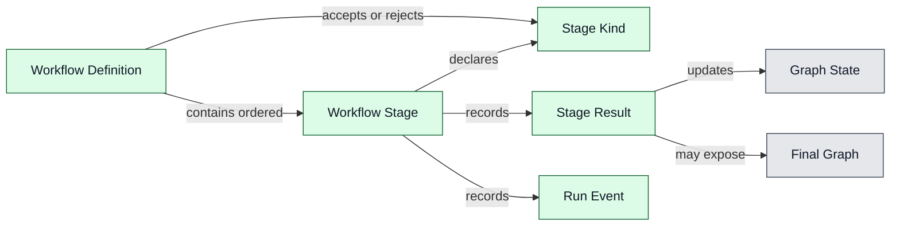
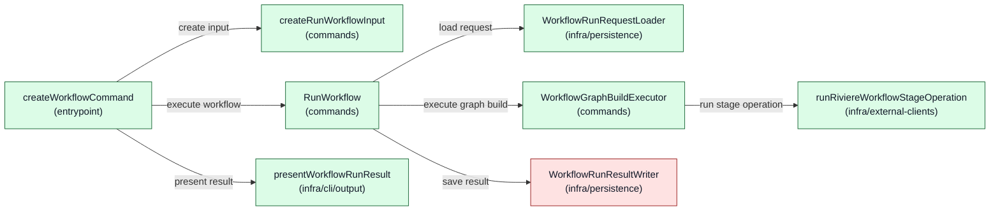
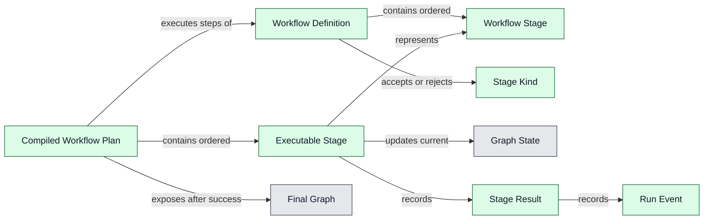
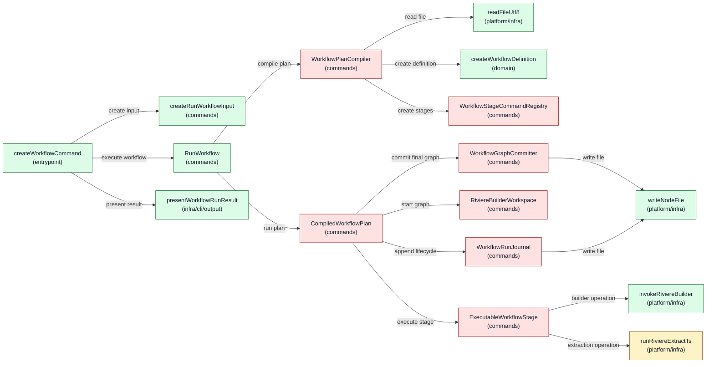
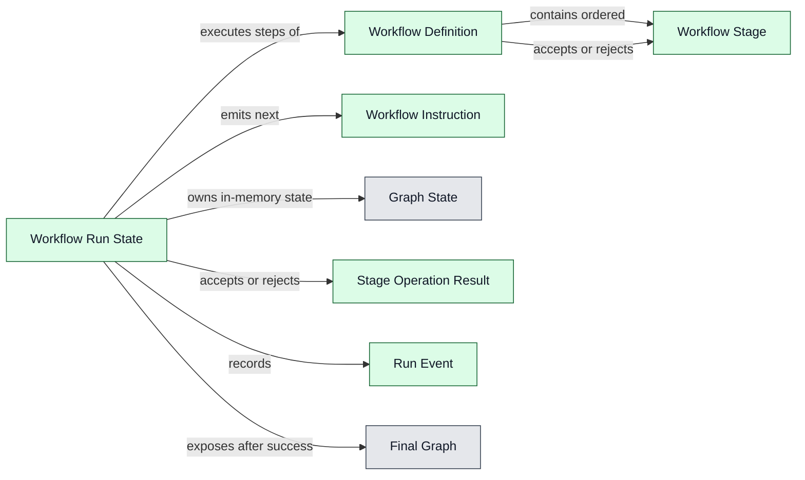
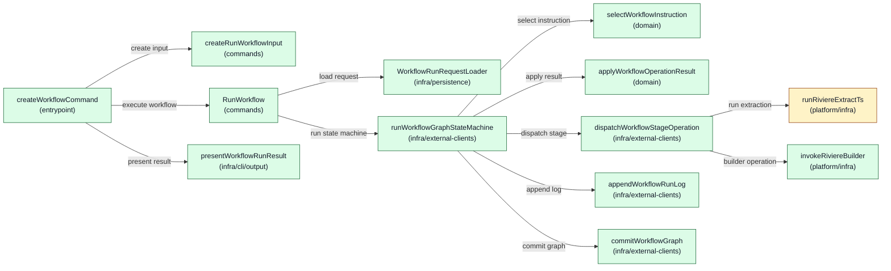

# Architecture: Riviere Extraction Workflows V1

**Status:** Draft

---

## 1. Product feasibility check

**Decision status:** Approved

Feasibility is still plausible, the approved PRD remains valid, and architecture drafting can continue.

The V1 product scope deliberately excludes AI-assisted stages so the first slice can be delivered faster. However, AI is expected future product work. The architecture must therefore avoid a V1 shape that assumes every future workflow stage is deterministic TypeScript extraction. V1 must not implement AI-assisted stages, but it should leave a clear future stage-extension seam so AI can later fit into the workflow model as a Rivière-owned stage with defined outputs and hard failure behaviour.

All-or-nothing graph integrity is a key architectural concern. The architecture must keep workflow graph-building state separate from the existing final graph until all stages succeed, so a failed run leaves the previous final graph unchanged.

## 2. Ownership and boundaries

**Decision status:** Approved

Top-level ownership is approved as a dedicated workflow feature inside `packages/riviere-cli/src/features/workflow`.

The workflow must not simply wrap or chain existing CLI commands. Existing builder commands load and save graph state command-by-command. Using workflows as wrappers around those commands would require saving, reloading, and cleaning up temporary files, which would likely make the implementation more complex and more awkward while fighting the PRD's all-or-nothing graph integrity promise.

The workflow feature should instead orchestrate workflow execution in memory and write the final graph only after all stages succeed. Existing lower-level Rivière capabilities such as deterministic extraction, graph building, linking, validation, and graph serialisation remain owned by their existing packages and command/use-case layers.

Important product boundary: workflows must not provide Rivière capabilities that the CLI does not provide. The CLI must not become “a watered down version of the full product.” Workflow execution may compose capabilities differently to protect all-or-nothing execution, but the underlying product capabilities should remain available through CLI surfaces rather than being hidden only inside workflow execution.

Rejected ownership options:

- A workflow wrapper around existing CLI commands was rejected because it would require graph state to be saved and reloaded between stages and would create cleanup complexity.
- A new `packages/riviere-workflow` package was not selected for V1 because it adds package and API surface area before the first workflow slice is proven. It remains a possible future evolution if workflows need to be consumed outside the CLI.
- `packages/riviere-builder` was rejected as the top-level workflow owner because workflow concerns include project-local workflow files, extraction config resolution, run logs, CLI progress, and future stage orchestration beyond pure graph building.
- `packages/riviere-extract-ts` was rejected because workflows include linking, validation, graph writing, and future non-deterministic AI-assisted stages; `riviere-extract-ts` should remain deterministic extraction only.

Future evolution notes:

- Consumers will import or invoke the CLI for V1 workflows because CLIs trigger workflows in this slice.
- Future workflows may be usable from code without YAML, but that is not part of V1.
- AI-assisted stages are future product work. V1 architecture should leave a stage-extension seam without implementing AI-assisted execution now.

## 3. Component design

**Decision status:** Pending

### Design Options: Riviere Extraction Workflows V1

<!-- component-design-option-1:start -->
#### Option 1: Workflow Executor Facade

This design replaces the rejected dependency-soup shape with a high-level command use case and a dedicated workflow executor facade. The use case loads a typed run request, delegates the full graph-state fold to one executor, persists the executor result, and returns. Stage progression, dispatch, fail-fast behaviour, graph-state updates, and final-write gating are owned by `WorkflowGraphBuildExecutor`, not by the use case.

##### Domain model change



- gray = existing
- yellow = changed
- green = new
- red = unclear ownership / open decision

`Workflow Definition`, `Workflow Stage`, `Stage Kind`, `Stage Result`, and `Run Event` are proposed V1 domain terms. `Graph State` and `Final Graph` use existing Rivière graph representation concepts.

##### Runtime call diagram



- gray = existing
- yellow = changed
- green = new
- red = unclear ownership / open decision

##### Components

| Component | Layer / path | Status | .riviere role | Responsibilities | Estimated size |
|---|---|---|---|---|---|
| `createWorkflowCommand` | `packages/riviere-cli/src/features/workflow/entrypoint/workflow.ts` | New | `cli-entrypoint` | Register workflow command, create typed input, call use case, present result. | Medium |
| `createRunWorkflowInput` | `packages/riviere-cli/src/features/workflow/commands/create-run-workflow-input.ts` | New | `command-input-factory` | Convert CLI options into `RunWorkflowInput`. | Small |
| `RunWorkflowInput` | `packages/riviere-cli/src/features/workflow/commands/run-workflow-input.ts` | New | `command-use-case-input` | Workflow file path, project root, graph path, and log path. | Small |
| `RunWorkflowResult` | `packages/riviere-cli/src/features/workflow/commands/run-workflow-result.ts` | New | `command-use-case-result` | Outcome, stage summaries, log path, graph path, and failure reason. | Small |
| `RunWorkflow` | `packages/riviere-cli/src/features/workflow/commands/run-workflow.ts` | New | `command-use-case` | High-level orchestration only: load request, delegate execution, save result, return. | Small |
| `WorkflowGraphBuildExecutor` | `packages/riviere-cli/src/features/workflow/commands/workflow-graph-build-executor.ts` | New | open role decision | Workflow process component that owns ordered stage progression, dispatch, fail-fast behaviour, graph-state fold, stage results, and final-write gating. | Medium |
| `WorkflowRunRequest` | `packages/riviere-cli/src/features/workflow/domain/workflow-run-request.ts` | New | `value-object` | Validated workflow definition plus run paths and initial empty graph state. | Small |
| `WorkflowDefinition` | `packages/riviere-cli/src/features/workflow/domain/workflow-definition.ts` | New | `value-object` | Ordered Rivière-only workflow definition. | Small |
| `createWorkflowDefinition` | `packages/riviere-cli/src/features/workflow/domain/create-workflow-definition.ts` | New | `domain-service` | Reject invalid V1 definitions, including `extract → write graph`, missing link/validate, write graph not last, or validate before final link. | Medium |
| `WorkflowStage` | `packages/riviere-cli/src/features/workflow/domain/workflow-stage.ts` | New | `value-object` | One ordered stage and its references/config path. | Small |
| `WorkflowStageResult` | `packages/riviere-cli/src/features/workflow/domain/workflow-stage-result.ts` | New | `value-object` | Stage success/failure plus updated graph state or final graph content. | Small |
| `WorkflowRunEvent` | `packages/riviere-cli/src/features/workflow/domain/workflow-run-event.ts` | New | `domain-event` | NDJSON lifecycle event payloads such as `StartStep` and `StepCompleted`. | Small |
| `WorkflowDefinitionError` | `packages/riviere-cli/src/features/workflow/domain/workflow-definition-error.ts` | New | `domain-error` | Invalid workflow definition errors. | Small |
| `WorkflowRunRequestLoader` | `packages/riviere-cli/src/features/workflow/infra/persistence/workflow-run-request-loader.ts` | New | `query-model-loader` | Read workflow JSON, validate it into `WorkflowDefinition`, and create empty `RiviereBuilder` graph state for execution. | Medium |
| `WorkflowRunResultWriter` | `packages/riviere-cli/src/features/workflow/infra/persistence/workflow-run-result-writer.ts` | New | open role decision | Persist NDJSON run log for every run and write final graph JSON only when executor result succeeded. | Medium |
| `runRiviereWorkflowStageOperation` | `packages/riviere-cli/src/features/workflow/infra/external-clients/riviere-workflow-runtime/run-riviere-workflow-stage-operation.ts` | New | `external-client-service` | Technical facade over `riviere-extract-ts`, `RiviereBuilder` upsert/link/validate/serialize, and package-neutral result mapping. | Medium |
| `extractComponentsForWorkflowStage` | `packages/riviere-extract-ts/src/features/extraction/domain/extract-components-for-workflow-stage.ts` | Changed | `domain-service` | Public package-owned deterministic extraction API reused without importing `features/extract` internals. | Medium |
| `presentWorkflowRunResult` | `packages/riviere-cli/src/features/workflow/infra/cli/output/present-workflow-run-result.ts` | New | `cli-output-formatter` | Present outcome and stage summaries. | Small |
| `createProgram` | `packages/riviere-cli/src/shell/cli.ts` | Changed | `main` | Wire workflow command with three high-level collaborators. | Small |

##### Runtime call outline

```text
createWorkflowCommand
  ├─ createRunWorkflowInput(options)
  ├─ RunWorkflow.execute(input)
  │  ├─ WorkflowRunRequestLoader.load(input)
  │  ├─ WorkflowGraphBuildExecutor.execute(request)
  │  │  └─ runRiviereWorkflowStageOperation(stage, graphState)
  │  └─ WorkflowRunResultWriter.save(result)
  └─ presentWorkflowRunResult(result)
```

##### Code stress test

```typescript
/** @riviere-role command-use-case */
export class RunWorkflow {
  constructor(
    private readonly requestLoader: WorkflowRunRequestLoader,
    private readonly executor: WorkflowGraphBuildExecutor,
    private readonly resultWriter: WorkflowRunResultWriter,
  ) {}

  execute(input: RunWorkflowInput): RunWorkflowResult {
    const request = this.requestLoader.load(input)
    const result = this.executor.execute(request)
    this.resultWriter.save(result)
    return result.toCommandResult()
  }
}

// .riviere role: open decision for application process executor
export class WorkflowGraphBuildExecutor {
  constructor(private readonly runStageOperation: typeof runRiviereWorkflowStageOperation) {}

  execute(request: WorkflowRunRequest): WorkflowExecutionResult {
    let graphState = request.emptyGraphState
    const events = [WorkflowRunEvent.runStarted(request.definition.name)]
    const stageResults: WorkflowStageResult[] = []

    for (const stage of request.definition.stages) {
      events.push(WorkflowRunEvent.startStep(stage))
      const result = this.runStageOperation(stage, graphState)
      stageResults.push(result)
      if (result.outcome === 'failed') return WorkflowExecutionResult.failed(request, stageResults, events, result.reason)
      if (stage.kind === 'writeGraph') return WorkflowExecutionResult.succeeded(request, stageResults, events, result.finalGraph)
      graphState = result.graphState
      events.push(WorkflowRunEvent.stepCompleted(stage))
    }

    return WorkflowExecutionResult.failed(request, stageResults, events, 'Workflow ended without writeGraph')
  }
}

/** @riviere-role external-client-service */
export function runRiviereWorkflowStageOperation(stage: WorkflowStage, graphState: RiviereBuilder): WorkflowStageResult {
  if (stage.kind === 'extract') {
    const extraction = extractComponentsForWorkflowStage(stage.configPath)
    if (extraction.components.length === 0) return WorkflowStageResult.failed(stage, 'Extraction produced no valid components')
    return WorkflowStageResult.succeeded(stage, graphState.upsertComponents(extraction.components))
  }
  if (stage.kind === 'link') return WorkflowStageResult.succeeded(stage, graphState.link(stage.linkOptions))
  if (stage.kind === 'validate') return graphState.validate().valid ? WorkflowStageResult.succeeded(stage, graphState) : WorkflowStageResult.failed(stage, 'Graph validation failed')
  return WorkflowStageResult.succeededWithFinalGraph(stage, graphState, graphState.serialize())
}
```

The use case has three constructor parameters, no private methods, no loops, and no stage branching. The executor owns workflow progression and fail-fast behaviour. The stage runtime owns technical Rivière operation dispatch and hides its package-level collaborators from the use case.

##### New dependencies

| Dependency | Status | Used by | Purpose |
|---|---|---|---|
| `@living-architecture/riviere-builder` | Existing | `runRiviereWorkflowStageOperation`, `WorkflowRunRequestLoader` | Empty graph state plus upsert/link/validate/serialize operations. |
| `@living-architecture/riviere-extract-ts` public API | Changed | `runRiviereWorkflowStageOperation` | Deterministic extraction without cross-feature imports. |
| Node file system APIs | Existing | `WorkflowRunRequestLoader`, `WorkflowRunResultWriter` | Read workflow file, append NDJSON log, atomically write final graph JSON. |

##### Code shape

```text
packages/riviere-cli/src/features/workflow/
  entrypoint/workflow.ts
  commands/create-run-workflow-input.ts
  commands/run-workflow-input.ts
  commands/run-workflow-result.ts
  commands/run-workflow.ts
  commands/workflow-graph-build-executor.ts
  domain/workflow-run-request.ts
  domain/workflow-definition.ts
  domain/create-workflow-definition.ts
  domain/workflow-stage.ts
  domain/workflow-stage-result.ts
  domain/workflow-run-event.ts
  domain/workflow-definition-error.ts
  infra/persistence/workflow-run-request-loader.ts
  infra/persistence/workflow-run-result-writer.ts
  infra/external-clients/riviere-workflow-runtime/run-riviere-workflow-stage-operation.ts
  infra/cli/output/present-workflow-run-result.ts
packages/riviere-extract-ts/src/features/extraction/domain/extract-components-for-workflow-stage.ts
packages/riviere-cli/src/shell/cli.ts
ecommerce-demo-app/.riviere/workflows/rebuild-graph.json
ecommerce-demo-app/package.json
ecommerce-demo-app/.github/workflows/*
```

##### .riviere role options

| Declaration                                  | Candidate roles           | Preferred role            | Reason                                                                                                     | Open decision                                                |
| -------------------------------------------- | ------------------------- | ------------------------- | ---------------------------------------------------------------------------------------------------------- | ------------------------------------------------------------ |
| `createWorkflowCommand` function             | `cli-entrypoint`          | `cli-entrypoint`          | CLI registration and high-level command invocation.                                                        | None.                                                        |
| `createRunWorkflowInput` function            | `command-input-factory`   | `command-input-factory`   | Builds typed command input.                                                                                | None.                                                        |
| `RunWorkflowInput` interface                 | `command-use-case-input`  | `command-use-case-input`  | Dedicated input for `RunWorkflow`.                                                                         | None.                                                        |
| `RunWorkflowResult` type                     | `command-use-case-result` | `command-use-case-result` | Dedicated command result.                                                                                  | None.                                                        |
| `RunWorkflow` class                          | `command-use-case`        | `command-use-case`        | High-level load/delegate/save/return orchestration.                                                        | None.                                                        |
| `WorkflowGraphBuildExecutor` class           | open role decision        | open role decision        | Process component owned by command layer; not a command use case and not injected with many collaborators. | Existing roles do not include application process executors. |
| `WorkflowRunRequest` interface               | `value-object`            | `value-object`            | Immutable execution request value.                                                                         | None.                                                        |
| `WorkflowDefinition` interface               | `value-object`            | `value-object`            | Immutable ordered workflow definition.                                                                     | None.                                                        |
| `createWorkflowDefinition` function          | `domain-service`          | `domain-service`          | Pure V1 workflow-definition validation.                                                                    | None.                                                        |
| `WorkflowStage` type                         | `value-object`            | `value-object`            | Immutable stage definition.                                                                                | None.                                                        |
| `WorkflowStageResult` type                   | `value-object`            | `value-object`            | Stage outcome and graph-state/final-graph result.                                                          | None.                                                        |
| `WorkflowRunEvent` type                      | `domain-event`            | `domain-event`            | Lifecycle event payloads.                                                                                  | None.                                                        |
| `WorkflowDefinitionError` class              | `domain-error`            | `domain-error`            | Invalid workflow definition error.                                                                         | None.                                                        |
| `WorkflowRunRequestLoader` class             | `query-model-loader`      | `query-model-loader`      | Loads execution request without mutating durable graph.                                                    | None.                                                        |
| `WorkflowRunResultWriter` class              | open role decision        | open role decision        | Writes log and final graph; current roles do not cleanly cover non-aggregate write-result persistence.     | Open role refinement needed.                                 |
| `runRiviereWorkflowStageOperation` function  | `external-client-service` | `external-client-service` | Technical facade over Rivière package operations, not workflow policy.                                     | None.                                                        |
| `extractComponentsForWorkflowStage` function | `domain-service`          | `domain-service`          | Package-owned deterministic extraction seam.                                                               | None.                                                        |
| `presentWorkflowRunResult` function          | `cli-output-formatter`    | `cli-output-formatter`    | CLI presentation.                                                                                          | None.                                                        |
| `createProgram` function                     | `main`                    | `main`                    | Shell wiring only.                                                                                         | None.                                                        |

##### Canonical role pattern and tangled responsibility findings

- Canonical CLI pattern used: entrypoint calls input factory, use case, and output formatter.
- Use case hard rules pass: three constructor parameters, no private methods, no loops, no stage kind branching, and no dependency soup.
- The executor owns workflow progression and fail-fast behaviour outside the use case.
- The stage runtime hides technical Rivière package calls behind one collaborator so the use case never knows extract/link/validate/serialize details.
- Tangled responsibility avoided: workflow definitions do not contain extraction rules, linking rules, custom types, detection predicates, or extraction semantics.
- Rejected prior-shape note: dependency-soup use cases that inject file readers, graph factories, extraction runners, upserters, linkers, validators, serializers, log writers, and graph writers directly into `RunWorkflow` are rejected.

##### Design validation

- Domain terminology: open issue, because workflow-specific terms need glossary approval if selected.
- Application/domain separation: pass, because workflow-definition validation is pure and technical Rivière operations are isolated in the stage runtime.
- Role and location fit: open issue, because `WorkflowGraphBuildExecutor` and `WorkflowRunResultWriter` expose gaps in the current role vocabulary without violating the hard use-case rules.
- Implementability: pass against the hard use-case rules.

##### Open decisions

- Approve proposed workflow terminology for the glossary.
- Decide whether `.riviere` needs an application process executor role and a non-aggregate write-result persistence role; if not, keep these as documented role exceptions for this option.
<!-- component-design-option-1:end -->

<!-- component-design-option-2:start -->
#### Option 2: Compiled Polymorphic Workflow Plan

This design compiles the workflow file into an executable Rivière-only plan made of polymorphic stage command objects. The command use case does not know stage kinds, stage order, logging details, graph-state advancement, or final-write rules; it only asks the compiler for a plan, runs that plan, and returns the plan result.

##### Domain model change



- gray = existing
- yellow = changed
- green = new
- red = unclear ownership / open decision

`Workflow Definition`, `Workflow Stage`, `Stage Kind`, `Compiled Workflow Plan`, `Executable Stage`, `Stage Result`, and `Run Event` are proposed V1 terms. `Graph State` and `Final Graph` use existing Rivière graph representation concepts.

##### Runtime call diagram



- gray = existing
- yellow = changed
- green = new
- red = unclear ownership / open decision

##### Components

| Component | Layer / path | Status | .riviere role | Responsibilities | Estimated size |
|---|---|---|---|---|---|
| `createWorkflowCommand` | `packages/riviere-cli/src/features/workflow/entrypoint/workflow.ts` | New | `cli-entrypoint` | Register workflow command, build input, execute use case, present result. | Medium |
| `createRunWorkflowInput` | `packages/riviere-cli/src/features/workflow/commands/create-run-workflow-input.ts` | New | `command-input-factory` | Convert CLI options into `RunWorkflowInput`. | Small |
| `RunWorkflowInput` | `packages/riviere-cli/src/features/workflow/commands/run-workflow-input.ts` | New | `command-use-case-input` | Workflow file path, project root, graph output path, and log path. | Small |
| `RunWorkflowResult` | `packages/riviere-cli/src/features/workflow/commands/run-workflow-result.ts` | New | `command-use-case-result` | Outcome, stage summaries, graph path, log path, and failure reason. | Small |
| `RunWorkflow` | `packages/riviere-cli/src/features/workflow/commands/run-workflow.ts` | New | `command-use-case` | High-level orchestration only: compile plan, run plan, return command result. | Small |
| `WorkflowPlanCompiler` | `packages/riviere-cli/src/features/workflow/commands/workflow-plan-compiler.ts` | New | open role decision | Read workflow file through a technical adapter, create a validated workflow definition, ask the registry for executable stages, and assemble a compiled plan. | Medium |
| `CompiledWorkflowPlan` | `packages/riviere-cli/src/features/workflow/commands/compiled-workflow-plan.ts` | New | open role decision | Own ordered stage progression, fail-fast behaviour, graph-state fold, lifecycle journaling, and final graph commit gating. | Medium |
| `ExecutableWorkflowStage` | `packages/riviere-cli/src/features/workflow/commands/executable-workflow-stage.ts` | New | open role decision | Interface implemented by stage command objects; each object executes one stage kind polymorphically. | Small |
| `ExtractWorkflowStageCommand` | `packages/riviere-cli/src/features/workflow/commands/stages/extract-workflow-stage-command.ts` | New | open role decision | Execute one extraction stage, map missing config, no matched files, invalid extraction output, and builder upsert failure into stage result. | Medium |
| `LinkWorkflowStageCommand` | `packages/riviere-cli/src/features/workflow/commands/stages/link-workflow-stage-command.ts` | New | open role decision | Execute one link stage against current graph state. | Small |
| `ValidateWorkflowStageCommand` | `packages/riviere-cli/src/features/workflow/commands/stages/validate-workflow-stage-command.ts` | New | open role decision | Execute validation and produce a failed result on validation errors. | Small |
| `WriteGraphWorkflowStageCommand` | `packages/riviere-cli/src/features/workflow/commands/stages/write-graph-workflow-stage-command.ts` | New | open role decision | Serialize current graph state into final graph content without durable file write. | Small |
| `WorkflowStageCommandRegistry` | `packages/riviere-cli/src/features/workflow/commands/workflow-stage-command-registry.ts` | New | open role decision | Compile validated stage definitions into polymorphic executable stage objects; this is the only stage-kind dispatch point. | Small |
| `RiviereBuilderWorkspace` | `packages/riviere-cli/src/features/workflow/commands/riviere-builder-workspace.ts` | New | open role decision | Own transient graph-building state for one run and expose current graph state to stage commands. | Small |
| `WorkflowRunJournal` | `packages/riviere-cli/src/features/workflow/commands/workflow-run-journal.ts` | New | open role decision | Append NDJSON lifecycle records such as `StartStep`, `StepCompleted`, and `StepFailed`. | Small |
| `WorkflowGraphCommitter` | `packages/riviere-cli/src/features/workflow/commands/workflow-graph-committer.ts` | New | open role decision | Atomically write the final graph only when the compiled plan reports full success. | Small |
| `WorkflowDefinition` | `packages/riviere-cli/src/features/workflow/domain/workflow-definition.ts` | New | `value-object` | Branded ordered workflow definition. | Small |
| `createWorkflowDefinition` | `packages/riviere-cli/src/features/workflow/domain/create-workflow-definition.ts` | New | `domain-service` | Reject non-Rivière stages, `extract → write graph`, missing link/validate, write graph not last, or validate before final link. | Medium |
| `WorkflowStage` | `packages/riviere-cli/src/features/workflow/domain/workflow-stage.ts` | New | `value-object` | Branded stage definition with allowed references such as Extraction Config path. | Small |
| `WorkflowStageResult` | `packages/riviere-cli/src/features/workflow/domain/workflow-stage-result.ts` | New | `value-object` | Branded stage outcome with updated graph state, final graph content, or failure reason. | Small |
| `WorkflowRunEvent` | `packages/riviere-cli/src/features/workflow/domain/workflow-run-event.ts` | New | `domain-event` | Structured lifecycle event payloads. | Small |
| `WorkflowDefinitionError` | `packages/riviere-cli/src/features/workflow/domain/workflow-definition-error.ts` | New | `domain-error` | Invalid workflow definition error. | Small |
| `readFileUtf8` | `packages/riviere-cli/src/platform/infra/external-clients/node-fs/read-file-utf8.ts` | New | `external-client-service` | Technical filesystem read wrapper. | Small |
| `writeNodeFile` | `packages/riviere-cli/src/platform/infra/external-clients/node-fs/write-node-file.ts` | New | `external-client-service` | Technical filesystem write/append wrapper used by journal and committer. | Small |
| `invokeRiviereBuilder` | `packages/riviere-cli/src/platform/infra/external-clients/riviere-builder/invoke-riviere-builder.ts` | New | `external-client-service` | Technical adapter over builder create/upsert/link/validate/serialize operations. | Medium |
| `runRiviereExtractTs` | `packages/riviere-cli/src/platform/infra/external-clients/riviere-extract-ts/run-riviere-extract-ts.ts` | Changed | `external-client-service` | Technical adapter over the public deterministic extraction API. | Medium |
| `extractComponentsFromConfig` | `packages/riviere-extract-ts/src/features/extraction/domain/extract-components-from-config.ts` | Changed | `domain-service` | Package-owned deterministic extraction seam, not a cross-feature CLI import. | Medium |
| `presentWorkflowRunResult` | `packages/riviere-cli/src/features/workflow/infra/cli/output/present-workflow-run-result.ts` | New | `cli-output-formatter` | Render workflow outcome and stage summaries. | Small |
| `createProgram` | `packages/riviere-cli/src/shell/cli.ts` | Changed | `main` | Wire compiler, registry, stage command factories, and entrypoint. | Small |

##### Runtime call outline

```text
createWorkflowCommand
  ├─ createRunWorkflowInput(options)
  ├─ RunWorkflow.execute(input)
  │  ├─ WorkflowPlanCompiler.compile(input)
  │  │  ├─ readFileUtf8(input.workflowPath)
  │  │  ├─ createWorkflowDefinition(rawWorkflowText)
  │  │  └─ WorkflowStageCommandRegistry.createStages(definition.stages)
  │  └─ CompiledWorkflowPlan.run()
  │     ├─ RiviereBuilderWorkspace.startEmpty(input.projectRoot)
  │     ├─ WorkflowRunJournal.append(event)
  │     ├─ ExecutableWorkflowStage.execute(context)
  │     ├─ RiviereBuilderWorkspace.replaceGraphState(graphState)
  │     └─ WorkflowGraphCommitter.commit(finalGraph)
  └─ presentWorkflowRunResult(result)
```

##### Code stress test

```typescript
/** @riviere-role command-use-case */
export class RunWorkflow {
  constructor(private readonly compiler: WorkflowPlanCompiler) {}

  execute(input: RunWorkflowInput): RunWorkflowResult {
    const plan = this.compiler.compile(input)
    return plan.run().toCommandResult()
  }
}

// .riviere role: open decision for compiled application process object
export class CompiledWorkflowPlan {
  constructor(private readonly stages: ExecutableWorkflowStage[], private readonly workspace: RiviereBuilderWorkspace, private readonly journal: WorkflowRunJournal, private readonly committer: WorkflowGraphCommitter) {}

  run(): WorkflowPlanRunResult {
    this.workspace.startEmpty()
    for (const stage of this.stages) {
      this.journal.append(WorkflowRunEvent.startStep(stage.name, stage.operation))
      const result = stage.execute({ graphState: this.workspace.currentGraphState })
      if (result.outcome === 'failed') {
        this.journal.append(WorkflowRunEvent.stepFailed(stage.name, result.reason))
        return WorkflowPlanRunResult.failed(result.reason, this.journal.events)
      }
      if (result.kind === 'finalGraph') {
        this.committer.commit(result.finalGraph)
        this.journal.append(WorkflowRunEvent.runCompleted())
        return WorkflowPlanRunResult.succeeded(result.finalGraph, this.journal.events)
      }
      this.workspace.replaceGraphState(result.graphState)
      this.journal.append(WorkflowRunEvent.stepCompleted(stage.name, stage.operation))
    }
    return WorkflowPlanRunResult.failed('Workflow ended without write graph', this.journal.events)
  }
}

export class ExtractWorkflowStageCommand implements ExecutableWorkflowStage {
  readonly operation = 'extract'
  constructor(readonly name: string, private readonly configPath: string, private readonly extractTs: typeof runRiviereExtractTs, private readonly builder: typeof invokeRiviereBuilder) {}
  execute(context: WorkflowStageContext): WorkflowStageResult {
    const extracted = this.extractTs(this.configPath)
    if (extracted.outcome === 'failed') return WorkflowStageResult.failed(this.name, extracted.reason)
    if (extracted.components.length === 0) return WorkflowStageResult.failed(this.name, 'NoMatchedFiles')
    return this.builder.upsert(context.graphState, extracted.components).mapFailure('BuilderUpsertFailed')
  }
}

export class WriteGraphWorkflowStageCommand implements ExecutableWorkflowStage {
  readonly operation = 'writeGraph'
  constructor(readonly name: string, private readonly builder: typeof invokeRiviereBuilder) {}
  execute(context: WorkflowStageContext): WorkflowStageResult {
    return this.builder.serialize(context.graphState).mapFailure('SerializationFailed')
  }
}
```

The use case has one constructor parameter, no private methods, no loops, no stage branching, and no direct technical operation dependencies. The loop is owned by `CompiledWorkflowPlan`; stage dispatch is polymorphic after compilation, so `ExtractWorkflowStageCommand`, `LinkWorkflowStageCommand`, `ValidateWorkflowStageCommand`, and `WriteGraphWorkflowStageCommand` own their own technical execution and failure mapping.

##### New dependencies

| Dependency | Status | Used by | Purpose |
|---|---|---|---|
| `@living-architecture/riviere-builder` | Existing | `invokeRiviereBuilder`, stage commands, workspace | Create empty graph state, upsert, link, validate, and serialize through technical adapters. |
| `@living-architecture/riviere-extract-ts` public API | Changed | `runRiviereExtractTs`, `ExtractWorkflowStageCommand` | Deterministic extraction without importing `features/extract` internals. |
| Node file system APIs | Existing | `readFileUtf8`, `writeNodeFile`, journal, committer | Read workflow file, append NDJSON logs, and atomically write final graph. |

##### Code shape

```text
packages/riviere-cli/src/features/workflow/
  entrypoint/workflow.ts
  commands/create-run-workflow-input.ts
  commands/run-workflow-input.ts
  commands/run-workflow-result.ts
  commands/run-workflow.ts
  commands/workflow-plan-compiler.ts
  commands/compiled-workflow-plan.ts
  commands/executable-workflow-stage.ts
  commands/workflow-stage-command-registry.ts
  commands/riviere-builder-workspace.ts
  commands/workflow-run-journal.ts
  commands/workflow-graph-committer.ts
  commands/stages/extract-workflow-stage-command.ts
  commands/stages/link-workflow-stage-command.ts
  commands/stages/validate-workflow-stage-command.ts
  commands/stages/write-graph-workflow-stage-command.ts
  domain/workflow-definition.ts
  domain/create-workflow-definition.ts
  domain/workflow-stage.ts
  domain/workflow-stage-result.ts
  domain/workflow-run-event.ts
  domain/workflow-definition-error.ts
  infra/cli/output/present-workflow-run-result.ts
packages/riviere-cli/src/platform/infra/external-clients/node-fs/read-file-utf8.ts
packages/riviere-cli/src/platform/infra/external-clients/node-fs/write-node-file.ts
packages/riviere-cli/src/platform/infra/external-clients/riviere-builder/invoke-riviere-builder.ts
packages/riviere-cli/src/platform/infra/external-clients/riviere-extract-ts/run-riviere-extract-ts.ts
packages/riviere-extract-ts/src/features/extraction/domain/extract-components-from-config.ts
packages/riviere-cli/src/shell/cli.ts
ecommerce-demo-app/.riviere/workflows/rebuild-graph.json
ecommerce-demo-app/package.json
ecommerce-demo-app/.github/workflows/*
```

##### .riviere role options

| Declaration | Candidate roles | Preferred role | Reason | Open decision |
|---|---|---|---|---|
| `createWorkflowCommand` function | `cli-entrypoint` | `cli-entrypoint` | CLI registration and high-level invocation. | None. |
| `createRunWorkflowInput` function | `command-input-factory` | `command-input-factory` | Builds typed command input. | None. |
| `RunWorkflowInput` type | `command-use-case-input` | `command-use-case-input` | Dedicated input for `RunWorkflow`. | None. |
| `RunWorkflowResult` type | `command-use-case-result` | `command-use-case-result` | Dedicated result for `RunWorkflow`. | None. |
| `RunWorkflow` class | `command-use-case` | `command-use-case` | High-level compile/run/return orchestration only. | None. |
| `WorkflowPlanCompiler` class | open role decision | open role decision | Application compiler that assembles executable plan objects; no current command role fits compiled-plan creation. | Decide whether to add an application-plan-compiler role. |
| `CompiledWorkflowPlan` class | open role decision | open role decision | Application process object owning the stage loop and all-or-nothing execution. | Decide whether to add a compiled-plan role. |
| `ExecutableWorkflowStage` interface | open role decision | open role decision | Polymorphic executable stage contract; not a command use case input/result/domain value. | Decide whether to add a workflow-stage-command role. |
| Stage command classes | open role decision | open role decision | Polymorphic application commands for stage execution with technical adapters injected outside the use case. | Decide whether stage command role is needed. |
| `WorkflowStageCommandRegistry` class | open role decision | open role decision | Stage-kind dispatch during compilation only; keeps dispatch out of use case and plan runtime. | Decide whether registry role is needed. |
| `RiviereBuilderWorkspace` class | open role decision | open role decision | Transient run workspace for in-memory graph-building state. | Decide whether workspace role is needed. |
| `WorkflowRunJournal` class | open role decision | open role decision | Application-level NDJSON journal over technical file writes. | Decide whether non-aggregate write collaborator role is needed. |
| `WorkflowGraphCommitter` class | open role decision | open role decision | Application-level final graph commit gate over technical file writes. | Decide whether non-aggregate write collaborator role is needed. |
| `WorkflowDefinition` type | `value-object` | `value-object` | Immutable validated workflow definition. | None. |
| `createWorkflowDefinition` function | `domain-service` | `domain-service` | Pure V1 definition validation. | None. |
| `WorkflowStage` type | `value-object` | `value-object` | Immutable stage definition. | None. |
| `WorkflowStageResult` type | `value-object` | `value-object` | Branded stage result. | None. |
| `WorkflowRunEvent` type | `domain-event` | `domain-event` | Lifecycle events. | None. |
| `WorkflowDefinitionError` class | `domain-error` | `domain-error` | Invalid workflow definition error. | None. |
| `readFileUtf8` function | `external-client-service` | `external-client-service` | Technical filesystem read wrapper. | None. |
| `writeNodeFile` function | `external-client-service` | `external-client-service` | Technical filesystem write wrapper. | None. |
| `invokeRiviereBuilder` function | `external-client-service` | `external-client-service` | Technical builder API wrapper. | None. |
| `runRiviereExtractTs` function | `external-client-service` | `external-client-service` | Technical extraction API wrapper. | None. |
| `extractComponentsFromConfig` function | `domain-service` | `domain-service` | Package-owned deterministic extraction seam. | None. |
| `presentWorkflowRunResult` function | `cli-output-formatter` | `cli-output-formatter` | CLI presentation only. | None. |
| `createProgram` function | `main` | `main` | Shell wiring only. | None. |

##### Canonical role pattern and tangled responsibility findings

- Canonical CLI pattern used: entrypoint calls input factory, command use case, and output formatter.
- Use case hard rules pass: one constructor parameter, no private methods, no loops, no stage kind branching, and no dependency soup.
- Stage progression is owned by `CompiledWorkflowPlan`, and stage dispatch is owned by `WorkflowStageCommandRegistry` at compile time plus stage polymorphism at runtime.
- Tangled responsibility avoided: domain validation is pure; stage commands call technical adapters; the compiled plan coordinates execution; the use case only orchestrates at a high level.
- Tangled responsibility avoided: workflow files reference Extraction Config paths but never contain Detection Predicates, Extraction Rules, custom types, Connection Detection rules, Strict Mode, Lenient Mode, or graph semantics-changing settings.
- Rejected prior-shape note: dependency-soup use cases that inject file readers, graph factories, extraction runners, upserters, linkers, validators, serializers, log writers, and graph writers directly into `RunWorkflow` are rejected.

##### Design validation

- Domain terminology: open issue, because workflow-specific terms need glossary approval if this option is selected.
- Application/domain separation: pass, because definition validation is pure domain logic while compiled plan execution and technical stage commands sit outside `domain/`.
- Role and location fit: open issue, because this design intentionally surfaces missing roles for compiled plans, executable stage commands, registries, workspaces, journals, and committers.
- Implementability: pass against hard use-case rules; role vocabulary would need approval before implementation in an enforced package.

##### Open decisions

- Approve proposed workflow terminology for the glossary.
- Decide whether `.riviere` should add application roles for compiled workflow plans, plan compilers, executable stage commands, stage registries, transient workspaces, journals, and graph committers.

##### Why this design is distinct

This is not a copy of Option 1: Option 1 has a single executor facade and a single stage-runtime operation, while this option compiles the workflow into polymorphic executable stage objects and lets the compiled plan run those objects directly.
<!-- component-design-option-2:end -->

<!-- component-design-option-3:start -->
#### Option 3: Domain Instruction State Machine with Runtime Driver

This design makes the workflow's business process explicit as a pure domain instruction state machine. The use case loads a validated run request and delegates to a runtime driver; the driver owns the mechanical loop, the domain state machine decides the next instruction and fail-fast transitions, and a separate operation dispatcher invokes extraction, builder, validation, serialization, logging, and file-writing adapters.

##### Domain model change



- gray = existing
- yellow = changed
- green = new
- red = unclear ownership / open decision

`Workflow Definition`, `Workflow Stage`, `Workflow Instruction`, `Workflow Run State`, `Stage Operation Result`, and `Run Event` are proposed V1 domain terms. No new aggregate is introduced; `Workflow Run State` is a branded value object and all transitions are pure domain services.

##### Runtime call diagram



- gray = existing
- yellow = changed
- green = new
- red = unclear ownership / open decision

##### Components

| Component | Layer / path | Status | .riviere role | Responsibilities | Estimated size |
|---|---|---|---|---|---|
| `createWorkflowCommand` | `packages/riviere-cli/src/features/workflow/entrypoint/workflow.ts` | New | `cli-entrypoint` | Register workflow command, call input factory, execute use case, and present result. | Medium |
| `createRunWorkflowInput` | `packages/riviere-cli/src/features/workflow/commands/create-run-workflow-input.ts` | New | `command-input-factory` | Convert Commander options into typed command input. | Small |
| `RunWorkflowInput` | `packages/riviere-cli/src/features/workflow/commands/run-workflow-input.ts` | New | `command-use-case-input` | Workflow path, project root, graph output path, and log output path. | Small |
| `RunWorkflowResult` | `packages/riviere-cli/src/features/workflow/commands/run-workflow-result.ts` | New | `command-use-case-result` | Outcome, stage summaries, failure detail, graph path, and log path. | Small |
| `RunWorkflow` | `packages/riviere-cli/src/features/workflow/commands/run-workflow.ts` | New | `command-use-case` | High-level orchestration only: load request, run state-machine driver, return result. | Small |
| `WorkflowRunRequest` | `packages/riviere-cli/src/features/workflow/queries/workflow-run-request.ts` | New | `query-model` | Read-only loaded request containing validated workflow definition, empty graph state, graph path, and log path. | Small |
| `WorkflowDefinition` | `packages/riviere-cli/src/features/workflow/domain/workflow-definition.ts` | New | `value-object` | Branded ordered workflow definition. | Small |
| `WorkflowStage` | `packages/riviere-cli/src/features/workflow/domain/workflow-stage.ts` | New | `value-object` | Branded Rivière stage for `extract`, `link`, `validate`, or `writeGraph`. | Small |
| `WorkflowStageKind` | `packages/riviere-cli/src/features/workflow/domain/workflow-stage-kind.ts` | New | `value-object` | Branded stage kind rejecting non-Rivière operations. | Small |
| `createWorkflowDefinition` | `packages/riviere-cli/src/features/workflow/domain/create-workflow-definition.ts` | New | `domain-service` | Reject non-Rivière stages, `extract → write graph`, missing link/validate, write graph not last, or validate before final link. | Medium |
| `WorkflowRunState` | `packages/riviere-cli/src/features/workflow/domain/workflow-run-state.ts` | New | `value-object` | Branded immutable state: current stage index, graph state, events, summaries, outcome, and optional final graph. | Small |
| `WorkflowInstruction` | `packages/riviere-cli/src/features/workflow/domain/workflow-instruction.ts` | New | `value-object` | Next pure instruction: run a stage, commit final graph, abort, or finish. | Small |
| `StageOperationResult` | `packages/riviere-cli/src/features/workflow/domain/stage-operation-result.ts` | New | `value-object` | Explicit result of an already-run stage operation, with updated graph state, final graph JSON, or failure reason. | Small |
| `startWorkflowRunState` | `packages/riviere-cli/src/features/workflow/domain/start-workflow-run-state.ts` | New | `domain-service` | Create initial running state from validated request and empty graph state. | Small |
| `selectWorkflowInstruction` | `packages/riviere-cli/src/features/workflow/domain/select-workflow-instruction.ts` | New | `domain-service` | Decide the next instruction from current run state; no I/O or technical calls. | Small |
| `applyWorkflowOperationResult` | `packages/riviere-cli/src/features/workflow/domain/apply-workflow-operation-result.ts` | New | `domain-service` | Accept/reject operation result, record lifecycle events, fail fast, advance graph state, or expose final graph. | Medium |
| `WorkflowRunEvent` | `packages/riviere-cli/src/features/workflow/domain/workflow-run-event.ts` | New | `domain-event` | Structured lifecycle events including `RunStarted`, `StartStep`, `StepCompleted`, `StepFailed`, `RunCompleted`, and `RunFailed`. | Small |
| `WorkflowDefinitionError` | `packages/riviere-cli/src/features/workflow/domain/workflow-definition-error.ts` | New | `domain-error` | Invalid workflow definition failure. | Small |
| `WorkflowStageError` | `packages/riviere-cli/src/features/workflow/domain/workflow-stage-error.ts` | New | `domain-error` | Stage operation failure reason without CLI formatting. | Small |
| `WorkflowRunRequestLoader` | `packages/riviere-cli/src/features/workflow/infra/persistence/workflow-run-request-loader.ts` | New | `query-model-loader` | Read workflow file, create validated definition, and create an empty graph state query model for the run. | Medium |
| `runWorkflowGraphStateMachine` | `packages/riviere-cli/src/features/workflow/infra/external-clients/workflow-runtime/run-workflow-graph-state-machine.ts` | New | `external-client-service` | Mechanical in-process driver: ask domain for next instruction, dispatch stage operations, append logs, commit final graph. It does not decide workflow policy. | Medium |
| `dispatchWorkflowStageOperation` | `packages/riviere-cli/src/features/workflow/infra/external-clients/workflow-runtime/dispatch-workflow-stage-operation.ts` | New | `external-client-service` | The only stage-kind dispatch point; maps technical extraction/builder responses into `StageOperationResult`. | Medium |
| `appendWorkflowRunLog` | `packages/riviere-cli/src/features/workflow/infra/external-clients/workflow-runtime/append-workflow-run-log.ts` | New | `external-client-service` | Append domain run events as NDJSON through a Node filesystem adapter. | Small |
| `commitWorkflowGraph` | `packages/riviere-cli/src/features/workflow/infra/external-clients/workflow-runtime/commit-workflow-graph.ts` | New | `external-client-service` | Atomically write the final graph only for a domain commit instruction. | Small |
| `readFileUtf8` | `packages/riviere-cli/src/platform/infra/external-clients/node-fs/read-file-utf8.ts` | New | `external-client-service` | Technical Node filesystem text read. | Small |
| `writeNodeFile` | `packages/riviere-cli/src/platform/infra/external-clients/node-fs/write-node-file.ts` | New | `external-client-service` | Technical file write/append wrapper. | Small |
| `invokeRiviereBuilder` | `packages/riviere-cli/src/platform/infra/external-clients/riviere-builder/invoke-riviere-builder.ts` | New | `external-client-service` | Technical adapter over builder create/upsert/link/validate/serialize. | Medium |
| `runRiviereExtractTs` | `packages/riviere-cli/src/platform/infra/external-clients/riviere-extract-ts/run-riviere-extract-ts.ts` | Changed | `external-client-service` | Technical adapter over public deterministic extraction API. | Medium |
| `extractComponentsFromConfig` | `packages/riviere-extract-ts/src/features/extraction/domain/extract-components-from-config.ts` | Changed | `domain-service` | Package-owned deterministic extraction API reused without importing `features/extract` internals. | Medium |
| `presentWorkflowRunResult` | `packages/riviere-cli/src/features/workflow/infra/cli/output/present-workflow-run-result.ts` | New | `cli-output-formatter` | Format progress summary, failure detail, graph path, and log path. | Small |
| `createProgram` | `packages/riviere-cli/src/shell/cli.ts` | Changed | `main` | Wire request loader, runtime driver, and workflow command. | Small |

##### Runtime call outline

```text
createWorkflowCommand
  ├─ createRunWorkflowInput(options)
  ├─ RunWorkflow.execute(input)
  │  ├─ WorkflowRunRequestLoader.load(input)
  │  └─ runWorkflowGraphStateMachine(request)
  │     ├─ selectWorkflowInstruction(state)
  │     ├─ dispatchWorkflowStageOperation(instruction, graphState)
  │     │  ├─ runRiviereExtractTs(configPath)
  │     │  └─ invokeRiviereBuilder(operation)
  │     ├─ applyWorkflowOperationResult(state, operationResult)
  │     ├─ appendWorkflowRunLog(events)
  │     └─ commitWorkflowGraph(finalGraph)
  └─ presentWorkflowRunResult(result)
```

##### Code stress test

```typescript
/** @riviere-role command-use-case */
export class RunWorkflow {
  constructor(
    private readonly requestLoader: WorkflowRunRequestLoader,
    private readonly runStateMachine: typeof runWorkflowGraphStateMachine,
  ) {}

  execute(input: RunWorkflowInput): RunWorkflowResult {
    const request = this.requestLoader.load(input)
    return this.runStateMachine(request)
  }
}

/** @riviere-role domain-service */
export function selectWorkflowInstruction(state: WorkflowRunState): WorkflowInstruction {
  if (state.outcome === 'failed') return { brand: 'WorkflowInstruction', kind: 'abort', reason: state.failure.message }
  if (state.outcome === 'succeeded') return { brand: 'WorkflowInstruction', kind: 'commitFinalGraph', finalGraph: state.finalGraph }
  const stage = state.definition.stages[state.stageIndex]
  return { brand: 'WorkflowInstruction', kind: 'runStage', stage, graphState: state.graphState, events: [{ type: 'StartStep', stage: stage.name, operation: stage.kind }] }
}

/** @riviere-role external-client-service */
export function runWorkflowGraphStateMachine(request: WorkflowRunRequest): RunWorkflowResult {
  let state = startWorkflowRunState(request)
  while (true) {
    const instruction = selectWorkflowInstruction(state)
    if (instruction.kind === 'abort') return mapRunFailure(request, state)
    if (instruction.kind === 'commitFinalGraph') {
      commitWorkflowGraph(request.graphPath, instruction.finalGraph)
      appendWorkflowRunLog(request.logPath, state.pendingEvents)
      return mapRunSuccess(request, state)
    }
    appendWorkflowRunLog(request.logPath, instruction.events)
    const result = dispatchWorkflowStageOperation(instruction.stage, instruction.graphState)
    state = applyWorkflowOperationResult(state, instruction.stage, result)
    appendWorkflowRunLog(request.logPath, state.pendingEvents)
  }
}

/** @riviere-role external-client-service */
export function dispatchWorkflowStageOperation(stage: WorkflowStage, graphState: WorkflowGraphState): StageOperationResult {
  if (stage.kind === 'extract') return runExtractAndUpsert(stage, graphState)
  if (stage.kind === 'link') return invokeRiviereBuilder('link', graphState)
  if (stage.kind === 'validate') return invokeRiviereBuilder('validate', graphState)
  return invokeRiviereBuilder('serialize', graphState)
}

/** @riviere-role domain-service */
export function createWorkflowDefinition(input: RawWorkflowDefinition): WorkflowDefinition {
  const kinds = input.stages.map(stage => stage.kind)
  if (kinds.join('>') === 'extract>writeGraph') throw new WorkflowDefinitionError('Workflow requires link and validate before write graph')
  if (!kinds.includes('extract') || !kinds.includes('link') || !kinds.includes('validate')) throw new WorkflowDefinitionError('Workflow requires extract, link, validate, and write graph')
  if (kinds[kinds.length - 1] !== 'writeGraph' || kinds.indexOf('writeGraph') !== kinds.length - 1) throw new WorkflowDefinitionError('write graph must appear once as the final stage')
  if (kinds.lastIndexOf('link') < kinds.lastIndexOf('extract')) throw new WorkflowDefinitionError('At least one link stage must run after the final extract stage')
  if (kinds.lastIndexOf('validate') < kinds.lastIndexOf('link')) throw new WorkflowDefinitionError('At least one validate stage must run after the final link stage')
  return { brand: 'WorkflowDefinition', name: input.name, stages: input.stages }
}
```

The use case has two constructor parameters, no private methods, no loop, no stage-kind branch, and no direct technical dependencies. The loop is isolated in a role-valid runtime driver; the driver does not decide workflow policy, because it follows explicit instructions from the domain state machine and passes already-produced operation results back to `applyWorkflowOperationResult`.

##### New dependencies

| Dependency | Status | Used by | Purpose |
|---|---|---|---|
| `@living-architecture/riviere-builder` | Existing | `invokeRiviereBuilder`, `WorkflowRunRequestLoader`, `dispatchWorkflowStageOperation` | Create empty graph state, upsert extracted components, link, validate, and serialize without reading the durable final graph. |
| `@living-architecture/riviere-extract-ts` public extraction API | Changed | `runRiviereExtractTs`, `dispatchWorkflowStageOperation` | Reuse deterministic extraction without forbidden cross-feature imports. |
| Node file system APIs | Existing | `readFileUtf8`, `writeNodeFile`, `appendWorkflowRunLog`, `commitWorkflowGraph` | Read workflow definitions, write NDJSON logs, and atomically commit the final graph after success. |

##### Code shape

```text
packages/riviere-cli/src/features/workflow/
  entrypoint/workflow.ts
  commands/create-run-workflow-input.ts
  commands/run-workflow-input.ts
  commands/run-workflow-result.ts
  commands/run-workflow.ts
  queries/workflow-run-request.ts
  domain/workflow-definition.ts
  domain/workflow-stage.ts
  domain/workflow-stage-kind.ts
  domain/create-workflow-definition.ts
  domain/workflow-run-state.ts
  domain/workflow-instruction.ts
  domain/stage-operation-result.ts
  domain/start-workflow-run-state.ts
  domain/select-workflow-instruction.ts
  domain/apply-workflow-operation-result.ts
  domain/workflow-run-event.ts
  domain/workflow-definition-error.ts
  domain/workflow-stage-error.ts
  infra/persistence/workflow-run-request-loader.ts
  infra/external-clients/workflow-runtime/run-workflow-graph-state-machine.ts
  infra/external-clients/workflow-runtime/dispatch-workflow-stage-operation.ts
  infra/external-clients/workflow-runtime/append-workflow-run-log.ts
  infra/external-clients/workflow-runtime/commit-workflow-graph.ts
  infra/cli/output/present-workflow-run-result.ts
packages/riviere-cli/src/platform/infra/external-clients/node-fs/read-file-utf8.ts
packages/riviere-cli/src/platform/infra/external-clients/node-fs/write-node-file.ts
packages/riviere-cli/src/platform/infra/external-clients/riviere-builder/invoke-riviere-builder.ts
packages/riviere-cli/src/platform/infra/external-clients/riviere-extract-ts/run-riviere-extract-ts.ts
packages/riviere-extract-ts/src/features/extraction/domain/extract-components-from-config.ts
packages/riviere-cli/src/shell/cli.ts
ecommerce-demo-app/.riviere/workflows/rebuild-graph.json
ecommerce-demo-app/package.json
ecommerce-demo-app/.github/workflows/*
```

##### .riviere role options

| Declaration | Candidate roles | Preferred role | Reason | Open decision |
|---|---|---|---|---|
| `createWorkflowCommand` function | `cli-entrypoint` | `cli-entrypoint` | Commander entrypoint orchestration. | None. |
| `createRunWorkflowInput` function | `command-input-factory`, `cli-input-validator` | `command-input-factory` | Builds use-case input from CLI options. | None. |
| `RunWorkflowInput` type | `command-use-case-input` | `command-use-case-input` | Dedicated command input. | None. |
| `RunWorkflowResult` type | `command-use-case-result` | `command-use-case-result` | Dedicated command result. | None. |
| `RunWorkflow` class | `command-use-case` | `command-use-case` | High-level load/delegate/return orchestration only. | None. |
| `WorkflowRunRequest` type | `query-model` | `query-model` | Immutable read-only request loaded for one workflow run. | None. |
| `WorkflowDefinition` type | `value-object` | `value-object` | Branded immutable definition data. | None. |
| `WorkflowStage` type | `value-object` | `value-object` | Branded immutable stage data. | None. |
| `WorkflowStageKind` type | `value-object` | `value-object` | Branded enum-like value. | None. |
| `createWorkflowDefinition` function | `domain-service` | `domain-service` | Pure definition validation and construction. | None. |
| `WorkflowRunState` type | `value-object` | `value-object` | Immutable run state; transitions are domain services. | None. |
| `WorkflowInstruction` type | `value-object` | `value-object` | Branded instruction emitted by the domain state machine. | None. |
| `StageOperationResult` type | `value-object` | `value-object` | Branded explicit result accepted by the state machine. | None. |
| `startWorkflowRunState` function | `domain-service` | `domain-service` | Pure initial state creation. | None. |
| `selectWorkflowInstruction` function | `domain-service` | `domain-service` | Pure next-instruction selection. | None. |
| `applyWorkflowOperationResult` function | `domain-service` | `domain-service` | Pure fail-fast, graph advancement, event, and final graph transition. | None. |
| `WorkflowRunEvent` type | `domain-event` | `domain-event` | Structured lifecycle event union. | None. |
| `WorkflowDefinitionError` class | `domain-error` | `domain-error` | Invalid definition failure. | None. |
| `WorkflowStageError` class | `domain-error` | `domain-error` | Stage failure reason. | None. |
| `WorkflowRunRequestLoader` class | `query-model-loader` | `query-model-loader` | Loads request without mutating durable graph. | None. |
| `runWorkflowGraphStateMachine` function | `external-client-service` | `external-client-service` | In-process technical runtime driver for the pure domain state machine. | None. |
| `dispatchWorkflowStageOperation` function | `external-client-service` | `external-client-service` | Invokes stage-specific technical Rivière operations and maps to domain result values. | None. |
| `appendWorkflowRunLog` function | `external-client-service` | `external-client-service` | Technical NDJSON append adapter. | None. |
| `commitWorkflowGraph` function | `external-client-service` | `external-client-service` | Technical atomic final graph write adapter. | None. |
| `readFileUtf8` function | `external-client-service` | `external-client-service` | Technical filesystem read. | None. |
| `writeNodeFile` function | `external-client-service` | `external-client-service` | Technical filesystem write/append. | None. |
| `invokeRiviereBuilder` function | `external-client-service` | `external-client-service` | Technical builder package adapter. | None. |
| `runRiviereExtractTs` function | `external-client-service` | `external-client-service` | Technical extraction package adapter. | None. |
| `extractComponentsFromConfig` function | `domain-service` | `domain-service` | Package-owned deterministic extraction API. | None. |
| `presentWorkflowRunResult` function | `cli-output-formatter` | `cli-output-formatter` | CLI presentation only. | None. |
| `createProgram` function | `main` | `main` | Shell wiring only. | None. |

##### Canonical role pattern and tangled responsibility findings

- Canonical CLI pattern used: entrypoint calls input factory, command use case, and output formatter.
- Use case hard rules pass: two constructor parameters, no private methods, no loops, no stage-kind branching, and no dependency soup.
- Loop owner: `runWorkflowGraphStateMachine` owns the mechanical loop as an `external-client-service`; workflow policy stays in pure domain services `selectWorkflowInstruction` and `applyWorkflowOperationResult`.
- Stage dispatch owner: `dispatchWorkflowStageOperation` is the only stage-kind branch and is outside the use case and outside the domain.
- Tangled responsibility avoided: workflow definitions reference Extraction Config paths only; Detection Predicates, Extraction Rules, custom types, Connection Detection, Strict Mode, Lenient Mode, and extraction semantics remain in Rivière configuration and extraction packages.
- Tangled responsibility avoided: no domain component calls infrastructure, no aggregate approval is needed, and the use case does not receive extraction/builder/filesystem dependency soup.
- Rejected prior-shape note: dependency-soup use cases that inject file readers, graph factories, extraction runners, upserters, linkers, validators, serializers, log writers, and graph writers directly into `RunWorkflow` are rejected.
- Not a copy of Options 1 or 2: this option is not a single executor facade and does not compile polymorphic stage objects; its core is a domain instruction state machine interpreted by a runtime driver.

##### Design validation

- Domain terminology: open issue, because proposed workflow terms need glossary approval if this option is selected.
- Application/domain separation: pass, because domain services only validate definitions and transition run state; all extraction, builder, validation, serialization, logging, and file writes are outside `domain/`.
- Role and location fit: pass, because every proposed component uses existing `.riviere` roles and ADR-002-compliant locations.
- Implementability: pass, because no forbidden cross-feature imports are required and the use case obeys all hard rules.

##### Open decisions

- Approve proposed workflow domain terminology and add it to `docs/architecture/domain-terminology/contextive/definitions.glossary.yml` if this option is selected.

##### Why this design is distinct

This option is structurally distinct from Options 1 and 2 because the workflow process is represented as domain instructions interpreted by a runtime driver. Option 1 centralises execution behind one executor facade; Option 2 compiles polymorphic executable stages; this option uses neither shape and keeps progression decisions in a pure state machine.
<!-- component-design-option-3:end -->

#### Approval

Options have been written to this file. Which option should be approved, rejected, or combined?


## 4. Feasibility confirmations

**Decision status:** Pending

## 5. Product impact notes

No product-impact changes identified.

## 6. Task generation consequences

**Decision status:** Pending
