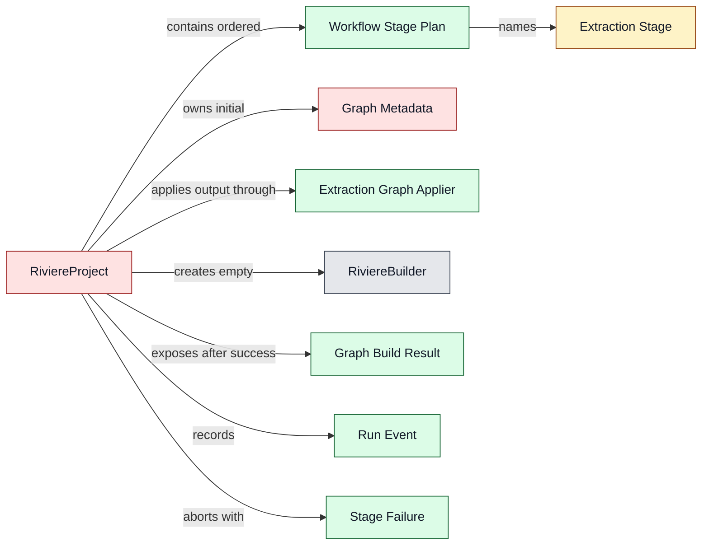
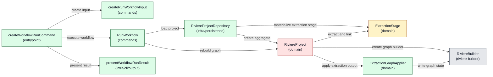
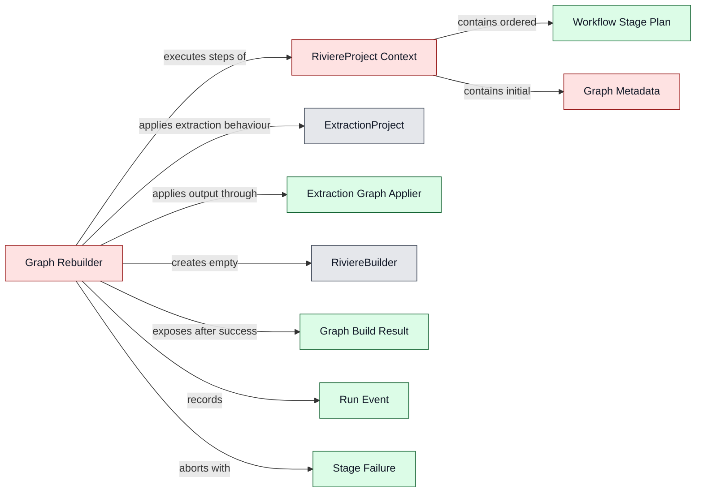
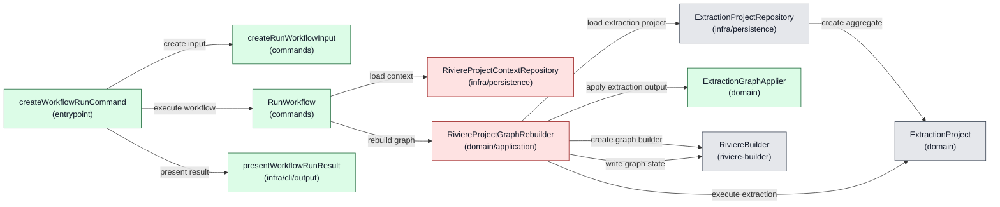

# Architecture: Riviere Extraction Workflows V1

**Status:** Draft

---

## 1. Product feasibility check

**Decision status:** Approved

Feasibility is still plausible, the approved PRD remains valid, and architecture drafting can continue.

The V1 product scope deliberately excludes AI-assisted stages so the first slice can be delivered faster. However, AI is expected future product work. The architecture must therefore avoid a V1 shape that assumes every future workflow stage is deterministic TypeScript extraction. V1 must not implement AI-assisted stages, but it should leave a clear future stage-extension seam so AI can later fit into the workflow model as a Rivière-owned stage with defined outputs and hard failure behaviour.

All-or-nothing graph integrity is a key architectural concern. The architecture must keep workflow graph-building state separate from the existing final graph until all stages succeed, so a failed run leaves the previous final graph unchanged.

## 2. Ownership and boundaries

**Decision status:** Approved

Top-level ownership is approved as a dedicated workflow feature inside `packages/riviere-cli/src/features/workflow`.

The workflow must not simply wrap or chain existing CLI commands. Existing builder commands load and save graph state command-by-command. Using workflows as wrappers around those commands would require graph state to be saved and reloaded between stages and would create cleanup complexity while fighting the PRD's all-or-nothing graph integrity promise.

The workflow feature should instead orchestrate workflow execution in memory and write the final graph only after all stages succeed. Existing lower-level Rivière capabilities such as deterministic extraction, graph building, linking, validation, and graph serialisation remain owned by their existing packages and command/use-case layers.

Important product boundary: workflows must not provide Rivière capabilities that the CLI does not provide. The CLI must not become “a watered down version of the full product.” Workflow execution may compose capabilities differently to protect all-or-nothing execution, but the underlying product capabilities should remain available through CLI surfaces rather than being hidden only inside workflow execution.

Rejected ownership options:

- A workflow wrapper around existing CLI commands was rejected because it would require graph state to be saved and reloaded between stages and would create cleanup complexity.
- A new `packages/riviere-workflow` package was not selected for V1 because it adds package and API surface area before the first workflow slice is proven. It remains a possible future evolution if workflows need to be consumed outside the CLI.
- `packages/riviere-builder` was rejected as the top-level workflow owner because workflow concerns include project-local workflow files, extraction config resolution, run logs, CLI progress, and future stage orchestration beyond pure graph building.
- `packages/riviere-extract-ts` was rejected because workflows include linking, validation, graph writing, and future non-deterministic AI-assisted stages; `riviere-extract-ts` should remain deterministic extraction only.

Future evolution notes:

- Consumers will import or invoke the CLI for V1 workflows because CLIs trigger workflows in this slice.
- Future workflows may be usable from code without YAML, but that is not part of V1.
- AI-assisted stages are future product work. V1 architecture should leave a stage-extension seam without implementing AI-assisted execution now.

## 3. Component design

**Decision status:** Pending

### Design Options: Rivière Workflow Execution

The previous generated options were rejected as architecture theatre: they used undefined operation sets, magic resources, shell-owned semantic wiring, repository-owned workflow engines, use-case-owned stage loops, nested aggregate/resource maps, and names whose behaviour did not match their responsibility.

The design discussion reset around this core insight:

> We are building one graph. At the end, there is one graph coming out of it.

That means the workflow is not managing extraction projects. It is building one graph through an ordered graph-building journey. Extraction is one kind of input-producing step in that journey. The internal model may differ from the external workflow-file UX: users may specify config files inline for simplicity, while the repository/load boundary turns those external inputs into a coherent executable project model.

Hard criteria for the next approved design:

- `RiviereBuilder` remains decoupled from workflow and config. It is an in-memory abstraction over raw graph data that provides graph write operations, rules, and convenience.
- The use case must not create an empty `RiviereBuilder` and pass it into a project rebuild. If the operation is a rebuild, the project/domain concept must enforce an empty start itself.
- The use case must not contain the stage loop.
- The repository must not contain the stage loop or become a workflow engine.
- The shell must not decide workflow semantics, stage ordering, or operation composition.
- Aggregates must not be nested inside other aggregates or hidden in workflow resource maps.
- Extraction is core Rivière domain logic, not merely infrastructure. Technical file/source/config loading is infrastructure; extraction rules, detection, enrichment, and connection detection are domain behaviour.
- The final graph output belongs at the CLI boundary where the CLI decides whether to write to console, write to a file, or follow CLI parameters. Application/domain code should produce the graph artefact and run result, not leak CLI output decisions inward.
- The product requirement is that the graph is actually saved at the end of a successful workflow. The internal stage name does not have to be literally `write graph`, but names must match behaviour.

Current implementation facts the design must not hide:

- `ExtractionProjectRepository` currently performs real stage materialisation work: it reads the extraction config file, expands module `$ref` entries, resolves module `extends`, resolves source files, creates `ts-morph` projects, loads draft components for enrichment, and creates `ExtractionProject`.
- `ExtractionProject.extractDraftComponents({ includeConnections: false })` returns `draftOnly` components. Those are not enough to populate `RiviereBuilder`, because builder component methods need graph-ready fields such as API type, route, method, operation name, event name, subscribed events, custom type name, and source location.
- `ExtractionProject.extractDraftComponents({ includeConnections: true })` returns graph-ready components and links together. That is useful capability, but it collapses the PRD's required `extract → link` distinction unless extraction exposes “enriched components without connection detection” as a separate operation.
- `ExtractionProject.detectConnections(enrichedComponents, allowIncomplete)` is public and can detect links from an extraction project's module contexts against a supplied component set. That is the current seam for a link stage that runs after one or many extraction stages have produced graph-ready components.
- `RiviereBuilder.new(options)` needs `BuilderOptions` with `sources` and `domains` before any components can be added. The architecture must decide whether workflow files include that graph metadata, load it from another Rivière config file, or derive it from an existing source. It must not pretend an empty builder can be created with no graph metadata.
- `RiviereBuilder` has concrete methods such as `upsertApi`, `upsertUseCase`, `upsertDomainOp`, `upsertEvent`, `upsertEventHandler`, `upsertUI`, `upsertCustom`, `link`, `linkExternal`, `validate`, and `build`. There is no existing bulk operation that applies an `ExtractionOutcome` to a builder.
- Therefore every valid option needs an explicit graph-application component that maps `EnrichedComponent[]`, `ExtractedLink[]`, and `ExternalLink[]` onto those real builder methods. Names such as `ConfiguredGraphBuildStep`, `WorkflowDefinition`, `GraphRebuilder`, or `Orchestrator` are only acceptable when the document shows exactly what they contain and which real APIs they call.

Required extraction and graph-application split:

- The design needs a new or changed extraction operation with this behaviour: extract draft components, enrich them into graph-ready `EnrichedComponent[]`, fail if required metadata is missing in strict mode, and return before connection detection. This is not available as a public operation today; it must be extracted from the current private `enrichDraftComponentValues()` path or equivalent code.
- The link stage then uses existing connection-detection behaviour separately: `detectConnections(enrichedComponents, allowIncomplete)` returns internal links, external links, and timings. This is the first concrete way to preserve the PRD's separate `extract → link` stages without duplicating linking rules in the workflow file.
- The graph applier must validate required builder fields before calling builder methods. For example, API needs `apiType`, DomainOp needs `operationName`, Event needs `eventName`, EventHandler needs `subscribedEvents`, UI needs `route`, and custom components need the extracted type name as `customTypeName`.
- The graph applier must carry the repository name from the extraction stage into `SourceLocation.repository`. It must not invent a repository string at application time.
- The graph applier should use builder upsert methods for components so multiple extraction stages can contribute to one in-memory graph without immediately failing on repeated component identity. Duplicate/conflicting behaviour still needs explicit implementation tests.

Concrete extraction seam required by all options:

```typescript
type ExtractComponentsForGraphResult =
  | { ok: true; repository: string; components: EnrichedComponent[]; failedFields: string[] }
  | { ok: false; failure: { reason: string; failedFields?: string[] } };

class ExtractionProject {
  extractComponentsForGraph(options: { allowIncomplete: boolean }): ExtractComponentsForGraphResult {
    const drafts = this.moduleContexts.flatMap((context) =>
      extractComponents(context.project, context.files, context.module),
    );
    const enrichment = this.enrichDraftComponentValues(drafts, options.allowIncomplete);
    if (enrichment.kind === "fieldFailure") {
      return { ok: false, failure: { reason: "Field enrichment failed", failedFields: enrichment.failedFields } };
    }
    return { ok: true, repository: this.repositoryName, components: enrichment.components, failedFields: enrichment.failedFields };
  }
}
```

This shows real work that does not exist as a public API today: `enrichDraftComponentValues()` is currently private extraction-domain logic, and the architecture must decide whether to expose it through `ExtractionProject`, move it into `ExtractionStage`, or split it into a smaller extraction-domain service.

<!-- component-design-option-1:start -->
#### Option 1: `RiviereProject` aggregate replaces `ExtractionProject`

##### Core idea

Introduce `RiviereProject` as the main aggregate for a Rivière project rooted in a repository. In this option, `ExtractionProject` is explicitly retired as an aggregate. Its current config/materialisation state and extraction behaviours are split into extraction stage/domain components owned by the workflow/project execution model.

The workflow file is one input used by `RiviereProjectRepository` to build project state for a selected workflow run. The project is identified by `projectRoot`; the workflow is selected by `workflowName` inside that project. Inline config paths in the user-facing workflow file are resolved during project loading into explicit extraction stages, not opaque configured steps and not nested aggregates.

`RiviereProject.rebuildGraph()` takes no builder argument. It creates `RiviereBuilder.new(graphOptions)` internally, runs its ordered stages, fails fast, records run events, and returns either a completed graph artefact or a failure result. This protects the rebuild invariant: a rebuild always starts from new in-memory graph state.

The current `ExtractionProject` abstraction is challenged directly and resolved in this option: it must not remain an aggregate. Keeping it as an aggregate is Option 2, not an unresolved choice inside this option.

##### Domain model change



Legend: gray = existing, yellow = changed, green = new, red = unclear ownership / open decision.

##### Runtime call diagram



Legend: gray = existing, yellow = changed, green = new, red = unclear ownership / open decision.

##### Components

| Component | Layer / path | Status | .riviere role | Responsibilities | Estimated size |
|---|---|---|---|---|---|
| `createWorkflowRunCommand` | `packages/riviere-cli/src/features/workflow/entrypoint/run-workflow.ts` | New | `cli-entrypoint` | Define the workflow CLI command, call input factory, use case, and formatter. | Small |
| `createRunWorkflowInput` | `packages/riviere-cli/src/features/workflow/commands/create-run-workflow-input.ts` | New | `command-input-factory` | Convert CLI options into typed workflow input without reading files. | Small |
| `RunWorkflow` | `packages/riviere-cli/src/features/workflow/commands/run-workflow.ts` | New | `command-use-case` | Load `RiviereProject` for `{ projectRoot, workflowName }`, call `rebuildGraph()`, return result. No stage loop, no builder construction. | Small |
| `RunWorkflowInput` | `packages/riviere-cli/src/features/workflow/commands/run-workflow-input.ts` | New | `command-use-case-input` | Project root, workflow name, and CLI output options. | Small |
| `RunWorkflowResult` | `packages/riviere-cli/src/features/workflow/commands/run-workflow-result.ts` | New | `command-use-case-result` | Graph build success/failure, graph artefact, run events, and failure detail. | Small |
| `RiviereProjectRepository` | `packages/riviere-cli/src/features/workflow/infra/persistence/riviere-project-repository.ts` | New | `aggregate-repository` | Load `RiviereProject` for a selected workflow run from `projectRoot` and `workflowName`; read workflow file, resolve graph metadata, materialise extraction stages, and create the aggregate. Does not run stages. | Large |
| `RiviereProject` | `packages/riviere-cli/src/features/workflow/domain/riviere-project.ts` | New | `aggregate` | Own ordered graph-building journey, empty-start rebuild invariant, fail-fast execution, run events, and graph build result. | Medium |
| `ExtractionProject` | `packages/riviere-cli/src/features/extract/domain/extraction-project.ts` | Changed | open role decision | Retired as an aggregate in this option. Its current state/behaviour is split into extraction stage and extraction-domain operations. | Large |
| `ExtractionStage` | `packages/riviere-cli/src/features/workflow/domain/extraction-stage.ts` | Changed / extracted from current `ExtractionProject` | open role decision | Hold module contexts, resolved extraction config, repository name, and draft components for one extraction config. | Large |
| `ExtractComponentsForGraph` | `packages/riviere-cli/src/features/workflow/domain/extract-components-for-graph.ts` | New / extracted from current `ExtractionProject` | `domain-service` | Extract draft components and enrich them into graph-ready components without connection detection. | Medium |
| `DetectExtractionConnections` | `packages/riviere-cli/src/features/workflow/domain/detect-extraction-connections.ts` | New / extracted from current `ExtractionProject` | `domain-service` | Detect links from an extraction stage's module contexts against accumulated graph-ready components. | Medium |
| `ExtractionGraphApplier` | `packages/riviere-cli/src/features/workflow/domain/extraction-graph-applier.ts` | New | `domain-service` | Map `EnrichedComponent[]`, `ExtractedLink[]`, and `ExternalLink[]` onto real `RiviereBuilder` methods. | Medium |
| `RiviereBuilder` | `packages/riviere-builder/src/features/building/domain/builder-facade.ts` | Existing | `aggregate` | In-memory graph write abstraction only. Knows graph rules, not workflow/config/project setup. | Existing |
| `presentWorkflowRunResult` | `packages/riviere-cli/src/features/workflow/infra/cli/output/present-workflow-run-result.ts` | New | `cli-output-formatter` | Write graph/log to console or files according to CLI parameters. | Small |

##### Stage materialisation and execution mechanics

- `RiviereProjectRepository` may not create opaque “configured steps”. It must parse the workflow file into an ordered stage plan and expose what each stage actually needs: graph metadata, extraction config path, `useTsConfig`, and link/validate/write stage positions.
- For every extract stage, the repository must perform the same concrete setup currently inside `ExtractionProjectRepository`: expand module `$ref`, resolve module `extends`, resolve source files, create `ts-morph` projects, and keep the resolved config/module contexts available for execution.
- This option avoids nested aggregates by making a concrete choice: current `ExtractionProject` is no longer an aggregate. Its module contexts, resolved config, repository name, and draft components become `ExtractionStage`; draft extraction, enrichment, and connection-detection behaviour move into smaller extraction-domain services or methods over that stage.
- If the team wants `ExtractionProject` to remain an aggregate, this option is rejected and Option 2 is the relevant branch.
- The extract stage cannot call today's `extractDraftComponents({ includeConnections: false })` and then add results to the builder, because `draftOnly` output is not graph-ready. This option requires an explicit extraction operation that returns enriched graph components without running connection detection.
- The link stage should call `detectConnections(allGraphComponents, extractionOptions)` on the relevant extraction stage(s), then apply the returned links to the current in-memory builder. For multiple extraction configs, this is where cross-config linking must be reviewed: each extraction stage can detect links from its own module contexts against the accumulated component set.
- The validate stage must call `builder.validate()` before final graph build. The final graph write remains outside `RiviereProject`; the aggregate returns the built graph and events.

`ExtractionStage` construction is repository materialisation, not execution:

| `ExtractionStage` field | Source | Constructed by | Allowed role pattern |
|---|---|---|---|
| `name` | Extract stage entry in the selected workflow definition | `RiviereProjectRepository` private materialisation helper | `aggregate-repository` constructing aggregate state |
| `configPath` | Workflow extract stage config path resolved relative to `projectRoot` / workflow file directory | `RiviereProjectRepository` | `aggregate-repository` file/config loading |
| `useTsConfig` | Workflow extract stage execution setting or default project policy | `RiviereProjectRepository` | `aggregate-repository` loading input state; policy source remains an open decision |
| `repositoryName` | `getRepositoryInfo()` for the project root | `RiviereProjectRepository` using existing git external-client helper | `aggregate-repository` may call infrastructure while loading aggregate state |
| `resolvedConfig` | Extraction config file after YAML parse, module `$ref` expansion, module `extends` resolution, and schema validation | `RiviereProjectRepository`, reusing current `ExtractionProjectRepository` logic | `aggregate-repository` config loading; extraction semantics stay in domain config types |
| `moduleContexts[].module` | `resolvedConfig.modules` | `RiviereProjectRepository` | aggregate state materialisation |
| `moduleContexts[].files` | Glob resolution from each resolved module's `path` + `glob` under the extraction config directory | `RiviereProjectRepository` | aggregate state materialisation; no execution loop |
| `moduleContexts[].project` | `createConfiguredProject(findModuleTsConfigDir(...), !useTsConfig)` plus `project.addSourceFilesAtPaths(files)` | `RiviereProjectRepository` using existing ts-morph external-client helpers | same existing pattern as `ExtractionProjectRepository` |

`ExtractionStage` itself is data-only:

```typescript
/** @riviere-role value-object */
export class ExtractionStage {
  declare private brand: "ExtractionStage";

  constructor(
    readonly name: string,
    readonly configPath: string,
    readonly useTsConfig: boolean,
    readonly repositoryName: string,
    readonly resolvedConfig: ResolvedExtractionConfig,
    readonly moduleContexts: readonly ModuleContext[],
  ) {}
}
```

It does not read files, run extraction, mutate a builder, know workflow order, or save graph output. Domain services operate on it:

```typescript
ExtractComponentsForGraph.execute(extractionStage, stage.options)
DetectExtractionConnections.execute(extractionStage, allComponents, stage.options)
```

Role note: `ExtractionStage` is shown as a `value-object` because the current role model has no separate role for materialised, data-only execution state. This is implementable under the current role definitions only if it has data members and no public behaviour. The fact that it carries `ts-morph` `Project` objects should be reviewed during role approval; if that is considered too mutable for `value-object`, Option 1 requires either a new approved role or a different extraction-state split.

##### Runtime call outline

```text
createWorkflowRunCommand
  ├─ createRunWorkflowInput(options)
  ├─ RunWorkflow.execute(input)
  │  ├─ RiviereProjectRepository.loadForWorkflowRun(input.projectRoot, input.workflowName)
  │  │  ├─ WorkflowDefinitionFile.read(projectRoot, workflowName)
  │  │  ├─ GraphOptions.fromWorkflowDefinition(definition.graph)
  │  │  ├─ RiviereProjectRepository.buildExtractionStage(projectRoot, extractStageDefinition)
  │  │  └─ RiviereProject.create(projectRoot, workflowName, graphOptions, stagePlan, extractionStages)
  │  └─ RiviereProject.rebuildGraph()
  │     ├─ RiviereBuilder.new(graphOptions)
  │     ├─ ExtractComponentsForGraph.execute(extractionStage, stage.options)
  │     ├─ ExtractionGraphApplier.applyComponents(builder, stageName, repository, components)
  │     ├─ DetectExtractionConnections.execute(extractionStage, allComponents, extractionOptions)
  │     ├─ ExtractionGraphApplier.applyLinks(builder, stageName, links, externalLinks)
  │     ├─ RiviereBuilder.validate()
  │     └─ RiviereBuilder.build()
  └─ presentWorkflowRunResult(result)
```

##### Code stress test

```typescript
type RiviereGraph = object;
type BuilderOptions = object;
type RunEvent = { stepName: string; status: "succeeded" | "failed" };
type StageFailure = { stepName: string; reason: string };
type RunWorkflowInput = { projectRoot: string; workflowName: string };
type SourceLocation = { repository: string; filePath: string; lineNumber?: number };
type EnrichedComponent = { type: string; name: string; domain: string; module: string; location: { file: string; line: number }; metadata: Record<string, unknown> };
type ExtractedLink = { source: string; target: string; type?: "sync" | "async" };
type ExternalLink = { source: string; target: object; type?: "sync" | "async" };

type ExtractionExecutionOptions = { allowIncomplete: boolean };
type StagePlan = Array<
  | { type: "extract"; name: string; options: ExtractionExecutionOptions }
  | { type: "link" | "validate"; name: string }
>;
type ExtractResult = { ok: true; repository: string; components: EnrichedComponent[] } | { ok: false; failure: StageFailure };
type LinkResult = { ok: true; links: ExtractedLink[]; externalLinks: ExternalLink[] } | { ok: false; failure: StageFailure };
type ApplyResult = { ok: true } | { ok: false; failure: StageFailure };

type GraphBuildResult =
  | { ok: true; graph: RiviereGraph; events: RunEvent[] }
  | { ok: false; failure: StageFailure; events: RunEvent[] };

interface RiviereBuilder {
  upsertApi(input: object): void; upsertUseCase(input: object): void; upsertDomainOp(input: object): void;
  upsertEvent(input: object): void; upsertEventHandler(input: object): void; upsertUI(input: object): void; upsertCustom(input: object): void;
  link(input: ExtractedLink): void; linkExternal(input: ExternalLink): void;
  validate(): { valid: boolean }; build(): RiviereGraph;
}
declare const RiviereBuilder: { new(options: BuilderOptions): RiviereBuilder };

interface ModuleContext { module: object; files: readonly string[]; project: object }
interface ExtractionStage { name: string; configPath: string; useTsConfig: boolean; repositoryName: string; resolvedConfig: object; moduleContexts: readonly ModuleContext[] }

interface ExtractComponentsForGraph { execute(stage: ExtractionStage, options: ExtractionExecutionOptions): ExtractResult }
interface DetectExtractionConnections { execute(stage: ExtractionStage, components: EnrichedComponent[], options: ExtractionExecutionOptions): LinkResult }

class ExtractionGraphApplier {
  applyComponents(builder: RiviereBuilder, stepName: string, repository: string, components: EnrichedComponent[]): ApplyResult {
    try {
      for (const component of components) this.applyComponent(builder, repository, component);
      return { ok: true };
    } catch (error) {
      return { ok: false, failure: { stepName, reason: error instanceof Error ? error.message : String(error) } };
    }
  }
  applyLinks(builder: RiviereBuilder, stepName: string, links: ExtractedLink[], externalLinks: ExternalLink[]): ApplyResult {
    try {
      links.forEach((link) => builder.link(link));
      externalLinks.forEach((link) => builder.linkExternal(link));
      return { ok: true };
    } catch (error) {
      return { ok: false, failure: { stepName, reason: error instanceof Error ? error.message : String(error) } };
    }
  }
  private applyComponent(builder: RiviereBuilder, repository: string, component: EnrichedComponent): void {
    const sourceLocation: SourceLocation = { repository, filePath: component.location.file, lineNumber: component.location.line };
    const common = { name: component.name, domain: component.domain, module: component.module, sourceLocation };
    if (component.type === "api") builder.upsertApi({ ...common, apiType: this.requiredString(component, "apiType"), httpMethod: component.metadata.method, path: component.metadata.route });
    else if (component.type === "useCase") builder.upsertUseCase(common);
    else if (component.type === "domainOp") builder.upsertDomainOp({ ...common, operationName: this.requiredString(component, "operationName") });
    else if (component.type === "event") builder.upsertEvent({ ...common, eventName: this.requiredString(component, "eventName") });
    else if (component.type === "eventHandler") builder.upsertEventHandler({ ...common, subscribedEvents: this.requiredStringArray(component, "subscribedEvents") });
    else if (component.type === "ui") builder.upsertUI({ ...common, route: this.requiredString(component, "route") });
    else builder.upsertCustom({ ...common, customTypeName: component.type, metadata: component.metadata });
  }
  private requiredString(component: EnrichedComponent, key: string): string {
    const value = component.metadata[key];
    if (typeof value !== "string" || value.length === 0) throw new Error(`${component.type}:${component.name} missing metadata.${key}`);
    return value;
  }
  private requiredStringArray(component: EnrichedComponent, key: string): string[] {
    const value = component.metadata[key];
    if (!Array.isArray(value) || !value.every((item) => typeof item === "string")) throw new Error(`${component.type}:${component.name} missing metadata.${key}`);
    return value;
  }
}

interface RiviereProjectRepository {
  loadForWorkflowRun(input: { projectRoot: string; workflowName: string }): Promise<RiviereProject>;
}

export class RunWorkflow {
  constructor(private readonly projects: RiviereProjectRepository) {}

  async execute(input: RunWorkflowInput): Promise<GraphBuildResult> {
    const project = await this.projects.loadForWorkflowRun({ projectRoot: input.projectRoot, workflowName: input.workflowName });
    return project.rebuildGraph();
  }
}

export class RiviereProject {
  constructor(
    private readonly graphOptions: BuilderOptions,
    private readonly projectRoot: string,
    private readonly workflowName: string,
    private readonly stagePlan: StagePlan,
    private readonly extractionStages: Map<string, { stage: ExtractionStage; options: ExtractionExecutionOptions }>,
    private readonly extractComponentsForGraph: ExtractComponentsForGraph,
    private readonly detectExtractionConnections: DetectExtractionConnections,
    private readonly graphApplier: ExtractionGraphApplier,
  ) {}

  rebuildGraph(): GraphBuildResult {
    const builder = RiviereBuilder.new(this.graphOptions);
    const events: RunEvent[] = [];
    const allComponents: EnrichedComponent[] = [];

    for (const stage of this.stagePlan) {
      if (stage.type === "extract") {
        const extraction = this.extractionStages.get(stage.name);
        const result = extraction === undefined ? undefined : this.extractComponentsForGraph.execute(extraction.stage, extraction.options);
        if (result === undefined || !result.ok) return { ok: false, failure: result?.failure ?? { stepName: stage.name, reason: "Unknown extraction stage" }, events };
        const applied = this.graphApplier.applyComponents(builder, stage.name, result.repository, result.components);
        if (!applied.ok) return { ok: false, failure: applied.failure, events };
        allComponents.push(...result.components);
      }
      if (stage.type === "link") {
        for (const extraction of this.extractionStages.values()) {
          const result = this.detectExtractionConnections.execute(extraction.stage, allComponents, extraction.options);
          if (!result.ok) return { ok: false, failure: result.failure, events };
          const applied = this.graphApplier.applyLinks(builder, stage.name, result.links, result.externalLinks);
          if (!applied.ok) return { ok: false, failure: applied.failure, events };
        }
      }
      if (stage.type === "validate" && !builder.validate().valid) return { ok: false, failure: { stepName: stage.name, reason: "Graph validation failed" }, events };
      events.push({ stepName: stage.name, status: "succeeded" });
    }

    return { ok: true, graph: builder.build(), events };
  }
}
```

##### New dependencies

| Dependency | Status | Used by | Purpose |
|---|---|---|---|
| `RiviereBuilder` | Existing | `RiviereProject`, `ExtractionGraphApplier` | Provides the empty in-memory graph write abstraction used during rebuild. |
| Existing extraction config/source-file setup from `ExtractionProjectRepository` | Changed | `RiviereProjectRepository`, `ExtractionStage` | Materialises each extraction stage from real config paths, module contexts, resolved config, and ts-morph projects. |
| Existing git repository info helper | Existing | `RiviereProjectRepository` | Supplies `repositoryName` for `ExtractionStage` and graph source locations. |
| Existing ts-morph project helpers | Existing | `RiviereProjectRepository` | Build per-module `Project` instances for extraction stage module contexts. |

##### Code shape

```text
packages/riviere-cli/src/features/workflow/entrypoint/run-workflow.ts
packages/riviere-cli/src/features/workflow/commands/create-run-workflow-input.ts
packages/riviere-cli/src/features/workflow/commands/run-workflow.ts
packages/riviere-cli/src/features/workflow/commands/run-workflow-input.ts
packages/riviere-cli/src/features/workflow/commands/run-workflow-result.ts
packages/riviere-cli/src/features/workflow/infra/persistence/riviere-project-repository.ts
packages/riviere-cli/src/features/workflow/infra/cli/output/present-workflow-run-result.ts
packages/riviere-cli/src/features/workflow/domain/riviere-project.ts
packages/riviere-cli/src/features/workflow/domain/extraction-stage.ts
packages/riviere-cli/src/features/workflow/domain/extract-components-for-graph.ts
packages/riviere-cli/src/features/workflow/domain/detect-extraction-connections.ts
packages/riviere-cli/src/features/workflow/domain/extraction-graph-applier.ts
```

##### Design validation

- Domain terminology: open issue, because `RiviereProject` needs explicit aggregate approval and this option explicitly removes `ExtractionProject` as the aggregate.
- Application/domain separation: pass, because `RunWorkflow` loads the project and invokes `rebuildGraph()` without owning stage order or graph-state decisions.
- Role and location fit: open issue, because `.riviere` role approval must add `RiviereProject` as an aggregate and remove or change `ExtractionProject`'s aggregate status.
- Implementability: open issue, because this option requires extracting or replacing current `ExtractionProject` behaviour and adding a graph application component rather than hiding those mechanics.

##### Trade-offs

Benefits:

- Best alignment with “one project builds one graph”.
- `project.rebuildGraph()` is a strong domain operation and enforces empty-start rebuild internally.
- Avoids nested `ExtractionProject` aggregates because `ExtractionProject` is no longer an aggregate in this option.
- Keeps `RiviereBuilder` clean and decoupled.
- Keeps user-facing workflow config simple while allowing a richer internal executable model.

Costs / risks:

- Highest refactor cost because it challenges the existing `ExtractionProject` aggregate boundary.
- Requires splitting current `ExtractionProject` state and behaviour into non-aggregate extraction stage/domain components.
- Requires explicit aggregate approval for `RiviereProject` and removal or role change for `ExtractionProject`.

##### Open decisions

- Approve `RiviereProject` as the aggregate and remove/change `ExtractionProject`'s aggregate status.
- Confirm the role and location for `ExtractionStage` after splitting current `ExtractionProject` behaviour.
- Decide whether `RiviereProject` lives under `features/workflow`, or whether this reveals a broader project feature boundary that workflows use.
- Where does `BuilderOptions` graph metadata come from: the workflow file, a separate Rivière graph config, or derived project metadata?
- Should the new graph-ready extraction operation live on `ExtractionProject`, `ExtractionStage`, or a smaller extraction-domain service?
- Where should extraction execution options such as `allowIncomplete` live without violating the PRD rule against workflow settings that duplicate extraction semantics?
- Confirm the project-local workflow file location and schema used by `RiviereProjectRepository.loadForWorkflowRun({ projectRoot, workflowName })`.
<!-- component-design-option-1:end -->

<!-- component-design-option-2:start -->
#### Option 2: Keep `ExtractionProject` aggregate and make `RiviereProject` a non-aggregate executable context

##### Core idea

Keep the existing `ExtractionProject` aggregate boundary and introduce `RiviereProject` as an executable project context rather than an aggregate. This is the explicit alternative to Option 1. `RiviereProject` represents the ordered graph-building journey assembled from workflow/config inputs, but it does not own aggregate state and does not contain nested aggregates.

The use case loads the `RiviereProject` context and any required existing aggregate(s) through repositories, then delegates to a named execution component that is not shell, not repository, and not the command use case itself.

This option avoids immediately replacing `ExtractionProject`, but it probably requires a new recognised role/concept for a process coordinator or project execution component. Without that, it risks recreating the earlier bad designs under a different name.

##### Domain model change



Legend: gray = existing, yellow = changed, green = new, red = unclear ownership / open decision.

##### Runtime call diagram



Legend: gray = existing, yellow = changed, green = new, red = unclear ownership / open decision.

##### Components

| Component | Layer / path | Status | .riviere role | Responsibilities | Estimated size |
|---|---|---|---|---|---|
| `createWorkflowRunCommand` | `packages/riviere-cli/src/features/workflow/entrypoint/run-workflow.ts` | New | `cli-entrypoint` | Define the workflow CLI command, call input factory, use case, and formatter. | Small |
| `createRunWorkflowInput` | `packages/riviere-cli/src/features/workflow/commands/create-run-workflow-input.ts` | New | `command-input-factory` | Convert CLI options into typed workflow input without reading files. | Small |
| `RunWorkflow` | `packages/riviere-cli/src/features/workflow/commands/run-workflow.ts` | New | `command-use-case` | Load context, invoke one rebuilder, return result. No extraction loading and no stage loop. | Small |
| `RiviereProjectContextRepository` | `packages/riviere-cli/src/features/workflow/infra/persistence/riviere-project-context-repository.ts` | New | open role decision | Read workflow file and resolve graph metadata plus ordered stage definitions. Does not load extraction projects or execute stages. | Medium |
| `RiviereProjectContext` | `packages/riviere-cli/src/features/workflow/domain/riviere-project-context.ts` | New | open role decision | Hold `BuilderOptions`, ordered stage definitions, extraction config paths, and stage names without owning aggregate state. | Medium |
| `RiviereProjectGraphRebuilder` | `packages/riviere-cli/src/features/workflow/domain/riviere-project-graph-rebuilder.ts` | New | open role decision | Own the explicit graph-state fold: create builder, load extraction project per extract stage, apply components, detect/apply links, validate, build result. | Large |
| `ExtractionGraphApplier` | `packages/riviere-cli/src/features/workflow/domain/extraction-graph-applier.ts` | New | `domain-service` | Map `EnrichedComponent[]`, `ExtractedLink[]`, and `ExternalLink[]` onto real `RiviereBuilder` methods. | Medium |
| `ExtractionProjectRepository` | `packages/riviere-cli/src/features/extract/infra/persistence/extraction-project/extraction-project-repository.ts` | Existing | `aggregate-repository` | Load existing `ExtractionProject` aggregate from extraction config inputs. | Existing |
| `ExtractionProject` | `packages/riviere-cli/src/features/extract/domain/extraction-project.ts` | Changed | `aggregate` | Continue to own configured extraction behaviour and expose graph-ready component extraction separately from connection detection. | Medium |
| `RiviereBuilder` | `packages/riviere-builder/src/features/building/domain/builder-facade.ts` | Existing | `aggregate` | In-memory graph write abstraction only. | Existing |
| `presentWorkflowRunResult` | `packages/riviere-cli/src/features/workflow/infra/cli/output/present-workflow-run-result.ts` | New | `cli-output-formatter` | Write graph/log to console or files according to CLI parameters. | Small |

##### Stage materialisation and execution mechanics

- `RiviereProjectContextRepository` only parses the workflow and resolves non-executing context: graph `BuilderOptions`, ordered stages, and extraction config references. It must not load `ExtractionProject` instances because that would make it an execution component.
- `RiviereProjectGraphRebuilder` is the controversial component in this option. It owns the graph-state fold explicitly rather than hiding it: create `RiviereBuilder.new(context.graphOptions)`, load `ExtractionProject` for extract stages, call extraction, apply graph-ready components, run link detection against the accumulated component set, apply links, validate, and build.
- Keeping `ExtractionProject` as an aggregate only works if it grows or exposes a non-workflow-specific method for graph-ready components without connection detection. Today's `draftOnly` output is not enough for builder writes, and today's `full` output combines extract and link.
- For multiple extraction stages, the rebuilder must keep the `ExtractionProject` instances or equivalent loaded extraction contexts until link stages run, because link detection needs module contexts/source files from the extraction config that produced or owns the relevant source files.
- `ExtractionGraphApplier` must contain the explicit mapping from enriched extraction output to builder method calls; it is not allowed to be a generic `addComponents()` wrapper.

##### Runtime call outline

```text
createWorkflowRunCommand
  ├─ createRunWorkflowInput(options)
  ├─ RunWorkflow.execute(input)
  │  ├─ RiviereProjectContextRepository.load(input.workflowReference)
  │  └─ RiviereProjectGraphRebuilder.rebuildGraph(context)
  │     ├─ RiviereBuilder.new(context.graphOptions)
  │     ├─ ExtractionProjectRepository.loadFromFullProject(stage.extractionConfig)
  │     ├─ ExtractionProject.extractComponentsForGraph(stage.options)
  │     ├─ ExtractionGraphApplier.applyComponents(builder, stageName, repository, components)
  │     ├─ ExtractionProject.detectConnections(allComponents, extractionOptions)
  │     ├─ ExtractionGraphApplier.applyLinks(builder, stageName, links, externalLinks)
  │     ├─ RiviereBuilder.validate()
  │     └─ RiviereBuilder.build()
  └─ presentWorkflowRunResult(result)
```

##### Code stress test

```typescript
type WorkflowReference = string; type RiviereGraph = object; type BuilderOptions = object;
type RunEvent = { stepName: string; status: "succeeded" | "failed" }; type StageFailure = { stepName: string; reason: string };
type EnrichedComponent = { type: string; name: string; domain: string; module: string; metadata: Record<string, unknown> };
type ExtractionExecutionOptions = { allowIncomplete: boolean };
type ExtractStage = { type: "extract"; name: string; extractionConfig: { configPath: string; useTsConfig: boolean }; options: ExtractionExecutionOptions };
type WorkflowStage = ExtractStage | { type: "link" | "validate"; name: string };
type GraphBuildResult = { ok: true; graph: RiviereGraph; events: RunEvent[] } | { ok: false; failure: StageFailure; events: RunEvent[] };
type ExtractResult = { ok: true; repository: string; components: EnrichedComponent[] } | { ok: false; failure: StageFailure };
type LinkResult = { ok: true; links: object[]; externalLinks: object[] } | { ok: false; failure: StageFailure };
type ApplyResult = { ok: true } | { ok: false; failure: StageFailure };

class RiviereProjectContext { constructor(readonly graphOptions: BuilderOptions, readonly stages: WorkflowStage[]) {} }
interface RiviereProjectContextRepository { load(reference: WorkflowReference): Promise<RiviereProjectContext> }
interface ExtractionProject { extractComponentsForGraph(options: ExtractionExecutionOptions): ExtractResult; detectConnections(components: EnrichedComponent[], options: ExtractionExecutionOptions): LinkResult }
interface ExtractionProjectRepository { loadFromFullProject(params: ExtractStage["extractionConfig"]): ExtractionProject }
interface RiviereBuilder { validate(): { valid: boolean }; build(): RiviereGraph }
declare const RiviereBuilder: { new(options: BuilderOptions): RiviereBuilder };
interface ExtractionGraphApplier { applyComponents(builder: RiviereBuilder, stepName: string, repository: string, components: EnrichedComponent[]): ApplyResult; applyLinks(builder: RiviereBuilder, stepName: string, links: object[], externalLinks: object[]): ApplyResult }

export class RunWorkflow {
  constructor(private readonly contexts: RiviereProjectContextRepository, private readonly rebuilder: RiviereProjectGraphRebuilder) {}
  async execute(input: { workflowReference: WorkflowReference }): Promise<GraphBuildResult> {
    return this.rebuilder.rebuildGraph(await this.contexts.load(input.workflowReference));
  }
}

export class RiviereProjectGraphRebuilder {
  constructor(private readonly extractions: ExtractionProjectRepository, private readonly applier: ExtractionGraphApplier) {}
  rebuildGraph(context: RiviereProjectContext): GraphBuildResult {
    const builder = RiviereBuilder.new(context.graphOptions); const events: RunEvent[] = [];
    const loadedExtractions: Array<{ project: ExtractionProject; options: ExtractionExecutionOptions }> = []; const allComponents: EnrichedComponent[] = [];
    for (const stage of context.stages) {
      if (stage.type === "extract") {
        const extraction = this.extractions.loadFromFullProject(stage.extractionConfig); loadedExtractions.push({ project: extraction, options: stage.options });
        const result = extraction.extractComponentsForGraph(stage.options); if (!result.ok) return { ok: false, failure: result.failure, events };
        const applied = this.applier.applyComponents(builder, stage.name, result.repository, result.components); if (!applied.ok) return { ok: false, failure: applied.failure, events };
        allComponents.push(...result.components);
      }
      if (stage.type === "link") for (const extraction of loadedExtractions) {
        const result = extraction.project.detectConnections(allComponents, extraction.options); if (!result.ok) return { ok: false, failure: result.failure, events };
        const applied = this.applier.applyLinks(builder, stage.name, result.links, result.externalLinks); if (!applied.ok) return { ok: false, failure: applied.failure, events };
      }
      if (stage.type === "validate" && !builder.validate().valid) return { ok: false, failure: { stepName: stage.name, reason: "Graph validation failed" }, events };
      events.push({ stepName: stage.name, status: "succeeded" });
    }
    return { ok: true, graph: builder.build(), events };
  }
}
```

##### New dependencies

| Dependency | Status | Used by | Purpose |
|---|---|---|---|
| `ExtractionProjectRepository` | Existing | `RiviereProjectGraphRebuilder` | Loads existing extraction aggregates for extract stages at execution time. |
| `RiviereBuilder` | Existing | `RiviereProjectGraphRebuilder`, `ExtractionGraphApplier` | Provides the empty in-memory graph write abstraction used during rebuild. |
| `ExtractionProject.extractComponentsForGraph` | New / changed | `RiviereProjectGraphRebuilder` | Exposes graph-ready enriched components without also running connection detection. |

##### Code shape

```text
packages/riviere-cli/src/features/workflow/entrypoint/run-workflow.ts
packages/riviere-cli/src/features/workflow/commands/create-run-workflow-input.ts
packages/riviere-cli/src/features/workflow/commands/run-workflow.ts
packages/riviere-cli/src/features/workflow/infra/persistence/riviere-project-context-repository.ts
packages/riviere-cli/src/features/workflow/domain/riviere-project-context.ts
packages/riviere-cli/src/features/workflow/domain/riviere-project-graph-rebuilder.ts
packages/riviere-cli/src/features/workflow/domain/extraction-graph-applier.ts
packages/riviere-cli/src/features/workflow/infra/cli/output/present-workflow-run-result.ts
packages/riviere-cli/src/features/extract/domain/extraction-project.ts
```

##### Design validation

- Domain terminology: open issue, because `RiviereProjectContext` and `RiviereProjectGraphRebuilder` are not clearly recognised domain terms yet.
- Application/domain separation: open issue, because the rebuilder owns substantial process execution even though the use case remains thin.
- Role and location fit: open issue, because the rebuilder probably needs a role that is neither command use case, repository, nor aggregate.
- Implementability: open issue, because existing `ExtractionProject` must expose enriched graph components separately from connection detection and the graph applier must be implemented explicitly.

##### Trade-offs

Benefits:

- Lower refactor cost than replacing `ExtractionProject`.
- Preserves existing extraction aggregate semantics.
- Makes the “workflow is a project with ordered steps” idea explicit without immediately changing all extraction internals.

Costs / risks:

- May not fit the current `.riviere` role model cleanly. A non-aggregate execution component that owns a process loop can be legitimate, but the current roles may force it into an unsuitable box.
- Risks becoming architecture theatre if the executor is just a renamed use-case loop or pseudo-repository.
- Still has to avoid nested aggregate/resource maps when coordinating existing `ExtractionProject` instances.

##### Open decisions

- Does the project need to introduce a new role for process execution/orchestration that is neither command-use-case, repository, nor aggregate?
- Can this option stay clean without pushing workflow-specific behaviour into `ExtractionProject`?
- If `RiviereProjectContext` is not an aggregate, what owns lifecycle invariants and run events?
- Where does `BuilderOptions` graph metadata come from: the workflow file, a separate Rivière graph config, or derived project metadata?
- How should duplicate or conflicting components across multiple extraction stages be handled when the applier uses builder upserts?
- Where should extraction execution options such as `allowIncomplete` live without violating the PRD rule against workflow settings that duplicate extraction semantics?
<!-- component-design-option-2:end -->

<!-- component-design-option-3:start -->
#### Option 3: Keep `ExtractionProject` as-is and introduce an application workflow orchestrator

##### Core idea

Keep `ExtractionProject` unchanged and avoid a new project aggregate for now. Workflow execution is handled by a dedicated application-level orchestrator that loads the workflow definition, invokes existing extraction and builder capabilities in order, fails fast, and returns graph/events.

This is the least disruptive option to existing extraction architecture, but it is also the most likely to become the kind of procedural orchestration the design discussion rejected unless the orchestrator has a very clear role and strict boundaries.

##### Domain model change

No domain model change identified. This option deliberately keeps `ExtractionProject` and `RiviereBuilder` as the existing approved aggregates and puts workflow execution outside a new domain model. The consequence is explicit: workflow execution becomes an application-level state machine rather than a discovered domain concept.

##### Runtime call diagram


Legend: gray = existing, yellow = changed, green = new, red = unclear ownership / open decision.

##### Components

| Component | Layer / path | Status | .riviere role | Responsibilities | Estimated size |
|---|---|---|---|---|---|
| `createWorkflowRunCommand` | `packages/riviere-cli/src/features/workflow/entrypoint/run-workflow.ts` | New | `cli-entrypoint` | Define the workflow CLI command, call input factory, use case, and formatter. | Small |
| `createRunWorkflowInput` | `packages/riviere-cli/src/features/workflow/commands/create-run-workflow-input.ts` | New | `command-input-factory` | Convert CLI options into typed workflow input without reading files. | Small |
| `RunWorkflow` | `packages/riviere-cli/src/features/workflow/commands/run-workflow.ts` | New | `command-use-case` | Load workflow definition, invoke orchestrator, return result. No stage loop if possible. | Small |
| `WorkflowDefinitionRepository` | `packages/riviere-cli/src/features/workflow/infra/persistence/workflow-definition-repository.ts` | New | open role decision | Read workflow file and resolve graph metadata plus ordered stage definitions. Does not execute stages. | Medium |
| `WorkflowDefinition` | `packages/riviere-cli/src/features/workflow/domain/workflow-definition.ts` | New | open role decision | Hold `BuilderOptions`, ordered stage definitions, extraction config paths, and stage names. | Medium |
| `WorkflowGraphBuildOrchestrator` | `packages/riviere-cli/src/features/workflow/application/workflow-graph-build-orchestrator.ts` | New | open role decision | Own the procedural state machine: create builder, load extraction projects, apply components, detect/apply links, validate, and build result. | Large |
| `ExtractionGraphApplier` | `packages/riviere-cli/src/features/workflow/domain/extraction-graph-applier.ts` | New | `domain-service` | Map `EnrichedComponent[]`, `ExtractedLink[]`, and `ExternalLink[]` onto real `RiviereBuilder` methods. | Medium |
| `ExtractionProjectRepository` | `packages/riviere-cli/src/features/extract/infra/persistence/extraction-project/extraction-project-repository.ts` | Existing | `aggregate-repository` | Load existing `ExtractionProject` aggregate from extraction config inputs. | Existing |
| `ExtractionProject` | `packages/riviere-cli/src/features/extract/domain/extraction-project.ts` | Changed | `aggregate` | Remains focused on extraction behaviour and must expose graph-ready component extraction separately from connection detection. | Medium |
| `RiviereBuilder` | `packages/riviere-builder/src/features/building/domain/builder-facade.ts` | Existing | `aggregate` | In-memory graph write abstraction only. | Existing |
| `presentWorkflowRunResult` | `packages/riviere-cli/src/features/workflow/infra/cli/output/present-workflow-run-result.ts` | New | `cli-output-formatter` | Write graph/log to console or files according to CLI parameters. | Small |

##### Stage materialisation and execution mechanics

- `WorkflowDefinitionRepository` loads graph metadata and ordered stage definitions from the workflow file. In this option the loaded definition is not an aggregate or rich domain model; it is execution input for an application state machine.
- `WorkflowGraphBuildOrchestrator` owns the full loop. That is the trade-off, not an implementation detail: it creates `RiviereBuilder.new(workflow.graphOptions)`, loads extraction projects for extract stages, calls extraction, applies graph-ready components, later runs connection detection for link stages, applies links, validates, and returns the built graph.
- This option still cannot use today's `draftOnly` output to write components. It either needs `ExtractionProject.extractComponentsForGraph()` or it must collapse `extract` and `link` into one operation, which would conflict with the PRD stage model.
- Multiple extraction configs require the orchestrator to keep loaded extraction projects until a link stage runs, then call each project's connection detection against all accumulated graph-ready components.
- The graph applier is mandatory here as well; otherwise the orchestrator would hide a second procedural mapping from extraction output to builder calls.

##### Runtime call outline

```text
createWorkflowRunCommand
  ├─ createRunWorkflowInput(options)
  ├─ RunWorkflow.execute(input)
  │  ├─ WorkflowDefinitionRepository.load(input.workflowReference)
  │  └─ WorkflowGraphBuildOrchestrator.run(workflow)
  │     ├─ RiviereBuilder.new(workflow.graphOptions)
  │     ├─ ExtractionProjectRepository.loadFromFullProject(stage.extractionConfig)
  │     ├─ ExtractionProject.extractComponentsForGraph(stage.options)
  │     ├─ ExtractionGraphApplier.applyComponents(builder, stageName, repository, components)
  │     ├─ ExtractionProject.detectConnections(allComponents, extractionOptions)
  │     ├─ ExtractionGraphApplier.applyLinks(builder, stageName, links, externalLinks)
  │     ├─ RiviereBuilder.validate()
  │     └─ RiviereBuilder.build()
  └─ presentWorkflowRunResult(result)
```

##### Code stress test

```typescript
type WorkflowReference = string; type RiviereGraph = object; type BuilderOptions = object;
type RunEvent = { stepName: string; status: "succeeded" | "failed" }; type StageFailure = { stepName: string; reason: string };
type EnrichedComponent = { type: string; name: string; domain: string; module: string; metadata: Record<string, unknown> };
type ExtractionExecutionOptions = { allowIncomplete: boolean };
type ExtractStage = { type: "extract"; name: string; extractionConfig: { configPath: string; useTsConfig: boolean }; options: ExtractionExecutionOptions };
type WorkflowStage = ExtractStage | { type: "link" | "validate"; name: string };
type WorkflowDefinition = { graphOptions: BuilderOptions; stages: WorkflowStage[] };
type GraphBuildResult = { ok: true; graph: RiviereGraph; events: RunEvent[] } | { ok: false; failure: StageFailure; events: RunEvent[] };
type ExtractResult = { ok: true; repository: string; components: EnrichedComponent[] } | { ok: false; failure: StageFailure };
type LinkResult = { ok: true; links: object[]; externalLinks: object[] } | { ok: false; failure: StageFailure };
type ApplyResult = { ok: true } | { ok: false; failure: StageFailure };

interface WorkflowDefinitionRepository { load(reference: WorkflowReference): Promise<WorkflowDefinition> }
interface ExtractionProject { extractComponentsForGraph(options: ExtractionExecutionOptions): ExtractResult; detectConnections(components: EnrichedComponent[], options: ExtractionExecutionOptions): LinkResult }
interface ExtractionProjectRepository { loadFromFullProject(params: ExtractStage["extractionConfig"]): ExtractionProject }
interface RiviereBuilder { validate(): { valid: boolean }; build(): RiviereGraph }
declare const RiviereBuilder: { new(options: BuilderOptions): RiviereBuilder };
interface ExtractionGraphApplier { applyComponents(builder: RiviereBuilder, stepName: string, repository: string, components: EnrichedComponent[]): ApplyResult; applyLinks(builder: RiviereBuilder, stepName: string, links: object[], externalLinks: object[]): ApplyResult }

export class RunWorkflow {
  constructor(private readonly workflows: WorkflowDefinitionRepository, private readonly orchestrator: WorkflowGraphBuildOrchestrator) {}
  async execute(input: { workflowReference: WorkflowReference }): Promise<GraphBuildResult> {
    return this.orchestrator.run(await this.workflows.load(input.workflowReference));
  }
}

export class WorkflowGraphBuildOrchestrator {
  constructor(private readonly extractions: ExtractionProjectRepository, private readonly applier: ExtractionGraphApplier) {}
  run(workflow: WorkflowDefinition): GraphBuildResult {
    const builder = RiviereBuilder.new(workflow.graphOptions); const events: RunEvent[] = [];
    const loadedExtractions: Array<{ project: ExtractionProject; options: ExtractionExecutionOptions }> = []; const allComponents: EnrichedComponent[] = [];
    for (const stage of workflow.stages) {
      if (stage.type === "extract") {
        const extraction = this.extractions.loadFromFullProject(stage.extractionConfig); loadedExtractions.push({ project: extraction, options: stage.options });
        const result = extraction.extractComponentsForGraph(stage.options); if (!result.ok) return { ok: false, failure: result.failure, events };
        const applied = this.applier.applyComponents(builder, stage.name, result.repository, result.components); if (!applied.ok) return { ok: false, failure: applied.failure, events };
        allComponents.push(...result.components);
      }
      if (stage.type === "link") for (const extraction of loadedExtractions) {
        const result = extraction.project.detectConnections(allComponents, extraction.options); if (!result.ok) return { ok: false, failure: result.failure, events };
        const applied = this.applier.applyLinks(builder, stage.name, result.links, result.externalLinks); if (!applied.ok) return { ok: false, failure: applied.failure, events };
      }
      if (stage.type === "validate" && !builder.validate().valid) return { ok: false, failure: { stepName: stage.name, reason: "Graph validation failed" }, events };
      events.push({ stepName: stage.name, status: "succeeded" });
    }
    return { ok: true, graph: builder.build(), events };
  }
}
```

##### New dependencies

| Dependency | Status | Used by | Purpose |
|---|---|---|---|
| `ExtractionProjectRepository` | Existing | `WorkflowGraphBuildOrchestrator` | Loads existing extraction aggregates for each workflow stage. |
| `RiviereBuilder` | Existing | `WorkflowGraphBuildOrchestrator`, `ExtractionGraphApplier` | Provides the empty in-memory graph write abstraction used during orchestration. |
| `ExtractionProject.extractComponentsForGraph` | New / changed | `WorkflowGraphBuildOrchestrator` | Exposes graph-ready enriched components without also running connection detection. |

##### Code shape

```text
packages/riviere-cli/src/features/workflow/entrypoint/run-workflow.ts
packages/riviere-cli/src/features/workflow/commands/create-run-workflow-input.ts
packages/riviere-cli/src/features/workflow/commands/run-workflow.ts
packages/riviere-cli/src/features/workflow/infra/persistence/workflow-definition-repository.ts
packages/riviere-cli/src/features/workflow/domain/workflow-definition.ts
packages/riviere-cli/src/features/workflow/application/workflow-graph-build-orchestrator.ts
packages/riviere-cli/src/features/workflow/domain/extraction-graph-applier.ts
packages/riviere-cli/src/features/workflow/infra/cli/output/present-workflow-run-result.ts
packages/riviere-cli/src/features/extract/domain/extraction-project.ts
```

##### Design validation

- Domain terminology: open issue, because this option avoids naming a richer domain concept for the project/workflow journey.
- Application/domain separation: open issue, because the orchestrator owns stage order, extraction loading, builder mutation, and failure handling.
- Role and location fit: open issue, because no current `.riviere` role clearly describes this orchestrator.
- Implementability: open issue, because even this tactical bridge needs the extraction API split and explicit graph applier; it is not implementable by simply calling today's `extractDraftComponents()` and `addComponents()`.

##### Trade-offs

Benefits:

- Lowest immediate refactor cost.
- Keeps `ExtractionProject` untouched.
- Makes no premature commitment to a broader `RiviereProject` aggregate.

Costs / risks:

- Weakest DDD model. It treats workflow as orchestration around existing components rather than discovering the right domain concept.
- High risk of stage-loop dumping into a component whose only real meaning is “do the workflow”.
- Likely requires either a new role or an explicit exception to avoid misusing `command-use-case`, `domain-service`, or `aggregate-repository`.
- May be a tactical bridge but probably not the clean long-term design.

##### Open decisions

- Is this a deliberate short-term bridge, or would it create architecture debt immediately?
- What role would the orchestrator have under `.riviere` enforcement?
- If the orchestrator owns the stage loop, what prevents it becoming a generic task runner or workflow engine?
- Where does `BuilderOptions` graph metadata come from: the workflow file, a separate Rivière graph config, or derived project metadata?
- Is the required `extractComponentsForGraph()` API split acceptable, or does it reveal that Option 3 is not actually low-refactor?
- Where should extraction execution options such as `allowIncomplete` live without violating the PRD rule against workflow settings that duplicate extraction semantics?
<!-- component-design-option-3:end -->

#### Approval

These are discussion options, not an approved component design yet. The next decision is whether Option 1's broader `RiviereProject` aggregate direction is the best long-term model, or whether the lower-refactor alternatives are worth keeping alive.

## 4. Feasibility confirmations

**Decision status:** Pending

## 5. Product impact notes

No product-impact changes identified.

## 6. Task generation consequences

**Decision status:** Pending
