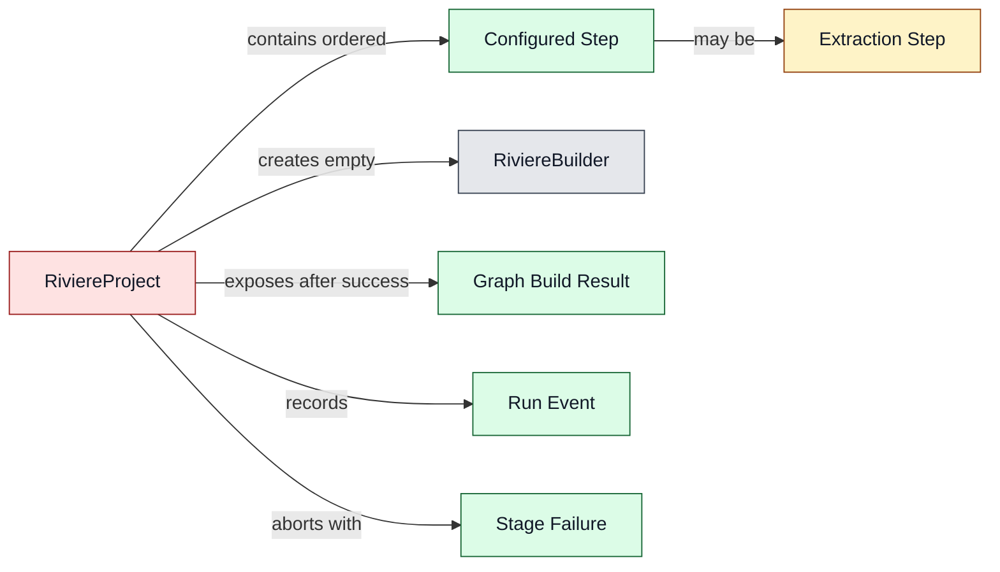
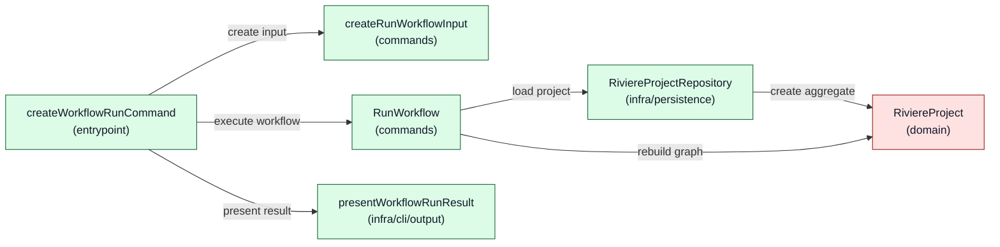
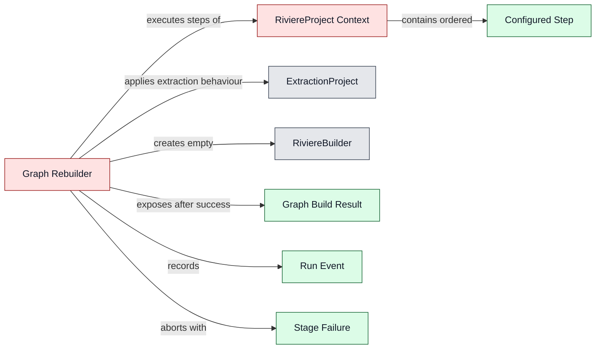
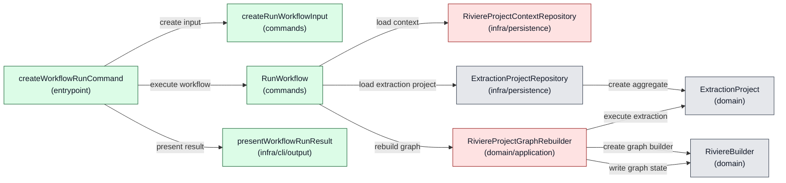
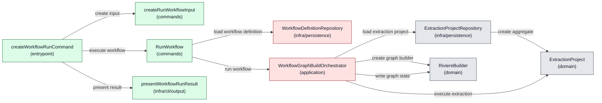

# Architecture: Riviere Extraction Workflows V1

**Status:** Draft

---

## 1. Product feasibility check

**Decision status:** Approved

Feasibility is still plausible, the approved PRD remains valid, and architecture drafting can continue.

The V1 product scope deliberately excludes AI-assisted stages so the first slice can be delivered faster. However, AI is expected future product work. The architecture must therefore avoid a V1 shape that assumes every future workflow stage is deterministic TypeScript extraction. V1 must not implement AI-assisted stages, but it should leave a clear future stage-extension seam so AI can later fit into the workflow model as a Rivière-owned stage with defined outputs and hard failure behaviour.

All-or-nothing graph integrity is a key architectural concern. The architecture must keep workflow graph-building state separate from the existing final graph until all stages succeed, so a failed run leaves the previous final graph unchanged.

## 2. Ownership and boundaries

**Decision status:** Approved

Top-level ownership is approved as a dedicated workflow feature inside `packages/riviere-cli/src/features/workflow`.

The workflow must not simply wrap or chain existing CLI commands. Existing builder commands load and save graph state command-by-command. Using workflows as wrappers around those commands would require graph state to be saved and reloaded between stages and would create cleanup complexity while fighting the PRD's all-or-nothing graph integrity promise.

The workflow feature should instead orchestrate workflow execution in memory and write the final graph only after all stages succeed. Existing lower-level Rivière capabilities such as deterministic extraction, graph building, linking, validation, and graph serialisation remain owned by their existing packages and command/use-case layers.

Important product boundary: workflows must not provide Rivière capabilities that the CLI does not provide. The CLI must not become “a watered down version of the full product.” Workflow execution may compose capabilities differently to protect all-or-nothing execution, but the underlying product capabilities should remain available through CLI surfaces rather than being hidden only inside workflow execution.

Rejected ownership options:

- A workflow wrapper around existing CLI commands was rejected because it would require graph state to be saved and reloaded between stages and would create cleanup complexity.
- A new `packages/riviere-workflow` package was not selected for V1 because it adds package and API surface area before the first workflow slice is proven. It remains a possible future evolution if workflows need to be consumed outside the CLI.
- `packages/riviere-builder` was rejected as the top-level workflow owner because workflow concerns include project-local workflow files, extraction config resolution, run logs, CLI progress, and future stage orchestration beyond pure graph building.
- `packages/riviere-extract-ts` was rejected because workflows include linking, validation, graph writing, and future non-deterministic AI-assisted stages; `riviere-extract-ts` should remain deterministic extraction only.

Future evolution notes:

- Consumers will import or invoke the CLI for V1 workflows because CLIs trigger workflows in this slice.
- Future workflows may be usable from code without YAML, but that is not part of V1.
- AI-assisted stages are future product work. V1 architecture should leave a stage-extension seam without implementing AI-assisted execution now.

## 3. Component design

**Decision status:** Pending

### Design Options: Rivière Workflow Execution

The previous generated options were rejected as architecture theatre: they used undefined operation sets, magic resources, shell-owned semantic wiring, repository-owned workflow engines, use-case-owned stage loops, nested aggregate/resource maps, and names whose behaviour did not match their responsibility.

The design discussion reset around this core insight:

> We are building one graph. At the end, there is one graph coming out of it.

That means the workflow is not managing extraction projects. It is building one graph through an ordered graph-building journey. Extraction is one kind of input-producing step in that journey. The internal model may differ from the external workflow-file UX: users may specify config files inline for simplicity, while the repository/load boundary turns those external inputs into a coherent executable project model.

Hard criteria for the next approved design:

- `RiviereBuilder` remains decoupled from workflow and config. It is an in-memory abstraction over raw graph data that provides graph write operations, rules, and convenience.
- The use case must not create an empty `RiviereBuilder` and pass it into a project rebuild. If the operation is a rebuild, the project/domain concept must enforce an empty start itself.
- The use case must not contain the stage loop.
- The repository must not contain the stage loop or become a workflow engine.
- The shell must not decide workflow semantics, stage ordering, or operation composition.
- Aggregates must not be nested inside other aggregates or hidden in workflow resource maps.
- Extraction is core Rivière domain logic, not merely infrastructure. Technical file/source/config loading is infrastructure; extraction rules, detection, enrichment, and connection detection are domain behaviour.
- The final graph output belongs at the CLI boundary where the CLI decides whether to write to console, write to a file, or follow CLI parameters. Application/domain code should produce the graph artefact and run result, not leak CLI output decisions inward.
- The product requirement is that the graph is actually saved at the end of a successful workflow. The internal stage name does not have to be literally `write graph`, but names must match behaviour.

<!-- component-design-option-1:start -->
#### Option 1: `RiviereProject` aggregate owns graph rebuild

##### Core idea

Introduce `RiviereProject` as the main aggregate for an executable graph-building project. The workflow file is one input used by `RiviereProjectRepository` to build project state. Inline config paths in the user-facing workflow file are resolved during project loading into configured graph-building steps.

`RiviereProject.rebuildGraph()` takes no builder argument. It creates an empty `RiviereBuilder` internally, runs its ordered steps, fails fast, records run events, and returns either a completed graph artefact or a failure result. This protects the rebuild invariant: a rebuild always starts from empty graph state.

The current `ExtractionProject` abstraction is challenged directly. It may be refactored downward into extraction-specific domain components such as configured extraction context/step behaviour, or replaced by smaller concepts under `RiviereProject`. It must not remain a separate aggregate nested inside `RiviereProject`.

##### Domain model change



Legend: gray = existing, yellow = changed, green = new, red = unclear ownership / open decision.

##### Runtime call diagram



Legend: gray = existing, yellow = changed, green = new, red = unclear ownership / open decision.

##### Components

| Component | Layer / path | Status | .riviere role | Responsibilities | Estimated size |
|---|---|---|---|---|---|
| `createWorkflowRunCommand` | `packages/riviere-cli/src/features/workflow/entrypoint/run-workflow.ts` | New | `cli-entrypoint` | Define the workflow CLI command, call input factory, use case, and formatter. | Small |
| `createRunWorkflowInput` | `packages/riviere-cli/src/features/workflow/commands/create-run-workflow-input.ts` | New | `command-input-factory` | Convert CLI options into typed workflow input without reading files. | Small |
| `RunWorkflow` | `packages/riviere-cli/src/features/workflow/commands/run-workflow.ts` | New | `command-use-case` | Load `RiviereProject`, call `rebuildGraph()`, return result. No stage loop, no builder construction. | Small |
| `RunWorkflowInput` | `packages/riviere-cli/src/features/workflow/commands/run-workflow-input.ts` | New | `command-use-case-input` | Workflow reference and CLI output options. | Small |
| `RunWorkflowResult` | `packages/riviere-cli/src/features/workflow/commands/run-workflow-result.ts` | New | `command-use-case-result` | Graph build success/failure, graph artefact, run events, and failure detail. | Small |
| `RiviereProjectRepository` | `packages/riviere-cli/src/features/workflow/infra/persistence/riviere-project-repository.ts` | New | `aggregate-repository` | Load complete `RiviereProject` from workflow file, extraction config files, and project context. Does not execute stages. | Medium |
| `RiviereProject` | `packages/riviere-cli/src/features/workflow/domain/riviere-project.ts` | New | `aggregate` | Own ordered graph-building journey, empty-start rebuild invariant, fail-fast execution, run events, and graph build result. | Medium |
| `ConfiguredGraphBuildStep` | `packages/riviere-cli/src/features/workflow/domain/configured-graph-build-step.ts` | New | open role decision | Executable project step created from external workflow/config inputs. Must not hide aggregates. | Medium |
| `RiviereBuilder` | `packages/riviere-builder/src/features/building/domain/riviere-builder.ts` | Existing | `aggregate` | In-memory graph write abstraction only. Knows graph rules, not workflow/config/project setup. | Existing |
| `presentWorkflowRunResult` | `packages/riviere-cli/src/features/workflow/infra/cli/output/present-workflow-run-result.ts` | New | `cli-output-formatter` | Write graph/log to console or files according to CLI parameters. | Small |

##### Runtime call outline

```text
createWorkflowRunCommand
  ├─ createRunWorkflowInput(options)
  ├─ RunWorkflow.execute(input)
  │  ├─ RiviereProjectRepository.load(input.workflowReference)
  │  │  └─ RiviereProject.fromLoadedDefinition(definition)
  │  └─ RiviereProject.rebuildGraph()
  └─ presentWorkflowRunResult(result)
```

##### Code stress test

```typescript
type WorkflowReference = string;
type RiviereGraph = object;
type RunEvent = { stepName: string; status: "succeeded" | "failed" };
type StageFailure = { stepName: string; reason: string };
type RunWorkflowInput = { workflowReference: WorkflowReference };

type StepResult =
  | { ok: true; event: RunEvent }
  | { ok: false; event: RunEvent; failure: StageFailure };

type GraphBuildResult =
  | { ok: true; graph: RiviereGraph; events: RunEvent[] }
  | { ok: false; failure: StageFailure; events: RunEvent[] };

interface RiviereBuilder {
  toGraph(): RiviereGraph;
}

declare const RiviereBuilder: { empty(): RiviereBuilder };

interface ConfiguredGraphBuildStep {
  applyTo(builder: RiviereBuilder): StepResult;
}

interface RiviereProjectRepository {
  load(reference: WorkflowReference): Promise<RiviereProject>;
}

export class RunWorkflow {
  constructor(private readonly projects: RiviereProjectRepository) {}

  async execute(input: RunWorkflowInput): Promise<GraphBuildResult> {
    const project = await this.projects.load(input.workflowReference);
    return project.rebuildGraph();
  }
}

export class RiviereProject {
  constructor(private readonly steps: ConfiguredGraphBuildStep[]) {}

  rebuildGraph(): GraphBuildResult {
    const builder = RiviereBuilder.empty();
    const events: RunEvent[] = [];

    for (const step of this.steps) {
      const result = step.applyTo(builder);
      events.push(result.event);

      if (!result.ok) return { ok: false, failure: result.failure, events };
    }

    return { ok: true, graph: builder.toGraph(), events };
  }
}
```

##### New dependencies

| Dependency | Status | Used by | Purpose |
|---|---|---|---|
| `RiviereBuilder` | Existing | `RiviereProject` | Provides the empty in-memory graph write abstraction used during rebuild. |

##### Code shape

```text
packages/riviere-cli/src/features/workflow/entrypoint/run-workflow.ts
packages/riviere-cli/src/features/workflow/commands/create-run-workflow-input.ts
packages/riviere-cli/src/features/workflow/commands/run-workflow.ts
packages/riviere-cli/src/features/workflow/commands/run-workflow-input.ts
packages/riviere-cli/src/features/workflow/commands/run-workflow-result.ts
packages/riviere-cli/src/features/workflow/infra/persistence/riviere-project-repository.ts
packages/riviere-cli/src/features/workflow/infra/cli/output/present-workflow-run-result.ts
packages/riviere-cli/src/features/workflow/domain/riviere-project.ts
packages/riviere-cli/src/features/workflow/domain/configured-graph-build-step.ts
```

##### Design validation

- Domain terminology: open issue, because `RiviereProject` needs explicit aggregate approval and its relationship to `ExtractionProject` must be confirmed.
- Application/domain separation: pass, because `RunWorkflow` loads the project and invokes `rebuildGraph()` without owning stage order or graph-state decisions.
- Role and location fit: open issue, because `RiviereProject` as a new aggregate and `ConfiguredGraphBuildStep` as a domain concept need role confirmation.
- Implementability: open issue, because this option has the highest refactor cost and challenges the existing `ExtractionProject` boundary.

##### Trade-offs

Benefits:

- Best alignment with “one project builds one graph”.
- `project.rebuildGraph()` is a strong domain operation and enforces empty-start rebuild internally.
- Avoids nested `ExtractionProject` aggregates and workflow-specific methods on an extraction-only aggregate.
- Keeps `RiviereBuilder` clean and decoupled.
- Keeps user-facing workflow config simple while allowing a richer internal executable model.

Costs / risks:

- Highest refactor cost because it challenges the existing `ExtractionProject` aggregate boundary.
- Requires deciding what the current extraction aggregate becomes: renamed, split, or absorbed into smaller project-owned extraction components.
- Requires explicit aggregate approval for `RiviereProject` and likely supersedes `ExtractionProject` as the central project aggregate.

##### Open decisions

- Is `ExtractionProject` actually an extraction-only aggregate, or was it an early name for the broader Rivière project concept?
- What extraction-specific components remain after `RiviereProject` becomes the executable project aggregate?
- Does `RiviereProject` live under `features/workflow`, or does this reveal a broader project feature boundary that workflows use?
<!-- component-design-option-1:end -->

<!-- component-design-option-2:start -->
#### Option 2: Keep `ExtractionProject` aggregate and make `RiviereProject` a non-aggregate executable context

##### Core idea

Keep the existing `ExtractionProject` aggregate boundary and introduce `RiviereProject` as an executable project context rather than an aggregate. `RiviereProject` represents the ordered graph-building journey assembled from workflow/config inputs, but it does not own aggregate state and does not contain nested aggregates.

The use case loads the `RiviereProject` context and any required existing aggregate(s) through repositories, then delegates to a named execution component that is not shell, not repository, and not the command use case itself.

This option avoids immediately replacing `ExtractionProject`, but it probably requires a new recognised role/concept for a process coordinator or project execution component. Without that, it risks recreating the earlier bad designs under a different name.

##### Domain model change



Legend: gray = existing, yellow = changed, green = new, red = unclear ownership / open decision.

##### Runtime call diagram



Legend: gray = existing, yellow = changed, green = new, red = unclear ownership / open decision.

##### Components

| Component | Layer / path | Status | .riviere role | Responsibilities | Estimated size |
|---|---|---|---|---|---|
| `createWorkflowRunCommand` | `packages/riviere-cli/src/features/workflow/entrypoint/run-workflow.ts` | New | `cli-entrypoint` | Define the workflow CLI command, call input factory, use case, and formatter. | Small |
| `createRunWorkflowInput` | `packages/riviere-cli/src/features/workflow/commands/create-run-workflow-input.ts` | New | `command-input-factory` | Convert CLI options into typed workflow input without reading files. | Small |
| `RunWorkflow` | `packages/riviere-cli/src/features/workflow/commands/run-workflow.ts` | New | `command-use-case` | Load context and extraction aggregate, invoke one rebuilder, return result. No stage loop. | Small |
| `RiviereProjectContextRepository` | `packages/riviere-cli/src/features/workflow/infra/persistence/riviere-project-context-repository.ts` | New | open role decision | Load workflow/config inputs into executable context without pretending the context is an aggregate. | Medium |
| `RiviereProjectContext` | `packages/riviere-cli/src/features/workflow/domain/riviere-project-context.ts` | New | open role decision | Hold ordered project steps and resolved references without owning aggregate state. | Medium |
| `RiviereProjectGraphRebuilder` | `packages/riviere-cli/src/features/workflow/domain/riviere-project-graph-rebuilder.ts` | New | open role decision | Own ordered rebuild process, empty builder creation, fail-fast execution, and result production. | Medium |
| `ExtractionProjectRepository` | `packages/riviere-cli/src/features/extract/infra/persistence/extraction-project/extraction-project-repository.ts` | Existing | `aggregate-repository` | Load existing `ExtractionProject` aggregate from extraction config inputs. | Existing |
| `ExtractionProject` | `packages/riviere-cli/src/features/extract/domain/extraction-project.ts` | Existing | `aggregate` | Continue to own configured extraction behaviour. No workflow-specific methods. | Existing |
| `RiviereBuilder` | `packages/riviere-builder/src/features/building/domain/riviere-builder.ts` | Existing | `aggregate` | In-memory graph write abstraction only. | Existing |
| `presentWorkflowRunResult` | `packages/riviere-cli/src/features/workflow/infra/cli/output/present-workflow-run-result.ts` | New | `cli-output-formatter` | Write graph/log to console or files according to CLI parameters. | Small |

##### Runtime call outline

```text
createWorkflowRunCommand
  ├─ createRunWorkflowInput(options)
  ├─ RunWorkflow.execute(input)
  │  ├─ RiviereProjectContextRepository.load(input.workflowReference)
  │  ├─ ExtractionProjectRepository.loadFromFullProject(context.extractionConfig)
  │  └─ RiviereProjectGraphRebuilder.rebuildGraph(context, extractionProject)
  │     ├─ RiviereBuilder.empty()
  │     ├─ ExtractionProject.extractDraftComponents(step.options)
  │     ├─ RiviereBuilder.addComponents(outcome.components)
  │     └─ RiviereBuilder.toGraph()
  └─ presentWorkflowRunResult(result)
```

##### Code stress test

```typescript
type WorkflowReference = string; type RiviereGraph = object;
type ExtractionOptions = { allowIncomplete: boolean; includeConnections: boolean };
type ExtractionProjectLoadParams = { configPath: string; useTsConfig: boolean };
type RunEvent = { stepName: string; status: "succeeded" | "failed" }; type StageFailure = { stepName: string; reason: string };
type RunWorkflowInput = { workflowReference: WorkflowReference };

type ExtractionOutcome =
  | { kind: "fieldFailure"; failedFields: string[] }
  | { kind: "draftOnly" | "full"; components: object[]; links?: object[] };

type ProjectContextStep = { name: string; options: ExtractionOptions };

type GraphBuildResult =
  | { ok: true; graph: RiviereGraph; events: RunEvent[] }
  | { ok: false; failure: StageFailure; events: RunEvent[] };

interface ExtractionProject {
  extractDraftComponents(options: ExtractionOptions): ExtractionOutcome;
}

interface RiviereBuilder { addComponents(components: object[]): void; toGraph(): RiviereGraph }
declare const RiviereBuilder: { empty(): RiviereBuilder };

class RiviereProjectContext {
  constructor(readonly extractionConfig: ExtractionProjectLoadParams, readonly steps: ProjectContextStep[]) {}
}

interface RiviereProjectContextRepository { load(reference: WorkflowReference): Promise<RiviereProjectContext> }
interface ExtractionProjectRepository { loadFromFullProject(params: ExtractionProjectLoadParams): ExtractionProject }

export class RunWorkflow {
  constructor(private readonly contexts: RiviereProjectContextRepository, private readonly extractions: ExtractionProjectRepository, private readonly rebuilder: RiviereProjectGraphRebuilder) {}
  async execute(input: RunWorkflowInput): Promise<GraphBuildResult> {
    const context = await this.contexts.load(input.workflowReference);
    const extractionProject = this.extractions.loadFromFullProject(context.extractionConfig);
    return this.rebuilder.rebuildGraph(context, extractionProject);
  }
}

export class RiviereProjectGraphRebuilder {
  rebuildGraph(context: RiviereProjectContext, extractionProject: ExtractionProject): GraphBuildResult {
    const builder = RiviereBuilder.empty();
    const events: RunEvent[] = [];
    for (const step of context.steps) {
      const outcome = extractionProject.extractDraftComponents(step.options);
      if (outcome.kind === "fieldFailure") {
        events.push({ stepName: step.name, status: "failed" });
        return { ok: false, failure: { stepName: step.name, reason: outcome.failedFields.join(", ") }, events };
      }
      builder.addComponents(outcome.components);
      events.push({ stepName: step.name, status: "succeeded" });
    }
    return { ok: true, graph: builder.toGraph(), events };
  }
}
```

##### New dependencies

| Dependency | Status | Used by | Purpose |
|---|---|---|---|
| `ExtractionProjectRepository` | Existing | `RunWorkflow` | Loads the existing extraction aggregate without making the workflow repository own extraction setup. |
| `RiviereBuilder` | Existing | `RiviereProjectGraphRebuilder` | Provides the empty in-memory graph write abstraction used during rebuild. |

##### Code shape

```text
packages/riviere-cli/src/features/workflow/entrypoint/run-workflow.ts
packages/riviere-cli/src/features/workflow/commands/create-run-workflow-input.ts
packages/riviere-cli/src/features/workflow/commands/run-workflow.ts
packages/riviere-cli/src/features/workflow/infra/persistence/riviere-project-context-repository.ts
packages/riviere-cli/src/features/workflow/domain/riviere-project-context.ts
packages/riviere-cli/src/features/workflow/domain/riviere-project-graph-rebuilder.ts
packages/riviere-cli/src/features/workflow/infra/cli/output/present-workflow-run-result.ts
```

##### Design validation

- Domain terminology: open issue, because `RiviereProjectContext` and `RiviereProjectGraphRebuilder` are not clearly recognised domain terms yet.
- Application/domain separation: open issue, because `RunWorkflow` loads both context and extraction aggregate before handing control to the rebuilder.
- Role and location fit: open issue, because the rebuilder probably needs a role that is neither command use case, repository, nor aggregate.
- Implementability: pass, if the project accepts the new role/concept for process execution.

##### Trade-offs

Benefits:

- Lower refactor cost than replacing `ExtractionProject`.
- Preserves existing extraction aggregate semantics.
- Makes the “workflow is a project with ordered steps” idea explicit without immediately changing all extraction internals.

Costs / risks:

- May not fit the current `.riviere` role model cleanly. A non-aggregate execution component that owns a process loop can be legitimate, but the current roles may force it into an unsuitable box.
- Risks becoming architecture theatre if the executor is just a renamed use-case loop or pseudo-repository.
- Still has to avoid nested aggregate/resource maps when coordinating existing `ExtractionProject` instances.

##### Open decisions

- Does the project need to introduce a new role for process execution/orchestration that is neither command-use-case, repository, nor aggregate?
- Can this option stay clean without pushing workflow-specific behaviour into `ExtractionProject`?
- If `RiviereProjectContext` is not an aggregate, what owns lifecycle invariants and run events?
<!-- component-design-option-2:end -->

<!-- component-design-option-3:start -->
#### Option 3: Keep `ExtractionProject` as-is and introduce an application workflow orchestrator

##### Core idea

Keep `ExtractionProject` unchanged and avoid a new project aggregate for now. Workflow execution is handled by a dedicated application-level orchestrator that loads the workflow definition, invokes existing extraction and builder capabilities in order, fails fast, and returns graph/events.

This is the least disruptive option to existing extraction architecture, but it is also the most likely to become the kind of procedural orchestration the design discussion rejected unless the orchestrator has a very clear role and strict boundaries.

##### Domain model change

No domain model change identified. This option deliberately keeps `ExtractionProject` and `RiviereBuilder` as the existing approved aggregates and puts workflow execution outside a new domain model.

##### Runtime call diagram



Legend: gray = existing, yellow = changed, green = new, red = unclear ownership / open decision.

##### Components

| Component | Layer / path | Status | .riviere role | Responsibilities | Estimated size |
|---|---|---|---|---|---|
| `createWorkflowRunCommand` | `packages/riviere-cli/src/features/workflow/entrypoint/run-workflow.ts` | New | `cli-entrypoint` | Define the workflow CLI command, call input factory, use case, and formatter. | Small |
| `createRunWorkflowInput` | `packages/riviere-cli/src/features/workflow/commands/create-run-workflow-input.ts` | New | `command-input-factory` | Convert CLI options into typed workflow input without reading files. | Small |
| `RunWorkflow` | `packages/riviere-cli/src/features/workflow/commands/run-workflow.ts` | New | `command-use-case` | Load workflow definition, invoke orchestrator, return result. No stage loop if possible. | Small |
| `WorkflowDefinitionRepository` | `packages/riviere-cli/src/features/workflow/infra/persistence/workflow-definition-repository.ts` | New | open role decision | Load and validate the workflow file without presenting it as an aggregate. | Medium |
| `WorkflowDefinition` | `packages/riviere-cli/src/features/workflow/domain/workflow-definition.ts` | New | open role decision | Represent ordered workflow stages loaded from user-facing workflow config. | Medium |
| `WorkflowGraphBuildOrchestrator` | `packages/riviere-cli/src/features/workflow/application/workflow-graph-build-orchestrator.ts` | New | open role decision | Own stage order, fail-fast execution, extraction calls, builder mutation, and result production. | Medium |
| `ExtractionProjectRepository` | `packages/riviere-cli/src/features/extract/infra/persistence/extraction-project/extraction-project-repository.ts` | Existing | `aggregate-repository` | Load existing `ExtractionProject` aggregate from extraction config inputs. | Existing |
| `ExtractionProject` | `packages/riviere-cli/src/features/extract/domain/extraction-project.ts` | Existing | `aggregate` | Remains focused on extraction behaviour. No workflow-specific methods. | Existing |
| `RiviereBuilder` | `packages/riviere-builder/src/features/building/domain/riviere-builder.ts` | Existing | `aggregate` | In-memory graph write abstraction only. | Existing |
| `presentWorkflowRunResult` | `packages/riviere-cli/src/features/workflow/infra/cli/output/present-workflow-run-result.ts` | New | `cli-output-formatter` | Write graph/log to console or files according to CLI parameters. | Small |

##### Runtime call outline

```text
createWorkflowRunCommand
  ├─ createRunWorkflowInput(options)
  ├─ RunWorkflow.execute(input)
  │  ├─ WorkflowDefinitionRepository.load(input.workflowReference)
  │  └─ WorkflowGraphBuildOrchestrator.run(workflow)
  │     ├─ RiviereBuilder.empty()
  │     ├─ ExtractionProjectRepository.loadFromFullProject(stage.extractionConfig)
  │     ├─ ExtractionProject.extractDraftComponents(stage.options)
  │     ├─ RiviereBuilder.addComponents(outcome.components)
  │     └─ RiviereBuilder.toGraph()
  └─ presentWorkflowRunResult(result)
```

##### Code stress test

```typescript
type WorkflowReference = string;
type RiviereGraph = object;
type ExtractionOptions = { allowIncomplete: boolean; includeConnections: boolean };
type ExtractionProjectLoadParams = { configPath: string; useTsConfig: boolean };
type WorkflowStage = { name: string; extractionConfig: ExtractionProjectLoadParams; options: ExtractionOptions };
type WorkflowDefinition = { stages: WorkflowStage[] };
type RunEvent = { stepName: string; status: "succeeded" | "failed" };
type StageFailure = { stepName: string; reason: string };
type RunWorkflowInput = { workflowReference: WorkflowReference };

type ExtractionOutcome =
  | { kind: "fieldFailure"; failedFields: string[] }
  | { kind: "draftOnly" | "full"; components: object[]; links?: object[] };

type GraphBuildResult =
  | { ok: true; graph: RiviereGraph; events: RunEvent[] }
  | { ok: false; failure: StageFailure; events: RunEvent[] };

interface WorkflowDefinitionRepository { load(reference: WorkflowReference): Promise<WorkflowDefinition> }
interface ExtractionProject { extractDraftComponents(options: ExtractionOptions): ExtractionOutcome }
interface ExtractionProjectRepository { loadFromFullProject(params: ExtractionProjectLoadParams): ExtractionProject }
interface RiviereBuilder { addComponents(components: object[]): void; toGraph(): RiviereGraph }
declare const RiviereBuilder: { empty(): RiviereBuilder };

export class RunWorkflow {
  constructor(private readonly workflows: WorkflowDefinitionRepository, private readonly orchestrator: WorkflowGraphBuildOrchestrator) {}
  async execute(input: RunWorkflowInput): Promise<GraphBuildResult> {
    const workflow = await this.workflows.load(input.workflowReference);
    return this.orchestrator.run(workflow);
  }
}

export class WorkflowGraphBuildOrchestrator {
  constructor(private readonly extractions: ExtractionProjectRepository) {}
  run(workflow: WorkflowDefinition): GraphBuildResult {
    const builder = RiviereBuilder.empty();
    const events: RunEvent[] = [];
    for (const stage of workflow.stages) {
      const project = this.extractions.loadFromFullProject(stage.extractionConfig);
      const outcome = project.extractDraftComponents(stage.options);
      if (outcome.kind === "fieldFailure") {
        events.push({ stepName: stage.name, status: "failed" });
        return { ok: false, failure: { stepName: stage.name, reason: outcome.failedFields.join(", ") }, events };
      }
      builder.addComponents(outcome.components);
      events.push({ stepName: stage.name, status: "succeeded" });
    }
    return { ok: true, graph: builder.toGraph(), events };
  }
}
```

##### New dependencies

| Dependency | Status | Used by | Purpose |
|---|---|---|---|
| `ExtractionProjectRepository` | Existing | `WorkflowGraphBuildOrchestrator` | Loads existing extraction aggregates for each workflow stage. |
| `RiviereBuilder` | Existing | `WorkflowGraphBuildOrchestrator` | Provides the empty in-memory graph write abstraction used during orchestration. |

##### Code shape

```text
packages/riviere-cli/src/features/workflow/entrypoint/run-workflow.ts
packages/riviere-cli/src/features/workflow/commands/create-run-workflow-input.ts
packages/riviere-cli/src/features/workflow/commands/run-workflow.ts
packages/riviere-cli/src/features/workflow/infra/persistence/workflow-definition-repository.ts
packages/riviere-cli/src/features/workflow/domain/workflow-definition.ts
packages/riviere-cli/src/features/workflow/application/workflow-graph-build-orchestrator.ts
packages/riviere-cli/src/features/workflow/infra/cli/output/present-workflow-run-result.ts
```

##### Design validation

- Domain terminology: open issue, because this option avoids naming a richer domain concept for the project/workflow journey.
- Application/domain separation: open issue, because the orchestrator owns stage order, extraction loading, builder mutation, and failure handling.
- Role and location fit: open issue, because no current `.riviere` role clearly describes this orchestrator.
- Implementability: pass as a tactical bridge, but open issue as a long-term design because it risks procedural workflow dumping.

##### Trade-offs

Benefits:

- Lowest immediate refactor cost.
- Keeps `ExtractionProject` untouched.
- Makes no premature commitment to a broader `RiviereProject` aggregate.

Costs / risks:

- Weakest DDD model. It treats workflow as orchestration around existing components rather than discovering the right domain concept.
- High risk of stage-loop dumping into a component whose only real meaning is “do the workflow”.
- Likely requires either a new role or an explicit exception to avoid misusing `command-use-case`, `domain-service`, or `aggregate-repository`.
- May be a tactical bridge but probably not the clean long-term design.

##### Open decisions

- Is this a deliberate short-term bridge, or would it create architecture debt immediately?
- What role would the orchestrator have under `.riviere` enforcement?
- If the orchestrator owns the stage loop, what prevents it becoming a generic task runner or workflow engine?
<!-- component-design-option-3:end -->

#### Approval

These are discussion options, not an approved component design yet. The next decision is whether Option 1's broader `RiviereProject` aggregate direction is the best long-term model, or whether the lower-refactor alternatives are worth keeping alive.

## 4. Feasibility confirmations

**Decision status:** Pending

## 5. Product impact notes

No product-impact changes identified.

## 6. Task generation consequences

**Decision status:** Pending
