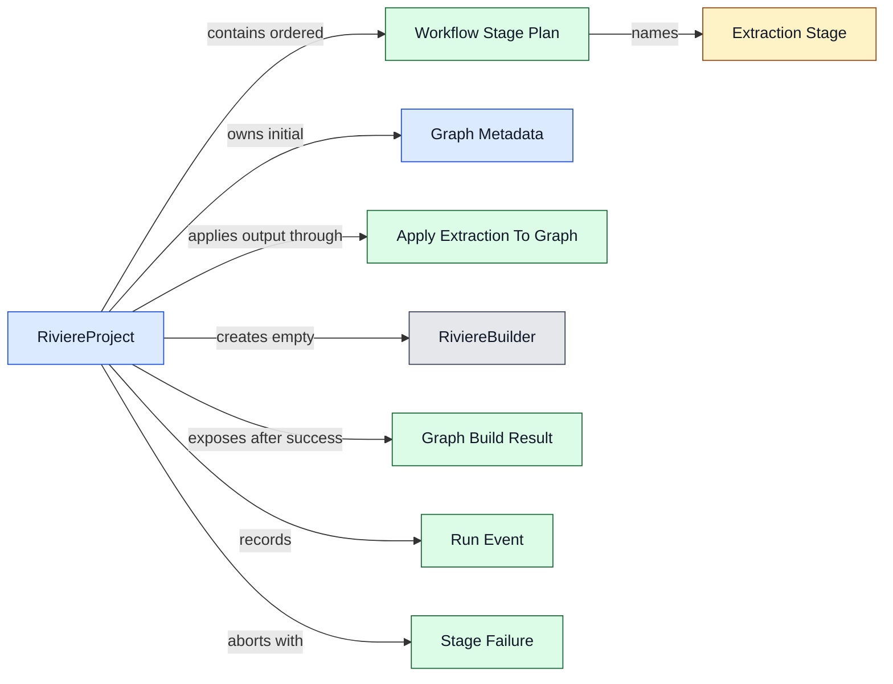
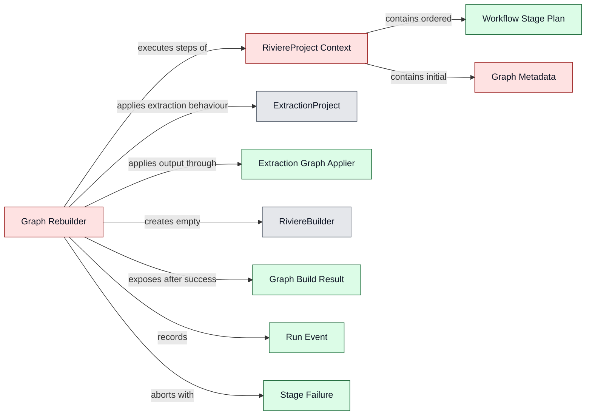
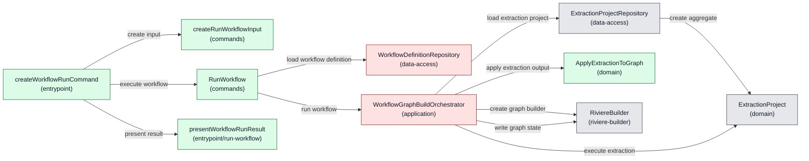

```mermaid
flowchart LR
  entrypoint["createWorkflowRunCommand<br/>(entrypoint)"]
  inputFactory["createRunWorkflowInput<br/>(commands)"]
  useCase["RunWorkflow<br/>(commands)"]
  repository["RiviereProjectRepository<br/>(riviere-extract-ts data-access)"]
  extractionStage["ExtractionStage<br/>(riviere-extract-ts domain)"]
  extractComponents["ExtractComponentsForGraph<br/>(riviere-extract-ts domain)"]
  detectConnections["DetectExtractionConnections<br/>(riviere-extract-ts domain)"]
  project["RiviereProject<br/>(riviere-extract-ts domain)"]
  builder["RiviereBuilder<br/>(riviere-builder)"]
  applyExtractionToGraph["ApplyExtractionToGraph<br/>(workflow domain)"]
  formatter["presentWorkflowRunResult<br/>(entrypoint/run-workflow)"]

  entrypoint -->|create input| inputFactory
  entrypoint -->|execute workflow| useCase
  useCase -->|load project| repository
  repository -->|loads config/source state and creates value object| extractionStage
  repository -->|create aggregate| project
  useCase -->|rebuild graph| project
  project -->|create graph builder| builder
  project -->|extract components| extractComponents
  project -->|detect links| detectConnections
  extractComponents -->|uses| extractionStage
  detectConnections -->|uses| extractionStage
  project -->|apply extraction output| applyExtractionToGraph
  applyExtractionToGraph -->|write graph state| builder
  entrypoint -->|present result| formatter

  classDef statusExisting fill:#e5e7eb,stroke:#374151,color:#111827
  classDef statusChanged fill:#fef3c7,stroke:#92400e,color:#111827
  classDef statusNew fill:#dcfce7,stroke:#166534,color:#111827
  classDef statusRequiresRoleChange fill:#dbeafe,stroke:#1d4ed8,color:#111827
  class entrypoint statusNew
  class inputFactory statusNew
  class useCase statusNew
  class repository statusNew
  class extractionStageMaterializer statusRequiresRoleChange
  class extractionStage statusChanged
  class extractComponents statusNew
  class detectConnections statusNew
  class project statusRequiresRoleChange
  class builder statusExisting
  class applyExtractionToGraph statusNew
  class formatter statusNew
```

# Architecture: Riviere Extraction Workflows V1

**Status:** Approved

**Approval note:** Architecture confirms the approved product direction and provides enough technical shape for delivery planning.

---

## 1. Product feasibility check

**Decision status:** Approved

Feasibility is still plausible, the approved PRD remains valid, and architecture drafting can continue.

The V1 product scope deliberately excludes AI-assisted stages so the first slice can be delivered faster. However, AI is expected future product work. The architecture must therefore avoid a V1 shape that assumes every future workflow stage is deterministic TypeScript extraction. V1 must not implement AI-assisted stages, but it should leave a clear future stage-extension seam so AI can later fit into the workflow model as a Rivière-owned stage with defined outputs and hard failure behaviour.

All-or-nothing graph integrity is a key architectural concern. The architecture must keep workflow graph-building state separate from the existing final graph until all stages succeed, so a failed run leaves the previous final graph unchanged.

## 2. Ownership and boundaries

**Decision status:** Approved

Top-level ownership is approved as a dedicated workflow feature inside `packages/riviere-cli/src/features/workflow`.

The workflow must not simply wrap or chain existing CLI commands. Existing builder commands load and save graph state command-by-command. Using workflows as wrappers around those commands would require graph state to be saved and reloaded between stages and would create cleanup complexity while fighting the PRD's all-or-nothing graph integrity promise.

The workflow feature should instead orchestrate workflow execution in memory and write the final graph only after all stages succeed. Existing lower-level Rivière capabilities such as deterministic extraction, graph building, linking, validation, and graph serialisation remain owned by their existing packages and command/use-case layers.

Concrete aggregate ownership: `RiviereProject` lives at `packages/riviere-extract-ts/src/features/extraction/domain/riviere-project.ts`, and `RiviereProjectRepository` lives at `packages/riviere-extract-ts/src/features/extraction/data-access/riviere-project-repository.ts`.

Important product boundary: workflows must not provide Rivière capabilities that the CLI does not provide. The CLI must not become “a watered down version of the full product.” Workflow execution may compose capabilities differently to protect all-or-nothing execution, but the underlying product capabilities should remain available through CLI surfaces rather than being hidden only inside workflow execution.

Rejected ownership options:

- A workflow wrapper around existing CLI commands was rejected because it would require graph state to be saved and reloaded between stages and would create cleanup complexity.
- A new `packages/riviere-workflow` package was not selected for V1 because it adds package and API surface area before the first workflow slice is proven. It remains a possible future evolution if workflows need to be consumed outside the CLI.
- `packages/riviere-builder` was rejected as the top-level workflow owner because workflow concerns include project-local workflow files, extraction config resolution, run logs, CLI progress, and future stage orchestration beyond pure graph building.
- `packages/riviere-extract-ts` was rejected as the top-level workflow feature owner because workflows include CLI workflow files, graph writing, run logs, and future non-deterministic AI-assisted stages. This does not move `RiviereProject` or `RiviereProjectRepository` out of the extraction package.

Future evolution notes:

- Consumers will import or invoke the CLI for V1 workflows because CLIs trigger workflows in this slice.
- Future workflows may be usable from code without YAML, but that is not part of V1.
- AI-assisted stages are future product work. V1 architecture should leave a stage-extension seam without implementing AI-assisted execution now.

## 3. Component design

**Decision status:** Approved

### Design Options: Rivière Workflow Execution

The previous generated options were rejected as architecture theatre: they used undefined operation sets, magic resources, shell-owned semantic wiring, repository-owned workflow engines, use-case-owned stage loops, nested aggregate/resource maps, and names whose behaviour did not match their responsibility.

The design discussion reset around this core insight:

> We are building one graph. At the end, there is one graph coming out of it.

That means the workflow is not managing extraction projects. It is building one graph through an ordered graph-building journey. Extraction is one kind of input-producing step in that journey. The internal model may differ from the external workflow-file UX: users may specify config files inline for simplicity, while the repository/load boundary turns those external inputs into a coherent executable project model.

Hard criteria for the next approved design:

- `RiviereBuilder` remains decoupled from workflow and config. It is an in-memory abstraction over raw graph data that provides graph write operations, rules, and convenience.
- The use case must not create an empty `RiviereBuilder` and pass it into a project rebuild. If the operation is a rebuild, the project/domain concept must enforce an empty start itself.
- The use case must not contain the stage loop.
- The repository must not contain the stage loop or become a workflow engine.
- The shell must not decide workflow semantics, stage ordering, or operation composition.
- Aggregates must not be nested inside other aggregates or hidden in workflow resource maps.
- Extraction is core Rivière domain logic, not merely infrastructure. Technical file/source/config loading is infrastructure; extraction rules, detection, enrichment, and connection detection are domain behaviour.
- The final graph output belongs at the CLI boundary where the CLI decides whether to write to console, write to a file, or follow CLI parameters. Application/domain code should produce the graph artefact and run result, not leak CLI output decisions inward.
- The product requirement is that the graph is actually saved at the end of a successful workflow. The internal stage name does not have to be literally `write graph`, but names must match behaviour.

Current implementation facts the design must not hide:

- `ExtractionProjectRepository` currently performs real stage materialisation work: it reads the extraction config file, expands module `$ref` entries, resolves module `extends`, resolves source files, creates `ts-morph` projects, loads draft components for enrichment, and creates `ExtractionProject`.
- The current extract commands and shell wiring depend on `ExtractionProjectRepository` and `ExtractionProject`, so retiring `ExtractionProject` is an extract-feature migration, not a workflow-only implementation detail.
- `ExtractionProject.extractDraftComponents({ includeConnections: false })` returns `draftOnly` components. Those are not enough to populate `RiviereBuilder`, because builder component methods need graph-ready fields such as API type, route, method, operation name, event name, subscribed events, custom type name, and source location.
- `ExtractionProject.extractDraftComponents({ includeConnections: true })` returns graph-ready components and links together. That is useful capability, but it collapses the PRD's required `extract → link` distinction unless extraction exposes “enriched components without connection detection” as a separate operation.
- `ExtractionProject.detectConnections(enrichedComponents, allowIncomplete)` is public and can detect links from resolved module contexts and connection configuration against a supplied component set. That is the current seam for a link stage that runs after one or many extraction stages have produced graph-ready components.
- `RiviereBuilder.new(options)` needs `BuilderOptions` with `sources` and `domains` before any components can be added. Option 1 selects the workflow file's required `graph` section as the source of `BuilderOptions`; options that do not include graph metadata in the workflow file must name a different source explicitly.
- `RiviereBuilder` has concrete methods such as `upsertApi`, `upsertUseCase`, `upsertDomainOp`, `upsertEvent`, `upsertEventHandler`, `upsertUI`, `upsertCustom`, `link`, `linkExternal`, `validate`, and `build`. There is no existing bulk operation that applies an `ExtractionOutcome` to a builder.
- Therefore every valid option needs an explicit graph-application component that maps `EnrichedComponent[]`, `ExtractedLink[]`, and `ExternalLink[]` onto those real builder methods. Names such as `ConfiguredGraphBuildStep`, `WorkflowDefinition`, `GraphRebuilder`, or `Orchestrator` are only acceptable when the document shows exactly what they contain and which real APIs they call.

Required extraction and graph-application split:

- The design needs a new or changed extraction operation with this behaviour: extract draft components, enrich them into graph-ready `EnrichedComponent[]`, fail if required metadata is missing in strict mode, and return before connection detection. This is not available as a public operation today; it must be extracted from the current private `enrichDraftComponentValues()` path or equivalent code.
- The link stage then uses existing connection-detection behaviour separately: `detectConnections(enrichedComponents, allowIncomplete)` returns internal links, external links, and timings. The link stage references the Rivière config that owns connection/linking rules, rather than inlining those rules in the workflow file. This is the first concrete way to preserve the PRD's separate `extract → link` stages without duplicating linking rules in the workflow file.
- `ApplyExtractionToGraph` must validate required builder fields before calling builder methods. For example, API needs `apiType`, DomainOp needs `operationName`, Event needs `eventName`, EventHandler needs `subscribedEvents`, UI needs `route`, and custom components need the extracted type name as `customTypeName`.
- `ApplyExtractionToGraph` must carry the repository name from the extraction stage into `SourceLocation.repository`. It must not invent a repository string at application time.
- `ApplyExtractionToGraph` should use builder upsert methods for components so multiple extraction stages can contribute to one in-memory graph without immediately failing on repeated component identity. Duplicate/conflicting behaviour requires implementation tests.

Concrete extraction seam required by all options:

```typescript
type ExtractComponentsForGraphResult =
  | { ok: true; repository: string; components: EnrichedComponent[]; failedFields: string[] }
  | { ok: false; failure: { reason: string; failedFields?: string[] } };

class ExtractComponentsForGraph {
  execute(stage: ExtractionStage, options: { allowIncomplete: false }): ExtractComponentsForGraphResult {
    const drafts = stage.moduleContexts.flatMap((context) =>
      extractComponents(context.project, context.files, context.module),
    );
    const enrichment = enrichDraftComponentValues(stage.resolvedConfig, drafts, options.allowIncomplete);
    if (enrichment.kind === "fieldFailure") {
      return { ok: false, failure: { reason: "Field enrichment failed", failedFields: enrichment.failedFields } };
    }
    return { ok: true, repository: stage.repositoryName, components: enrichment.components, failedFields: enrichment.failedFields };
  }
}
```

This shows real work that does not exist as a public API today: `enrichDraftComponentValues()` is currently private extraction-domain logic in `riviere-cli`. Option 1 moves that behaviour into the extraction domain package (`packages/riviere-extract-ts`) as an exported domain service over `ExtractionStage`; Options 2 and 3 keep the existing `ExtractionProject` aggregate and expose equivalent graph-ready extraction through that boundary.

<!-- component-design-option-1:start -->
#### Option 1: `RiviereProject` aggregate replaces `ExtractionProject`

**Approval status:** Approved.

Option 1 is the accepted architecture direction. The approved reason is that the refactor cost is worth taking now for the long-term health of the codebase.

##### Core idea

Introduce `RiviereProject` as the main aggregate for a Rivière project rooted in a repository. It lives at `packages/riviere-extract-ts/src/features/extraction/domain/riviere-project.ts`. `RiviereProjectRepository` lives at `packages/riviere-extract-ts/src/features/extraction/data-access/riviere-project-repository.ts`. In this option, `ExtractionProject` is explicitly retired as an aggregate. Its current config/materialisation state and extraction behaviours move out of `riviere-cli` into the extraction domain package (`packages/riviere-extract-ts`). Workflow consumes that package-level extraction capability; it does not import `riviere-cli`'s `features/extract` and it does not own extraction.

The workflow file is one input used by `RiviereProjectRepository` to build project state for a selected workflow run. The project is identified by `projectRoot`; the workflow is selected by `workflowName` inside that project. Inline extract and link config paths in the user-facing workflow file are resolved during project loading into explicit executable stage state, not opaque configured steps and not nested aggregates.

`RiviereProject.rebuildGraph()` takes no builder argument. It creates `RiviereBuilder.new(graphOptions)` internally, runs its ordered stages, fails fast, records run events, and returns either a completed graph artefact or a failure result. This protects the rebuild invariant: a rebuild always starts from new in-memory graph state.

The current `ExtractionProject` abstraction is challenged directly and resolved in this option: it must not remain an aggregate. Keeping it as an aggregate is Option 2, not an unresolved choice inside this option.

This is also the target architecture for the existing extract feature. Current extract commands are rewired directly from `ExtractionProjectRepository`/`ExtractionProject` to `RiviereProjectRepository`/`RiviereProject` plus package-owned extraction domain services in `@living-architecture/riviere-extract-ts`. The CLI package remains responsible for CLI input, output, command use cases, workflow loading, and shell wiring; it does not own core extraction domain logic. If the team wants to keep the current extract command wiring while adding workflows, that is not Option 1; it is a different option with explicit architecture debt.

Non-CLI use note: this option makes the extraction project aggregate reusable outside the CLI because `RiviereProject` and `RiviereProjectRepository` live in `packages/riviere-extract-ts`. It does not, by itself, make the V1 workflow CLI surface reusable outside the CLI; command input, output, run-log writing, graph-file writing, and shell wiring remain under `packages/riviere-cli/src/features/workflow`.

Workflow definitions use this V1 location and shape:

```yaml
version: 1
graph:
  sources:
    - name: ecommerce-demo-app
      repository: ecommerce-demo-app
  domains:
    - name: orders
    - name: shipping
  outputPath: .riviere/graph.json
runLog:
  directory: .riviere/logs/workflows
stages:
  - extract:
      name: extract-main
      config: .riviere/config/extraction.config.json
  - link:
      config: .riviere/config/extraction.config.json
  - validate: {}
```

`workflowName` resolves to `.riviere/workflows/{workflowName}.yaml`, where `workflowName` must match `[a-z0-9][a-z0-9-]*`. The filename is the workflow identity; a conflicting `name` field is not supported in V1. `graph.sources` and `graph.domains` are required and become `BuilderOptions`. `graph.outputPath` is required and is resolved relative to `projectRoot`. `runLog.directory` is required and is resolved relative to `projectRoot`; each run writes to `{runLog.directory}/{workflowName}/{runId}.ndjson`.

Workflow schema validation happens before any stage runs. Missing file, invalid YAML, unsupported `version`, missing `graph.sources`, missing `graph.domains`, missing `graph.outputPath`, missing `runLog.directory`, unknown stage type, duplicate stage name, missing extract `config`, missing link `config`, invalid stage order, multiple `link` stages, missing `link`, or missing `validate` all produce a workflow validation failure, leave the graph unchanged, and return failure details for the CLI boundary to log using the default log directory `.riviere/logs/workflows` when the configured log directory cannot be read from a valid workflow file.

Workflow files do not support `allowIncomplete` or any other extraction-result-semantics setting in V1. Workflow extraction runs in strict mode by passing `{ allowIncomplete: false }` to `riviere-extract-ts`. If incomplete extraction is needed later, it must be added to the extraction package/configuration as extraction-owned behaviour before workflow can compose it; workflow must not invent a separate semantic switch.

##### Domain model change



Legend: gray = existing, yellow = changed, green = new, blue = explicit role/config change required.

##### Runtime call diagram



Legend: gray = existing, yellow = changed, green = new, blue = explicit role/config change required.

##### Components

| Component                     | Layer / path                                                                                             | Status                                                                 | .riviere role                     | Responsibilities                                                                                                                                                                                                                                                                                                                                             | Estimated size |
| ----------------------------- | -------------------------------------------------------------------------------------------------------- | ---------------------------------------------------------------------- | --------------------------------- | ------------------------------------------------------------------------------------------------------------------------------------------------------------------------------------------------------------------------------------------------------------------------------------------------------------------------------------------------------------ | -------------- |
| `createWorkflowRunCommand`    | `packages/riviere-cli/src/features/workflow/entrypoint/run-workflow/entrypoint.ts`                       | New                                                                    | `cli-entrypoint`                  | Define the workflow CLI command, call input factory, use case, and formatter.                                                                                                                                                                                                                                                                                | Small          |
| `createRunWorkflowInput`      | `packages/riviere-cli/src/features/workflow/commands/create-run-workflow-input.ts`                       | New                                                                    | `command-input-factory`           | Convert a CLI-neutral parsed-options shape into typed workflow input without reading files. Must not depend on Commander/raw CLI option types directly.                                                                                                                                                                                                      | Small          |
| `RunWorkflow`                 | `packages/riviere-cli/src/features/workflow/commands/run-workflow.ts`                                    | New                                                                    | `command-use-case`                | Load `RiviereProject` for `{ projectRoot, workflowName }`, call `rebuildGraph()`, return result. No stage loop, no builder construction, no graph/log file writing.                                                                                                                                                                                            | Small          |
| `RunWorkflowInput`            | `packages/riviere-cli/src/features/workflow/commands/run-workflow-input.ts`                              | New                                                                    | `command-use-case-input`          | Project root, workflow name, and CLI output options.                                                                                                                                                                                                                                                                                                         | Small          |
| `RunWorkflowResult`           | `packages/riviere-cli/src/features/workflow/commands/run-workflow-result.ts`                             | New                                                                    | `command-use-case-result`         | Graph build success/failure, graph artefact, NDJSON run log events, run log path, and failure detail.                                                                                                                                                                                                                                                        | Small          |
| `RiviereProjectRepository`    | `packages/riviere-extract-ts/src/features/extraction/data-access/riviere-project-repository.ts`    | New                                                                    | `aggregate-repository`            | Load the full `RiviereProject` aggregate state for `{ projectRoot, workflowName }` or `{ projectRoot, configPath, useTsConfig }`; read workflow/config files, resolve graph metadata where present, load extract and link config/source state, materialise `ExtractionStage` value objects for extraction and link detection, and create the aggregate. Does not run stages.                         | Large          |
| `RiviereProject`              | `packages/riviere-extract-ts/src/features/extraction/domain/riviere-project.ts`                          | New                                                                    | `aggregate`                       | Own ordered graph-building journey, empty-start rebuild invariant, fail-fast execution, run events, graph build result, and extract-command operations that replace `ExtractionProject`. Implementation requires adding `RiviereProject` to approved aggregate instances.                                                                                  | Medium         |
| `ExtractionProject`           | `packages/riviere-cli/src/features/extract/domain/extraction-project.ts`                                 | Removed / replaced in Option 1                                         | none in target                    | No longer the extract aggregate or command-facing extraction object. Current extract command dependencies migrate to `@living-architecture/riviere-extract-ts` stage materialisation and extraction services.                                                                                                                                                | Large          |
| `ExtractionStage`             | `packages/riviere-extract-ts/src/features/extraction/domain/extraction-stage.ts`                         | Changed / extracted from current `ExtractionProject`                   | `value-object`                    | Hold module contexts, resolved extraction config, repository name, and source/project context for one extraction config. Shared by CLI extract commands, CLI workflows, and future non-CLI consumers through the package API.                                                                                                                                | Large          |
| `ExtractComponentsForGraph`   | `packages/riviere-extract-ts/src/features/extraction/domain/extract-components-for-graph.ts`             | New / extracted from current `ExtractionProject`                       | `domain-service`                  | Extract draft components and enrich them into graph-ready components without connection detection. Exported from `@living-architecture/riviere-extract-ts`.                                                                                                                                                                                                  | Medium         |
| `DetectExtractionConnections` | `packages/riviere-extract-ts/src/features/extraction/domain/detect-extraction-connections.ts`            | New / extracted from current `ExtractionProject`                       | `domain-service`                  | Detect links from the resolved link-stage config/module contexts against accumulated graph-ready components. Exported from `@living-architecture/riviere-extract-ts`.                                                                                                                                                                                                 | Medium         |
| `ApplyExtractionToGraph`      | `packages/riviere-cli/src/features/workflow/domain/apply-extraction-to-graph.ts`                         | New                                                                    | `domain-service`                  | Apply `riviere-extract-ts` output to concrete `RiviereBuilder` write methods as part of the workflow graph rebuild domain operation. This is not a generic mapper and not builder-owned: extraction owns extraction output, builder owns graph mutation rules, workflow owns applying extracted architecture into the rebuild journey.                       | Medium         |
| `RiviereBuilder`              | `packages/riviere-builder/src/features/building/domain/builder-facade.ts`                                | Existing                                                               | `aggregate`                       | In-memory graph write abstraction only. Knows graph rules, not workflow/config/project setup.                                                                                                                                                                                                                                                                | Existing       |
| `presentWorkflowRunResult`    | `packages/riviere-cli/src/features/workflow/entrypoint/run-workflow/present-workflow-run-result.ts`       | New                                                                    | `cli-output-formatter` / entrypoint-local output writer role from latest main | CLI boundary output handler. Writes the NDJSON run log and, on successful rebuild, writes the graph to the chosen output path using the command result plus CLI options. The accepted location follows the latest `entrypoint/{entrypoint}` structure from `main`, not the older feature-local `infra/cli/output` pattern. | Medium         |

##### Stage materialisation and execution mechanics

- `RiviereProjectRepository` may not create opaque “configured steps”. It must parse the workflow file into an ordered stage plan and expose what each stage actually needs: graph metadata, extraction config path, link config path, `useTsConfig`, and link/validate positions.
- V1 domain stage grammar for this option is monotonic and exact: one or more `extract` stages, then exactly one `link` stage, then exactly one `validate` stage. A `link` before all extracts, multiple `link` stages, an `extract` after `link`, `validate` before `link`, or missing `validate` is invalid workflow configuration.
- The PRD's “write graph” step is implemented at the CLI boundary, not as a domain stage and not as a command-use-case writer. `RiviereProject.rebuildGraph()` returns a result containing the built graph, default output path, default run-log path, events, and failure details. `presentWorkflowRunResult(result, cliOptions)` decides how/where to write the graph and log from that result plus CLI inputs.
- `RiviereProject.create(...)` or an equivalent domain factory must validate the stage-plan grammar before any run starts. The repository may parse workflow config and call that factory, but it must not become the owner of stage semantics.
- `createRunWorkflowInput` may live under `commands` only if its input is a small parsed-options type owned by the workflow feature. It must not import Commander types or depend on raw CLI option objects; the entrypoint owns CLI-to-parsed-options translation.
- `presentWorkflowRunResult` follows the latest `main` branch entrypoint-specific structure: feature-local CLI presentation for this command lives under `packages/riviere-cli/src/features/workflow/entrypoint/run-workflow/`, not under the older `infra/cli/output` pattern. Option 1 treats the entrypoint folder as the CLI boundary for summaries, graph writes, and run-log writes.
- `RiviereProjectRepository` is the repository in this option because it loads the `RiviereProject` aggregate. For every extract stage, it performs the loading/materialisation work: expand module `$ref`, resolve module `extends`, resolve source files, create `ts-morph` projects, and materialise an `ExtractionStage` value object as part of the aggregate state. There is no separate `ExtractionStageRepository`, because `ExtractionStage` is not an aggregate; there is also no `ExtractionConfigResolution` service, because resolving config/source/project context is persistence setup rather than pure domain computation.
- Repository loading follows the approved architecture memory `project-memory/architecture/memories/repository-loading-must-load-full-aggregate.md`: `RiviereProjectRepository` loads the full aggregate state. It must not accept `sourceMode`, selected files, changed-file mode, draft components, `includeConnections`, or `allowIncomplete`.
- This option avoids nested aggregates by making a concrete choice: current `ExtractionProject` is no longer an aggregate. Its module contexts, resolved config, repository name, and draft components become package-owned `ExtractionStage`; draft extraction, enrichment, and connection-detection behaviour move into package-owned extraction domain services over that stage.
- Existing extract commands migrate to the same package-owned `ExtractionStage` and extraction services. Option 1 does not keep `ExtractionProjectRepository`/`ExtractionProject` in the command path.
- If the team wants `ExtractionProject` to remain an aggregate, this option is rejected and Option 2 is the relevant branch.
- The extract stage cannot call today's `extractDraftComponents({ includeConnections: false })` and then add results to the builder, because `draftOnly` output is not graph-ready. This option requires an explicit extraction operation that returns enriched graph components without running connection detection.
- The link stage should call connection detection against the accumulated graph-ready components using the resolved link config for the link stage. For the combined-config workflow this may be the same config as the extract stage; for modular workflows it can be the combined config that owns cross-module connection rules. It must not inline linking rules in the workflow file, and it must not run before the configured extraction stages have executed.
- The validate stage must call `builder.validate()` before final graph build. The final graph write remains outside `RiviereProject`; the aggregate returns the built graph and events.
- Architecture approval disposition: keep `ApplyExtractionToGraph` as named and placed. It is approved as workflow domain logic because it mutates the in-memory `RiviereBuilder` graph aggregate as part of the rebuild journey, applies required graph-field checks, preserves source repository information, and is not shaping CLI/user output for a specific presentation use case.

Extraction command replacement flow:

```text
Current extract command path:
  ExtractDraftComponents
    -> ExtractionProjectRepository.loadFromChangedProject/loadFromSelectedFiles/loadFromFullProject(...)
    -> ExtractionProject.extractDraftComponents({ allowIncomplete, includeConnections })

  EnrichDraftComponents
    -> ExtractionProjectRepository.loadFromDraftEnrichment({ configPath, draftComponentsPath, useTsConfig })
    -> ExtractionProject.enrichDraftComponents({ allowIncomplete, includeConnections })

Target extract command path:
  ExtractDraftComponents
    -> RiviereProjectRepository.load({ projectRoot, configPath, useTsConfig })
    -> RiviereProject.extractDraftComponents({ sourceFileSelection, allowIncomplete, includeConnections })

  EnrichDraftComponents
    -> RiviereProjectRepository.load({ projectRoot, configPath, useTsConfig })
    -> RiviereProject.enrichDraftComponents({ draftComponents, allowIncomplete, includeConnections })
```

The target loading call loads the full project aggregate state for the resolved extraction config: expanded module `$ref` entries, resolved module `extends`, repository name, all files matched by config modules, `ts-morph` projects, and `ExtractionStage` value objects. Selected files and changed files are not repository inputs; they become `sourceFileSelection` on `RiviereProject.extractDraftComponents(...)`. `sourceMode` stays in CLI/input validation and is translated before the aggregate operation is called. `draftComponentsPath` is not a repository input; the CLI boundary/infra loads draft components and passes `draftComponents` into `RiviereProject.enrichDraftComponents(...)`. `allowIncomplete` and `includeConnections` are operation inputs only.

Run log semantics:

- `runId` is generated once at command start as a sortable UTC timestamp plus random suffix, for example `20260505T182233Z-a1b2c3d4`.
- The run log destination is `{runLog.directory}/{workflowName}/{runId}.ndjson`, resolved under `projectRoot`.
- The CLI boundary writes a run log for successful runs, stage failures, workflow validation failures, referenced config failures, extraction failures, validation failures, and graph write failures.
- Run logs are written even when graph output is not written. A failed run never updates `graph.outputPath`.
- Each NDJSON line is one JSON object with at least `{ "type", "timestamp", "runId", "workflowName", "level" }`.
- Required event types are `WorkflowStarted`, `WorkflowValidationFailed`, `StageStarted`, `StageCompleted`, `StageFailed`, `GraphWriteStarted`, `GraphWriteCompleted`, `WorkflowCompleted`, and `WorkflowFailed`.
- Stage events include `stageName`, `stageType`, and `stageIndex`. Failure events include `reason`, `errorCode`, and any relevant `configPath` or `outputPath`.
- `presentWorkflowRunResult` performs the CLI-side write sequence. On failure it writes the failure log and does not write graph output. On success it writes/prints according to CLI options using the returned graph and events; graph output path defaults to the workflow file's `graph.outputPath` unless overridden by CLI input. If graph writing fails, it writes a `GraphWriteFailed` / `WorkflowFailed` log event and leaves the previous graph unchanged by using a temp-file plus rename.
- If the log cannot be created before stages run, the command fails before extraction and leaves the graph unchanged.

`ExtractionStage` construction is repository materialisation, not execution:

| `ExtractionStage` field | Source | Constructed by | Allowed role pattern |
|---|---|---|---|
| `name` | Extract stage entry in the selected workflow definition, extract command context, or non-CLI caller context | `RiviereProjectRepository` when loading workflow aggregate; extract command use case when running extract command | aggregate state materialisation or command input handling |
| `configPath` | Workflow extract stage config path, extract command config path, or non-CLI caller config reference resolved relative to the supplied project root / base directory | `RiviereProjectRepository` while loading the aggregate | aggregate state materialisation |
| `useTsConfig` | Workflow extract stage execution setting, extract command option, or non-CLI caller option | caller | caller-owned execution option |
| `repositoryName` | Supplied by caller or resolved from project root | `RiviereProjectRepository` | aggregate state materialisation |
| `resolvedConfig` | Extraction config after module `$ref` expansion, module `extends` resolution, and schema validation | `RiviereProjectRepository` | persistence/config setup while loading aggregate state |
| `moduleContexts[].module` | `resolvedConfig.modules` | `RiviereProjectRepository` | aggregate state materialisation |
| `moduleContexts[].files` | Glob resolution from each resolved module's `path` + `glob` under the extraction config directory/base directory | `RiviereProjectRepository` | aggregate state materialisation; no workflow execution loop |
| `moduleContexts[].project` | `ts-morph` project configured from package options plus resolved source files | `RiviereProjectRepository` using package-level ts-morph helpers | must not depend on CLI-only helpers |

`ExtractionStage` itself is data-only:

```typescript
/** @riviere-role value-object */
export class ExtractionStage {
  declare private brand: "ExtractionStage";

  constructor(
    readonly name: string,
    readonly configPath: string,
    readonly useTsConfig: boolean,
    readonly repositoryName: string,
    readonly resolvedConfig: ResolvedExtractionConfig,
    readonly moduleContexts: readonly ModuleContext[],
  ) {}
}
```

It does not read files, run extraction, mutate a builder, know workflow order, or save graph output. Domain services operate on it:

```typescript
ExtractComponentsForGraph.execute(extractionStage, { allowIncomplete: false })
DetectExtractionConnections.execute(extractionStage, allComponents, { allowIncomplete: false })
```

Role decision: `ExtractionStage` lives in `packages/riviere-extract-ts/src/features/extraction/domain` because extraction capability belongs to the extraction package, not the CLI package and not workflow. It is a `value-object`: data members only, branded, no public behaviour. Carrying `ts-morph` `Project` objects is accepted in this option as materialised analysis state; if implementation proves that incompatible with the existing value-object role, the role definition must be expanded deliberately rather than moving extraction state back into CLI.

##### Runtime call outline

```text
createWorkflowRunCommand
  ├─ createRunWorkflowInput(options)
  ├─ RunWorkflow.execute(input)
  │  ├─ RiviereProjectRepository.load({ projectRoot: input.projectRoot, workflowName: input.workflowName })
  │  │  ├─ WorkflowDefinitionFile.read(projectRoot, workflowName)
  │  │  ├─ GraphOptions.fromWorkflowDefinition(definition.graph)
  │  │  ├─ load extraction config/source state for each extract stage
  │  │  ├─ load link config/source state for the link stage
  │  │  ├─ new ExtractionStage(stageName, resolvedConfig, moduleContexts, repositoryName) for extract stages
  │  │  ├─ new ExtractionStage(stageName, resolvedConfig, moduleContexts, repositoryName) for link detection context
  │  │  └─ RiviereProject.create(projectRoot, workflowName, graphOptions, stagePlan, extractionStages, linkStages)
  │  └─ RiviereProject.rebuildGraph()
  │     ├─ RiviereBuilder.new(graphOptions)
  │     ├─ ExtractComponentsForGraph.execute(extractionStage, { allowIncomplete: false })
  │     ├─ ApplyExtractionToGraph.applyComponents(builder, stageName, repository, components)
  │     ├─ DetectExtractionConnections.execute(linkStage, allComponents, { allowIncomplete: false })
  │     ├─ ApplyExtractionToGraph.applyLinks(builder, stageName, links, externalLinks)
  │     ├─ RiviereBuilder.validate()
  │     └─ RiviereBuilder.build()
  └─ presentWorkflowRunResult(result)
```

##### Code stress test

```typescript
type RiviereGraph = object;
type BuilderOptions = object;
type RunEvent = { stepName: string; status: "succeeded" | "failed" };
type StageFailure = { stepName: string; reason: string };
type RunWorkflowInput = { projectRoot: string; workflowName: string };
type SourceLocation = { repository: string; filePath: string; lineNumber?: number };
type EnrichedComponent = { type: string; name: string; domain: string; module: string; location: { file: string; line: number }; metadata: Record<string, unknown> };
type ExtractedLink = { source: string; target: string; type?: "sync" | "async" };
type ExternalLink = { source: string; target: object; type?: "sync" | "async" };

type ExtractionExecutionOptions = { allowIncomplete: false };
const STRICT_EXTRACTION_OPTIONS: ExtractionExecutionOptions = { allowIncomplete: false };
type StagePlan = Array<
  | { type: "extract"; name: string }
  | { type: "link"; name: string }
  | { type: "validate"; name: string }
>;
type ExtractResult = { ok: true; repository: string; components: EnrichedComponent[] } | { ok: false; failure: StageFailure };
type LinkResult = { ok: true; links: ExtractedLink[]; externalLinks: ExternalLink[] } | { ok: false; failure: StageFailure };
type ApplyResult = { ok: true } | { ok: false; failure: StageFailure };
type GraphBuildResult =
  | { ok: true; graph: RiviereGraph; graphOutputPath: string; runLogPath: string; events: RunEvent[] }
  | { ok: false; failure: StageFailure; graphOutputPath: string; runLogPath: string; events: RunEvent[] };

interface RiviereBuilder {
  upsertApi(input: object): void; upsertUseCase(input: object): void; upsertDomainOp(input: object): void;
  upsertEvent(input: object): void; upsertEventHandler(input: object): void; upsertUI(input: object): void; upsertCustom(input: object): void;
  link(input: ExtractedLink): void; linkExternal(input: ExternalLink): void;
  validate(): { valid: boolean }; build(): RiviereGraph;
}
declare const RiviereBuilder: { new(options: BuilderOptions): RiviereBuilder };

interface ModuleContext { module: object; files: readonly string[]; project: object }
interface ExtractionStage { name: string; configPath: string; useTsConfig: boolean; repositoryName: string; resolvedConfig: object; moduleContexts: readonly ModuleContext[] }

interface ExtractComponentsForGraph { execute(stage: ExtractionStage, options: ExtractionExecutionOptions): ExtractResult }
interface DetectExtractionConnections { execute(stage: ExtractionStage, components: EnrichedComponent[], options: ExtractionExecutionOptions): LinkResult }

class ApplyExtractionToGraph {
  applyComponents(builder: RiviereBuilder, stepName: string, repository: string, components: EnrichedComponent[]): ApplyResult {
    try {
      for (const component of components) this.applyComponent(builder, repository, component);
      return { ok: true };
    } catch (error) {
      return { ok: false, failure: { stepName, reason: error instanceof Error ? error.message : String(error) } };
    }
  }
  applyLinks(builder: RiviereBuilder, stepName: string, links: ExtractedLink[], externalLinks: ExternalLink[]): ApplyResult {
    try {
      links.forEach((link) => builder.link(link));
      externalLinks.forEach((link) => builder.linkExternal(link));
      return { ok: true };
    } catch (error) {
      return { ok: false, failure: { stepName, reason: error instanceof Error ? error.message : String(error) } };
    }
  }
  private applyComponent(builder: RiviereBuilder, repository: string, component: EnrichedComponent): void {
    const sourceLocation: SourceLocation = { repository, filePath: component.location.file, lineNumber: component.location.line };
    const common = { name: component.name, domain: component.domain, module: component.module, sourceLocation };
    if (component.type === "api") builder.upsertApi({ ...common, apiType: this.requiredString(component, "apiType"), httpMethod: component.metadata.method, path: component.metadata.route });
    else if (component.type === "useCase") builder.upsertUseCase(common);
    else if (component.type === "domainOp") builder.upsertDomainOp({ ...common, operationName: this.requiredString(component, "operationName") });
    else if (component.type === "event") builder.upsertEvent({ ...common, eventName: this.requiredString(component, "eventName") });
    else if (component.type === "eventHandler") builder.upsertEventHandler({ ...common, subscribedEvents: this.requiredStringArray(component, "subscribedEvents") });
    else if (component.type === "ui") builder.upsertUI({ ...common, route: this.requiredString(component, "route") });
    else builder.upsertCustom({ ...common, customTypeName: component.type, metadata: component.metadata });
  }
  private requiredString(component: EnrichedComponent, key: string): string {
    const value = component.metadata[key];
    if (typeof value !== "string" || value.length === 0) throw new Error(`${component.type}:${component.name} missing metadata.${key}`);
    return value;
  }
  private requiredStringArray(component: EnrichedComponent, key: string): string[] {
    const value = component.metadata[key];
    if (!Array.isArray(value) || !value.every((item) => typeof item === "string")) throw new Error(`${component.type}:${component.name} missing metadata.${key}`);
    return value;
  }
}

interface RiviereProjectRepository {
  load(input: { projectRoot: string; workflowName: string }): Promise<RiviereProject>;
}
export class RunWorkflow {
  constructor(private readonly projects: RiviereProjectRepository) {}

  async execute(input: RunWorkflowInput): Promise<GraphBuildResult> {
    const project = await this.projects.load({ projectRoot: input.projectRoot, workflowName: input.workflowName });
    return project.rebuildGraph();
  }
}

export class RiviereProject {
  constructor(
    private readonly graphOptions: BuilderOptions,
    private readonly graphOutputPath: string,
    private readonly runLogPath: string,
    private readonly projectRoot: string,
    private readonly workflowName: string,
    private readonly stagePlan: StagePlan,
    private readonly extractionStages: Map<string, ExtractionStage>,
    private readonly linkStages: Map<string, ExtractionStage>,
    private readonly extractComponentsForGraph: ExtractComponentsForGraph,
    private readonly detectExtractionConnections: DetectExtractionConnections,
    private readonly applyExtractionToGraph: ApplyExtractionToGraph,
  ) {}

  rebuildGraph(): GraphBuildResult {
    const builder = RiviereBuilder.new(this.graphOptions);
    const events: RunEvent[] = [];
    const allComponents: EnrichedComponent[] = [];

    for (const stage of this.stagePlan) {
      if (stage.type === "extract") {
        const extraction = this.extractionStages.get(stage.name);
        const result = extraction === undefined ? undefined : this.extractComponentsForGraph.execute(extraction, STRICT_EXTRACTION_OPTIONS);
        if (result === undefined || !result.ok) return { ok: false, failure: result?.failure ?? { stepName: stage.name, reason: "Unknown extraction stage" }, graphOutputPath: this.graphOutputPath, runLogPath: this.runLogPath, events };
        const applied = this.applyExtractionToGraph.applyComponents(builder, stage.name, result.repository, result.components);
        if (!applied.ok) return { ok: false, failure: applied.failure, graphOutputPath: this.graphOutputPath, runLogPath: this.runLogPath, events };
        allComponents.push(...result.components);
      }
      if (stage.type === "link") {
        const linkStage = this.linkStages.get(stage.name);
        const result = linkStage === undefined ? undefined : this.detectExtractionConnections.execute(linkStage, allComponents, STRICT_EXTRACTION_OPTIONS);
        if (result === undefined || !result.ok) return { ok: false, failure: result?.failure ?? { stepName: stage.name, reason: "Unknown link stage" }, graphOutputPath: this.graphOutputPath, runLogPath: this.runLogPath, events };
        const applied = this.applyExtractionToGraph.applyLinks(builder, stage.name, result.links, result.externalLinks);
        if (!applied.ok) return { ok: false, failure: applied.failure, graphOutputPath: this.graphOutputPath, runLogPath: this.runLogPath, events };
      }
      if (stage.type === "validate" && !builder.validate().valid) return { ok: false, failure: { stepName: stage.name, reason: "Graph validation failed" }, graphOutputPath: this.graphOutputPath, runLogPath: this.runLogPath, events };
      events.push({ stepName: stage.name, status: "succeeded" });
    }

    return { ok: true, graph: builder.build(), graphOutputPath: this.graphOutputPath, runLogPath: this.runLogPath, events };
  }
}
```

##### New dependencies

| Dependency | Status | Used by | Purpose |
|---|---|---|---|
| `RiviereBuilder` | Existing | `RiviereProject`, `ApplyExtractionToGraph` | Provides the empty in-memory graph write abstraction used during rebuild. |
| `@living-architecture/riviere-extract-ts` extraction-stage API | New / replaces current CLI `ExtractionProjectRepository` setup in Option 1 | `RiviereProjectRepository`, existing extract commands, future non-CLI consumers | Materialises extraction stages from real config paths, module contexts, resolved config, repository info, and ts-morph projects without creating `ExtractionProject` or depending on `riviere-cli`. |

##### Code shape

```text
packages/riviere-cli/src/features/workflow/entrypoint/run-workflow/entrypoint.ts
packages/riviere-cli/src/features/workflow/commands/create-run-workflow-input.ts
packages/riviere-cli/src/features/workflow/commands/run-workflow.ts
packages/riviere-cli/src/features/workflow/commands/run-workflow-input.ts
packages/riviere-cli/src/features/workflow/commands/run-workflow-result.ts
packages/riviere-extract-ts/src/features/extraction/data-access/riviere-project-repository.ts
packages/riviere-cli/src/features/workflow/entrypoint/run-workflow/present-workflow-run-result.ts
packages/riviere-extract-ts/src/features/extraction/domain/riviere-project.ts
packages/riviere-cli/src/features/workflow/domain/apply-extraction-to-graph.ts
packages/riviere-extract-ts/src/features/extraction/domain/extraction-stage.ts
packages/riviere-extract-ts/src/features/extraction/domain/extract-components-for-graph.ts
packages/riviere-extract-ts/src/features/extraction/domain/detect-extraction-connections.ts
```

##### Design validation

- Domain terminology: pass with role/config changes, because this option deliberately makes `RiviereProject` the project aggregate and removes `ExtractionProject` as an aggregate instead of trying to keep both.
- Application/domain separation: pass, because `RunWorkflow` loads the project and invokes `rebuildGraph()` without owning stage order or graph-state decisions.
- Role and location fit: pass with required `.riviere` changes: add `RiviereProject` as an approved aggregate instance and remove/change `ExtractionProject`'s aggregate approval. `RiviereProjectRepository` is the aggregate repository; `riviere-extract-ts` exposes domain services/helpers, not a fake repository for a value object.
- Implementability: pass as a large refactor, because the target components, package ownership, stage grammar, graph application service, and extract command migration are now explicit.

##### Trade-offs

Benefits:

- Best alignment with “one project builds one graph”.
- `project.rebuildGraph()` is a strong domain operation and enforces empty-start rebuild internally.
- Avoids nested `ExtractionProject` aggregates because `ExtractionProject` is no longer an aggregate in this option.
- Keeps extraction capability owned by `@living-architecture/riviere-extract-ts`, so CLI extract commands, CLI workflow, and future non-CLI consumers compose the same core extraction behaviour.
- Keeps `RiviereBuilder` clean and decoupled.
- Keeps user-facing workflow config simple while allowing a richer internal executable model.

Costs / risks:

- Highest refactor cost because it challenges the existing `ExtractionProject` aggregate boundary.
- Requires splitting current `ExtractionProject` state and behaviour into non-aggregate extraction stage/domain components in `riviere-extract-ts`.
- Requires migrating the current extract commands to the package-owned stage/services model in the same target architecture.
- Requires explicit aggregate approval for `RiviereProject` and removal or role change for `ExtractionProject`.

##### Required role/config changes selected by this option

- Add `RiviereProject` to the approved `aggregate` role instances.
- Remove `ExtractionProject` from approved `aggregate` role instances when Option 1 is implemented.
- Do not introduce `ExtractionStageRepository`: `ExtractionStage` is not an aggregate. Do not introduce `ExtractionConfigResolution`: resolving config/source/project context is loading/materialisation, not pure extraction computation. `RiviereProjectRepository` materialises extraction stage value objects while loading the `RiviereProject` aggregate.
- Keep `ApplyExtractionToGraph` in workflow domain as a `domain-service`; do not move it to builder, extraction, or infra mapping.
- Use the latest `main` branch entrypoint-specific CLI placement for workflow presentation: `packages/riviere-cli/src/features/workflow/entrypoint/run-workflow/`. Do not add new workflow presentation files under the older `infra/cli/output` pattern.
- Keep V1 workflow implementation under `packages/riviere-cli/src/features/workflow`. If non-CLI workflow execution becomes required, create a separate package-level workflow architecture rather than reusing CLI internals.
- Load `BuilderOptions` from the selected workflow definition's graph section for V1.
- Run workflow extraction in strict mode with `{ allowIncomplete: false }`; do not expose `allowIncomplete` in workflow files or workflow CLI options for V1.
- Resolve workflow names to project-local workflow definitions through `RiviereProjectRepository.load({ projectRoot, workflowName })` using `.riviere/workflows/{workflowName}.yaml` for V1. Other naming conventions or discovery rules are out of scope for this option.
<!-- component-design-option-1:end -->

<!-- component-design-option-2:start -->
#### Option 2: Keep `ExtractionProject` aggregate and make `RiviereProject` a non-aggregate executable context

##### Core idea

Keep the existing `ExtractionProject` aggregate boundary and introduce `RiviereProject` as an executable project context rather than an aggregate. This is the explicit alternative to Option 1. `RiviereProject` represents the ordered graph-building journey assembled from workflow/config inputs, but it does not own aggregate state and does not contain nested aggregates.

The use case loads the `RiviereProject` context and any required existing aggregate(s) through repositories, then delegates to a named execution component that is not shell, not repository, and not the command use case itself.

This option avoids immediately replacing `ExtractionProject`, but it probably requires a new recognised role/concept for a process coordinator or project execution component. Without that, it risks recreating the earlier bad designs under a different name.

##### Domain model change



Legend: gray = existing, yellow = changed, green = new, red = rejected design.

##### Runtime call diagram


Legend: gray = existing, yellow = changed, green = new, red = rejected design.

##### Components

| Component                         | Layer / path                                                                                                      | Status   | .riviere role                         | Responsibilities                                                                                                                                            | Estimated size |
| --------------------------------- | ----------------------------------------------------------------------------------------------------------------- | -------- | ------------------------------------- | ----------------------------------------------------------------------------------------------------------------------------------------------------------- | -------------- |
| `createWorkflowRunCommand`        | `packages/riviere-cli/src/features/workflow/entrypoint/run-workflow/entrypoint.ts`                                | New      | `cli-entrypoint`                      | Define the workflow CLI command, call input factory, use case, and formatter.                                                                               | Small          |
| `createRunWorkflowInput`          | `packages/riviere-cli/src/features/workflow/commands/create-run-workflow-input.ts`                                | New      | `command-input-factory`               | Convert CLI options into typed workflow input without reading files.                                                                                        | Small          |
| `RunWorkflow`                     | `packages/riviere-cli/src/features/workflow/commands/run-workflow.ts`                                             | New      | `command-use-case`                    | Load context, invoke one rebuilder, return result. No extraction loading and no stage loop.                                                                 | Small          |
| `RiviereProjectContextRepository` | `packages/riviere-cli/src/features/workflow/data-access/riviere-project-context-repository.ts`              | Rejected | repository                        | Read workflow file and resolve graph metadata plus ordered stage definitions. Does not load extraction projects or execute stages.                          | Medium         |
| `RiviereProjectContext`           | `packages/riviere-cli/src/features/workflow/domain/riviere-project-context.ts`                                    | Rejected | value-object                      | Hold `BuilderOptions`, ordered stage definitions, extraction config paths, and stage names without owning aggregate state.                                  | Medium         |
| `RiviereProjectGraphRebuilder`    | `packages/riviere-cli/src/features/workflow/domain/riviere-project-graph-rebuilder.ts`                            | Rejected | domain-service                    | Own the explicit graph-state fold: create builder, load extraction project per extract stage, apply components, detect/apply links, validate, build result. | Large          |
| `ApplyExtractionToGraph`          | `packages/riviere-cli/src/features/workflow/domain/apply-extraction-to-graph.ts`                                  | New      | `domain-service`                      | Apply `EnrichedComponent[]`, `ExtractedLink[]`, and `ExternalLink[]` onto real `RiviereBuilder` methods.                                                    | Medium         |
| `ExtractionProjectRepository`     | `packages/riviere-cli/src/features/extract/data-access/extraction-project/extraction-project-repository.ts` | Existing | `aggregate-repository`                | Load existing `ExtractionProject` aggregate from extraction config inputs.                                                                                  | Existing       |
| `ExtractionProject`               | `packages/riviere-cli/src/features/extract/domain/extraction-project.ts`                                          | Changed  | `aggregate`                           | Continue to own configured extraction behaviour and expose graph-ready component extraction separately from connection detection.                           | Medium         |
| `RiviereBuilder`                  | `packages/riviere-builder/src/features/building/domain/builder-facade.ts`                                         | Existing | `aggregate`                           | In-memory graph write abstraction only.                                                                                                                     | Existing       |
| `presentWorkflowRunResult`        | `packages/riviere-cli/src/features/workflow/entrypoint/run-workflow/present-workflow-run-result.ts`                | New      | `cli-output-formatter` / entrypoint-local output writer role from latest main | Write graph/log to console or files according to CLI parameters.                                                                                            | Small          |

##### Stage materialisation and execution mechanics

- `RiviereProjectContextRepository` only parses the workflow and resolves non-executing context: graph `BuilderOptions`, ordered stages, and extraction config references. It must not load `ExtractionProject` instances because that would make it an execution component.
- `RiviereProjectGraphRebuilder` is the controversial component in this option. It owns the graph-state fold explicitly rather than hiding it: create `RiviereBuilder.new(context.graphOptions)`, load `ExtractionProject` for extract stages, call extraction, apply graph-ready components, run link detection against the accumulated component set, apply links, validate, and build.
- Keeping `ExtractionProject` as an aggregate only works if it grows or exposes a non-workflow-specific method for graph-ready components without connection detection. Today's `draftOnly` output is not enough for builder writes, and today's `full` output combines extract and link.
- For multiple extraction stages, the rebuilder must keep the `ExtractionProject` instances or equivalent loaded extraction contexts until link stages run, because link detection needs module contexts/source files from the extraction config that produced or owns the relevant source files.
- `ApplyExtractionToGraph` must contain the explicit mapping from enriched extraction output to builder method calls; it is not allowed to be a generic `addComponents()` wrapper.

##### Runtime call outline

```text
createWorkflowRunCommand
  ├─ createRunWorkflowInput(options)
  ├─ RunWorkflow.execute(input)
  │  ├─ RiviereProjectContextRepository.load(input.workflowReference)
  │  └─ RiviereProjectGraphRebuilder.rebuildGraph(context)
  │     ├─ RiviereBuilder.new(context.graphOptions)
  │     ├─ ExtractionProjectRepository.loadFromFullProject(stage.extractionConfig)
  │     ├─ ExtractionProject.extractComponentsForGraph(stage.options)
  │     ├─ ApplyExtractionToGraph.applyComponents(builder, stageName, repository, components)
  │     ├─ ExtractionProject.detectConnections(allComponents, extractionOptions)
  │     ├─ ApplyExtractionToGraph.applyLinks(builder, stageName, links, externalLinks)
  │     ├─ RiviereBuilder.validate()
  │     └─ RiviereBuilder.build()
  └─ presentWorkflowRunResult(result)
```

##### Code stress test

```typescript
type WorkflowReference = string; type RiviereGraph = object; type BuilderOptions = object;
type RunEvent = { stepName: string; status: "succeeded" | "failed" }; type StageFailure = { stepName: string; reason: string };
type EnrichedComponent = { type: string; name: string; domain: string; module: string; metadata: Record<string, unknown> };
type ExtractionExecutionOptions = { allowIncomplete: boolean };
type ExtractStage = { type: "extract"; name: string; extractionConfig: { configPath: string; useTsConfig: boolean }; options: ExtractionExecutionOptions };
type WorkflowStage = ExtractStage | { type: "link" | "validate"; name: string };
type GraphBuildResult = { ok: true; graph: RiviereGraph; events: RunEvent[] } | { ok: false; failure: StageFailure; events: RunEvent[] };
type ExtractResult = { ok: true; repository: string; components: EnrichedComponent[] } | { ok: false; failure: StageFailure };
type LinkResult = { ok: true; links: object[]; externalLinks: object[] } | { ok: false; failure: StageFailure };
type ApplyResult = { ok: true } | { ok: false; failure: StageFailure };

class RiviereProjectContext { constructor(readonly graphOptions: BuilderOptions, readonly stages: WorkflowStage[]) {} }
interface RiviereProjectContextRepository { load(reference: WorkflowReference): Promise<RiviereProjectContext> }
interface ExtractionProject { extractComponentsForGraph(options: ExtractionExecutionOptions): ExtractResult; detectConnections(components: EnrichedComponent[], options: ExtractionExecutionOptions): LinkResult }
interface ExtractionProjectRepository { loadFromFullProject(params: ExtractStage["extractionConfig"]): ExtractionProject }
interface RiviereBuilder { validate(): { valid: boolean }; build(): RiviereGraph }
declare const RiviereBuilder: { new(options: BuilderOptions): RiviereBuilder };
interface ApplyExtractionToGraph { applyComponents(builder: RiviereBuilder, stepName: string, repository: string, components: EnrichedComponent[]): ApplyResult; applyLinks(builder: RiviereBuilder, stepName: string, links: object[], externalLinks: object[]): ApplyResult }

export class RunWorkflow {
  constructor(private readonly contexts: RiviereProjectContextRepository, private readonly rebuilder: RiviereProjectGraphRebuilder) {}
  async execute(input: { workflowReference: WorkflowReference }): Promise<GraphBuildResult> {
    return this.rebuilder.rebuildGraph(await this.contexts.load(input.workflowReference));
  }
}

export class RiviereProjectGraphRebuilder {
  constructor(private readonly extractions: ExtractionProjectRepository, private readonly applier: ApplyExtractionToGraph) {}
  rebuildGraph(context: RiviereProjectContext): GraphBuildResult {
    const builder = RiviereBuilder.new(context.graphOptions); const events: RunEvent[] = [];
    const loadedExtractions: Array<{ project: ExtractionProject; options: ExtractionExecutionOptions }> = []; const allComponents: EnrichedComponent[] = [];
    for (const stage of context.stages) {
      if (stage.type === "extract") {
        const extraction = this.extractions.loadFromFullProject(stage.extractionConfig); loadedExtractions.push({ project: extraction, options: stage.options });
        const result = extraction.extractComponentsForGraph(stage.options); if (!result.ok) return { ok: false, failure: result.failure, events };
        const applied = this.applier.applyComponents(builder, stage.name, result.repository, result.components); if (!applied.ok) return { ok: false, failure: applied.failure, events };
        allComponents.push(...result.components);
      }
      if (stage.type === "link") for (const extraction of loadedExtractions) {
        const result = extraction.project.detectConnections(allComponents, extraction.options); if (!result.ok) return { ok: false, failure: result.failure, events };
        const applied = this.applier.applyLinks(builder, stage.name, result.links, result.externalLinks); if (!applied.ok) return { ok: false, failure: applied.failure, events };
      }
      if (stage.type === "validate" && !builder.validate().valid) return { ok: false, failure: { stepName: stage.name, reason: "Graph validation failed" }, events };
      events.push({ stepName: stage.name, status: "succeeded" });
    }
    return { ok: true, graph: builder.build(), events };
  }
}
```

##### New dependencies

| Dependency | Status | Used by | Purpose |
|---|---|---|---|
| `ExtractionProjectRepository` | Existing | `RiviereProjectGraphRebuilder` | Loads existing extraction aggregates for extract stages at execution time. |
| `RiviereBuilder` | Existing | `RiviereProjectGraphRebuilder`, `ApplyExtractionToGraph` | Provides the empty in-memory graph write abstraction used during rebuild. |
| `ExtractionProject.extractComponentsForGraph` | New / changed | `RiviereProjectGraphRebuilder` | Exposes graph-ready enriched components without also running connection detection. |

##### Code shape

```text
packages/riviere-cli/src/features/workflow/entrypoint/run-workflow/entrypoint.ts
packages/riviere-cli/src/features/workflow/commands/create-run-workflow-input.ts
packages/riviere-cli/src/features/workflow/commands/run-workflow.ts
packages/riviere-cli/src/features/workflow/data-access/riviere-project-context-repository.ts
packages/riviere-cli/src/features/workflow/domain/riviere-project-context.ts
packages/riviere-cli/src/features/workflow/domain/riviere-project-graph-rebuilder.ts
packages/riviere-cli/src/features/workflow/domain/apply-extraction-to-graph.ts
packages/riviere-cli/src/features/workflow/entrypoint/run-workflow/present-workflow-run-result.ts
packages/riviere-cli/src/features/extract/domain/extraction-project.ts
```

##### Design validation

- Domain terminology: fail, because `RiviereProjectContext` and `RiviereProjectGraphRebuilder` are not recognised domain terms.
- Application/domain separation: fail, because the rebuilder owns substantial process execution without being an aggregate or approved process role.
- Role and location fit: fail, because the rebuilder has no valid `.riviere` role under the current role model.
- Implementability: fail for this PRD, because the option requires an unapproved process role while still needing the same extraction API split and graph application service as Option 1.

##### Trade-offs

Benefits:

- Lower refactor cost than replacing `ExtractionProject`.
- Preserves existing extraction aggregate semantics.
- Makes the “workflow is a project with ordered steps” idea explicit without immediately changing all extraction internals.

Costs / risks:

- May not fit the current `.riviere` role model cleanly. A non-aggregate execution component that owns a process loop can be legitimate, but the current roles may force it into an unsuitable box.
- Risks becoming architecture theatre if the executor is just a renamed use-case loop or pseudo-repository.
- Still has to avoid nested aggregate/resource maps when coordinating existing `ExtractionProject` instances.

##### Rejection decisions

- Do not introduce `RiviereProjectGraphRebuilder` for V1; the stage lifecycle belongs in the selected `RiviereProject` aggregate in Option 1.
- Do not keep `ExtractionProject` as the aggregate while also making workflow execution a separate domain process; that leaves lifecycle invariants split between two concepts.
- Use the workflow file's `graph` section for `BuilderOptions`, matching Option 1.
- Use strict extraction `{ allowIncomplete: false }` for V1 workflow runs, matching Option 1.
<!-- component-design-option-2:end -->

<!-- component-design-option-3:start -->
#### Option 3: Keep `ExtractionProject` as-is and introduce an application workflow orchestrator

##### Core idea

Keep `ExtractionProject` unchanged and avoid a new project aggregate for now. Workflow execution is handled by a dedicated application-level orchestrator that loads the workflow definition, invokes existing extraction and builder capabilities in order, fails fast, and returns graph/events.

This is the least disruptive option to existing extraction architecture, but it is also the most likely to become the kind of procedural orchestration the design discussion rejected unless the orchestrator has a very clear role and strict boundaries.

##### Domain model change

No domain model change identified. This option deliberately keeps `ExtractionProject` and `RiviereBuilder` as the existing approved aggregates and puts workflow execution outside a new domain model. The consequence is explicit: workflow execution becomes an application-level state machine rather than a discovered domain concept.

##### Runtime call diagram



Legend: gray = existing, yellow = changed, green = new, red = rejected design.

##### Components

| Component | Layer / path | Status | .riviere role | Responsibilities | Estimated size |
|---|---|---|---|---|---|
| `createWorkflowRunCommand` | `packages/riviere-cli/src/features/workflow/entrypoint/run-workflow/entrypoint.ts` | New | `cli-entrypoint` | Define the workflow CLI command, call input factory, use case, and formatter. | Small |
| `createRunWorkflowInput` | `packages/riviere-cli/src/features/workflow/commands/create-run-workflow-input.ts` | New | `command-input-factory` | Convert CLI options into typed workflow input without reading files. | Small |
| `RunWorkflow` | `packages/riviere-cli/src/features/workflow/commands/run-workflow.ts` | New | `command-use-case` | Load workflow definition, invoke orchestrator, return result. No stage loop if possible. | Small |
| `WorkflowDefinitionRepository` | `packages/riviere-cli/src/features/workflow/data-access/workflow-definition-repository.ts` | Rejected | repository | Read workflow file and resolve graph metadata plus ordered stage definitions. Does not execute stages. | Medium |
| `WorkflowDefinition` | `packages/riviere-cli/src/features/workflow/domain/workflow-definition.ts` | Rejected | value-object | Hold `BuilderOptions`, ordered stage definitions, extraction config paths, and stage names. | Medium |
| `WorkflowGraphBuildOrchestrator` | `packages/riviere-cli/src/features/workflow/application/workflow-graph-build-orchestrator.ts` | Rejected | domain-service | Own the procedural state machine: create builder, load extraction projects, apply components, detect/apply links, validate, and build result. | Large |
| `ApplyExtractionToGraph` | `packages/riviere-cli/src/features/workflow/domain/apply-extraction-to-graph.ts` | New | `domain-service` | Apply `EnrichedComponent[]`, `ExtractedLink[]`, and `ExternalLink[]` onto real `RiviereBuilder` methods. | Medium |
| `ExtractionProjectRepository` | `packages/riviere-cli/src/features/extract/data-access/extraction-project/extraction-project-repository.ts` | Existing | `aggregate-repository` | Load existing `ExtractionProject` aggregate from extraction config inputs. | Existing |
| `ExtractionProject` | `packages/riviere-cli/src/features/extract/domain/extraction-project.ts` | Changed | `aggregate` | Remains focused on extraction behaviour and must expose graph-ready component extraction separately from connection detection. | Medium |
| `RiviereBuilder` | `packages/riviere-builder/src/features/building/domain/builder-facade.ts` | Existing | `aggregate` | In-memory graph write abstraction only. | Existing |
| `presentWorkflowRunResult` | `packages/riviere-cli/src/features/workflow/entrypoint/run-workflow/present-workflow-run-result.ts` | New | `cli-output-formatter` / entrypoint-local output writer role from latest main | Write graph/log to console or files according to CLI parameters. | Small |

##### Stage materialisation and execution mechanics

- `WorkflowDefinitionRepository` loads graph metadata and ordered stage definitions from the workflow file. In this option the loaded definition is not an aggregate or rich domain model; it is execution input for an application state machine.
- `WorkflowGraphBuildOrchestrator` owns the full loop. That is the trade-off, not an implementation detail: it creates `RiviereBuilder.new(workflow.graphOptions)`, loads extraction projects for extract stages, calls extraction, applies graph-ready components, later runs connection detection for link stages, applies links, validates, and returns the built graph.
- This option still cannot use today's `draftOnly` output to write components. It either needs `ExtractionProject.extractComponentsForGraph()` or it must collapse `extract` and `link` into one operation, which would conflict with the PRD stage model.
- Multiple extraction configs require the orchestrator to keep loaded extraction projects until a link stage runs, then call each project's connection detection against all accumulated graph-ready components.
- `ApplyExtractionToGraph` is mandatory here as well; otherwise the orchestrator would hide a second procedural mapping from extraction output to builder calls.

##### Runtime call outline

```text
createWorkflowRunCommand
  ├─ createRunWorkflowInput(options)
  ├─ RunWorkflow.execute(input)
  │  ├─ WorkflowDefinitionRepository.load(input.workflowReference)
  │  └─ WorkflowGraphBuildOrchestrator.run(workflow)
  │     ├─ RiviereBuilder.new(workflow.graphOptions)
  │     ├─ ExtractionProjectRepository.loadFromFullProject(stage.extractionConfig)
  │     ├─ ExtractionProject.extractComponentsForGraph(stage.options)
  │     ├─ ApplyExtractionToGraph.applyComponents(builder, stageName, repository, components)
  │     ├─ ExtractionProject.detectConnections(allComponents, extractionOptions)
  │     ├─ ApplyExtractionToGraph.applyLinks(builder, stageName, links, externalLinks)
  │     ├─ RiviereBuilder.validate()
  │     └─ RiviereBuilder.build()
  └─ presentWorkflowRunResult(result)
```

##### Code stress test

```typescript
type WorkflowReference = string; type RiviereGraph = object; type BuilderOptions = object;
type RunEvent = { stepName: string; status: "succeeded" | "failed" }; type StageFailure = { stepName: string; reason: string };
type EnrichedComponent = { type: string; name: string; domain: string; module: string; metadata: Record<string, unknown> };
type ExtractionExecutionOptions = { allowIncomplete: boolean };
type ExtractStage = { type: "extract"; name: string; extractionConfig: { configPath: string; useTsConfig: boolean }; options: ExtractionExecutionOptions };
type WorkflowStage = ExtractStage | { type: "link" | "validate"; name: string };
type WorkflowDefinition = { graphOptions: BuilderOptions; stages: WorkflowStage[] };
type GraphBuildResult = { ok: true; graph: RiviereGraph; events: RunEvent[] } | { ok: false; failure: StageFailure; events: RunEvent[] };
type ExtractResult = { ok: true; repository: string; components: EnrichedComponent[] } | { ok: false; failure: StageFailure };
type LinkResult = { ok: true; links: object[]; externalLinks: object[] } | { ok: false; failure: StageFailure };
type ApplyResult = { ok: true } | { ok: false; failure: StageFailure };

interface WorkflowDefinitionRepository { load(reference: WorkflowReference): Promise<WorkflowDefinition> }
interface ExtractionProject { extractComponentsForGraph(options: ExtractionExecutionOptions): ExtractResult; detectConnections(components: EnrichedComponent[], options: ExtractionExecutionOptions): LinkResult }
interface ExtractionProjectRepository { loadFromFullProject(params: ExtractStage["extractionConfig"]): ExtractionProject }
interface RiviereBuilder { validate(): { valid: boolean }; build(): RiviereGraph }
declare const RiviereBuilder: { new(options: BuilderOptions): RiviereBuilder };
interface ApplyExtractionToGraph { applyComponents(builder: RiviereBuilder, stepName: string, repository: string, components: EnrichedComponent[]): ApplyResult; applyLinks(builder: RiviereBuilder, stepName: string, links: object[], externalLinks: object[]): ApplyResult }

export class RunWorkflow {
  constructor(private readonly workflows: WorkflowDefinitionRepository, private readonly orchestrator: WorkflowGraphBuildOrchestrator) {}
  async execute(input: { workflowReference: WorkflowReference }): Promise<GraphBuildResult> {
    return this.orchestrator.run(await this.workflows.load(input.workflowReference));
  }
}

export class WorkflowGraphBuildOrchestrator {
  constructor(private readonly extractions: ExtractionProjectRepository, private readonly applier: ApplyExtractionToGraph) {}
  run(workflow: WorkflowDefinition): GraphBuildResult {
    const builder = RiviereBuilder.new(workflow.graphOptions); const events: RunEvent[] = [];
    const loadedExtractions: Array<{ project: ExtractionProject; options: ExtractionExecutionOptions }> = []; const allComponents: EnrichedComponent[] = [];
    for (const stage of workflow.stages) {
      if (stage.type === "extract") {
        const extraction = this.extractions.loadFromFullProject(stage.extractionConfig); loadedExtractions.push({ project: extraction, options: stage.options });
        const result = extraction.extractComponentsForGraph(stage.options); if (!result.ok) return { ok: false, failure: result.failure, events };
        const applied = this.applier.applyComponents(builder, stage.name, result.repository, result.components); if (!applied.ok) return { ok: false, failure: applied.failure, events };
        allComponents.push(...result.components);
      }
      if (stage.type === "link") for (const extraction of loadedExtractions) {
        const result = extraction.project.detectConnections(allComponents, extraction.options); if (!result.ok) return { ok: false, failure: result.failure, events };
        const applied = this.applier.applyLinks(builder, stage.name, result.links, result.externalLinks); if (!applied.ok) return { ok: false, failure: applied.failure, events };
      }
      if (stage.type === "validate" && !builder.validate().valid) return { ok: false, failure: { stepName: stage.name, reason: "Graph validation failed" }, events };
      events.push({ stepName: stage.name, status: "succeeded" });
    }
    return { ok: true, graph: builder.build(), events };
  }
}
```

##### New dependencies

| Dependency | Status | Used by | Purpose |
|---|---|---|---|
| `ExtractionProjectRepository` | Existing | `WorkflowGraphBuildOrchestrator` | Loads existing extraction aggregates for each workflow stage. |
| `RiviereBuilder` | Existing | `WorkflowGraphBuildOrchestrator`, `ApplyExtractionToGraph` | Provides the empty in-memory graph write abstraction used during orchestration. |
| `ExtractionProject.extractComponentsForGraph` | New / changed | `WorkflowGraphBuildOrchestrator` | Exposes graph-ready enriched components without also running connection detection. |

##### Code shape

```text
packages/riviere-cli/src/features/workflow/entrypoint/run-workflow/entrypoint.ts
packages/riviere-cli/src/features/workflow/commands/create-run-workflow-input.ts
packages/riviere-cli/src/features/workflow/commands/run-workflow.ts
packages/riviere-cli/src/features/workflow/data-access/workflow-definition-repository.ts
packages/riviere-cli/src/features/workflow/domain/workflow-definition.ts
packages/riviere-cli/src/features/workflow/application/workflow-graph-build-orchestrator.ts
packages/riviere-cli/src/features/workflow/domain/apply-extraction-to-graph.ts
packages/riviere-cli/src/features/workflow/entrypoint/run-workflow/present-workflow-run-result.ts
packages/riviere-cli/src/features/extract/domain/extraction-project.ts
```

##### Design validation

- Domain terminology: fail, because this option avoids naming a richer domain concept for the project/workflow journey.
- Application/domain separation: fail, because the orchestrator owns stage order, extraction loading, builder mutation, and failure handling.
- Role and location fit: fail, because no current `.riviere` role describes this orchestrator.
- Implementability: fail for this PRD, because even this tactical bridge needs the extraction API split and explicit graph application service while adding procedural architecture debt.

##### Trade-offs

Benefits:

- Lowest immediate refactor cost.
- Keeps `ExtractionProject` untouched.
- Makes no premature commitment to a broader `RiviereProject` aggregate.

Costs / risks:

- Weakest DDD model. It treats workflow as orchestration around existing components rather than discovering the right domain concept.
- High risk of stage-loop dumping into a component whose only real meaning is “do the workflow”.
- Likely requires either a new role or an explicit exception to avoid misusing `command-use-case`, `domain-service`, or `aggregate-repository`.
- May be a tactical bridge but probably not the clean long-term design.

##### Rejection decisions

- Do not introduce an application workflow orchestrator for V1; it recreates the use-case/orchestrator dumping pattern rejected earlier.
- Do not add a new procedural role only to preserve the current `ExtractionProject` shape.
- Use the workflow file's `graph` section for `BuilderOptions`, matching Option 1.
- Use strict extraction `{ allowIncomplete: false }` for V1 workflow runs, matching Option 1.
<!-- component-design-option-3:end -->

#### Approval

Option 1 is approved: `RiviereProject` becomes the aggregate that owns the ordered graph-building journey and the empty-start rebuild invariant, at `packages/riviere-extract-ts/src/features/extraction/domain/riviere-project.ts`. `RiviereProjectRepository` is at `packages/riviere-extract-ts/src/features/extraction/data-access/riviere-project-repository.ts`. Current `ExtractionProject` aggregate responsibilities are retired and split into package-owned extraction stage/value-object and extraction domain services in `packages/riviere-extract-ts`.

Rejected alternatives:

- Option 2 is rejected because keeping `ExtractionProject` as an aggregate while making workflow execution a separate project context leaves lifecycle invariants split between two concepts and introduces an unapproved process/execution role.
- Option 3 is rejected because an application-level workflow orchestrator would recreate the use-case/orchestrator dumping pattern and add procedural architecture debt while still requiring the same extraction API split.

The accepted trade-off is to do the broader refactor now because it is better for long-term codebase health.

## 4. Feasibility confirmations

**Decision status:** Approved

- The approved PRD remains feasible with the selected architecture.
- V1 remains bounded to deterministic Rivière graph-building workflows: `extract → link → validate → write graph`.
- The separate `extract` and `link` product stages are feasible only if extraction exposes graph-ready enriched components before connection detection. This requires a new or changed extraction operation equivalent to `ExtractComponentsForGraph`, extracted from the current private enrichment path or equivalent code.
- All-or-nothing graph integrity is feasible because `RiviereProject.rebuildGraph()` creates a fresh in-memory `RiviereBuilder`, applies stages in order, and returns the built graph only after successful validation. The CLI boundary writes the final graph only after success.
- Multiple extraction stages are feasible because each extraction stage contributes graph-ready components to one in-memory builder, and the later link stage detects connections against the accumulated component set using the link stage's resolved config.
- Run logging is feasible because the domain/application result can carry run events, while `presentWorkflowRunResult` writes newline-delimited JSON logs at the CLI boundary.
- `.riviere` role consequences are explicit: add `RiviereProject` as an approved aggregate instance in `packages/riviere-extract-ts/src/features/extraction/domain`, remove or change `ExtractionProject`'s aggregate approval when Option 1 is implemented, keep `RiviereProjectRepository` as the aggregate repository in `packages/riviere-extract-ts/src/features/extraction/data-access`, keep `ApplyExtractionToGraph` as a workflow domain service, and keep CLI output writing at the CLI boundary.
- No product-impact loop-back is required.

## 5. Product impact notes

No product-impact changes identified.

## 6. Task generation consequences

**Decision status:** Approved

Delivery planning and task creation must carry forward these architecture consequences:

- Add the V1 workflow feature under `packages/riviere-cli/src/features/workflow`.
- Introduce `RiviereProject` at `packages/riviere-extract-ts/src/features/extraction/domain/riviere-project.ts` as the workflow/project aggregate that owns the ordered graph-building journey, fail-fast execution, run events, empty-start graph rebuild invariant, and extract-command operations replacing `ExtractionProject`.
- Introduce `RiviereProjectRepository` at `packages/riviere-extract-ts/src/features/extraction/data-access/riviere-project-repository.ts` to load the full `RiviereProject` aggregate state from `.riviere/workflows/{workflowName}.yaml` or an extraction config path, validate workflow schema/stage grammar when loading a workflow, resolve graph metadata where present, materialise extraction stages and link-detection stage state from their config references, and create `RiviereProject`. It must not run stages and must not accept operation inputs.
- Move or extract current `ExtractionProject` state and behaviour into `packages/riviere-extract-ts` as `ExtractionStage`, `ExtractComponentsForGraph`, and `DetectExtractionConnections` or equivalent package-owned domain components.
- Migrate existing extract command paths away from the current `ExtractionProjectRepository` / `ExtractionProject` aggregate model to the package-owned extraction stage/services model selected by Option 1.
- Add `ApplyExtractionToGraph` in workflow domain to map `EnrichedComponent[]`, `ExtractedLink[]`, and `ExternalLink[]` onto real `RiviereBuilder` methods, including required field validation and source repository preservation.
- Keep `RiviereBuilder` decoupled from workflow and config. It remains an in-memory graph write abstraction.
- Implement strict V1 workflow extraction with `{ allowIncomplete: false }`; do not expose `allowIncomplete` in workflow files or workflow CLI options.
- Implement workflow schema/stage validation before stages run, including required graph metadata, required run-log directory, required extract config references, required link config reference, valid stage order, one or more extract stages, exactly one link stage, and exactly one validate stage.
- Implement CLI-boundary graph and run-log writing through entrypoint-local workflow presentation/output handling under `packages/riviere-cli/src/features/workflow/entrypoint/run-workflow/`, including temp-file plus rename for graph writes so failed runs leave the previous graph unchanged.
- Add `.riviere` role/config changes for `RiviereProject` and the retirement or role change of `ExtractionProject` as part of implementation.
- Add `ecommerce-demo-app` workflow definition using `.riviere/config/extraction.config.json`, and wire it into CI as a normal CLI command.
