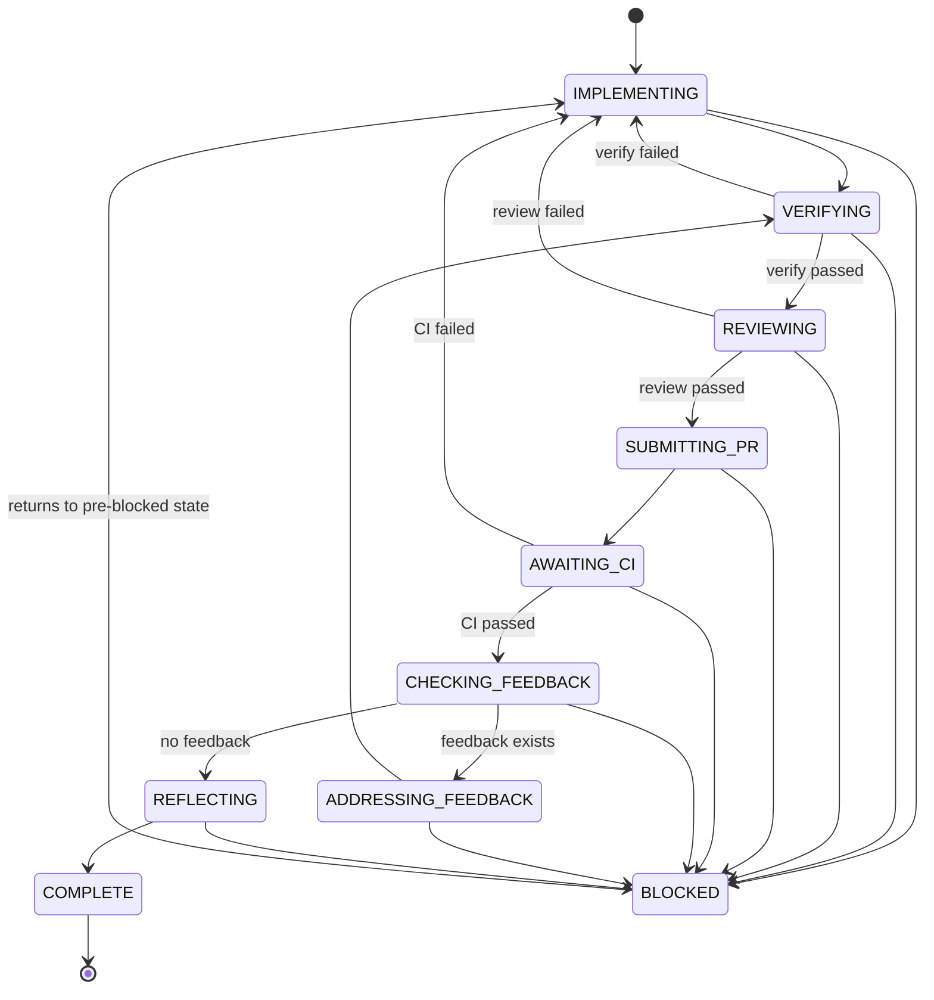

# dev-workflow-v2

An event-sourced state machine plugin for Claude Code that enforces a structured task lifecycle: implement, verify, review, submit PR, await CI, check feedback, reflect, complete.

## Quick Start

Start any feature with the `implement-feature` command:

```
/dev-workflow-v2:implement-feature
```

This initializes the workflow and loads the first state's instructions. From there, the state machine guides each step — you follow the TODO checklist in each state.

## State Machine



## User Touchpoints

Most of the workflow is automated. You interact at these points:

1. **Start** — trigger `/dev-workflow-v2:implement-feature` with a GitHub issue
2. **Approve plan** — the agent presents an implementation plan for your approval
3. **Review PR** — after the agent creates a PR, review it on GitHub
4. **Merge** — merge the PR when satisfied

## Troubleshooting

| Problem | Where to look |
|---------|---------------|
| Workflow state seems wrong | Event store: `~/.claude/workflow-events.db` |
| Hook errors / silent failures | Error log: `~/.claude/dev-workflow-v2-hook-errors.log` |
| Stale NX cache | Run `pnpm nx reset` |
