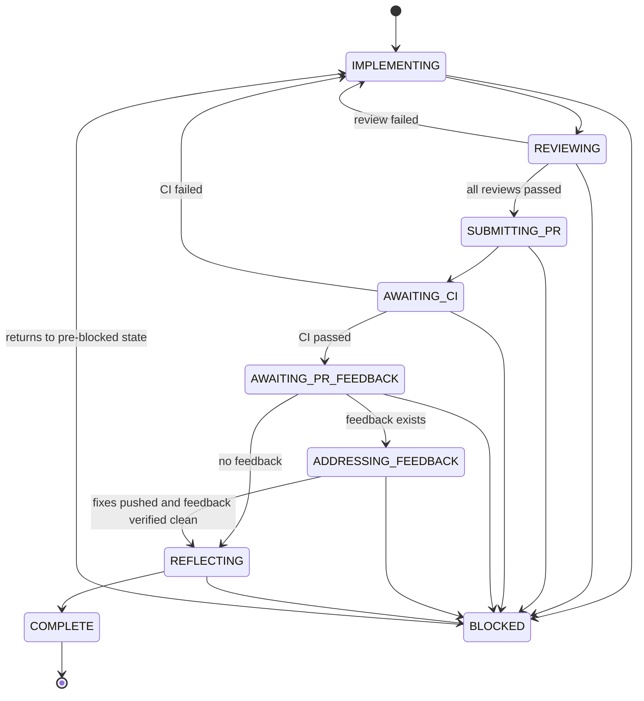

# dev-workflow-v2

An event-sourced state machine plugin for Claude Code, Codex, OpenCode, and Pi that enforces a structured task lifecycle: planning, implementation, verification, review, submit PR, await CI, await PR feedback, reflect, complete.

## How to Start with Claude Code

Start a new session in a worktree:

```bash
claude -w
```

Claude Code creates the worktree. The plugin owns everything from task selection onward.

## Commands

### Codex

`dev-workflow-v2` is an Agent Plugin. Its portable skills are in `skills/`, and its Codex hook configuration is in `com.openai.codex/`. The application installs this plugin; it does not copy provider files into the application's `.agents/` or `.codex/` directories.

After installing the plugin, invoke the matching skill rather than describing the operation in prose:

```text
$dev-workflow-start-planning <topic>
$dev-workflow-planning-status
$dev-workflow-continue-planning
$dev-workflow-choose-next-task
$dev-workflow-start-implementation <issue-number>
$dev-workflow-optimize-factory
$dev-workflow-v2:code-review
$dev-workflow-v2:list-review-threads
$dev-workflow-v2:create-pr
```

Agent Skills are the canonical procedures. Provider-specific commands adapt those procedures for their harness. Codex's shared workflow runner reads `CODEX_THREAD_ID`, so workflow operations use the active task session without copying an ID from hook output.

The internal Codex workflow operation is `$dev-workflow-v2:workflow <operation> [args]`.

### Pi

Start Pi from the repository root and approve the repository when Pi asks to trust it:

```bash
pi
```

Install the Pi executable before starting the workflow. The committed `.pi/settings.json` then loads the local `dev-workflow-v2` package, so no separate extension installation step is needed.

Pi exposes the same lifecycle commands as Claude Code:

```text
/dev-workflow-v2:start-planning <topic>
/dev-workflow-v2:planning-status
/dev-workflow-v2:continue-planning
/dev-workflow-v2:choose-next-task
/dev-workflow-v2:start-implementation <issue-number>
/dev-workflow-v2:code-review
/dev-workflow-v2:list-review-threads
/dev-workflow-v2:create-pr
/dev-workflow-v2:optimize-factory
/dev-workflow-v2:workflow <operation> [args]
```

The Pi extension provides the `workflow` tool for the agent. It uses the same event-sourced workflow state, write policy, GitHub integration, and state instructions as the other providers. Pi loads the lifecycle commands but does not register the Codex-oriented Agent Skills as native Pi skills. Commands which use a shared procedure select Pi's `Task` and `workflow` tools explicitly.

### Planning lifecycle

### Claude Code

```bash
/dev-workflow-v2:start-planning <topic>
```

Creates the planning folder, marker, and problem definition file for a new planning topic.

```bash
/dev-workflow-v2:planning-status
```

Prints the active planning marker, current stage, derived artifact paths, blockers, and next command.

#### Planning marker

Planning topics use one folder per product planning topic at `docs/project/PRD/<slug>/`.

Derive `<slug>` from the planning topic by lowercasing it, replacing non-alphanumeric characters with hyphens, collapsing repeated hyphens, and trimming leading and trailing hyphens.

Each PRD folder stores all related planning files:

- marker: `docs/project/PRD/<slug>/marker.yml`
- problem definition: `docs/project/PRD/<slug>/problem-definition.md`
- solution exploration: `docs/project/PRD/<slug>/solution-exploration.md`
- PRD: `docs/project/PRD/<slug>/PRD.md`
- architecture: `docs/project/PRD/<slug>/ARCH.md`
- dogfooding: `docs/project/PRD/<slug>/dogfooding.md`
- delivery plan: `docs/project/PRD/<slug>/delivery.md`

The workflow selects the active planning marker from `docs/project/PRD/*/marker.yml`, where active means `stage != planning-complete`.

If there is exactly one active marker, `planning-status` and `continue-planning` use it.

If there is no active marker, `planning-status` and `continue-planning` stop, and `start-planning` can create the first one.

If there is more than one active marker, the planning commands stop and report all of them.

The marker stores only:

- `planningId`
- `stage`
- `githubMilestone`
- `githubIssuesCreated`
- `githubIssueNumbers`

Artifact paths are derived from `planningId`.

#### Planning stages

1. problem definition
2. solution exploration
3. PRD drafting as a product decision record
4. PRD approval
5. architecture drafting
6. architecture approval
7. dogfooding
8. delivery planning
9. task creation on GitHub
10. planning complete

The PRD is intentionally not where discovery happens. It records the product decision once `problem-definition.md` and `solution-exploration.md` are approved.

Solution exploration includes market/comparable/open-source research where relevant and a required review of Marty Cagan's four big product risks: value, usability, feasibility, and business viability.

Architecture remains after PRD approval, but architecture may return the workflow to `solution-exploration` or `prd-drafting` if feasibility invalidates product assumptions.

Dogfooding owns exact dogfooding deliverables before delivery planning. Delivery planning owns milestones, deliverables, dependencies, parallelisation, and task creation readiness.

#### Project memory

Planning commands use `project-memory/` as the persistent cross-PRD planning memory layer.

Project memory stores deferred ideas, future-work candidates, confirmed priorities, dependencies, and links to relevant research or implementation evidence.

Project memory also includes `project-memory/architecture/`, which stores approved reusable architectural reasoning for planning. Architecture memories use frontmatter for retrieval and human-readable body text for nuance. They are advisory, not automatic rules; when applicability is unclear, `continue-planning` must clarify with the user before relying on them.

When `continue-planning` identifies work that is out of scope for the current PRD, it triages whether the work is explicitly not needed, probably needed later, definitely needed later, or uncertain. Work that is probably or definitely needed later is captured under `project-memory/ideas/` rather than being lost inside the current PRD.

Completed work is not manually duplicated into project memory. Future planning should retrieve completed-work context from PRDs, git history, GitHub issues, GitHub PRs, and linked evidence.

```bash
/dev-workflow-v2:continue-planning
```

Checks the current planning stage once and advances only when the current artifact passes its checks.

### Planning to implementation bridge

```bash
/dev-workflow-v2:choose-next-task
```

Analyzes parallel work streams across approved delivery plans, including completed planning folders with open GitHub issues, recommends a task from a ready track, and assigns the issue after confirmation.

### Start implementation

```bash
/dev-workflow-v2:start-implementation <issue-number>
```

Prepares an issue branch from the refreshed remote default branch, reads the issue details, initializes the workflow state machine, and begins the IMPLEMENTING state.

Branch preparation supports both a primary checkout and a linked worktree. It leaves the local default branch and any automatically created linked-worktree branch reference unchanged. It stops rather than overwriting work when the checkout is dirty or detached, the current branch contains commits absent from the remote default, the target branch is stale or contains commits, or another worktree already has the target branch checked out.

### Reusable workflow actions

```bash
/dev-workflow-v2:code-review
```

Runs the required workflow review bundle and records each valid verdict.

```bash
/dev-workflow-v2:list-review-threads
```

Lists unresolved review threads for the pull request recorded in workflow state.

```bash
/dev-workflow-v2:create-pr
```

Pushes the recorded feature branch, then delegates standard PR creation and recording to the workflow.

### Workflow (internal)

```bash
/dev-workflow-v2:workflow <command>
```

Low-level state machine CLI. Used by the other commands and state instructions — not called directly by users.

Useful internal command for state-driven instructions:

```bash
/dev-workflow-v2:workflow get-state
```

This returns the current workflow state as JSON so state instructions can extract exact values such as `githubIssue`, `prNumber`, and `taskCheckPassed` without guessing.

## State Machine



## User Touchpoints

Most of the workflow is automated. You interact at these points:

1. **Choose task** — `/dev-workflow-v2:choose-next-task` recommends a task; confirm to proceed
2. **Start** — `/dev-workflow-v2:start-implementation <issue>` to begin
3. **Approve plan** — the agent presents an implementation plan for your approval
4. **Review PR** — after the agent creates a PR, review it on GitHub
5. **Merge** — merge the PR when satisfied

## Troubleshooting

| Problem                       | Where to look                                          |
| ----------------------------- | ------------------------------------------------------ |
| Workflow state seems wrong    | Event store: `$WORKFLOW_EVENTS_DB`, or `~/ai-workflow-database/.workflow-events.db` when it is unset |
| Hook errors / silent failures | Error log: `~/.claude/dev-workflow-v2-hook-errors.log` |
| Stale NX cache                | Run `pnpm nx reset`                                    |
