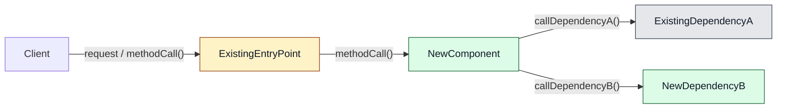

# architecture-drafting

Draft and refine the architecture document for the active planning topic.

Architecture comes after the PRD so it has stable product intent to respond to, but architecture is also allowed to invalidate product assumptions. If feasibility changes the product concept or requirements, loop back instead of forcing architecture to implement a flawed PRD.

## Active file

Use the architecture file passed in the runtime context:

- `architecturePath`

Use the approved PRD passed in the runtime context:

- `prdPath`

Use the approved solution exploration passed in the runtime context:

- `solutionExplorationPath`

Use architecture memory passed in the runtime context:

- `projectMemoryArchitectureInstructionsPath`
- `projectMemoryArchitectureReadmePath`
- `projectMemoryArchitectureMemoriesPath`

Do not switch into implementation.
Do not create tasks.
Do not approve the architecture document in this stage.
Do not write architecture decisions back into the PRD.

## Architecture memory use

Before presenting feasibility conclusions, ownership options, component design options, recommendations, or architecture draft updates:

1. Read `projectMemoryArchitectureInstructionsPath`.
2. Read `projectMemoryArchitectureReadmePath` as the source of truth for architecture-memory frontmatter, approved metadata values, and memory-card structure.
3. Identify the actual system areas and architecture concepts involved in the current architecture discussion.
4. Include `global` memories when their architecture concepts are relevant.
5. Search `projectMemoryArchitectureMemoriesPath` for approved memories matching those system areas or architecture concepts.
6. Read relevant memories and use them as advisory reasoning context.

If a memory appears relevant but its fit is unclear, ask the user whether it applies before using it to shape an option or recommendation.

If reusable architectural reasoning emerges during drafting, ask whether the user wants to save it as architecture memory. Propose concise memory-card frontmatter and body text, including `systemAreas` and `architectureConcepts`, and write it only after the user explicitly approves the content.

Do not treat architecture memory as automatic enforcement. Do not use it to override approved PRD content, ADRs, role definitions, repository conventions, or current user decisions.

## Required starting condition

The PRD must contain:

```text
**Status:** Approved
```

The solution exploration must contain:

```text
**Status:** Approved
```

If either condition is missing, `/dev-workflow-v2:continue-planning` must produce:

```text
BLOCK
- PRD is not approved
- Solution exploration is not approved
```

Only include the blocking item that applies.

## Architecture file creation

If `ARCH.md` does not exist, create it with:

```markdown
# Architecture: <title>

**Status:** Draft

---

## 1. Product feasibility check

**Decision status:** Pending

## 2. Ownership and boundaries

**Decision status:** Pending

## 3. Component design

**Decision status:** Pending

## 4. Feasibility confirmations

**Decision status:** Pending

## 5. Product impact notes

No product-impact changes identified.

## 6. Task generation consequences

**Decision status:** Pending
```

## Product-impact loop-back rule

While drafting architecture, explicitly check whether technical feasibility changes the product direction.

If architecture reveals that the selected product concept should change, `/dev-workflow-v2:continue-planning` must produce:

```text
RETURN: solution-exploration
```

If architecture confirms the concept but reveals that PRD requirements, non-goals, success criteria, or architecture questions need revision, `/dev-workflow-v2:continue-planning` must produce:

```text
RETURN: prd-drafting
```

If architecture changes no product assumptions, record that in `## 5. Product impact notes`.

Do not treat a loop-back as failure. It is the workflow protecting feasibility.

## Step 0: Confirm product feasibility at architecture depth

Before deciding component ownership, read the approved PRD and approved solution exploration. Check whether the feasibility assumptions captured in solution exploration still look valid at architecture depth.

Ask the user to approve one of these conclusions:

- feasibility is still plausible and architecture drafting can continue
- the product concept needs more solution exploration
- the PRD needs revision, but the product concept remains valid

Stop after this discussion if a loop-back is needed.

## Step 1: Decide top-level architecture ownership

Research the PRD, existing architecture, and relevant architecture memories, then propose ownership options.
The user owns the decision.
A recommendation is not approval.

Do not write component internals yet.
Do not mark an ownership decision approved until the user explicitly approves, rejects, or combines the options.

### Research inputs

Read:

- `prdPath`
- `solutionExplorationPath`
- `docs/architecture/overview.md`
- `docs/architecture/adr/*.md`
- `.riviere/role-enforcement.config.ts`
- relevant approved architecture memories from `projectMemoryArchitectureMemoriesPath`

### What to identify

- new apps, packages, libraries, tools, or modules
- existing apps, packages, libraries, tools, or modules that may change
- responsibilities that need an architectural home
- existing boundaries or ADRs that constrain placement
- approved architecture memories that may inform reasoning, trade-offs, or anti-pattern avoidance

### Required discussion output

For each major responsibility, present placement options:

| Option | Bucket placement | What changes there | Trade-off |
| --- | --- | --- | --- |
| A | `<app/package/tool/module>` | `<responsibility>` | `<cost/benefit>` |
| B | `<app/package/tool/module>` | `<responsibility>` | `<cost/benefit>` |

Then add:

```markdown
Recommendation: <one short reason>
Decision status: Waiting for user approval
```

If there is only one valid bucket, still explain why the other obvious buckets are rejected.

Stop after this discussion. Continue only after the user approves, rejects, or combines the options.

## Step 2: Present component design options

Work with the user to design the software components to implement the new capabilities.

## Task

Generate 3 or more component design options.

Options must be as unique as possible.

Example criteria for identifying unique options:

1. number of components => all of the code in 1 monolithic script vs breaking each fine-grained responsibility into its own component
2. size of components
3. touching existing code vs adding new code
4. introducing dependencies
5. coupling vs cohesion
6. DDD vs non-DDD

If two options have the same components with the same responsibilities, they are not unique.

## Component Naming Guidelines

All components must have names that comply with the following guidelines.

### Intention Revealing

A name must describe as clearly and precisely as possible what the thing is and does.

Good examples:

- `async-file-reader`
- `date-selector`
- `tax-calculator`

Bad examples:

- `data-manager`: what kind of data? how does it manage the data? The name tells us almost nothing here.
- `orders-service`: it does something related to orders but we don't know what. It is easy to dump multiple unrelated things into this, like domain logic and external service calls.

### Domain-driven

A name should use established domain terminology wherever possible and should not invent new words and phrases that do not exist in the domain.

### Compound noun phrases

Use this pattern as the default: `[Domain Object][Business Action][Role Noun]`.

Example: `InvoicePaymentCollector`

- `Invoice` = domain object
- `Payment` = business object/action target
- `Collector` = role noun / responsibility noun

### Forbidden terms

The following should be avoided unless truly necessary and reflective of the business domain:

- `util`
- `helper`
- `manager`
- `service`

If one of these words appears, first look for a more precise alternative.

### General guidelines

1. **Maximum file size is 400 lines**, enforced by lint rules. A component must be decomposed into multiple smaller components when it reaches this limit.

## Role option design

Use this section after component design options exist and before choosing the final architecture option.

Purpose: identify possible `.riviere` roles for each proposed new code element, surface tangled responsibilities early, and discuss role choices before implementation starts.

Do not run `plan-review.md` here. `plan-review.md` reviews an already chosen plan and produces an annex. This section is earlier: it supports discussion while component options are still being designed.

### Role context to read

Read `.riviere/role-selection-guide.md` first. Use it as the primary classification guide.

Then read:

- `.riviere/role-enforcement.config.ts`
- `.riviere/roles.ts`
- `.riviere/role-definitions/index.md`
- every role definition file in `.riviere/role-definitions/*.md`
- `.riviere/canonical-role-configurations.md`

### What to classify

For each component design option, list every proposed new or changed:

- class
- function
- interface
- type alias

Include existing components when the option changes their responsibility.

### Role option process

For each proposed code element, start with the flow questions from `.riviere/role-selection-guide.md`:

1. At what point in the end-to-end flow is this code used?
2. What is the result of this code used for immediately afterward?
3. Is this code actually interacting with an external system, or only helping another component decide how to do so?

Use those answers to identify role candidates before reading detailed role definitions.

Then:

1. identify the package and sublocation where the element would live
2. check whether that package is listed in `.riviere/role-enforcement.config.ts`
3. identify which roles are allowed in that sublocation
4. filter candidate roles by declaration kind using `.riviere/roles.ts`
5. read the matching role definitions and compare behavioral contracts
6. use `.riviere/canonical-role-configurations.md` to check whether the option follows an existing role pattern
7. propose multiple candidate roles where more than one role fits
8. mark one preferred role with a short reason
9. identify any element that does not fit existing roles

Do not force-fit unclear code into the closest role.
First check whether the design is missing a concept, especially an aggregate repository.

Any aggregate classification requires explicit user approval.
If uncertain whether something is an aggregate or a query model, ask the user. Do not default to aggregate.

### Tangled responsibility checks

For each component option, flag tangled components when:

- one element mixes entrypoint, orchestration, domain logic, persistence, external-client access, or presentation
- a component would need two unrelated `.riviere` roles
- a domain element exists only to map results into a consumer API such as CLI output, workflow updates, or builder writes
- a use case depends on another use case
- a repository depends on another repository
- an entrypoint directly imports persistence
- domain code imports infrastructure or external libraries

For each tangled component, propose one of:

- split into smaller components
- move behavior to an existing component
- move the component to a different sublocation
- return to top-level ownership discussion if the approved owner no longer fits

### Required role discussion output

Add this section under each component design option that touches a `.riviere` enforced package:

```markdown
### .riviere role options

| Element | Kind | Sublocation | Candidate roles | Preferred role | Reason | Open decision |
| --- | --- | --- | --- | --- | --- | --- |
| `<name>` | class/function/interface/type alias | `<path>` | `<role A>`, `<role B>` | `<role>` | `<short reason>` | `<decision or none>` |

### Canonical role pattern

Pattern: `<name from .riviere/canonical-role-configurations.md>`

If no pattern fits, write:

Pattern: `None — new or non-canonical pattern`
Reason: `<why existing patterns do not fit>`

### Tangled responsibility findings

- `<finding and proposed split/move>`

If none, write:

No tangled responsibilities identified.
```

If a component option touches no `.riviere` enforced package, write:

```text
No .riviere-enforced package is touched by this option.
```

### Blocking role decisions

Stop and discuss with the user if any of these appear:

- a new role may be required
- a new aggregate may be required
- no canonical role configuration fits
- a component has tangled responsibilities that change the component design
- a preferred role would violate sublocation or forbidden dependency rules

Do not continue to architecture approval until these decisions are resolved.

## Output Format

### Design Options: [Feature Name]

#### Option 1: [Name]

Describe this option by outlining the philosophy behind it and its key characteristics.

##### Diagram

Use Mermaid.

Rules:

- Show actual dependencies and calls, not a fake straight-line sequence.
- A line means the source component directly calls or depends on the target component.
- Do not connect two components if they do not directly call each other.
- Use branches when one component calls multiple dependencies.
- Label every line with the request, method call, response, event, query, file read/write, or result.
- Do not put status labels in node text.
- Show status through Mermaid classes.
- Keep it small.



Legend:

- gray = existing
- yellow = changed
- green = new
- red = unclear ownership

##### Components

| Component | Status | Role Archetypes | Responsibilities | Estimated Size |
|---|---|---|---|---|
| `ComponentName` | New / Existing / Changed | `entrypoint`, `coordinator`, `custom:bulk-copy-script` | <ul><li>Responsibility one</li><li>Responsibility two</li></ul> | Small / Medium / Large, or estimated lines |

**note:** component names must adhere to the component naming guidelines defined in this document.

**note:** role archetypes must use names from the Component Archetypes section when applicable. If a component does not match one of the listed archetypes, use a custom archetype prefixed with `custom:`. Example: `custom:bulk-copy-script`.

##### New Dependencies

| Dependency | Status | Used By | Purpose |
|---|---|---|---|
| `DependencyName` | New / Existing / Changed | `ComponentName` | One sentence |

##### Code Shape

List the main new or changed files only.

```text
src/
  api/
    ExistingEntryPoint.ts        [changed]
  feature/
    NewComponent.ts              [new]
```

##### Why This Option Is Unique

Explain the uniqueness using only these criteria:

- number of components
- size of components
- touching existing code vs adding new code
- introducing dependencies

#### Option 2: [Name]

Use the same format as Option 1.

#### Option 3: [Name]

Use the same format as Option 1.

#### Recommendation

Recommend one option in 1 short paragraph.

#### Approval

Before presenting the final design, review every component name against all rules in Component Naming Guidelines.

If any name violates any naming rule, revise the design before presenting it.

Then review all components against all guidelines in Layering. If any component violates a layering rule, revise the design before presenting it.

Ask the user which option to approve, reject, or combine.

## Draft approval and completion

After the user approves, rejects, or combines the architecture options into one architecture direction, update `ARCH.md` with:

```markdown
# Architecture: <title>

**Status:** Awaiting Architecture Approval

---

## 1. Product feasibility check

<approved feasibility conclusion, including whether the PRD remains valid>

## 2. Ownership and boundaries

<approved ownership and boundary decisions>

## 3. Component design

<approved component design, diagrams, role options, and rejected alternatives>

## 4. Feasibility confirmations

<technical feasibility confirmations and unresolved technical risks, if any>

## 5. Product impact notes

<"No product-impact changes identified." or explicit note that caused a RETURN outcome>

## 6. Task generation consequences

<explicit consequences that delivery planning and task creation must carry forward>
```

Then ask whether the architecture draft is ready for approval review.

If the user approves the draft for approval review, `/dev-workflow-v2:continue-planning` must produce:

```text
ADVANCE: architecture-approval
```

## Completion rule

This stage is complete only when all of these are true:

1. `ARCH.md` exists
2. it contains `**Status:** Awaiting Architecture Approval`
3. product feasibility has been checked at architecture depth
4. ownership and boundary decisions are approved
5. component design decisions are approved
6. rejected options are explicitly identified
7. `.riviere` role decisions are resolved where relevant
8. product-impact notes are explicit
9. task generation consequences are explicit
10. no `[NEEDS CLARIFICATION]` markers remain

If complete, produce:

```text
ADVANCE: architecture-approval
```

Otherwise produce a conversational architecture decision question, loop-back recommendation, or draft approval request and internally treat the stage as blocked.
