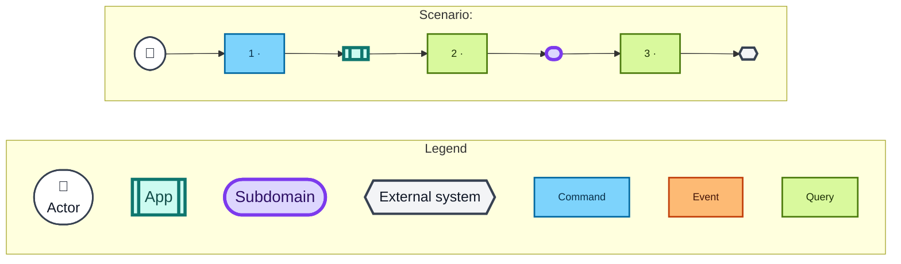

# Domain message flow

Use this skill while shaping architecture interactions and boundaries. It follows the [DDD Crew Domain Message Flow Modelling](https://github.com/ddd-crew/domain-message-flow-modelling) technique.

A domain message flow shows the ordered commands, events, and queries exchanged by actors, apps, subdomains, and external systems for one scenario. It is not a component diagram. Do not show classes, functions, repositories, adapters, files, roles, or other component internals.

Use message flow options before detailed component design. Once the user approves the interactions and boundaries, stop using this skill and continue with the detailed component design process.

## Source discipline

Use only:

- approved product requirements and solution decisions;
- repository behaviour observed from approved research;
- approved architecture decisions;
- user-confirmed assumptions.

Keep observed behaviour, proposals, and approved decisions distinct. Do not invent a message, participant, responsibility, data field, failure path, or boundary to make a diagram look complete.

If an interaction is unresolved, state it in the description or cons. Do not draw an invented interaction.

## Compare boundary options

Use the same concrete scenario when comparing options. Keep actors, scenario scope, terminology, legend, colours, shapes, direction, and table columns fixed so the interaction and boundary differences stand out.

Each option must differ through at least one meaningful boundary decision:

- a responsibility moves between an app, subdomain, or external system;
- a message crosses a different boundary;
- one boundary owns an interaction that another option delegates;
- coupling, autonomy, or dependency direction changes.

Renaming the same participants or messages is not a different option.

The user owns the boundary decision. Do not mark an option approved until the user explicitly approves, rejects, or combines the options.

## Required option structure

Use this relative heading structure. Choose the option heading level to fit its parent document; all headings inside the option are one level below it.

```markdown
<Option heading> Option <n>: <intention revealing name>

<Two to four sentences describing the design, its key boundary idea, what distinguishes it, and any important assumptions or preconditions.>

<standard Mermaid domain message flow>

<Message details heading>

<standard message details table>

<Pros heading>

- <benefit specific to this boundary design>

<Cons heading>

- <cost, risk, or limitation specific to this boundary design>
```

A standalone option uses:

```markdown
# Option 1: <Intention revealing name>
## Message details
## Pros
## Cons
```

An option beneath a level 2 architecture section uses:

```markdown
### Option 1: <Intention revealing name>
#### Message details
#### Pros
#### Cons
```

Do not add more sections unless the user approves a change to the standard.

## Mermaid standard

Use `flowchart LR`.

The diagram must contain only:

- one scenario;
- participants;
- compact numbered message boxes containing only the message name;
- solid directional lines from sender to message to recipient;
- the standard legend and class definitions below.

Do not put message data, return values, annotations, paths, role names, or explanatory prose inside message boxes or on connecting lines. Put those details in the table below the diagram.

Use short labels where their meaning remains clear. Prefer `PR` over `pull request` inside the diagram. Participant boxes contain only the participant name. Do not repeat `Actor`, `App`, `Subdomain`, or `External system` inside scenario participant boxes; the legend already explains their notation.

Use a conventional user icon for an actor. Never use a solid black actor box.

A command sends an instruction to a recipient. An event announces something that happened. A query requests information and includes its response as part of the same message. Do not define a command as merely asking for a state change.

Aim for five to nine messages, following the DDD Crew guidance. Use fewer when another message would only expose an internal implementation detail. Split the scenario rather than making an unreadable diagram.

Use lower camel case alphanumeric Mermaid node IDs. Never use literal `\n` in labels. Use `<br/>` only where a participant name genuinely needs a line break.

Use this exact visual notation:



Delete unused example participants and messages. Keep every legend item so diagrams use one stable visual language. Assign every scenario participant and message to exactly one class.

## Message details table

Use these exact columns and keep rows in message order:

```markdown
| # | Type | Message | Sender → recipient | Significant data |
| ---: | --- | --- | --- | --- |
| 1 | Command | `<name>` | `<sender>` → `<recipient>` | Instruction: `<instruction and significant data>`. |
| 2 | Query | `<name>` | `<sender>` → `<recipient>` | Request: `<data>`. Response: `<data>`. |
| 3 | Event | `<name>` | `<sender>` → `<recipient>` | Facts: `<significant facts carried by the event>`. |
```

For a query, name both request and response data. Do not draw a separate return arrow. The query represents request and response as one message, following the DDD Crew convention.

For a command, state the instruction and significant data. Do not invent a response unless the scenario contains a separate message for it.

For an event, use past tense and state the significant facts it carries.

## Pros and cons

Pros and cons must be consequences of the specific boundary design. Connect them to concrete concerns such as:

- boundary ownership;
- dependency direction;
- coupling;
- autonomy;
- consistency between consumers;
- failure isolation;
- information availability;
- reuse across scenarios.

Do not write generic claims such as “more scalable”, “cleaner”, “flexible”, or “easy to maintain” without explaining the concrete mechanism.

Record unresolved interactions and required preconditions as cons when they limit the option. Do not hide them behind implementation detail.

## Validation

Before presenting or writing an option, check:

1. The option follows the required heading order.
2. The diagram shows one named scenario.
3. Every participant is an actor, app, subdomain, or external system.
4. Apps are not labelled as subdomains. Determine participant type from the approved repository boundary, not its behaviour.
5. Message boxes contain only their order and name.
6. Lines contain no data annotations.
7. The table contains every diagram message exactly once and in order.
8. Every query row names its request and response data.
9. Every command is an instruction.
10. Every event announces something that happened.
11. The sender and recipient in each table row match the diagram direction.
12. Mermaid subgraphs and code fences are balanced.
13. The standard legend, shapes, colours, and classes are unchanged.
14. Pros and cons describe real differences and known limitations.
15. No detailed component design has leaked into boundary shaping.

Correct formatting, rendering, and consistency defects directly. Do not ask the user to approve defect fixes. Ask for approval only when the option requires a product or architecture decision.
